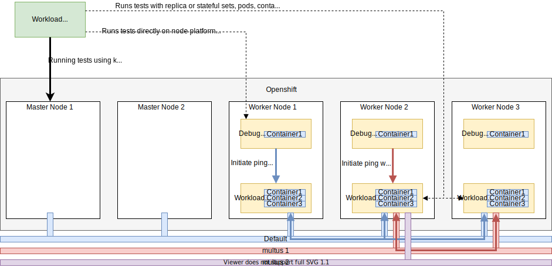

# Test Network Function  [](https://goreportcard.com/report/github.com/test-network-function/cnf-certification-test)


This repository contains a set of Cloud-Native Network Functions (CNFs) test cases and the framework to build more. The tests and framework are intended 
to test the interaction of CNFs with OpenShift Container Platform.  It also generates a report 
(claim.json) after running tests.

Please consult [CATALOG.md](./CATALOG.md) for a catalog of the included test cases and test case building blocks.

The suite is provided here in part so that CNF Developers can use the suite to test their CNFs readiness for
certification.  Please see "CNF Developers" below for more information.

## Overview 
 

In the diagram above:
- the `CNF` is the CNF to be certified. The certification suite identifies the resources (containers/pods/operators etc) belonging to the CNF via labels or static data entries in the config file
- the `Certification container/exec` is the certification test suite running on the platform or in a container. The executable verifies the CNF under test configuration and its interactions with openshift
- the `Debug` pods are part of a daemonset responsible to run various privileged commands on kubernetes nodes. Debug pods are useful to run platform tests and test commands (e.g. ping) in container namespaces without changing the container image content. The debug daemonset is instantiated via the cnf-certification-test-partner repository [repo](https://github.com/test-network-function/cnf-certification-test-partner).  


## Test Configuration

The Test Network Function support autodiscovery using labels and annotations. The following sections describe how to configure the TNF via labels/annotation and the corresponding settings in the config file. A sample config file can be found [here](test-network-function/tnf_config.yml).

### targetNameSpaces

Multiple namespaces can be specified in the [configuration file](test-network-function/tnf_config.yml). Namespaces will be used by autodiscovery to find the Pods under test.
``` shell script
targetNameSpaces:
  - name: firstnamespace
  - name: secondnamespace 
```
### targetPodLabels
The goal of this section is to specify the labels to be used to identify the CNF resources under test. It's highly recommended that the labels should be defined in pod definition rather than added after pod is created, as labels added later on will be lost in case the pod gets rescheduled. In case of pods defined as part of a deployment, it's best to use the same label as the one defined in the `spec.selector.matchLabels` section of the deployment yaml. The prefix field can be used to avoid naming collision with other labels.
```shell script
targetPodLabels:
  - prefix: test-network-function.com
    name: generic
    value: target
```

The corresponding label used to match pods is: 
```shell script
test-network-function.com/generic: target 
```

Once the pods are found, all of their containers are also added to the target container list. A target deployments list will also be created with all the deployments which the test pods belong to.

### targetCrds
In order to autodiscover the CRDs to be tested, an array of search filters can be set under the "targetCrdFilters" label. The autodiscovery mechanism will iterate through all the filters to look for all the CRDs that match it. Currently, filters only work by name suffix.

```shell-script
targetCrdFilters:
 - nameSuffix: "group1.tnf.com"
 - nameSuffix: "anydomain.com"
```

The autodiscovery mechanism will create a list of all CRD names in the cluster whose names have the suffix "group1.tnf.com" or "anydomain.com", e.g. "crd1.group1.tnf.com" or "mycrd.mygroup.anydomain.com".

### testTarget
#### podsUnderTest / containersUnderTest
The autodiscovery mechanism will attempt to identify the default network device and all the IP addresses of the pods it needs for network connectivity tests, though that information can be explicitly set using annotations if needed. For Pod IPs:

* The annotation test-network-function.com/multusips is the highest priority, and must contain a JSON-encoded list of IP addresses to be tested for the pod. This must be explicitly set.
* If the above is not present, the k8s.v1.cni.cncf.io/networks-status annotation is checked and all IPs from it are used. This annotation is automatically managed in OpenShift but may not be present in K8s.
* If neither of the above is present, then only known IPs associated with the pod are used (the pod .status.ips field).

For Network Interfaces:

* The annotation test-network-function.com/defaultnetworkinterface is the highest priority, and must contain a JSON-encoded string of the primary network interface for the pod. This must be explicitly set if needed. Examples can be seen in cnf-certification-test-partner
* If the above is not present, the k8s.v1.cni.cncf.io/networks-status annotation is checked and the "interface" from the first entry found with "default"=true is used. This annotation is automatically managed in OpenShift but may not be present in K8s.

The label test-network-function.com/skip_connectivity_tests excludes pods from all connectivity tests. The label value is not important, only its presence.
The label test-network-function.com/skip_multus_connectivity_tests excludes pods from multus connectivity tests. Tests on default interface are still done. The label value is not important, only its presence.

#### operators

The section can be configured as well as auto discovered. For manual configuration, see the commented part of the [sample config](test-network-function/tnf_config.yml). For autodiscovery:

* CSVs to be tested by the `operator` spec are identified with the `test-network-function.com/operator=target`
label. Any value is permitted but `target` is used here for consistency with the other specs.

### certifiedcontainerinfo and certifiedoperatorinfo

The `certifiedcontainerinfo` and `certifiedoperatorinfo` sections contain information about CNFs and Operators that are
to be checked for certification status on Red Hat catalogs.

## Runtime environement variables
### Disable intrusive tests
If you would like to skip intrusive tests which may disrupt cluster operations, issue the following:

```shell script
export TNF_NON_INTRUSIVE_ONLY=true
```

Likewise, to enable intrusive tests, set the following:

```shell script
export TNF_NON_INTRUSIVE_ONLY=false
```

### Specifiy the location of the partner repo
This env var is optional, but highly recommended if running the test suite from a clone of this github repo. It's not needed or used if running the tnf image.

To set it, clone the partner [repo](https://github.com/test-network-function/cnf-certification-test-partner) and set TNF_PARTNER_SRC_DIR to point to it.

```shell script
export TNF_PARTNER_SRC_DIR=/home/userid/code/cnf-certification-test-partner
```

When this variable is set, the run-cnf-suites.sh script will deploy/refresh the partner deployments/pods in the cluster before starting the test run.

### Disconnected environment
In a disconnected environment, only specific versions of images are mirrored to the local repo. For those environments,
the partner pod image `quay.io/testnetworkfunction/cnf-test-partner` and debug pod image `quay.io/testnetworkfunction/debug-partner` should be mirrored
and `TNF_PARTNER_REPO` should be set to the local repo, e.g.:

```shell-script
export TNF_PARTNER_REPO="registry.dfwt5g.lab:5000/testnetworkfunction"
```

### Execute test suites from openshift-kni/cnf-feature-deploy
The test suites from openshift-kni/cnf-feature-deploy can be run prior to the actual CNF certification test execution and the results are incorporated in the same claim file if the following environment variable is set:


```shell script
export TNF_RUN_CFD_TEST=true
```

By default, the image with release tag `4.6` is used and the ginkgo skip argument is set to `performance|sriov|ptp|sctp|xt_u32|dpdk|ovn`. To override the default behavior, set these environment variables: `TNF_CFD_IMAGE_TAG` and `TNF_CFD_SKIP`. For more information on the test suites, refer to [the cnf-features-deploy repository](https://github.com/openshift-kni/cnf-features-deploy)

## Running the tests with in a prebuild container

### Pulling test image
An image is built and is available at this repository: [quay.io](https://quay.io/repository/testnetworkfunction/test-network-function)
The image can be pulled using :
```shell script
docker pull quay.io/testnetworkfunction/test-network-function
```
### Cluster requirement
* OCP cluster should allow interactive shell sessions to pods/containers to stay alive when being idle for more than a few minutes. If it is not the case, consult the maintainer of the cluster infrastructure on how it can be enabled. Also, make sure the firewalls/load balancers on the path do not timeout idle connections too quickly.
* OCP cluster should provide enough resources to drain nodes and reschedule pods. If that's not the case, then ``lifecycle-pod-recreation`` test should be skipped.
### Check cluster resources
Some tests suites such as platform-alteration require node access to get node configuration like hugepage.
In order to get the required information, the test suite does not ssh into nodes, but instead rely on [oc debug tools ](https://docs.openshift.com/container-platform/3.7/cli_reference/basic_cli_operations.html#debug). This tool makes it easier to fetch information from nodes and also to debug running pods.

In short, oc debug tool will launch a new container ending with "-debug" suffix, the container will be destroyed once the debug session is done. To be able to create the debug pod,  the cluster should have enough resources, otherwise those tests would fail.

**Note:**
It's recommended to clean up disk space and make sure there's enough resources to deploy another container image in every node before starting the tests.
### Run the tests
``./run-tnf-container.sh`` script is used to launch the tests.  

There are several required arguments:

* `-t` gives the local directory that contains tnf config files set up for the test.
* `-o` gives the local directory that the test results will be available in once the container exits. This directory must exist in order for the claim file to be written.

Optional arguments are:
* `-f` gives the list of suites to be run, space separated.
* `-s` gives the name of tests that should be skipped. This flag is discarded if no `-f` was set.
* `-i` gives a name to a custom TNF container image. Supports local images, as well as images from external registries.
* `-k` gives a path to one or more kubeconfig files to be used by the container to authenticate with the cluster. Paths must be separated by a colon.
* `-n` gives the network mode of the container. Defaults set to `host`, which requires selinux to be disabled. Alternatively, `bridge` mode can be used with selinux if TNF_CONTAINER_CLIENT is set to `docker` or running the test as root. See the [docker run --network parameter reference](https://docs.docker.com/engine/reference/run/#network-settings) for more information on how to configure network settings.

If `-f` is not specified, the tnf will run in 'diagnostic' mode. In this mode, no test case will run: it will only get information from the cluster (PUTs, CRDs, nodes info, etc...) to save it in the claim file. This can be used to make sure the configuration was properly set and the autodiscovery found the right pods/crds...

If `-k` is not specified, autodiscovery is performed.
The autodiscovery first looks for paths in the `$KUBECONFIG` environment variable on the host system, and if the variable is not set or is empty, the default configuration stored in `$HOME/.kube/config` is checked.

```shell script
./run-tnf-container.sh -k ~/.kube/config -t ~/tnf/config -o ~/tnf/output -f networking access-control -s access-control-host-resource-PRIVILEGED_POD
```

See [General tests](#general-tests) for a list of available keywords.

### Running using `docker` instead of `podman`

By default, `run-container.sh` utilizes `podman`.  However, you can configure an alternate container virtualization
client using `TNF_CONTAINER_CLIENT`.  This is particularly useful for operating systems that do not readily support
`podman`, such as macOS.  In order to configure the test harness to use `docker`, issue the following prior to
`run-tnf-container.sh`:

```shell script
export TNF_CONTAINER_CLIENT="docker"
```

### Building the container image locally

You can build an image locally by using the command below. Use the value of `TNF_VERSION` to set a branch, a tag, or a hash of a commit that will be installed into the image.

```shell script
docker build -t test-network-function:v1.0.5 --build-arg TNF_VERSION=v1.0.5 .
```

To build an image that installs TNF from an unofficial source (e.g. a fork of the TNF repository), use the `TNF_SRC_URL` build argument to override the URL to a source repository.

```shell script
docker build -t test-network-function:v1.0.5 \
  --build-arg TNF_VERSION=v1.0.5 \
  --build-arg TNF_SRC_URL=https://github.com/test-network-function/test-network-function .
```

To make `run-tnf-container.sh` use the newly built image, specify the custom TNF image using the `-i` parameter.

```shell script
./run-tnf-container.sh -i test-network-function:v1.0.5 -t ~/tnf/config -o ~/tnf/output -f networking access-control
```
 Note: see [General tests](#general-tests) for a list of available keywords.


## Building and running the standalone test executable

Currently, all available tests are part of the "CNF Certification Test Suite" test suite, which serves as the entrypoint to run all test specs.
By default, `test-network-function` emits results to `test-network-function/cnf-certification-tests_junit.xml`.
### Dependencies

At a minimum, the following dependencies must be installed *prior* to running `make install-tools`.

Dependency|Minimum Version
---|---
[GoLang](https://golang.org/dl/)|1.18
[golangci-lint](https://golangci-lint.run/usage/install/)|1.45.2
[jq](https://stedolan.github.io/jq/)|1.6
[OpenShift Client](https://mirror.openshift.com/pub/openshift-v4/clients/ocp/)|4.7

Other binary dependencies required to run tests can be installed using the following command:

```shell script
make install-tools
```

Finally the source dependencies can be installed with

```shell script
make update-deps
```

*Note*: You must also make sure that `$GOBIN` (default `$GOPATH/bin`) is on your `$PATH`.

*Note*:  Efforts to containerize this offering are considered a work in progress.


### Pulling The Code

In order to pull the code, issue the following command:

```shell script
mkdir ~/workspace
cd ~/workspace
git clone git@github.com:test-network-function/test-network-function.git
cd test-network-function
```

### Building the Tests

In order to build the test executable, first make sure you have satisfied the [dependencies](#dependencies).
```shell script
make build-cnf-tests
```

*Gotcha:* The `make build*` commands run unit tests where appropriate. They do NOT test the CNF.

### Testing a CNF

Once the executable is built, a CNF can be tested by specifying which suites to run using the `run-cnf-suites.sh` helper
script.

Run any combination of the suites keywords listed at in the [General tests](#general-tests) section, e.g.

```shell script
./run-cnf-suites.sh -f lifecycle
./run-cnf-suites.sh -f networking lifecycle
./run-cnf-suites.sh -f operator networking
./run-cnf-suites.sh -f networking platform-alteration
./run-cnf-suites.sh -f networking lifecycle affiliated-certification operator
```

As with "run-tnf-container.sh", if `-f` is not specified here, the tnf will run in 'diagnostic' mode. See [Run the tests](#run-the-tests) section for more info.

By default the claim file will be output into the same location as the test executable. The `-o` argument for
`run-cnf-suites.sh` can be used to provide a new location that the output files will be saved to. For more detailed
control over the outputs, see the output of `test-network-function.test --help`.

```shell script
cd test-network-function && ./test-network-function.test --help
```

*Gotcha:* check that OCP cluster has resources to deploy [debug image](#check-cluster-resources)

#### Running a single test or a subset
All tests have unique labels, which can be used to filter which tests are to be run. This is useful when debugging
a single test.

You can select the test to be executed when running `run-cnf-suites.sh` with the following command-line:
```shell script
./run-cnf-suites.sh -f operator -l operator-install-source
```

Note that the `-l` parameter will be treated as a regular expression, so you can select more than one test by
their labels.

You can find all test labels by running the following command:
```shell script
./run-cnf-suites.sh --list
```

You can also check the [CATALOG.md](CATALOG.md) to find all test labels.
#### Labels to run in offline environments
Some tests do require connectivity to Redhat servers to validate certification status.
If you're running the tests in an offline environment, you can skip the tests using the `l` option as explained in [Label use](#running-a-single-test-or-a-subset)
```shell script
./run-cnf-suites.sh -l '!online'
```

## Available Test Specs

There are two categories for CNF tests;  'General' and 'CNF-specific' (TODO).

The 'General' tests are designed to test any commodity CNF running on OpenShift, and include specifications such as
'Default' network connectivity.

'CNF-specific' tests are designed to test some unique aspects of the CNF under test are behaving correctly.  This could
include specifications such as issuing a `GET` request to a web server, or passing traffic through an IPSEC tunnel.

'CNF-specific' test are yet to be defined.

### General tests

Test in the "general" category belong to multiple suites that can be run in any combination as is
appropriate for the CNF(s) under test. Test suites group tests by topic area:

Suite|Test Spec Description|Minimum OpenShift Version
---|---|---
`access-control`|The access-control test suite is used to test  service account, namespace and cluster/pod role binding for the pods under test. It also tests the pods/containers configuration.|4.6.0
`affiliated-certification`|The affiliated-certification test suite verifies that the containers and operators listed in the configuration file are certified by Redhat|4.6.0
`lifecycle`| The lifecycle test suite verifies the pods deployment, creation, shutdown and  survivability. |4.6.0
`networking`|The networking test suite contains tests that check connectivity and networking config related best practices.|4.6.0
`operator`|The operator test suite is designed to test basic Kubernetes Operator functionality.|4.6.0
`platform-alteration`| verifies that key platform configuration is not modified by the CNF under test|4.6.0
`observability`|  the observability test suite contains tests that check CNF logging is following best practices and that CRDs have status fields|4.6.0
Please consult [CATALOG.md](CATALOG.md) for a detailed description of tests in each suite.


### CNF-specific tests
TODO

## Test Output

### Claim File

The test suite generates a "claim" file, which describes the system(s) under test, the tests that were run, and the
outcome of all of the tests.  This claim file is the proof of the test run that is evaluated by Red Hat when
"certified" status is being considered.  For more information about the contents of the claim file please see the
[schema](https://github.com/test-network-function/test-network-function-claim/blob/main/schemas/claim.schema.json).  You can
read more about the purpose of the claim file and CNF Certification in the
[Guide](https://redhat-connect.gitbook.io/openshift-badges/badges/cloud-native-network-functions-cnf).

### Adding Test Results for the CNF Validation Test Suite to a Claim File 
e.g. Adding a cnf platform test results to your existing claim file.

You can use the claim cli tool to append other related test suite results to your existing claim.json file.
The output of the tool will be an updated claim file.
```
go run cmd/tools/cmd/main.go claim-add --claimfile=claim.json --reportdir=/home/$USER/reports
```
 Args:  
`
--claimfile is an existing claim.json file`
`
--repordir :path to test results that you want to include.
`

 The tests result files from the given report dir will be appended under the result section of the claim file using file name as the key/value pair.
 The tool will ignore the test result, if the key name is already present under result section of the claim file.
```
 "results": {
 "cnf-certification-tests_junit": {
 "testsuite": {
 "-errors": "0",
 "-failures": "2",
 "-name": "CNF Certification Test Suite",
 "-tests": "14",
```

### Command Line Output

When run the CNF test suite will output a report to the terminal that is primarily useful for Developers to evaluate and
address problems.  This output is similar to many testing tools.

#### Test successful output example
Here's an example of a Test pass.  It verifies that the CNF is using a replica set:

```shell
------------------------------
lifecycle when Testing owners of CNF pod 
  Should be only ReplicaSet
  /Users/$USER/cnf-cert/test-network-function/cnf-certification-test/lifecycle/suite.go:339
2021/07/27 11:41:25 Sent: "oc -n tnf get pods test-697ff58f87-d55zx -o custom-columns=OWNERKIND:.metadata.ownerReferences\\[\\*\\].kind && echo END_OF_TEST_SENTINEL\n"
2021/07/27 11:41:26 Match for RE: "(?s)OWNERKIND\n.+((.|\n)*END_OF_TEST_SENTINEL\n)" found: ["OWNERKIND\nReplicaSet\nEND_OF_TEST_SENTINEL\n" "END_OF_TEST_SENTINEL\n" ""] Buffer: "OWNERKIND\nReplicaSet\nEND_OF_TEST_SENTINEL\n"
•

```

#### Test failed output examples

The following is the output from a Test failure.  In this case, the test is checking that a CSV (ClusterServiceVersion)
is installed correctly, but does not find it (the operator was not present on the cluster under test):

```shell
------------------------------
operator Runs test on operators when under test is: my-etcd/etcdoperator.v0.9.4  
  tests for: CSV_INSTALLED
  /Users/$USER/cnf-cert/test-network-function/cnf-certification-test/operator/suite.go:122
2020/12/15 15:28:19 Sent: "oc get csv etcdoperator.v0.9.4 -n my-etcd -o json | jq -r '.status.phase'\n"

• Failure [10.002 seconds]
operator
/Users/$USER/cnf-cert/test-network-function/cnf-certification-test/operator/suite.go:58
  Runs test on operators
  /Users/$USER/cnf-cert/test-network-function/cnf-certification-test/operator/suite.go:71
    when under test is: my-etcd/etcdoperator.v0.9.4 
    /Users/$USER/cnf-cert/test-network-function/cnf-certification-test/operator/suite.go:121
      tests for: CSV_INSTALLED [It]
      /Users/$USER/cnf-cert/test-network-function/cnf-certification-test/operator/suite.go:122

      Expected
          <int>: 0
      to equal
          <int>: 1

```

The following is the output from a Test failure.  In this case, the test is checking that a Subscription
is installed correctly, but does not find it (the operator was not present on the cluster under test):

```shell
------------------------------
operator Runs test on operators when under test is: my-etcd/etcd
  tests for: SUBSCRIPTION_INSTALLED
  /Users/$USER/cnf-cert/test-network-function/cnf-certification-test/operator/suite.go:129
2021/04/09 12:37:10 Sent: "oc get subscription etcd -n my-etcd -ojson | jq -r '.spec.name'\n"

• Failure [10.000 seconds]
operator
/Users/$USER/cnf-cert/test-network-function/cnf-certification-test/operator/suite.go:55
  Runs test on operators
  /Users/$USER/cnf-cert/test-network-function/cnf-certification-test/operator/suite.go:68
    when under test is: default/etcdoperator.v0.9.4 
    /Users/$USER/cnf-cert/test-network-function/cnf-certification-test/operator/suite.go:128
      tests for: SUBSCRIPTION_INSTALLED [It]
      /Users/$USER/cnf-cert/test-network-function/cnf-certification-test/operator/suite.go:129

      Expected
          <int>: 0
      to equal
          <int>: 1

```

The following is the output from a Test failure.  In this case, the test is checking clusterPermissions for
specific CSV, but does not find it (the operator was not present on the cluster under test):

```shell
------------------------------
operator Runs test on operators 
  should eventually be verified as certified (operator redhat-marketplace/etcd-operator)
  /Users/$USER/cnf-cert/test-network-function/cnf-certification-test/operator/suite.go:146

• Failure [30.002 seconds]
operator
/Users/$USER/cnf-cert/test-network-function/cnf-certification-test/operator/suite.go:76
  Runs test on operators
  /Users/$USER/cnf-cert/test-network-function/cnf-certification-test/operator/suite.go:89
    should eventually be verified as certified (operator redhat-marketplace/etcd-operator) [It]
    /Users/$USER/cnf-cert/test-network-function/cnf-certification-test/operator/suite.go:146

    Timed out after 30.001s.
    Expected
        <bool>: false
    to be true

    /Users/$USER/cnf-cert/test-network-function/cnf-certification-test/operator/suite.go:152
```
## Log level 
The optional TNF_LOG_LEVEL environment variable sets the log level. Defaults to "info" if not set. Valid values are: trace, debug, info, warn, error, fatal, panic.

## Grading Tool
### Overview
A tool for processing the claim file and producing a quality grade for the CNF.
The user supplies a policy conforming to [policy schema](schemas/gradetool-policy-schema.json).
A grade is considered `passed` if all its direct tests passed and its base grade passed.
In the output we use the field `propose` to indicate grade passed or failed.
See [policy example](pkg/gradetool/testdata/policy-good.json) for understanding the output of the grading tool.
### How to build and execute
```
make build
or
make build-gradetool
```
Executable name is `gradetool`.

## CNF Developers

Developers of CNFs, particularly those targeting 
[CNF Certification with Red Hat on OpenShift](https://redhat-connect.gitbook.io/openshift-badges/badges/cloud-native-network-functions-cnf),
can use this suite to test the interaction of their CNF with OpenShift.  If you are interested in CNF Certification
please contact [Red Hat](https://redhat-connect.gitbook.io/red-hat-partner-connect-general-guide/managing-your-account/getting-help/technology-partner-success-desk).

Refer to the rest of the documentation in this file to see how to install and run the tests as well as how to
interpret the results.

You will need an [OpenShift 4.4 installation](https://docs.openshift.com/container-platform/4.4/welcome/index.html)
running your CNF, and at least one other machine available to host the test suite.  The
[cnf-certification-test-partner](https://github.com/test-network-function/cnf-certification-test-partner) repository has a very
simple example of this you can model your setup on.

# Known Issues

## Issue #146:  Shell Output larger than 16KB requires specification of the TNF_DEFAULT_BUFFER_SIZE environment variable

When dealing with large output, you may occasionally overrun the default buffer size. The manifestation of this issue is
a `json.SyntaxError`, and may look similar to the following:

```shell script
    Expected
        <*json.SyntaxError | 0xc0002bc020>: {
            msg: "unexpected end of JSON input",
            Offset: 660,
        }
    to be nil
```

In such cases, you will need to set the TNF_DEFAULT_BUFFER_SIZE to a sufficient size (in bytes) to handle the expected
output.

For example:

```shell script
TNF_DEFAULT_BUFFER_SIZE=32768 ./run-cnf-suites.sh -f networking
```
