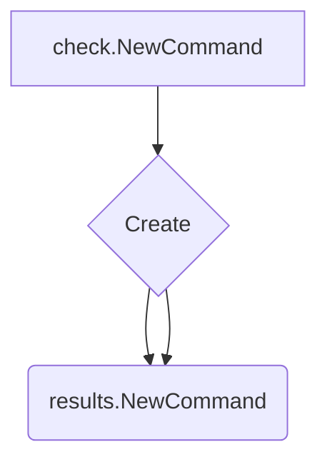
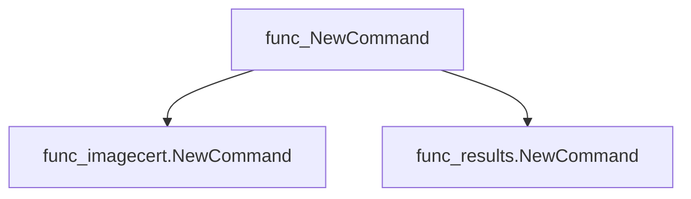
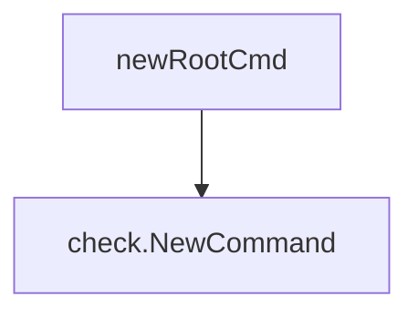

# Package check

**Path**: `cmd/certsuite/check`

## Table of Contents

- [Overview](#overview)
- [Exported Functions](#exported-functions)
  - [NewCommand](#newcommand)

## Overview

The `check` package provides the top‑level *check* command for the Certsuite CLI, exposing subcommands that perform image certificate status checks and display results. It is used when a user wants to run certification checks from the command line.

### Key Features

- Instantiates a Cobra command hierarchy with child commands for image status and result reporting
- Encapsulates command registration logic in a single `NewCommand` function
- Keeps CLI command definitions modular by importing subcommand packages

### Design Notes

- Uses Cobra to manage command parsing and execution, keeping the package focused on orchestration rather than business logic
- The global `checkCmd` variable is unexported to prevent external modification of the command state
- Best practice: call `NewCommand()` during application initialization and add it to the root command with `AddCommand`

### Exported Functions Summary

| Name | Purpose |
|------|----------|
| [func NewCommand() *cobra.Command](#newcommand) | Instantiates the top‑level *check* command for the Certsuite CLI and registers its child commands. |

## Exported Functions

### NewCommand

**NewCommand** - Instantiates the top‑level *check* command for the Certsuite CLI and registers its child commands.


#### Signature (Go)

```go
func NewCommand() *cobra.Command
```

#### Summary Table

| Aspect | Details |
|--------|---------|
| **Purpose** | Instantiates the top‑level *check* command for the Certsuite CLI and registers its child commands. |
| **Parameters** | None |
| **Return value** | A pointer to a `cobra.Command` representing the *check* command, ready for inclusion in the root command tree. |
| **Key dependencies** | • `github.com/spf13/cobra` – command construction and registration.<br>• Calls `imagecert.NewCommand()` and `results.NewCommand()` from subpackages `image_cert_status` and `results`. |
| **Side effects** | Modifies the internal state of the returned `cobra.Command` by adding child commands; no external I/O or concurrency. |
| **How it fits the package** | Provides the central entry point for all “check”‑related functionality, grouping image certification checks and result handling under a single command in the Certsuite CLI. |

#### Internal workflow (Mermaid)



#### Function dependencies (Mermaid)



#### Functions calling `check.NewCommand` (Mermaid)



#### Usage example (Go)

```go
// Minimal example invoking check.NewCommand
package main

import (
	"github.com/redhat-best-practices-for-k8s/certsuite/cmd/certsuite/check"
	"github.com/spf13/cobra"
)

func main() {
	root := &cobra.Command{Use: "certsuite"}
	root.AddCommand(check.NewCommand())
	if err := root.Execute(); err != nil {
		panic(err)
	}
}
```

---

---

