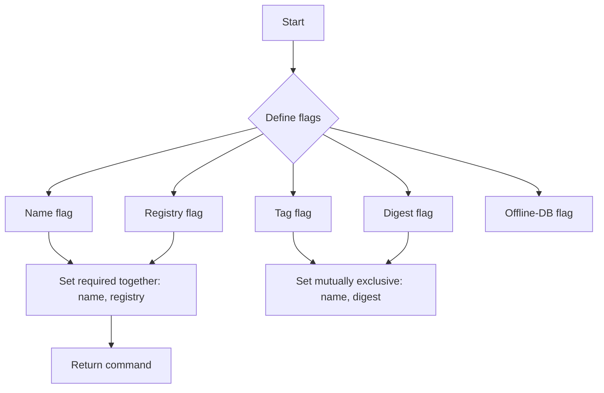
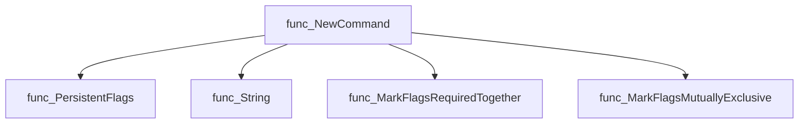
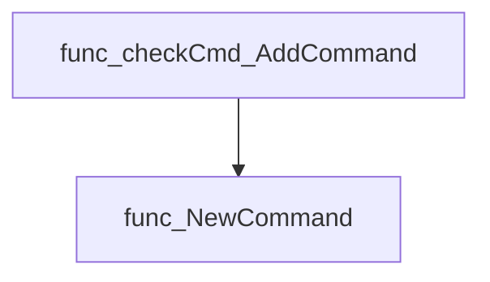
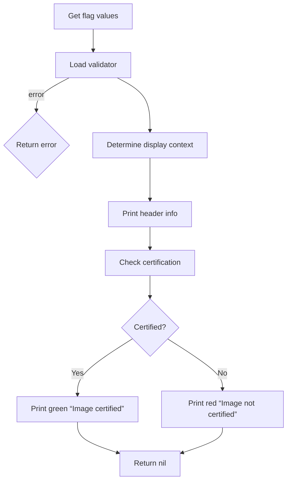
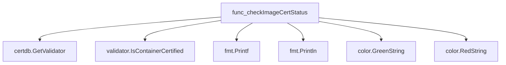

# Package imagecert

**Path**: `cmd/certsuite/check/image_cert_status`

## Table of Contents

- [Overview](#overview)
- [Exported Functions](#exported-functions)
  - [NewCommand](#newcommand)
- [Local Functions](#local-functions)
  - [checkImageCertStatus](#checkimagecertstatus)

## Overview

The imagecert package provides a Cobra command that registers persistent flags for specifying container images and validates those inputs against the certification database before reporting whether an image is certified.

### Key Features

- Registers and enforces flag constraints (required together, mutually exclusive) for image name, registry, tag, digest, and offline DB path using Cobra. 
- Retrieves and validates user input, then queries the certification database to determine if the specified image is certified. 
- Formats console output with colored status indicators via fatih/color for clear visual feedback.

### Design Notes

- Uses Cobra’s PersistentFlags to apply flags across subcommands, ensuring consistency. 
- Validates that only one of name/tag/digest can be used at a time, preventing ambiguous queries. 
- Outputs human‑readable status; errors are returned to the caller for proper command exit handling.

### Exported Functions Summary

| Name | Purpose |
|------|----------|
| [func NewCommand() *cobra.Command](#newcommand) | Registers persistent flags for image name, registry, tag, digest, and offline DB path; sets flag constraints; returns the configured command. |

### Local Functions Summary

| Name | Purpose |
|------|----------|
| [func checkImageCertStatus(cmd *cobra.Command, _ []string) error](#checkimagecertstatus) | Determines if a specified image (by name or digest) is certified, then outputs formatted status. |

## Exported Functions

### NewCommand

**NewCommand** - Registers persistent flags for image name, registry, tag, digest, and offline DB path; sets flag constraints; returns the configured command.


Creates and configures the Cobra command for checking an image’s certificate status, returning a fully prepared `*cobra.Command`.

---

#### Signature (Go)

```go
func NewCommand() *cobra.Command
```

---

#### Summary Table

| Aspect | Details |
|--------|---------|
| **Purpose** | Registers persistent flags for image name, registry, tag, digest, and offline DB path; sets flag constraints; returns the configured command. |
| **Parameters** | none |
| **Return value** | `*cobra.Command` – the initialized command ready to be added to a parent command. |
| **Key dependencies** | • `PersistentFlags().String()`<br>• `MarkFlagsRequiredTogether()`<br>• `MarkFlagsMutuallyExclusive()` |
| **Side effects** | Mutates the global flag set of the returned command; no I/O or concurrency. |
| **How it fits the package** | Provides the CLI entry point for the image‑certificate‑status subcommand within the `imagecert` package, which is later added to the top‑level check command. |

---

#### Internal workflow (Mermaid)



---

#### Function dependencies (Mermaid)



---

#### Functions calling `NewCommand` (Mermaid)



(Only the parent check command adds this subcommand.)

---

#### Usage example (Go)

```go
// Minimal example invoking NewCommand
package main

import (
    "github.com/redhat-best-practices-for-k8s/certsuite/cmd/certsuite/check/image_cert_status"
    "github.com/spf13/cobra"
)

func main() {
    rootCmd := &cobra.Command{Use: "certsuite"}
    // Add the image‑certificate‑status subcommand
    rootCmd.AddCommand(imagecert.NewCommand())

    if err := rootCmd.Execute(); err != nil {
        panic(err)
    }
}
```

---

---

## Local Functions

### checkImageCertStatus

**checkImageCertStatus** - Determines if a specified image (by name or digest) is certified, then outputs formatted status.


Checks whether a container image is certified by querying a validator database and prints the result.

#### Signature (Go)

```go
func checkImageCertStatus(cmd *cobra.Command, _ []string) error
```

#### Summary Table

| Aspect | Details |
|--------|---------|
| **Purpose** | Determines if a specified image (by name or digest) is certified, then outputs formatted status. |
| **Parameters** | `cmd *cobra.Command` – command context; `_ []string` – unused arguments placeholder. |
| **Return value** | `error` – non‑nil when missing required input or validator retrieval fails. |
| **Key dependencies** | • `cmd.Flags().GetString` (retrieves flag values)<br>• `certdb.GetValidator` (loads validation DB)<br>• `validator.IsContainerCertified` (checks certification)<br>• `fmt.Printf/Println` (output formatting)<br>• `color.GreenString` / `color.RedString` (colored status) |
| **Side effects** | Writes to standard output; may return an error but does not modify global state. |
| **How it fits the package** | Implements the `image-cert-status` sub‑command for the CertSuite CLI, providing a user‑facing check of image certification status. |

#### Internal workflow (Mermaid)



#### Function dependencies (Mermaid)



#### Functions calling `checkImageCertStatus` (Mermaid)

None – this function is currently not referenced elsewhere in the package.

#### Usage example (Go)

```go
// Minimal example invoking checkImageCertStatus
package main

import (
    "github.com/spf13/cobra"
)

func main() {
    cmd := &cobra.Command{}
    // Simulate flag setup
    _ = cmd.Flags().String("name", "", "image name")
    _ = cmd.Flags().String("registry", "", "image registry")
    _ = cmd.Flags().String("tag", "", "image tag")
    _ = cmd.Flags().String("digest", "", "image digest")
    _ = cmd.Flags().String("offline-db", "", "path to offline DB")

    // Invoke the function
    if err := checkImageCertStatus(cmd, nil); err != nil {
        fmt.Println("Error:", err)
    }
}
```

---

