```mermaid
flowchart TD
  A["Open log file"] --> B["Compile regex"]
  B --> C["Create scanner with large buffer"]
  C --> D{"Scan each line"}
  D -->|"Match found"| E["Extract test case & result"]
  E --> F["Store in resultsDB map"]
  D -->|"No match"| G["Ignore line"]
  D --> H{"Scanner finished?"}
  H -->|"Yes, error"| I["Return error"]
  H -->|"No, end"| J["Close file & return map"]
```

# Package results

**Path**: `cmd/certsuite/check/results`

## Table of Contents

- [Overview](#overview)
- [Structs](#structs)
  - [TestCaseList](#testcaselist)
  - [TestResults](#testresults)
- [Exported Functions](#exported-functions)
  - [NewCommand](#newcommand)
- [Local Functions](#local-functions)
  - [checkResults](#checkresults)
  - [generateTemplateFile](#generatetemplatefile)
  - [getExpectedTestResults](#getexpectedtestresults)
  - [getTestResultsDB](#gettestresultsdb)
  - [printTestResultsMismatch](#printtestresultsmismatch)

## Overview

The results package provides utilities for managing and validating test result data in the Certsuite CLI, enabling users to generate reference templates, compare actual log outputs against expected outcomes, and report mismatches.

### Key Features

- Command construction with Cobra that exposes flags for specifying input files and template generation
- Parsing of log files into a map of test case names to results (pass/skip/fail)
- YAML template creation and validation against actual results

### Design Notes

- Result status values are hard‑coded constants: pass, skip, fail, miss for missing entries
- Mismatches trigger an exit with status 1; the CLI prints a formatted table of discrepancies
- Flags are marked mutually exclusive to prevent conflicting operations (e.g., generating and checking simultaneously)

### Structs Summary

| Name | Purpose |
|------|----------|
| [**TestCaseList**](#testcaselist) | One-line purpose |
| [**TestResults**](#testresults) | Holds the collection of individual test case outcomes |

### Exported Functions Summary

| Name | Purpose |
|------|----------|
| [func() *cobra.Command](#newcommand) | Builds and returns a Cobra command that manages result‑related flags for the Certsuite CLI. |

### Local Functions Summary

| Name | Purpose |
|------|----------|
| [func checkResults(cmd *cobra.Command, _ []string) error](#checkresults) | Reads actual test outcomes from a log file, optionally generates a YAML reference template, and verifies that the recorded results match an expected set defined in a template. Exits with status 1 on mismatch. |
| [func generateTemplateFile(resultsDB map[string]string) error](#generatetemplatefile) | Builds a `TestResults` struct from the supplied result database, serializes it to YAML, and writes the output to the designated template file. |
| [func getExpectedTestResults(templateFileName string) (map[string]string, error)](#getexpectedtestresults) | Reads a YAML template file and returns a map of test case names to their expected result (`pass`, `skip`, or `fail`). |
| [func getTestResultsDB(logFileName string) (map[string]string, error)](#gettestresultsdb) | Reads a log file and builds a map of test‑case names to their recorded results. |
| [func([]string, map[string]string, map[string]string)()](#printtestresultsmismatch) | Displays each mismatched test case in a human‑readable table with columns for the test name, expected result, and actual result. |

## Structs

### TestCaseList


A container for grouping test case identifiers by their execution outcome.

#### Fields
| Field | Type   | Description |
|-------|--------|-------------|
| Pass  | []string | Names or IDs of test cases that completed successfully. |
| Fail  | []string | Names or IDs of test cases that failed during execution. |
| Skip  | []string | Names or IDs of test cases that were intentionally skipped. |

#### Purpose
`TestCaseList` aggregates the results of a test run, separating each case into one of three categories: passed, failed, or skipped. The struct is primarily used to marshal/unmarshal result data in YAML format for reporting and further analysis.

#### Related functions
| Function | Purpose |
|----------|---------|
| *None* |  |

---

---

### TestResults


#### Fields
| Field | Type | Description |
|-------|------|-------------|
| TestCaseList | `TestCaseList` (embedded) | A slice of `TestCase` structures representing each executed test. The embedded field is serialized under the YAML key **testCases**. |

#### Purpose
`TestResults` aggregates all results from a suite of tests into a single structure. It serves as the primary return value for test execution routines, allowing consumers to access the list of individual `TestCase` objects via the embedded `TestCaseList`. The struct is serialized/deserialized with YAML using the key `"testCases"`.

#### Related functions
| Function | Purpose |
|----------|---------|
| *none* | No functions directly reference or manipulate this struct in the current codebase. |

---

---

## Exported Functions

### NewCommand

**NewCommand** - Builds and returns a Cobra command that manages result‑related flags for the Certsuite CLI.


#### Signature (Go)

```go
func() *cobra.Command
```

#### Summary Table

| Aspect | Details |
|--------|---------|
| **Purpose** | Builds and returns a Cobra command that manages result‑related flags for the Certsuite CLI. |
| **Parameters** | None |
| **Return value** | `*cobra.Command` – the configured results sub‑command. |
| **Key dependencies** | • `checkResultsCmd.PersistentFlags().String()`<br>• `checkResultsCmd.PersistentFlags().Bool()`<br>• `checkResultsCmd.MarkFlagsMutuallyExclusive()` |
| **Side effects** | Registers three persistent flags (`template`, `log-file`, `generate-template`) on the command and enforces mutual exclusivity between `template` and `generate-template`. No external I/O or state changes occur. |
| **How it fits the package** | Provides a reusable sub‑command that is added to the top‑level `check` command in `cmd/certsuite/check`. It encapsulates all flag configuration for result handling. |

#### Internal workflow (Mermaid)


#### Function dependencies (Mermaid)


#### Functions calling `NewCommand` (Mermaid)


#### Usage example (Go)

```go
// Minimal example invoking NewCommand
import (
    "github.com/redhat-best-practices-for-k8s/certsuite/cmd/certsuite/check/results"
    "github.com/spf13/cobra"
)

func main() {
    // Create the results sub‑command
    cmd := results.NewCommand()

    // The returned command can now be added to a parent command
    var root = &cobra.Command{Use: "certsuite"}
    root.AddCommand(cmd)

    // Execute the CLI (error handling omitted for brevity)
    _ = root.Execute()
}
```

---

## Local Functions

### checkResults

**checkResults** - Reads actual test outcomes from a log file, optionally generates a YAML reference template, and verifies that the recorded results match an expected set defined in a template. Exits with status 1 on mismatch.


#### Signature (Go)
```go
func checkResults(cmd *cobra.Command, _ []string) error
```

#### Summary Table
| Aspect | Details |
|--------|---------|
| **Purpose** | Reads actual test outcomes from a log file, optionally generates a YAML reference template, and verifies that the recorded results match an expected set defined in a template. Exits with status 1 on mismatch. |
| **Parameters** | `cmd *cobra.Command` – command instance providing flag values.<br>`_ []string` – unused argument slice (required by Cobra). |
| **Return value** | `error` – non‑nil if file I/O or parsing fails; otherwise nil after successful validation. |
| **Key dependencies** | • `GetString`, `GetBool`, `Flags` from `cobra.Command`<br>• `getTestResultsDB` (parses log)<br>• `generateTemplateFile` (writes YAML)<br>• `getExpectedTestResults` (reads YAML)<br>• `printTestResultsMismatch` (formats mismatches)<br>• `os.Exit`, `fmt.Println` |
| **Side effects** | • Reads from disk (`log-file`, template file).<br>• May write a generated template to disk.<br>• Prints diagnostic tables.<br>• Calls `os.Exit(1)` on mismatch. |
| **How it fits the package** | Central validation routine for the *results* sub‑command; orchestrates log parsing, optional template generation, and result comparison. |

#### Internal workflow (Mermaid)


#### Function dependencies (Mermaid)


#### Functions calling `checkResults` (Mermaid)
None – this function is currently not referenced elsewhere in the package.

#### Usage example (Go)
```go
// Minimal example invoking checkResults
import (
	"github.com/spf13/cobra"
)

func main() {
	cmd := &cobra.Command{
		RunE: checkResults,
	}
	// Define flags expected by checkResults
	cmd.Flags().StringP("template", "t", "", "YAML template with expected results")
	cmd.Flags().BoolP("generate-template", "g", false, "Generate a reference YAML from the log file")
	cmd.Flags().StringP("log-file", "l", "", "Path to the test log file")

	if err := cmd.Execute(); err != nil {
		panic(err)
	}
}
```

---

### generateTemplateFile

**generateTemplateFile** - Builds a `TestResults` struct from the supplied result database, serializes it to YAML, and writes the output to the designated template file.


#### Signature (Go)
```go
func generateTemplateFile(resultsDB map[string]string) error
```

#### Summary Table
| Aspect | Details |
|--------|---------|
| **Purpose** | Builds a `TestResults` struct from the supplied result database, serializes it to YAML, and writes the output to the designated template file. |
| **Parameters** | `resultsDB map[string]string – mapping of test case names to their result status (`resultPass`, `resultSkip`, or `resultFail`). |
| **Return value** | `error` – non‑nil if an unknown result is encountered, YAML encoding fails, or the file cannot be written. |
| **Key dependencies** | • `append` (built‑in) <br>• `fmt.Errorf` (pkg: fmt) <br>• `yaml.NewEncoder`, `SetIndent`, `Encode` (gopkg.in/yaml.v2) <br>• `os.WriteFile` (pkg: os) |
| **Side effects** | Writes a file named by `TestResultsTemplateFileName`; may log errors via returned error. No global state changes. |
| **How it fits the package** | Used by the command‑line interface to generate a reference YAML template that represents expected test outcomes. |

#### Internal workflow (Mermaid)


#### Function dependencies (Mermaid)


#### Functions calling `generateTemplateFile` (Mermaid)


#### Usage example (Go)
```go
// Minimal example invoking generateTemplateFile
package main

import (
	"fmt"

	"github.com/redhat-best-practices-for-k8s/certsuite/cmd/certsuite/check/results"
)

func main() {
	db := map[string]string{
		"testA": "pass",
		"testB": "skip",
		"testC": "fail",
	}
	if err := results.generateTemplateFile(db); err != nil {
		fmt.Printf("Error generating template: %v\n", err)
	}
}
```

---

### getExpectedTestResults

**getExpectedTestResults** - Reads a YAML template file and returns a map of test case names to their expected result (`pass`, `skip`, or `fail`).


#### Signature (Go)

```go
func getExpectedTestResults(templateFileName string) (map[string]string, error)
```

#### Summary Table

| Aspect | Details |
|--------|---------|
| **Purpose** | Reads a YAML template file and returns a map of test case names to their expected result (`pass`, `skip`, or `fail`). |
| **Parameters** | `templateFileName string` – path to the YAML template. |
| **Return value** | `map[string]string, error` – mapping from test case identifiers to expected results; an error if file read or YAML parsing fails. |
| **Key dependencies** | • `os.ReadFile` (file I/O)  <br>• `fmt.Errorf` (error formatting) <br>• `yaml.Unmarshal` (YAML decoding) <br>• Built‑in `make` for map creation |
| **Side effects** | Reads the specified file; does not modify global state or perform network I/O. |
| **How it fits the package** | Provides the reference results used by the `checkResults` command to validate actual test outcomes against expectations. |

#### Internal workflow (Mermaid)


#### Function dependencies (Mermaid)


#### Functions calling `getExpectedTestResults` (Mermaid)


#### Usage example (Go)

```go
// Minimal example invoking getExpectedTestResults
package main

import (
	"fmt"
	"log"

	"github.com/redhat-best-practices-for-k8s/certsuite/cmd/certsuite/check/results"
)

func main() {
	templatePath := "expected.yaml" // Path to your YAML template
	expected, err := results.getExpectedTestResults(templatePath)
	if err != nil {
		log.Fatalf("Failed to load expected results: %v", err)
	}
	fmt.Printf("Loaded %d expected test cases\n", len(expected))
}
```

---

### getTestResultsDB

**getTestResultsDB** - Reads a log file and builds a map of test‑case names to their recorded results.


#### Signature (Go)
```go
func getTestResultsDB(logFileName string) (map[string]string, error)
```

#### Summary Table
| Aspect | Details |
|--------|---------|
| **Purpose** | Reads a log file and builds a map of test‑case names to their recorded results. |
| **Parameters** | `logFileName` – path to the log file to parse. |
| **Return value** | A `map[string]string` where keys are test case identifiers and values are result strings (e.g., `"PASS"`, `"FAIL"`). Returns an error if file access or scanning fails. |
| **Key dependencies** | • `os.Open` – open the log file.<br>• `regexp.MustCompile` – compile the regex used to extract data.<br>• `bufio.NewScanner` & `Scanner.Buffer` – read file line by line with a larger buffer.<br>• `re.FindStringSubmatch` – match each line against the pattern. |
| **Side effects** | • Opens and closes the specified file.<br>• Reads the entire file sequentially; no concurrent access. |
| **How it fits the package** | Provides the core data source for result comparison logic in the `check/results` command. |

#### Internal workflow (Mermaid)


#### Function dependencies (Mermaid)


#### Functions calling `getTestResultsDB` (Mermaid)


#### Usage example (Go)
```go
// Minimal example invoking getTestResultsDB
results, err := getTestResultsDB("test.log")
if err != nil {
    fmt.Printf("Failed to load results: %v\n", err)
    return
}
for testCase, result := range results {
    fmt.Printf("%s -> %s\n", testCase, result)
}
```

---

### printTestResultsMismatch

**printTestResultsMismatch** - Displays each mismatched test case in a human‑readable table with columns for the test name, expected result, and actual result.


Prints a formatted table of test cases whose expected and actual results differ.

#### Signature (Go)

```go
func([]string, map[string]string, map[string]string)()
```

#### Summary Table

| Aspect | Details |
|--------|---------|
| **Purpose** | Displays each mismatched test case in a human‑readable table with columns for the test name, expected result, and actual result. |
| **Parameters** | `mismatchedTestCases []string` – list of test case identifiers that differ.<br>`actualResults map[string]string` – map from test case to its actual outcome.<br>`expectedResults map[string]string` – map from test case to its expected outcome. |
| **Return value** | None (the function performs I/O only). |
| **Key dependencies** | • `fmt.Printf`, `fmt.Println`<br>• `strings.Repeat` |
| **Side effects** | Writes to standard output; no state mutation or concurrency. |
| **How it fits the package** | Used by the command‑line tool to report discrepancies between a reference YAML template and a log file containing test results. |

#### Internal workflow (Mermaid)


#### Function dependencies (Mermaid)


#### Functions calling `printTestResultsMismatch` (Mermaid)


#### Usage example (Go)

```go
// Minimal example invoking printTestResultsMismatch
mismatched := []string{"testA", "testB"}
actual := map[string]string{
    "testA": "FAIL",
    "testB": "PASS",
}
expected := map[string]string{
    "testA": "PASS",
    "testB": "PASS",
}
printTestResultsMismatch(mismatched, actual, expected)
```

---

