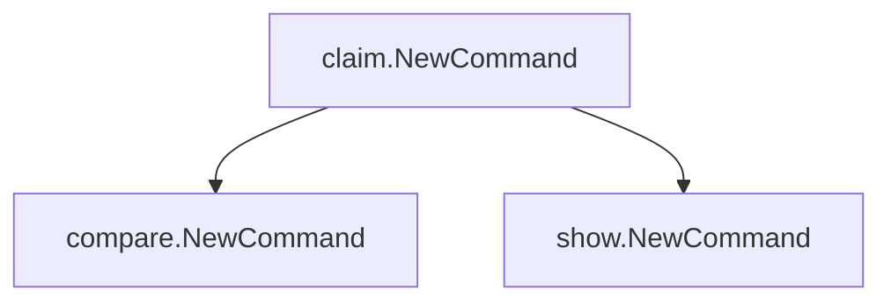
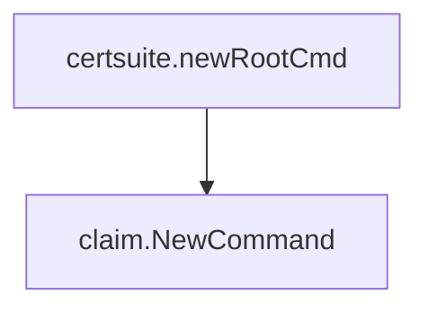

# Package claim

**Path**: `cmd/certsuite/claim`

## Table of Contents

- [Overview](#overview)
- [Exported Functions](#exported-functions)
  - [NewCommand](#newcommand)

## Overview

The `claim` package builds the Cobra command hierarchy for the top‑level `claim` subcommand of certsuite, wiring together its comparison and display subcommands.

### Key Features

- Provides a single entry point (`NewCommand`) that returns a fully configured cobra.Command with nested children

### Design Notes

- Relies on the Cobra library to manage CLI flags and execution flow
- Keeps command construction isolated from business logic by delegating to subpackages

### Exported Functions Summary

| Name | Purpose |
|------|----------|
| [func NewCommand() *cobra.Command](#newcommand) | Builds a Cobra command tree for the `claim` sub‑command, adding both comparison and display sub‑commands. |

## Exported Functions

### NewCommand

**NewCommand** - Builds a Cobra command tree for the `claim` sub‑command, adding both comparison and display sub‑commands.

#### Signature (Go)

```go
func NewCommand() *cobra.Command
```

#### Summary Table

| Aspect | Details |
|--------|---------|
| **Purpose** | Builds a Cobra command tree for the `claim` sub‑command, adding both comparison and display sub‑commands. |
| **Parameters** | None |
| **Return value** | A pointer to a configured `*cobra.Command` ready to be added to the application root. |
| **Key dependencies** | • `github.com/spf13/cobra` for command construction<br>• Calls to `compare.NewCommand()` and `show.NewCommand()` from sub‑packages |
| **Side effects** | Registers two child commands (`compare` and `show`) on the returned command; no global state changes. |
| **How it fits the package** | Serves as the entry point for the *claim* feature, exposing comparison and display functionality under the CLI hierarchy. |

#### Internal workflow (Mermaid)



#### Function dependencies (Mermaid)


#### Functions calling `NewCommand` (Mermaid)



#### Usage example (Go)

```go
// Minimal example invoking NewCommand
package main

import (
    "github.com/redhat-best-practices-for-k8s/certsuite/cmd/certsuite/claim"
)

func main() {
    cmd := claim.NewCommand()
    // Normally this command would be added to the root CLI and executed.
}
```

---
