# Package compare

**Path**: `cmd/certsuite/claim/compare`

## Table of Contents

- [Overview](#overview)
- [Exported Functions](#exported-functions)
  - [NewCommand](#newcommand)
- [Local Functions](#local-functions)
  - [claimCompare](#claimcompare)
  - [claimCompareFilesfunc](#claimcomparefilesfunc)
  - [unmarshalClaimFile](#unmarshalclaimfile)

## Overview

Provides a CLI command that compares two claim files, reporting differences in versioning, test cases, configurations and nodes.

### Key Features

- Builds a cobra.Command accepting two required file path flags
- Parses claim JSON/YAML into structured Schema objects
- Compares each major component (versions, test‑case results, configuration, node data) and prints a formatted diff report

### Design Notes

- Flags are defined as global variables for easy access by the command handler
- Comparison logic is encapsulated in a helper that returns errors to allow graceful logging
- The package focuses on read‑only comparison; it does not modify input files

### Exported Functions Summary

| Name | Purpose |
|------|----------|
| [func NewCommand() *cobra.Command](#newcommand) | Builds a `*cobra.Command` that accepts two file paths (`claim1`, `claim2`) as required flags, then returns it for use in the CLI. |

### Local Functions Summary

| Name | Purpose |
|------|----------|
| [func claimCompare(_ *cobra.Command, _ []string) error](#claimcompare) | Invokes the file‑comparison routine for two claim JSON/YAML files specified by global flags and handles errors via logging. |
| [func claimCompareFilesfunc(claim1, claim2 string) error](#claimcomparefilesfunc) | Reads two JSON claim files, unmarshals them into `claim.Schema`, compares their versions, test‑case results, configuration and node data, printing a structured diff report for each category. |
| [func([]byte)(claim.Schema, error)](#unmarshalclaimfile) | Parses raw JSON data from a claim file into the `claim.Schema` structure. |

## Exported Functions

### NewCommand

**NewCommand** - Builds a `*cobra.Command` that accepts two file paths (`claim1`, `claim2`) as required flags, then returns it for use in the CLI.

Creates and configures the Cobra command used to compare two claim files.

```go
func NewCommand() *cobra.Command
```

| Aspect | Details |
|--------|---------|
| **Purpose** | Builds a `*cobra.Command` that accepts two file paths (`claim1`, `claim2`) as required flags, then returns it for use in the CLI. |
| **Parameters** | None |
| **Return value** | A pointer to a configured `cobra.Command`. If flag validation fails, it logs an error and returns `nil`. |
| **Key dependencies** | *`StringVarP` – defines string flags.<br>* `Flags` – retrieves the command’s flag set.<br>*`MarkFlagRequired` – enforces required flags.<br>* `log.Error` – reports failures. |
| **Side effects** | Adds two persistent flags to the command; marks them as required; logs errors if marking fails. No external I/O is performed here. |
| **How it fits the package** | This function supplies the top‑level “compare” subcommand for the `claim` command hierarchy, enabling users to run `certsuite claim compare …`. |

#### Internal workflow

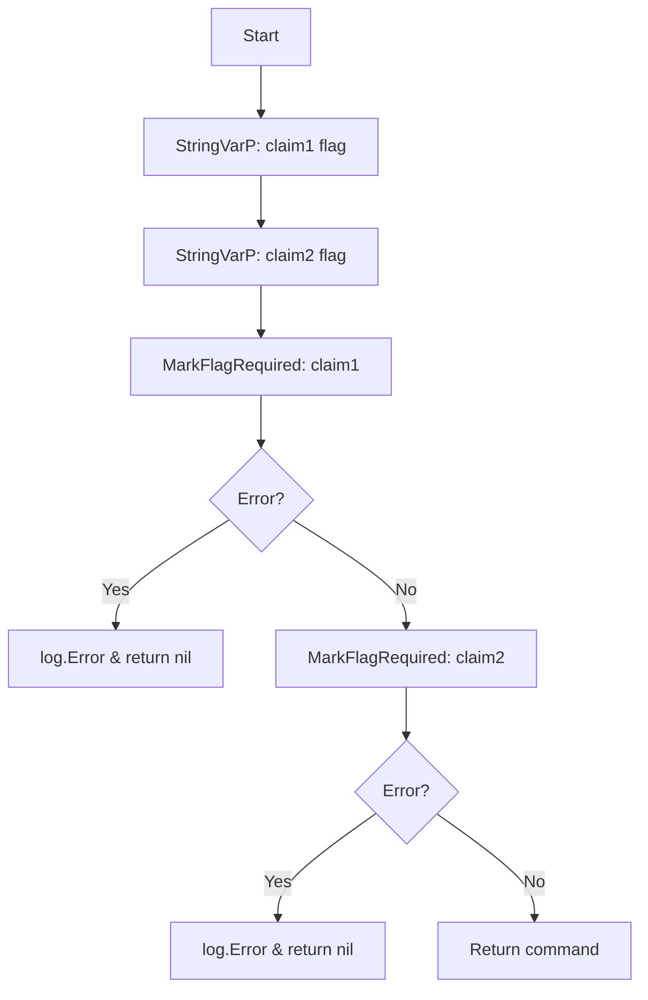

#### Function dependencies

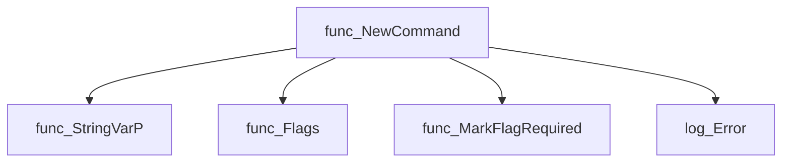

#### Functions calling `NewCommand`

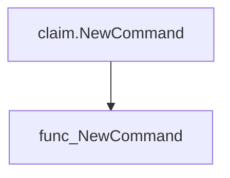

#### Usage example (Go)

```go
// Minimal example invoking NewCommand
package main

import (
    "github.com/redhat-best-practices-for-k8s/certsuite/cmd/certsuite/claim/compare"
    "github.com/spf13/cobra"
)

func main() {
    root := &cobra.Command{Use: "certsuite"}
    // Register the compare subcommand
    root.AddCommand(compare.NewCommand())

    // Execute the command line interface
    if err := root.Execute(); err != nil {
        panic(err)
    }
}
```

---

## Local Functions

### claimCompare

**claimCompare** - Invokes the file‑comparison routine for two claim JSON/YAML files specified by global flags and handles errors via logging.

#### Signature (Go)

```go
func claimCompare(_ *cobra.Command, _ []string) error
```

#### Summary Table

| Aspect | Details |
|--------|---------|
| **Purpose** | Invokes the file‑comparison routine for two claim JSON/YAML files specified by global flags and handles errors via logging. |
| **Parameters** | `_ *cobra.Command` – command context (unused). <br>`_ []string` – arguments list (unused). |
| **Return value** | `error` – always `nil`; any error is logged as fatal and terminates the program. |
| **Key dependencies** | • `claimCompareFilesfunc` – performs file I/O, unmarshalling, and diff generation.<br>• `log.Fatal` from the internal logging package – outputs errors and exits. |
| **Side effects** | Reads two claim files, prints diffs to stdout, logs fatal error on failure, and terminates the process if an error occurs. |
| **How it fits the package** | Entry point for the `compare` sub‑command of the certsuite CLI; orchestrates the comparison workflow without exposing details to the user. |

#### Internal workflow (Mermaid)

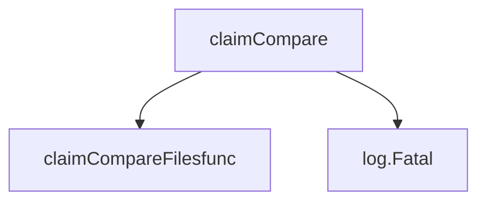

#### Function dependencies

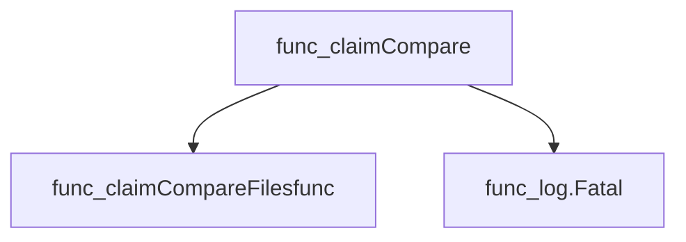

#### Functions calling `claimCompare` (Mermaid)

None – this function is currently not referenced elsewhere in the package.

#### Usage example (Go)

```go
// Minimal example invoking claimCompare
import (
    "github.com/redhat-best-practices-for-k8s/certsuite/cmd/certsuite/claim/compare"
    cobra "github.com/spf13/cobra"
)

func main() {
    cmd := &cobra.Command{Use: "compare"}
    // The command expects no arguments; flags Claim1FilePathFlag and Claim2FilePathFlag are set elsewhere.
    err := compare.claimCompare(cmd, []string{})
    if err != nil {
        // handle error (though claimCompare logs fatal on failure)
        fmt.Println("Unexpected error:", err)
    }
}
```

---

### claimCompareFilesfunc

**claimCompareFilesfunc** - Reads two JSON claim files, unmarshals them into `claim.Schema`, compares their versions, test‑case results, configuration and node data, printing a structured diff report for each category.

#### Signature (Go)

```go
func claimCompareFilesfunc(claim1, claim2 string) error
```

#### Summary Table

| Aspect | Details |
|--------|---------|
| **Purpose** | Reads two JSON claim files, unmarshals them into `claim.Schema`, compares their versions, test‑case results, configuration and node data, printing a structured diff report for each category. |
| **Parameters** | `claim1 string – path to first claim file`<br>`claim2 string – path to second claim file` |
| **Return value** | `error` – non‑nil if any I/O or unmarshalling error occurs; otherwise `nil`. |
| **Key dependencies** | • `os.ReadFile` (twice)<br>• `fmt.Errorf`, `fmt.Println`, `fmt.Print`<br>• `unmarshalClaimFile` (internal helper)<br>• `versions.Compare`<br>• `testcases.GetDiffReport`<br>• `configurations.GetDiffReport`<br>• `nodes.GetDiffReport` |
| **Side effects** | Reads files from disk; writes formatted diff reports to standard output. No global state is mutated. |
| **How it fits the package** | Internal implementation of the CLI command that performs a comprehensive comparison between two claim snapshots, producing human‑readable diagnostics for developers and operators. |

#### Internal workflow

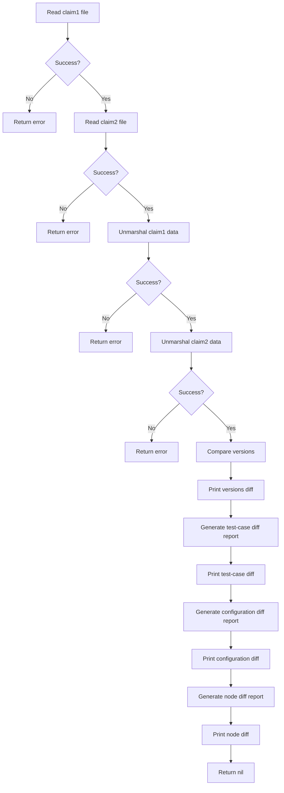

#### Function dependencies

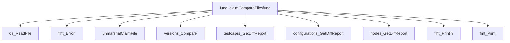

#### Functions calling `claimCompareFilesfunc`

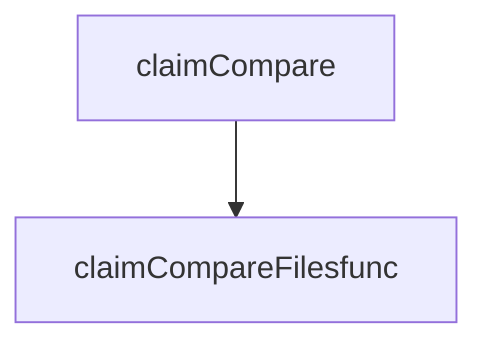

#### Usage example (Go)

```go
// Minimal example invoking claimCompareFilesfunc
package main

import (
    "log"
)

func main() {
    if err := claimCompareFilesfunc("path/to/claim1.json", "path/to/claim2.json"); err != nil {
        log.Fatalf("Comparison failed: %v", err)
    }
}
```

---

---

### unmarshalClaimFile

**unmarshalClaimFile** - Parses raw JSON data from a claim file into the `claim.Schema` structure.

#### 1) Signature (Go)

```go
func([]byte)(claim.Schema, error)
```

#### 2) Summary Table

| Aspect | Details |
|--------|---------|
| **Purpose** | Parses raw JSON data from a claim file into the `claim.Schema` structure. |
| **Parameters** | `claimdata []byte` – Byte slice containing the JSON representation of a claim. |
| **Return value** | `claim.Schema, error` – The unmarshaled schema object and an error if parsing fails. |
| **Key dependencies** | • `encoding/json.Unmarshal` – Deserialises the byte slice into the struct. |
| **Side effects** | None. The function is pure; it does not modify global state or perform I/O. |
| **How it fits the package** | Used by `claimCompareFilesfunc` to read and interpret claim files before comparison operations. |

#### 3) Internal workflow (Mermaid)

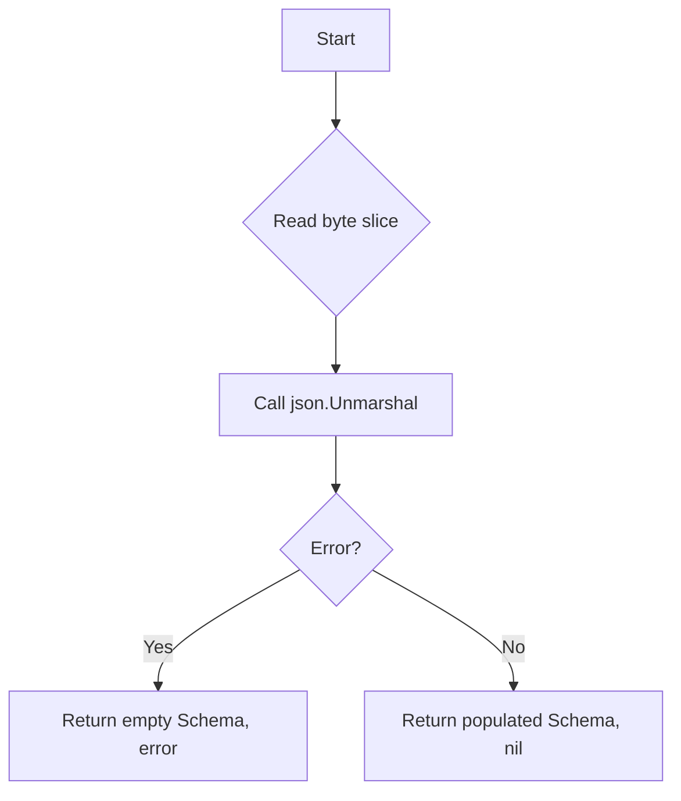

#### 4) Function dependencies (Mermaid)

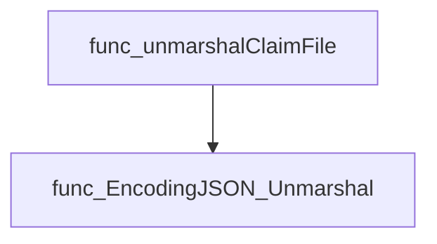

#### 5) Functions calling `unmarshalClaimFile` (Mermaid)

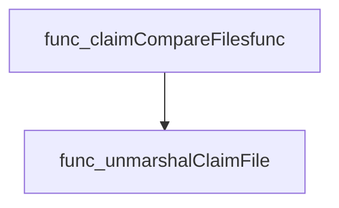

#### 6) Usage example (Go)

```go
// Minimal example invoking unmarshalClaimFile
import (
    "fmt"
    "io/ioutil"

    "github.com/redhat-best-practices-for-k8s/certsuite/cmd/certsuite/claim"
)

// Assume `pathToClaim` is a string containing the file path.
data, err := ioutil.ReadFile(pathToClaim)
if err != nil {
    log.Fatalf("failed to read claim file: %v", err)
}

schema, err := unmarshalClaimFile(data)
if err != nil {
    log.Fatalf("failed to parse claim: %v", err)
}

fmt.Printf("Parsed claim version: %s\n", schema.Claim.Versions[0])
```

---
