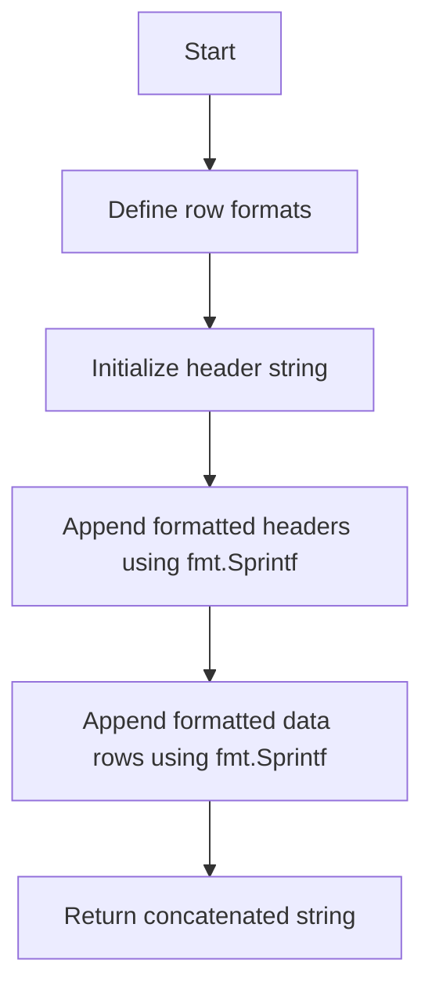
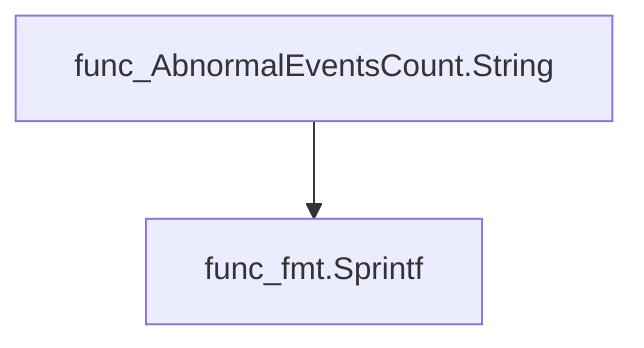
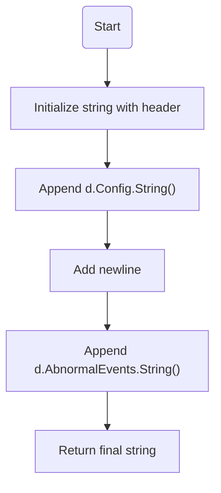
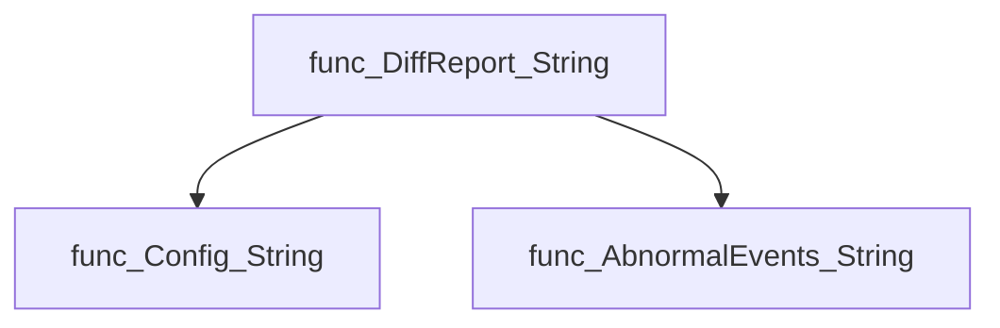
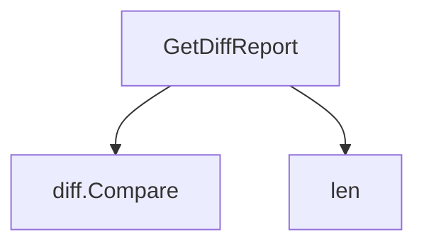
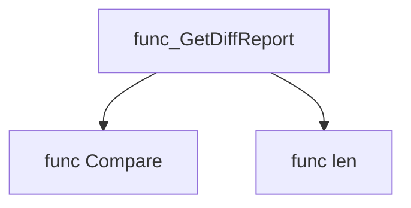
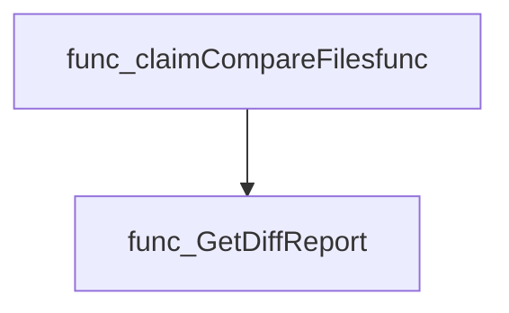

# Package configurations

**Path**: `cmd/certsuite/claim/compare/configurations`

## Table of Contents

- [Overview](#overview)
- [Structs](#structs)
  - [AbnormalEventsCount](#abnormaleventscount)
  - [DiffReport](#diffreport)
- [Exported Functions](#exported-functions)
  - [AbnormalEventsCount.String](#abnormaleventscount.string)
  - [DiffReport.String](#diffreport.string)
  - [GetDiffReport](#getdiffreport)

## Overview

Provides utilities to compare two claim configurations, summarizing configuration differences and abnormal event counts.

### Key Features

- Generates a DiffReport struct containing diff.Diffs and abnormal event statistics
- String methods produce human‑readable tables for reports
- GetDiffReport orchestrates comparison of two claim.Configurations

### Design Notes

- Relies on external diff package to compute configuration differences
- Assumes Claim1/Claim2 fields represent counts from separate contexts
- Best practice: use GetDiffReport before displaying or storing the report

### Structs Summary

| Name | Purpose |
|------|----------|
| [**AbnormalEventsCount**](#abnormaleventscount) | Struct definition |
| [**DiffReport**](#diffreport) | Summary of configuration differences and abnormal event counts |

### Exported Functions Summary

| Name | Purpose |
|------|----------|
| [func (c *AbnormalEventsCount) String() string](#abnormaleventscount.string) | Builds a human‑readable table that lists the number of abnormal events detected in two separate claim contexts. |
| [func (d *DiffReport) String() string](#diffreport.string) | Builds and returns a formatted text block that lists configuration differences and any abnormal events. |
| [func GetDiffReport(claim1Configurations, claim2Configurations *claim.Configurations) *DiffReport](#getdiffreport) | Compares two `claim.Configurations` objects and returns a summary of differences in configuration settings and abnormal event counts. |

## Structs

### AbnormalEventsCount

<!-- DEBUG: Struct AbnormalEventsCount exists in bundle but ParsedOK=false, Fields=0 -->
**Purpose**: 

**Fields**:

| Field | Type | Description |
|-------|------|--------------|
| `Claim1` | `int` | Field documentation |
| `Claim2` | `int` | Field documentation |

---

### DiffReport


#### Fields
| Field | Type | Description |
|-------|------|-------------|
| `Config` | `*diff.Diffs` | Holds the detailed differences between two Cert Suite configuration objects, produced by the diffing library. |
| `AbnormalEvents` | `AbnormalEventsCount` | Stores the number of abnormal events observed in each claim (`Claim1` and `Claim2`). |

#### Purpose
`DiffReport` encapsulates a comparison result for two Cert Suite claims. It contains both the structural differences of their configuration sections and the counts of any abnormal events recorded during execution. The struct is used to generate human‑readable summaries (via its `String()` method) and can be serialized as JSON for reporting or further analysis.

#### Related functions
| Function | Purpose |
|----------|---------|
| `GetDiffReport` | Creates a new `DiffReport` by comparing the configurations of two claims and counting their abnormal events. |
| `DiffReport.String` | Returns a formatted string that lists the configuration differences followed by the abnormal event counts for display or logging. |

---

---

## Exported Functions

### AbnormalEventsCount.String

**String** - Builds a human‑readable table that lists the number of abnormal events detected in two separate claim contexts.


Displays a formatted string summarizing abnormal event counts for two claims.

```go
func (c *AbnormalEventsCount) String() string
```

| Aspect | Details |
|--------|---------|
| **Purpose** | Builds a human‑readable table that lists the number of abnormal events detected in two separate claim contexts. |
| **Parameters** | `c` – pointer to an `AbnormalEventsCount` struct containing integer fields `Claim1` and `Claim2`. |
| **Return value** | A string formatted as: <br>``Cluster abnormal events count\nCLAIM 1 CLAIM 2\n<value1><value2>\n``` |
| **Key dependencies** | • `fmt.Sprintf` (two calls)<br>• Standard library only |
| **Side effects** | None – purely functional; no mutation or I/O. |
| **How it fits the package** | Provides a convenient textual representation for reporting or logging within the `configurations` comparison tooling. |

#### Internal workflow



#### Function dependencies



#### Functions calling `AbnormalEventsCount.String`

None – this function is currently not referenced elsewhere in the package.

#### Usage example (Go)

```go
// Minimal example invoking AbnormalEventsCount.String
package main

import (
	"fmt"

	"github.com/redhat-best-practices-for-k8s/certsuite/cmd/certsuite/claim/compare/configurations"
)

func main() {
	c := configurations.AbnormalEventsCount{Claim1: 3, Claim2: 5}
	fmt.Print(c.String())
}
```

---

### DiffReport.String

**String** - Builds and returns a formatted text block that lists configuration differences and any abnormal events.

Converts a `DiffReport` into a human‑readable string representation.

#### Signature (Go)
```go
func (d *DiffReport) String() string
```

#### Summary Table
| Aspect | Details |
|--------|---------|
| **Purpose** | Builds and returns a formatted text block that lists configuration differences and any abnormal events. |
| **Parameters** | `d *DiffReport` – the report instance to be rendered. |
| **Return value** | `string` – concatenated textual representation of the report. |
| **Key dependencies** | • Calls `d.Config.String()`<br>• Calls `d.AbnormalEvents.String()` |
| **Side effects** | None; purely functional, no mutation or I/O. |
| **How it fits the package** | Provides a convenient way to display comparison results in logs or user interfaces within the `configurations` comparison module. |

#### Internal workflow (Mermaid)


#### Function dependencies (Mermaid)


#### Functions calling `DiffReport.String` (Mermaid)
None – this function is currently not referenced elsewhere in the package.

#### Usage example (Go)
```go
// Minimal example invoking DiffReport.String
report := &configurations.DiffReport{
    Config:          myConfig,
    AbnormalEvents:  myEvents,
}
fmt.Println(report.String())
```

---

### GetDiffReport

**GetDiffReport** - Compares two `claim.Configurations` objects and returns a summary of differences in configuration settings and abnormal event counts.


#### Signature (Go)

```go
func GetDiffReport(claim1Configurations, claim2Configurations *claim.Configurations) *DiffReport
```

#### Summary Table

| Aspect | Details |
|--------|---------|
| **Purpose** | Compares two `claim.Configurations` objects and returns a summary of differences in configuration settings and abnormal event counts. |
| **Parameters** | `claim1Configurations *claim.Configurations` – first claim’s configurations.<br>`claim2Configurations *claim.Configurations` – second claim’s configurations. |
| **Return value** | `*DiffReport` – a struct containing the diff of config values (`Config`) and counts of abnormal events for each claim. |
| **Key dependencies** | • `diff.Compare` from `github.com/redhat-best-practices-for-k8s/certsuite/cmd/certsuite/claim/compare/diff`.<br>• `len` (built‑in). |
| **Side effects** | None; purely functional. |
| **How it fits the package** | Provides a high‑level API for the *configurations* comparison module, used by higher‑level claim comparison logic to produce human‑readable diff reports. |

#### Internal workflow (Mermaid)



#### Function dependencies



#### Functions calling `GetDiffReport`



#### Usage example (Go)

```go
// Minimal example invoking GetDiffReport
package main

import (
    "fmt"

    "github.com/redhat-best-practices-for-k8s/certsuite/cmd/certsuite/claim"
    "github.com/redhat-best-practices-for-k8s/certsuite/cmd/certsuite/claim/compare/configurations"
)

func main() {
    // Assume cfg1 and cfg2 are populated *claim.Configurations instances
    var cfg1, cfg2 *claim.Configurations

    diffReport := configurations.GetDiffReport(cfg1, cfg2)
    fmt.Printf("%+v\n", diffReport)
}
```

---

