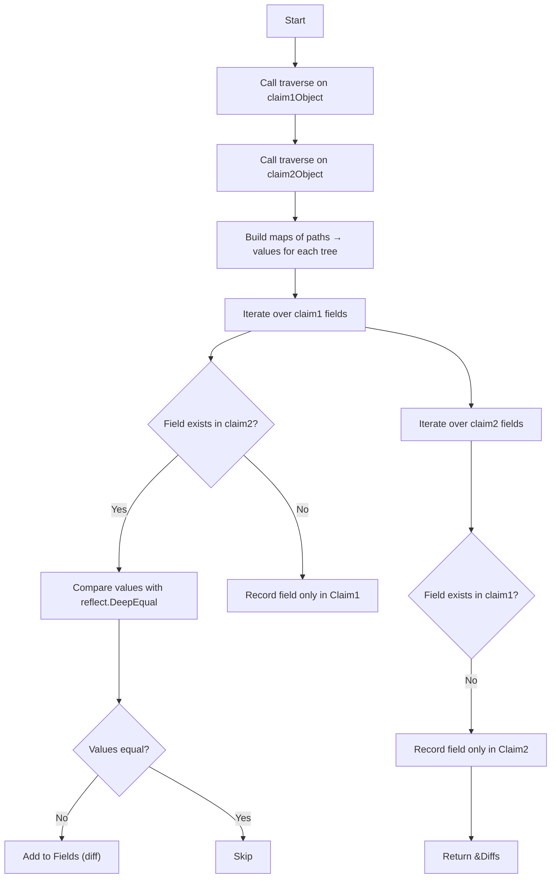
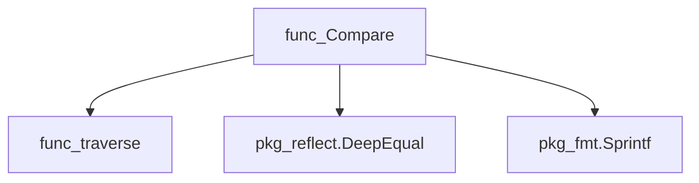
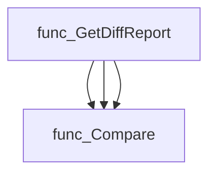
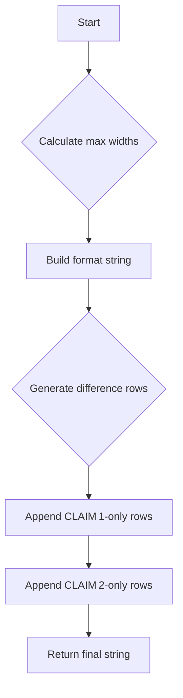
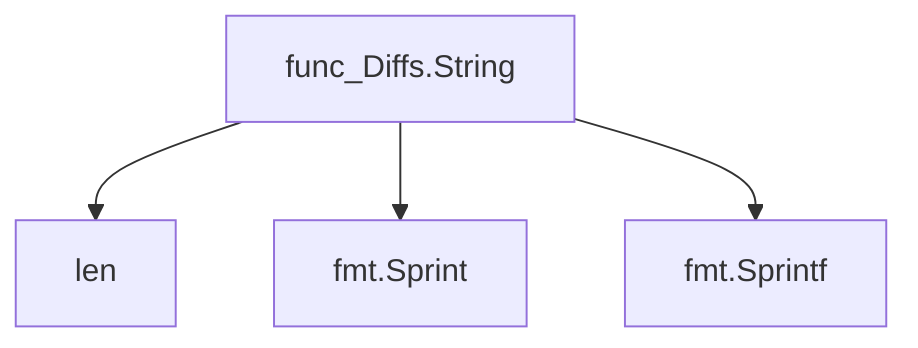
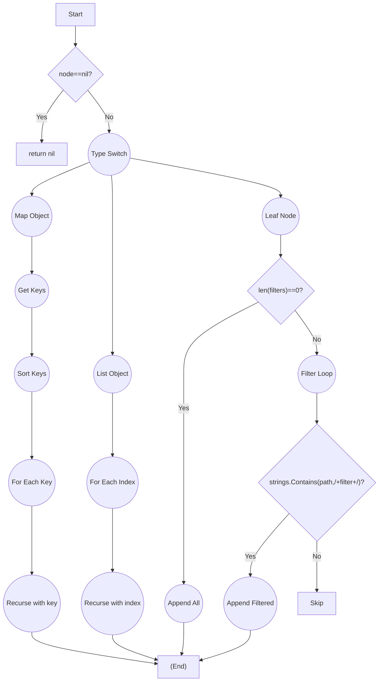
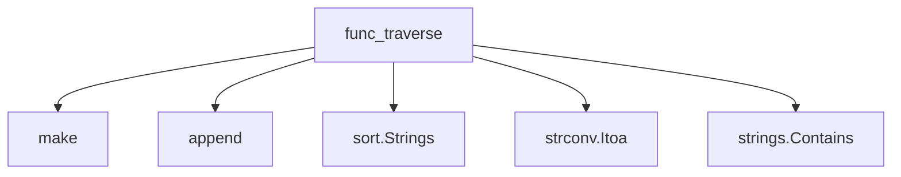
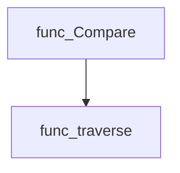

# Package diff

**Path**: `cmd/certsuite/claim/compare/diff`

## Table of Contents

- [Overview](#overview)
- [Structs](#structs)
  - [Diffs](#diffs)
  - [FieldDiff](#fielddiff)
- [Exported Functions](#exported-functions)
  - [Compare](#compare)
  - [Diffs.String](#diffs.string)
- [Local Functions](#local-functions)
  - [traverse](#traverse)

## Overview

The diff package provides utilities for comparing two unmarshaled JSON‑like structures and summarizing their differences in a tabular form.

### Key Features

- Recursively walks arbitrary maps or slices to produce a flat list of leaf nodes
- Compares two such trees, reporting matching fields, differing values, and fields present only in one tree
- Formats the diff into a human‑readable table with dynamic column widths

### Design Notes

- Comparison is value‑based using reflect.DeepEqual; order of keys in maps does not affect results
- The traversal function supports optional path filters to limit output to specific subtrees
- The String method calculates column width at runtime, which may be costly for very large diffs

### Structs Summary

| Name | Purpose |
|------|----------|
| [**Diffs**](#diffs) | Holds the differences between two JSON‑unmarshalled objects |
| [**FieldDiff**](#fielddiff) | Struct definition |

### Exported Functions Summary

| Name | Purpose |
|------|----------|
| [func Compare(objectName string, claim1Object, claim2Object interface{}, filters []string) *Diffs](#compare) | Walks two arbitrary `interface{}` trees (typically unmarshaled JSON), optionally filtering by subtree paths, and returns a `*Diffs` struct summarizing matching fields, differing values, and unique fields in each tree. |
| [func (d *Diffs) String() string](#diffs.string) | Returns a formatted string that lists field differences, fields only in CLAIM 1 and fields only in CLAIM 2. The output is tabular with dynamic column widths based on the longest path or value. |

### Local Functions Summary

| Name | Purpose |
|------|----------|
| [func traverse(node interface{}, path string, filters []string) []field](#traverse) | Walks through an arbitrary JSON‑like tree (`map[string]interface{}` or `[]interface{}`), building a flat list of leaf nodes. Each leaf is represented as a `field` containing its full path and value. Optional filters restrict the paths that are returned. |

## Structs

### Diffs


| Field | Type | Description |
|-------|------|-------------|
| `Name` | `string` | Identifier of the object being compared; used as a header when rendering results. |
| `Fields` | `[]FieldDiff` | Entries for fields that exist in both objects but have differing values. |
| `FieldsInClaim1Only` | `[]string` | List of field paths (with their values) present only in the first object. |
| `FieldsInClaim2Only` | `[]string` | List of field paths (with their values) present only in the second object. |

#### Purpose
`Diffs` aggregates all differences discovered when comparing two arbitrary Go structures that were decoded from JSON. It records:
- Which fields differ and shows both values (`FieldDiff`),
- Which fields exist exclusively in each input.

This struct is primarily used by the `Compare` function to produce a human‑readable report, and it implements `String()` for easy formatting.

#### Related functions
| Function | Purpose |
|----------|---------|
| `Compare(objectName string, claim1Object, claim2Object interface{}, filters []string) *Diffs` | Walks both objects, populates a `Diffs` instance with differing fields and exclusive fields. |
| `(*Diffs).String() string` | Formats the stored differences into a plain‑text table for display or logging. |

---

---

### FieldDiff

<!-- DEBUG: Struct FieldDiff exists in bundle but ParsedOK=false, Fields=3 -->
**Purpose**: FieldDIff holds the field path and the values from both claim files
that have been found to be different.

**Fields**:

| Field | Type | Description |
|-------|------|--------------|
| `Claim2Value` | `interface{}` | Value of the field extracted from the second claim file. |
| `FieldPath` | `string` | JSON‑style path to the field within the claim structure (e.g., `"spec.template.spec.containers[0].image"`). |
| `Claim1Value` | `interface{}` | Value of the field extracted from the first claim file. |

---

## Exported Functions

### Compare

**Compare** - Walks two arbitrary `interface{}` trees (typically unmarshaled JSON), optionally filtering by subtree paths, and returns a `*Diffs` struct summarizing matching fields, differing values, and unique fields in each tree.


#### 1) Signature (Go)

```go
func Compare(objectName string, claim1Object, claim2Object interface{}, filters []string) *Diffs
```

#### 2) Summary Table

| Aspect | Details |
|--------|---------|
| **Purpose** | Walks two arbitrary `interface{}` trees (typically unmarshaled JSON), optionally filtering by subtree paths, and returns a `*Diffs` struct summarizing matching fields, differing values, and unique fields in each tree. |
| **Parameters** | `objectName string –` identifier used in the resulting `Diffs`; <br>`claim1Object interface{} –` first tree to compare; <br>`claim2Object interface{} –` second tree; <br>`filters []string –` optional list of subtree names that should be traversed and compared. |
| **Return value** | `*Diffs` containing: <br>• `Name string` (the supplied object name) <br>• `Fields []FieldDiff` (paths where values differ) <br>• `FieldsInClaim1Only []string` (paths present only in the first tree) <br>• `FieldsInClaim2Only []string` (paths present only in the second tree). |
| **Key dependencies** | • `traverse` – recursively extracts fields from a tree. <br>• `reflect.DeepEqual` – checks value equality. <br>• `fmt.Sprintf` – formats missing‑field strings. |
| **Side effects** | None beyond constructing and returning the `Diffs` result; no global state is mutated, and no I/O occurs. |
| **How it fits the package** | Core comparison routine used by higher‑level diff reports for configurations, nodes, versions, etc., enabling consistent reporting across claim types. |

#### 3) Internal workflow (Mermaid)



#### 4) Function dependencies (Mermaid)



#### 5) Functions calling `Compare` (Mermaid)



*Note: The function is referenced by multiple callers in different subpackages.*

#### 6) Usage example (Go)

```go
// Minimal example invoking Compare
package main

import (
    "encoding/json"
    "fmt"

    "github.com/redhat-best-practices-for-k8s/certsuite/cmd/certsuite/claim/compare/diff"
)

func main() {
    // Example JSON objects unmarshaled into interface{}
    obj1JSON := `{"name":"alpha","value":42,"labels":{"env":"prod"}}`
    obj2JSON := `{"name":"alpha","value":43,"labels":{"env":"dev"}}`

    var obj1, obj2 interface{}
    json.Unmarshal([]byte(obj1JSON), &obj1)
    json.Unmarshal([]byte(obj2JSON), &obj2)

    // Compare all fields
    result := diff.Compare("ExampleObject", obj1, obj2, nil)

    fmt.Printf("%+v\n", result)
}
```

This example demonstrates how `Compare` can be used to detect differences between two arbitrary JSON structures.

---

### Diffs.String

**String** - Returns a formatted string that lists field differences, fields only in CLAIM 1 and fields only in CLAIM 2. The output is tabular with dynamic column widths based on the longest path or value.

Creates a human‑readable table summarising the differences between two claim files.

```go
func (d *Diffs) String() string
```

| Aspect | Details |
|--------|---------|
| **Purpose** | Returns a formatted string that lists field differences, fields only in CLAIM 1 and fields only in CLAIM 2. The output is tabular with dynamic column widths based on the longest path or value. |
| **Parameters** | `d *Diffs` – receiver holding comparison data (Name, Fields, FieldsInClaim1Only, FieldsInClaim2Only). |
| **Return value** | `string` – the formatted diff report. |
| **Key dependencies** | • `len`, `fmt.Sprint`, `fmt.Sprintf` for calculating widths and formatting.<br>• Constants `noDiffs`, `columnsGapSize`. |
| **Side effects** | None; purely functional, no state mutation or I/O. |
| **How it fits the package** | Implements the `Stringer` interface for `Diffs`, enabling easy printing of comparison results within the `diff` package. |

#### Internal workflow


#### Function dependencies


#### Functions calling `Diffs.String`
None – this function is currently not referenced elsewhere in the package.

#### Usage example (Go)
```go
// Minimal example invoking Diffs.String
diff := &diff.Diffs{
    Name: "Certificate",
    Fields: []diff.FieldDiff{{
        FieldPath:   "/metadata/name",
        Claim1Value: "certA",
        Claim2Value: "certB",
    }},
}
fmt.Println(diff.String())
```

---

## Local Functions

### traverse

**traverse** - Walks through an arbitrary JSON‑like tree (`map[string]interface{}` or `[]interface{}`), building a flat list of leaf nodes. Each leaf is represented as a `field` containing its full path and value. Optional filters restrict the paths that are returned.


#### Signature (Go)
```go
func traverse(node interface{}, path string, filters []string) []field
```

#### Summary Table
| Aspect | Details |
|--------|---------|
| **Purpose** | Walks through an arbitrary JSON‑like tree (`map[string]interface{}` or `[]interface{}`), building a flat list of leaf nodes. Each leaf is represented as a `field` containing its full path and value. Optional filters restrict the paths that are returned. |
| **Parameters** | - `node interface{}` – Current node to inspect.<br>- `path string` – Accumulated slash‑delimited path from the root.<br>- `filters []string` – Path fragments; only leaves whose path contains one of these fragments (surrounded by slashes) are included when filters are non‑empty. |
| **Return value** | `[]field` – Slice of all matching leaf nodes found under `node`. If `node` is `nil`, returns `nil`. |
| **Key dependencies** | • `make` to create slices and maps.<br>• `append` for slice manipulation.<br>• `sort.Strings` to visit map keys in deterministic order.<br>• `strconv.Itoa` to convert list indices into string form.<br>• `strings.Contains` to apply filter checks. |
| **Side effects** | None; the function is pure and does not modify any external state. |
| **How it fits the package** | Used by the public `Compare` function to flatten two claim objects into comparable lists of fields before performing a diff. |

#### Internal workflow (Mermaid)


#### Function dependencies (Mermaid)


#### Functions calling `traverse` (Mermaid)


#### Usage example (Go)
```go
// Minimal example invoking traverse
package main

import (
	"fmt"
)

func main() {
	data := map[string]interface{}{
		"metadata": map[string]interface{}{
			"name":   "example",
			"labels": []interface{}{"app", "demo"},
		},
		"spec": map[string]interface{}{
			"replicas": 3,
		},
	}

	fields := traverse(data, "", nil)
	for _, f := range fields {
		fmt.Printf("%s = %v\n", f.Path, f.Value)
	}
}
```

---

