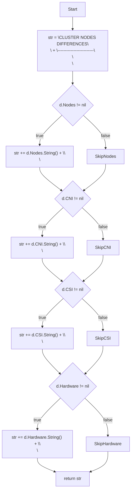
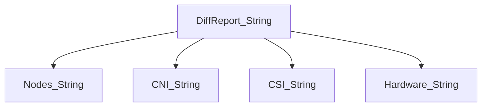
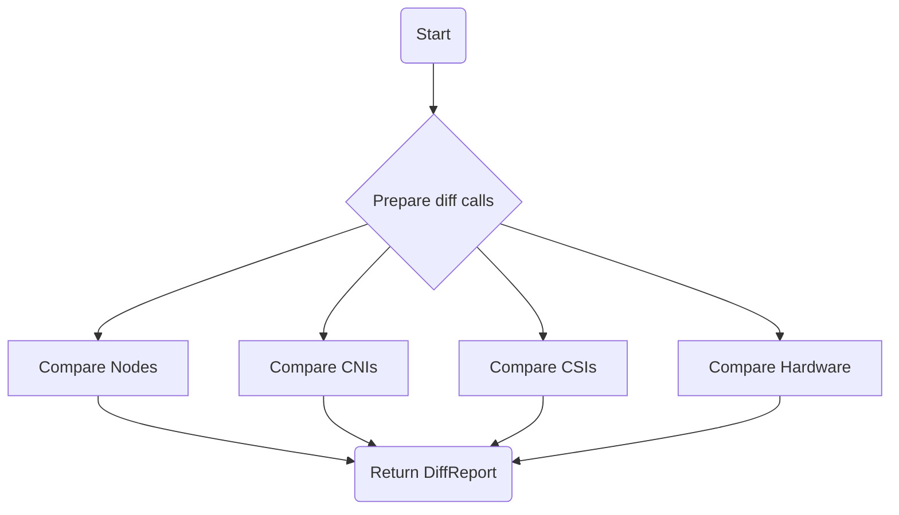
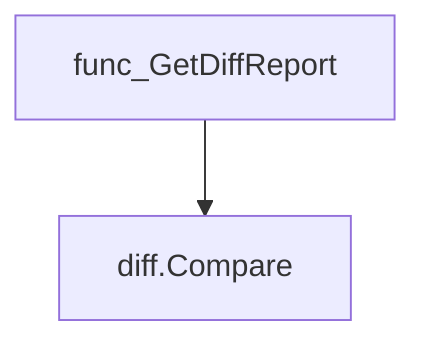
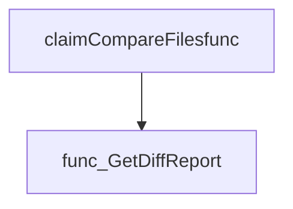

# Package nodes

**Path**: `cmd/certsuite/claim/compare/nodes`

## Table of Contents

- [Overview](#overview)
- [Structs](#structs)
  - [DiffReport](#diffreport)
- [Exported Functions](#exported-functions)
  - [DiffReport.String](#diffreport.string)
  - [GetDiffReport](#getdiffreport)

## Overview

The nodes package builds a human‑readable report summarizing differences between two claim node sets—covering node lists, CNI networks, CSI drivers and hardware details.

### Key Features

- Computes structured diffs via the diff package for each component (Nodes, CNI, CSI, Hardware)
- Encapsulates results in DiffReport with a String() method for easy display
- Provides GetDiffReport to construct reports from claim.Nodes objects

### Design Notes

- Assumes both input claims are fully populated and comparable; nil pointers result in empty diffs
- Diff generation is delegated to the diff package, keeping comparison logic separate
- String() aggregates multiple diff sections into one string, suitable for CLI output

### Structs Summary

| Name | Purpose |
|------|----------|
| [**DiffReport**](#diffreport) | Summary of node differences between two claims |

### Exported Functions Summary

| Name | Purpose |
|------|----------|
| [func (d DiffReport) String() string](#diffreport.string) | Creates a human‑readable summary of cluster node differences, including nodes, CNI, CSI and hardware comparisons. |
| [func GetDiffReport(claim1Nodes, claim2Nodes *claim.Nodes) *DiffReport](#getdiffreport) | Builds a `DiffReport` that contains the differences between two sets of claim nodes. It compares node summaries, CNI networks, CSI drivers and hardware information. |

## Structs

### DiffReport

#### Fields

| Field    | Type        | Description |
|----------|-------------|-------------|
| `Nodes`  | `*diff.Diffs` | Differences in node roles and summaries, one entry per node that appears in both claim files. If a node exists only in one claim it is marked “not found in claim[1|2]”. |
| `CNI`    | `*diff.Diffs` | Differences between CNI network configurations across the two claims. |
| `CSI`    | `*diff.Diffs` | Differences between CSI driver definitions in the two claims. |
| `Hardware` | `*diff.Diffs` | Differences in hardware information reported by the nodes in each claim. |

#### Purpose

`DiffReport` aggregates the results of comparing node-related data from two Kubernetes cluster claims. It holds separate diff summaries for general node information, CNI networks, CSI drivers, and hardware specs, allowing consumers to inspect which aspects differ between the clusters.

#### Related functions

| Function | Purpose |
|----------|---------|
| `GetDiffReport` | Creates a new `DiffReport` by comparing corresponding fields of two `claim.Nodes` objects. |
| `DiffReport.String` | Returns a formatted string representation of the report, listing differences for each section if present. |

---

---

## Exported Functions

### DiffReport.String

**String** - Creates a human‑readable summary of cluster node differences, including nodes, CNI, CSI and hardware comparisons.

Outputs a formatted report of node differences between two claim files.

---

#### Signature (Go)

```go
func (d DiffReport) String() string
```

---

#### Summary Table

| Aspect | Details |
|--------|---------|
| **Purpose** | Creates a human‑readable summary of cluster node differences, including nodes, CNI, CSI and hardware comparisons. |
| **Parameters** | `d DiffReport` – the report to format (receiver). |
| **Return value** | `string` – multiline text ready for printing or logging. |
| **Key dependencies** | Calls `String()` on the nested fields: `d.Nodes`, `d.CNI`, `d.CSI`, and `d.Hardware`. |
| **Side effects** | None; purely functional, no state mutation or I/O. |
| **How it fits the package** | Serves as the stringer for `DiffReport`, enabling concise output when comparing claims in the *nodes* comparison tool. |

---

#### Internal workflow (Mermaid)



---

#### Function dependencies (Mermaid)



---

#### Functions calling `DiffReport.String` (Mermaid)

None – this function is currently not referenced elsewhere in the package.

---

#### Usage example (Go)

```go
// Minimal example invoking DiffReport.String
package main

import (
    "fmt"
    "github.com/redhat-best-practices-for-k8s/certsuite/cmd/certsuite/claim/compare/nodes"
)

func main() {
    var report nodes.DiffReport
    // populate report with data...
    fmt.Println(report.String())
}
```

---

### GetDiffReport

**GetDiffReport** - Builds a `DiffReport` that contains the differences between two sets of claim nodes. It compares node summaries, CNI networks, CSI drivers and hardware information.

#### Signature (Go)

```go
func GetDiffReport(claim1Nodes, claim2Nodes *claim.Nodes) *DiffReport
```

#### Summary Table

| Aspect | Details |
|--------|---------|
| **Purpose** | Builds a `DiffReport` that contains the differences between two sets of claim nodes. It compares node summaries, CNI networks, CSI drivers and hardware information. |
| **Parameters** | `claim1Nodes *claim.Nodes – first set of nodes to compare`<br>`claim2Nodes *claim.Nodes – second set of nodes to compare` |
| **Return value** | `*DiffReport – a report with fields for Nodes, CNI, CSI and Hardware diffs` |
| **Key dependencies** | • `diff.Compare` (from `github.com/redhat-best-practices-for-k8s/certsuite/cmd/certsuite/claim/compare/diff`)<br>• Types from the `claim` package (`Nodes`, `NodesSummary`, etc.) |
| **Side effects** | None – pure function, no I/O or global state modification. |
| **How it fits the package** | This function is the public entry point for producing node‑level differences used by higher‑level comparison utilities (e.g., `claimCompareFilesfunc`). |

#### Internal workflow (Mermaid)



#### Function dependencies (Mermaid)



#### Functions calling `GetDiffReport` (Mermaid)



#### Usage example (Go)

```go
// Minimal example invoking GetDiffReport

import (
    "github.com/redhat-best-practices-for-k8s/certsuite/cmd/certsuite/claim"
    "github.com/redhat-best-practices-for-k8s/certsuite/cmd/certsuite/claim/compare/nodes"
)

func main() {
    // Assume node1 and node2 are already populated *claim.Nodes
    var node1, node2 *claim.Nodes

    diffReport := nodes.GetDiffReport(node1, node2)
    fmt.Printf("%+v\n", diffReport)
}
```

---
