# Package testcases

**Path**: `cmd/certsuite/claim/compare/testcases`

## Table of Contents

- [Overview](#overview)
- [Structs](#structs)
  - [DiffReport](#diffreport)
  - [TcResultDifference](#tcresultdifference)
  - [TcResultsSummary](#tcresultssummary)
- [Exported Functions](#exported-functions)
  - [DiffReport.String](#diffreport.string)
  - [GetDiffReport](#getdiffreport)
- [Local Functions](#local-functions)
  - [getMergedTestCasesNames](#getmergedtestcasesnames)
  - [getTestCasesResultsMap](#gettestcasesresultsmap)
  - [getTestCasesResultsSummary](#gettestcasesresultssummary)

## Overview

The testcases package compares two claim result sets and produces a structured diff report, summarising pass/fail/skipped counts per claim and listing any differing test case outcomes.

### Key Features

- Generates a DiffReport struct that contains summary statistics for each claim and a list of individual test‑case differences
- Provides helper functions to map raw results into lookup tables and compute summaries efficiently
- Sorts merged test‑case names so the diff report is deterministic and easy to read

### Design Notes

- Assumes claim.TestSuiteResults are maps keyed by test case ID; conversion to string maps abstracts away internal structure
- The DiffReport.String method formats output with tables, using fmt.Sprintf for alignment; missing differences are shown as <none>
- Best practice: call GetDiffReport before rendering or serialising the report; avoid direct manipulation of DiffReport fields

### Structs Summary

| Name | Purpose |
|------|----------|
| [**DiffReport**](#diffreport) | Struct definition |
| [**TcResultDifference**](#tcresultdifference) | One‑line purpose |
| [**TcResultsSummary**](#tcresultssummary) | Summary of test case execution results |

### Exported Functions Summary

| Name | Purpose |
|------|----------|
| [func (r *DiffReport) String() string](#diffreport.string) | Builds a formatted string containing: <br>• A summary table of passed, skipped, and failed counts for CLAIM‑1 and CLAIM‑2.<br>• A differences table listing each test case name with its result in both claims. If no differences exist, it shows “<none>”. |
| [func GetDiffReport(resultsClaim1, resultsClaim2 claim.TestSuiteResults) *DiffReport](#getdiffreport) | Produces a `DiffReport` comparing test case outcomes from two claim files. Each differing result is recorded, and summary statistics for each claim are included. |

### Local Functions Summary

| Name | Purpose |
|------|----------|
| [func getMergedTestCasesNames(results1, results2 map[string]string) []string](#getmergedtestcasesnames) | Combines the keys from two result maps into a unique, sorted slice of test‑case names. |
| [func getTestCasesResultsMap(testSuiteResults claim.TestSuiteResults) map[string]string](#gettestcasesresultsmap) | Builds a map from each test case ID to its result state for quick comparison. |
| [func getTestCasesResultsSummary(results map[string]string) TcResultsSummary](#gettestcasesresultssummary) | Aggregates the outcome of each test case into a `TcResultsSummary` struct, counting passed, skipped and failed cases. |

## Structs

### DiffReport

<!-- DEBUG: Struct DiffReport exists in bundle but ParsedOK=false, Fields=0 -->
**Purpose**: Holds the results summary and the list of test cases whose result
is different.

**Fields**:

| Field | Type | Description |
|-------|------|--------------|
| `DifferentTestCasesResults` | `int` | Field documentation |
| `Claim1ResultsSummary` | `TcResultsSummary` | Field documentation |
| `Claim2ResultsSummary` | `TcResultsSummary` | Field documentation |
| `TestCases` | `[]TcResultDifference` | Field documentation |

---

### TcResultDifference


Represents a discrepancy between the results of two claim evaluations for a single test case.

#### Fields

| Field         | Type   | Description |
|---------------|--------|-------------|
| `Name`        | string | Identifier of the test case that produced the difference. |
| `Claim1Result` | string | Result value returned by the first claim under comparison. |
| `Claim2Result` | string | Result value returned by the second claim under comparison. |

#### Purpose  

In a comparison workflow, each test case is evaluated against two different claims (e.g., expected versus actual). When the outcomes differ, an instance of `TcResultDifference` captures the test case name and both result strings, enabling downstream reporting or debugging.

#### Related functions  

| Function | Purpose |
|----------|---------|
| *none*   | No package‑level functions directly operate on this struct. |

---

---

### TcResultsSummary


#### Fields
| Field   | Type | Description |
|---------|------|-------------|
| Passed  | int  | Number of test cases that completed successfully. |
| Skipped | int  | Number of test cases that were skipped during the run. |
| Failed  | int  | Number of test cases that did not pass. |

#### Purpose
`TcResultsSummary` aggregates the outcome counts of a set of test case executions, providing a quick overview of how many tests passed, were skipped, or failed. It is used to report overall test suite health and to drive decision‑making based on test results.

#### Related functions
| Function | Purpose |
|----------|---------|
| `getTestCasesResultsSummary` | Computes a `TcResultsSummary` from a map of test case names to result strings by incrementing the appropriate counter (`Passed`, `Skipped`, or `Failed`) for each reported outcome. |

---

---

## Exported Functions

### DiffReport.String

**String** - Builds a formatted string containing: <br>• A summary table of passed, skipped, and failed counts for CLAIM‑1 and CLAIM‑2.<br>• A differences table listing each test case name with its result in both claims. If no differences exist, it shows “<none>”.


Generates a human‑readable report summarising test case outcomes for two claims and listing differences between them.

#### Signature (Go)

```go
func (r *DiffReport) String() string
```

#### Summary Table

| Aspect | Details |
|--------|---------|
| **Purpose** | Builds a formatted string containing: <br>• A summary table of passed, skipped, and failed counts for CLAIM‑1 and CLAIM‑2.<br>• A differences table listing each test case name with its result in both claims. If no differences exist, it shows “<none>”. |
| **Parameters** | `r *DiffReport` – receiver holding results data. |
| **Return value** | `string` – the fully formatted report. |
| **Key dependencies** | • `fmt.Sprintf` for string formatting.<br>• `len` to detect empty difference list. |
| **Side effects** | None – purely functional; does not modify state or perform I/O. |
| **How it fits the package** | Provides the standard library interface (`String()`) so a `DiffReport` can be printed directly (e.g., with `fmt.Println`). It is used when generating command‑line output for claim comparison. |

#### Internal workflow (Mermaid)

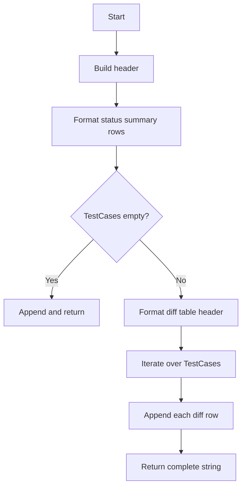

#### Function dependencies (Mermaid)

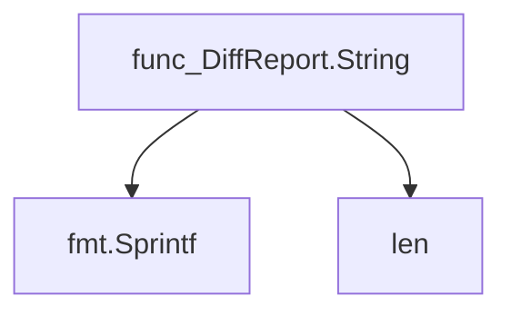

#### Functions calling `DiffReport.String` (Mermaid)

None – this function is currently not referenced elsewhere in the package.

#### Usage example (Go)

```go
// Minimal example invoking DiffReport.String
report := &testcases.DiffReport{
    Claim1ResultsSummary: testcases.ResultsSummary{Passed: 22, Skipped: 62, Failed: 3},
    Claim2ResultsSummary: testcases.ResultsSummary{Passed: 21, Skipped: 62, Failed: 4},
    TestCases: []testcases.TestCaseDiff{
        {Name: "access-control-net-admin-capability-check", Claim1Result: "failed", Claim2Result: "passed"},
        // … additional diffs …
    },
}

fmt.Println(report.String())
```

---

### GetDiffReport

**GetDiffReport** - Produces a `DiffReport` comparing test case outcomes from two claim files. Each differing result is recorded, and summary statistics for each claim are included.


#### Signature (Go)
```go
func GetDiffReport(resultsClaim1, resultsClaim2 claim.TestSuiteResults) *DiffReport
```

#### Summary Table
| Aspect | Details |
|--------|---------|
| **Purpose** | Produces a `DiffReport` comparing test case outcomes from two claim files. Each differing result is recorded, and summary statistics for each claim are included. |
| **Parameters** | `resultsClaim1`, `resultsClaim2` – maps of test case IDs to their execution results (`claim.TestSuiteResults`). |
| **Return value** | Pointer to a populated `DiffReport` struct. |
| **Key dependencies** | • `getTestCasesResultsMap` (builds ID→result map)<br>• `getMergedTestCasesNames` (collects all test case IDs)<br>• `append` (adds differences to slice)<br>• `getTestCasesResultsSummary` (counts passed/failed/skipped) |
| **Side effects** | No external I/O or state mutation; operates solely on its inputs and returns a new report. |
| **How it fits the package** | Central routine in the `testcases` comparison sub‑package, used by higher‑level comparison commands to present test outcome differences between two claim files. |

#### Internal workflow (Mermaid)
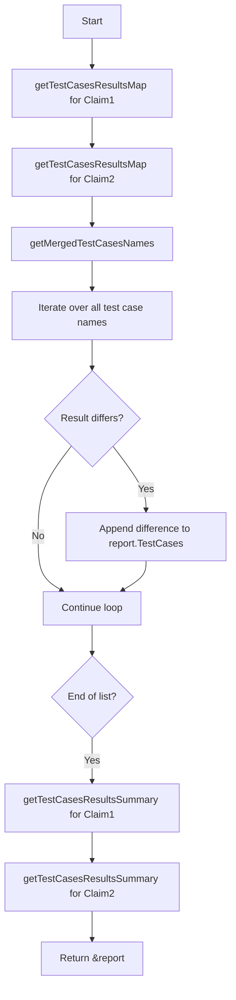

#### Function dependencies (Mermaid)
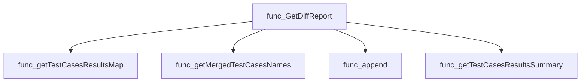

#### Functions calling `GetDiffReport` (Mermaid)
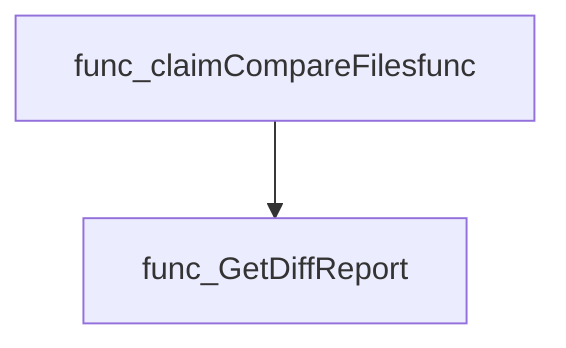

#### Usage example (Go)
```go
// Minimal example invoking GetDiffReport
import (
    "github.com/redhat-best-practices-for-k8s/certsuite/cmd/certsuite/claim"
    "github.com/redhat-best-practices-for-k8s/certsuite/cmd/certsuite/claim/compare/testcases"
)

func main() {
    // Assume results1 and results2 are populated claim.TestSuiteResults maps
    var results1, results2 claim.TestSuiteResults

    diffReport := testcases.GetDiffReport(results1, results2)
    fmt.Printf("Differing tests: %d\n", diffReport.DifferentTestCasesResults)
}
```

---

## Local Functions

### getMergedTestCasesNames

**getMergedTestCasesNames** - Combines the keys from two result maps into a unique, sorted slice of test‑case names.


#### Signature (Go)
```go
func getMergedTestCasesNames(results1, results2 map[string]string) []string
```

#### Summary Table
| Aspect | Details |
|--------|---------|
| **Purpose** | Combines the keys from two result maps into a unique, sorted slice of test‑case names. |
| **Parameters** | `results1` – `map[string]string`: first set of test results.<br>`results2` – `map[string]string`: second set of test results. |
| **Return value** | `[]string`: all distinct test‑case names, sorted alphabetically. |
| **Key dependencies** | *append* (built‑in)<br>*sort.Strings* (`"sort"` package) |
| **Side effects** | None – purely functional; no state mutation or I/O. |
| **How it fits the package** | Used by `GetDiffReport` to iterate over every test case when computing differences between two claim results. |

#### Internal workflow (Mermaid)
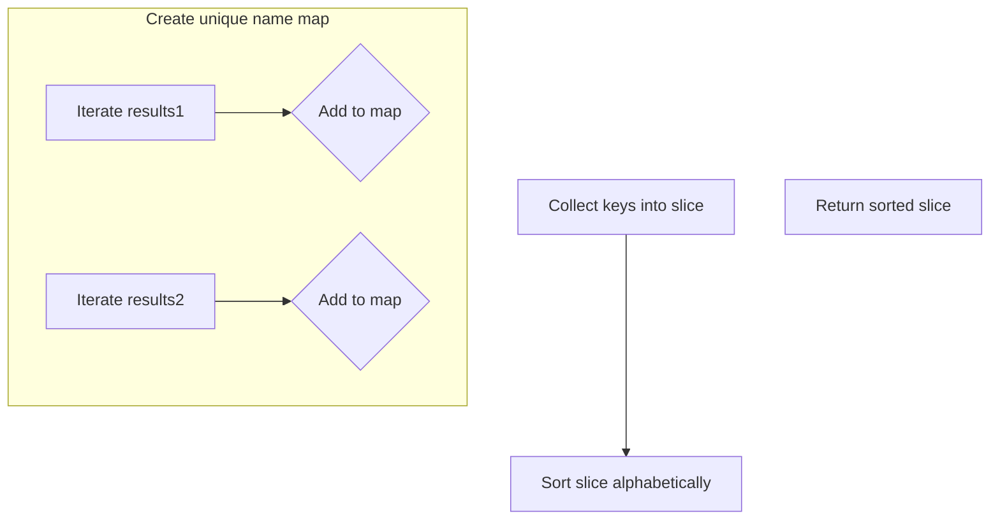

#### Function dependencies (Mermaid)
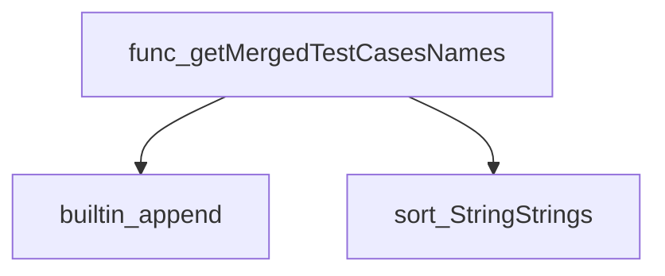

#### Functions calling `getMergedTestCasesNames` (Mermaid)
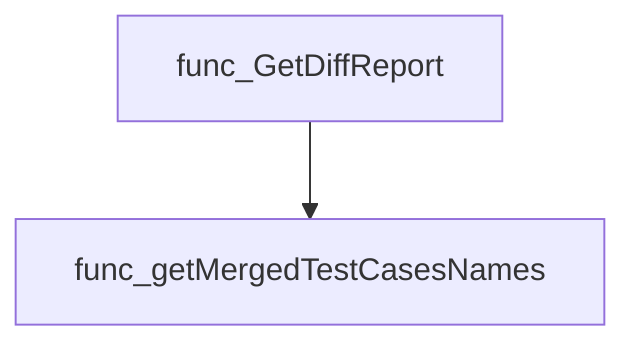

#### Usage example (Go)
```go
// Minimal example invoking getMergedTestCasesNames
resultsA := map[string]string{
    "tc1": "pass",
    "tc2": "fail",
}
resultsB := map[string]string{
    "tc2": "pass",
    "tc3": "skip",
}

merged := getMergedTestCasesNames(resultsA, resultsB)
// merged == []string{"tc1", "tc2", "tc3"}
```

---

### getTestCasesResultsMap

**getTestCasesResultsMap** - Builds a map from each test case ID to its result state for quick comparison.


#### Signature (Go)

```go
func getTestCasesResultsMap(testSuiteResults claim.TestSuiteResults) map[string]string
```

#### Summary Table

| Aspect | Details |
|--------|---------|
| **Purpose** | Builds a map from each test case ID to its result state for quick comparison. |
| **Parameters** | `testSuiteResults` claim.TestSuiteResults – the original mapping of test cases within a suite. |
| **Return value** | `map[string]string` – keys are test‑case identifiers (`TestID.ID`), values are their states (`State`). |
| **Key dependencies** | Uses the fields `TestID.ID` and `State` from the structs inside `claim.TestSuiteResults`. No external function calls. |
| **Side effects** | None; purely functional transformation. |
| **How it fits the package** | Supplies `GetDiffReport` with a convenient lookup structure to detect differences between two claim result sets. |

#### Internal workflow (Mermaid)

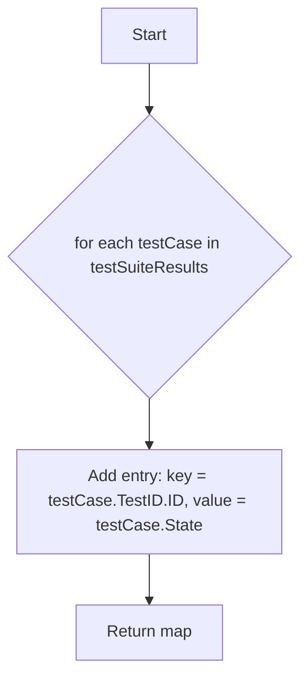

#### Function dependencies

None – this function is currently not referenced elsewhere in the package.

#### Functions calling `getTestCasesResultsMap` (Mermaid)

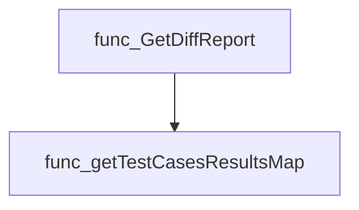

#### Usage example (Go)

```go
// Minimal example invoking getTestCasesResultsMap
package main

import (
    "fmt"
    "github.com/redhat-best-practices-for-k8s/certsuite/cmd/certsuite/claim"
    // Assume the package containing the function is imported as testcasespkg
    testcasespkg "github.com/redhat-best-practices-for-k8s/certsuite/cmd/certsuite/claim/compare/testcases"
)

func main() {
    // Construct a dummy TestSuiteResults map for illustration
    results := claim.TestSuiteResults{
        "tc1": {TestID: claim.TestID{ID: "test-001"}, State: "passed"},
        "tc2": {TestID: claim.TestID{ID: "test-002"}, State: "failed"},
    }

    // Call the helper
    resultMap := testcasespkg.GetTestCasesResultsMap(results) // note: function is unexported; this call would be in same package

    fmt.Printf("%+v\n", resultMap)
}
```

*Note:* The function is unexported, so it can only be called from within the `testcases` package. The example demonstrates its intended usage pattern when available.*

---

### getTestCasesResultsSummary

**getTestCasesResultsSummary** - Aggregates the outcome of each test case into a `TcResultsSummary` struct, counting passed, skipped and failed cases.


#### Signature (Go)

```go
func getTestCasesResultsSummary(results map[string]string) TcResultsSummary
```

#### Summary Table

| Aspect | Details |
|--------|---------|
| **Purpose** | Aggregates the outcome of each test case into a `TcResultsSummary` struct, counting passed, skipped and failed cases. |
| **Parameters** | `results` – `map[string]string`: mapping from test‑case name to its result string (`claim.TestCaseResultPassed`, `Skipped`, or `Failed`). |
| **Return value** | `TcResultsSummary`: a struct with integer counters for each outcome category. |
| **Key dependencies** | Uses the constants `claim.TestCaseResultPassed`, `claim.TestCaseResultSkipped`, and `claim.TestCaseResultFailed`. |
| **Side effects** | None – purely functional; does not modify its arguments or external state. |
| **How it fits the package** | Provides a reusable routine for summarizing test‑case results, used by the diff report generator to populate per‑claim summaries. |

#### Internal workflow (Mermaid)

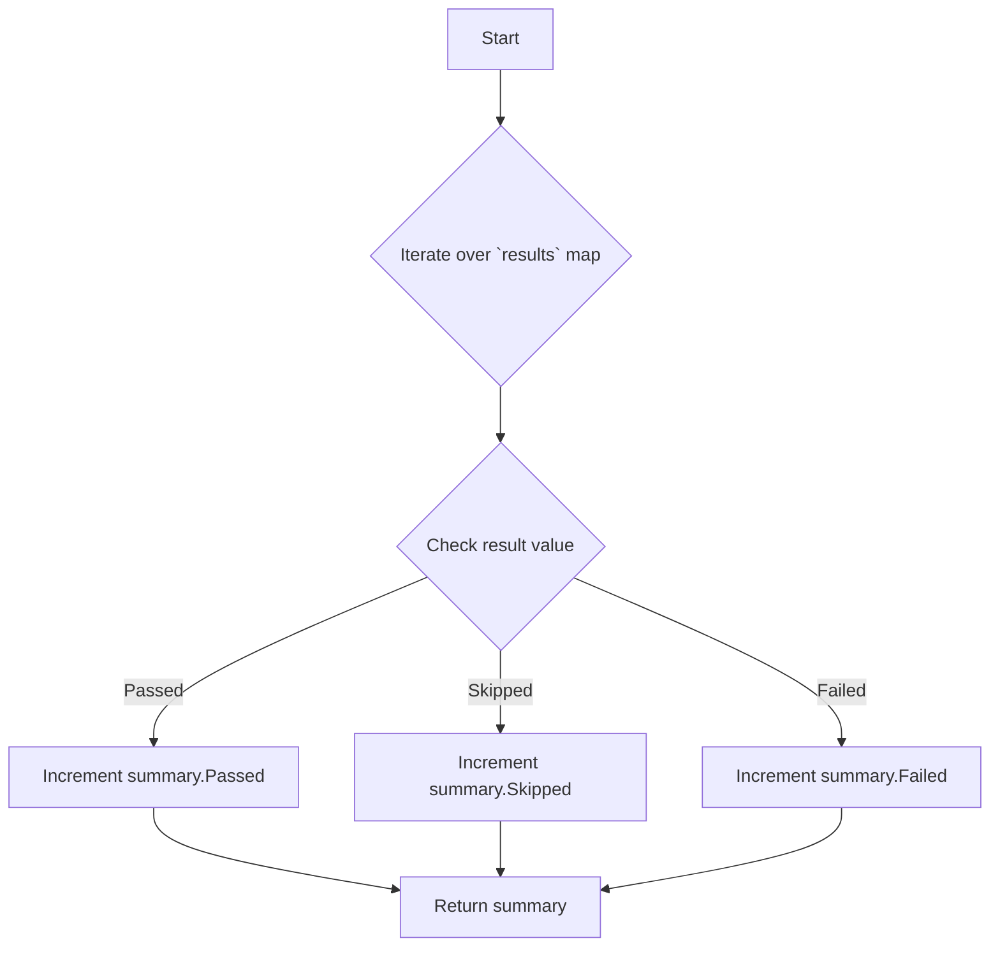

#### Function dependencies

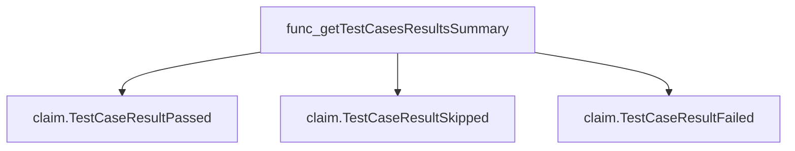

#### Functions calling `getTestCasesResultsSummary` (Mermaid)

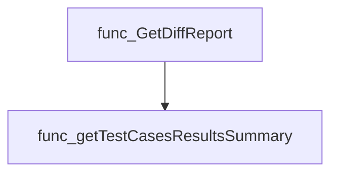

#### Usage example (Go)

```go
// Minimal example invoking getTestCasesResultsSummary
results := map[string]string{
    "tc1": claim.TestCaseResultPassed,
    "tc2": claim.TestCaseResultFailed,
    "tc3": claim.TestCaseResultSkipped,
}

summary := getTestCasesResultsSummary(results)
fmt.Printf("Passed: %d, Skipped: %d, Failed: %d\n",
          summary.Passed, summary.Skipped, summary.Failed)
```

---

