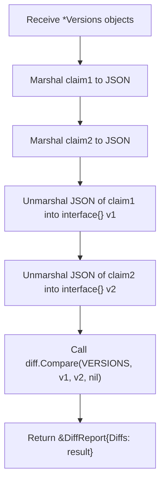
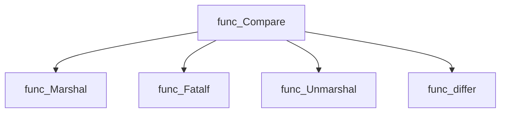
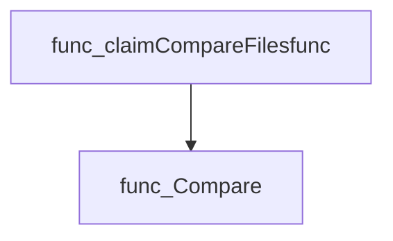
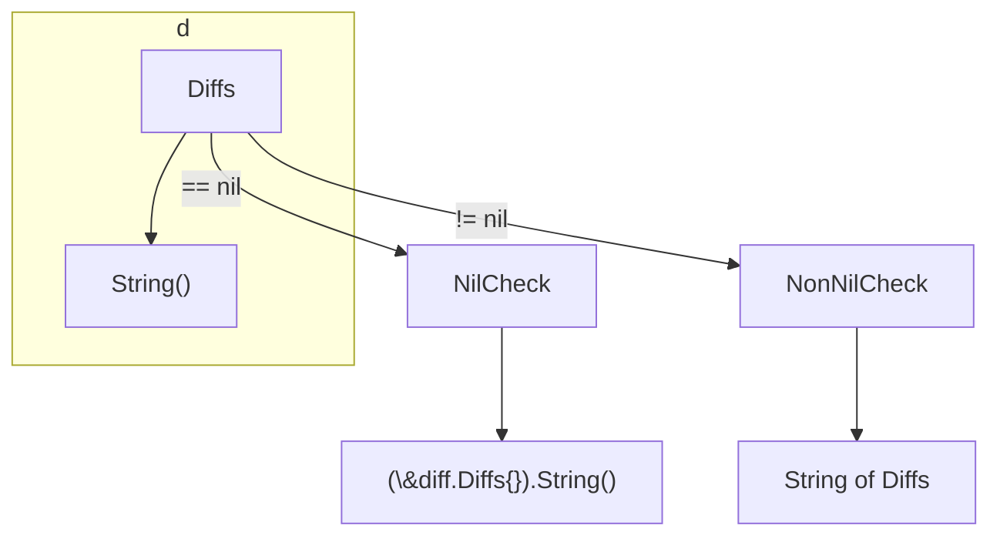
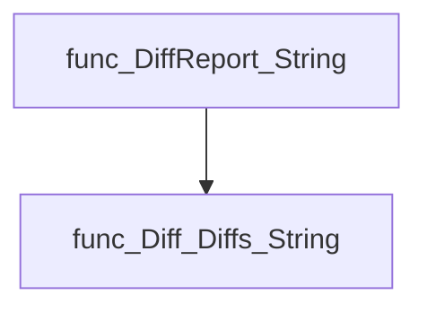
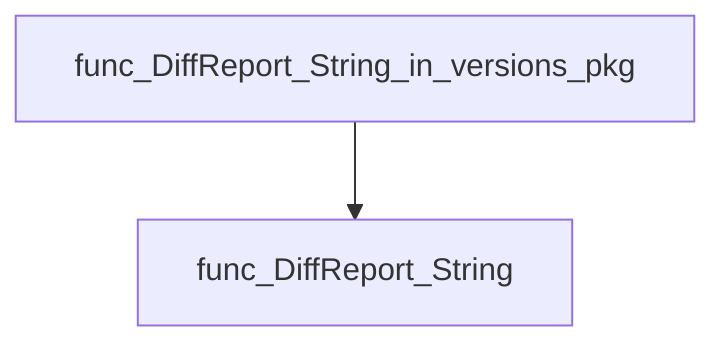

# Package versions

**Path**: `cmd/certsuite/claim/compare/versions`

## Table of Contents

- [Overview](#overview)
- [Structs](#structs)
  - [DiffReport](#diffreport)
- [Exported Functions](#exported-functions)
  - [Compare](#compare)
  - [DiffReport.String](#diffreport.string)

## Overview

The versions package provides utilities to compare two claim version structures, serialising them to JSON and diffing the resulting maps to generate a structured report of differences.

### Key Features

- Serialises officialClaimScheme.Versions into generic maps via json.Marshal for comparison
- Uses a generic diff routine from github.com/.../diff to produce a DiffReport
- Offers a human‑readable String method on DiffReport that returns an empty representation when no diffs exist

### Design Notes

- Comparison is performed by converting structs to JSON rather than field‑by‑field; assumes both inputs are serialisable
- DiffReport contains a pointer to diff.Diffs, so nil indicates no differences
- Best practice: call Compare then inspect DiffReport.Diffs or use its String method for output

### Structs Summary

| Name | Purpose |
|------|----------|
| [**DiffReport**](#diffreport) | One‑line purpose |

### Exported Functions Summary

| Name | Purpose |
|------|----------|
| [func Compare(claim1Versions, claim2Versions *officialClaimScheme.Versions) *DiffReport](#compare) | Serialises two `officialClaimScheme.Versions` structs to JSON, deserialises them into generic maps, and uses a generic diff routine to produce a structured report of differences. |
| [func (d *DiffReport) String() string](#diffreport.string) | Provides a human‑readable description of a version comparison result. If no differences are stored, it returns the empty diff representation. |

## Structs

### DiffReport

A container that holds the result of comparing two sets of claim versions.

#### Fields

| Field | Type | Description |
|-------|------|-------------|
| `Diffs` | `*diff.Diffs` | Pointer to a `diff.Diffs` structure (from the external diff package) representing all detected differences. The JSON tag `differences` indicates how it is marshalled/unmarshalled. |

#### Purpose

`DiffReport` encapsulates the outcome of the `Compare` function, providing an easy way to inspect or serialize the differences between two `officialClaimScheme.Versions` objects.

#### Related functions

| Function | Purpose |
|----------|---------|
| `Compare(claim1Versions, claim2Versions *officialClaimScheme.Versions) *DiffReport` | Serialises both version sets to JSON, unmarshals them into generic interfaces, and uses the diff package to compute differences. The resulting `Diffs` are stored in a new `DiffReport`. |
| `(*DiffReport).String() string` | Returns a human‑readable string representation of the contained diffs; if no diffs exist it returns an empty `diff.Diffs` string. |

---

---

## Exported Functions

### Compare

**Compare** - Serialises two `officialClaimScheme.Versions` structs to JSON, deserialises them into generic maps, and uses a generic diff routine to produce a structured report of differences.

#### 1) Signature (Go)

```go
func Compare(claim1Versions, claim2Versions *officialClaimScheme.Versions) *DiffReport
```

#### 2) Summary Table

| Aspect | Details |
|--------|---------|
| **Purpose** | Serialises two `officialClaimScheme.Versions` structs to JSON, deserialises them into generic maps, and uses a generic diff routine to produce a structured report of differences. |
| **Parameters** | `claim1Versions *officialClaimScheme.Versions –` first version set<br>`claim2Versions *officialClaimScheme.Versions –` second version set |
| **Return value** | `*DiffReport –` a pointer containing the diff result produced by `diff.Compare`. |
| **Key dependencies** | • `encoding/json.Marshal`, `encoding/json.Unmarshal`<br>• `log.Fatalf` for error handling<br>• `github.com/redhat-best-practices-for-k8s/certsuite/cmd/certsuite/claim/compare/diff.Compare` |
| **Side effects** | No state mutation; only logs fatal errors and returns a diff report. |
| **How it fits the package** | Acts as the public entry point for comparing claim version data within the `versions` comparison module, delegating actual field‑level logic to the generic diff package. |

#### 3) Internal workflow (Mermaid)



#### 4) Function dependencies (Mermaid)



*(Note: `func_differ` refers to the generic `diff.Compare` function.)*

#### 5) Functions calling `Compare` (Mermaid)



#### 6) Usage example (Go)

```go
// Minimal example invoking Compare
package main

import (
 "github.com/redhat-best-practices-for-k8s/certsuite/cmd/certsuite/claim/compare/versions"
 officialClaimScheme "github.com/redhat-best-practices-for-k8s/certsuite/pkg/scheme"
)

func main() {
 v1 := &officialClaimScheme.Versions{ /* populate fields */ }
 v2 := &officialClaimScheme.Versions{ /* populate fields differently */ }

 diffReport := versions.Compare(v1, v2)
 fmt.Printf("%+v\n", diffReport)
}
```

---

### DiffReport.String

**String** - Provides a human‑readable description of a version comparison result. If no differences are stored, it returns the empty diff representation.

Converts a `DiffReport` into its string representation, delegating to the embedded `diff.Diffs`.

```go
func (d *DiffReport) String() string
```

| Aspect | Details |
|--------|---------|
| **Purpose** | Provides a human‑readable description of a version comparison result. If no differences are stored, it returns the empty diff representation. |
| **Parameters** | `d *DiffReport` – receiver holding the comparison data. |
| **Return value** | `string` – formatted text produced by `diff.Diffs.String()`. |
| **Key dependencies** | - Calls `(*diff.Diffs).String()` to format differences.<br>- Uses the nil‑check on `d.Diffs`. |
| **Side effects** | None. The function is pure; it reads state but does not modify it or perform I/O. |
| **How it fits the package** | In the *versions* comparison subsystem, this method enables users and other components to obtain a concise textual summary of the diff report. |

#### Internal workflow



#### Function dependencies



#### Functions calling `DiffReport.String`



#### Usage example (Go)

```go
// Minimal example invoking DiffReport.String
package main

import (
    "fmt"
    "github.com/redhat-best-practices-for-k8s/certsuite/cmd/certsuite/claim/compare/versions"
)

func main() {
    var report versions.DiffReport
    // Assume report is populated elsewhere
    fmt.Println(report.String())
}
```

---
