# Package csv

**Path**: `cmd/certsuite/claim/show/csv`

## Table of Contents

- [Overview](#overview)
- [Exported Functions](#exported-functions)
  - [NewCommand](#newcommand)
- [Local Functions](#local-functions)
  - [buildCSV](#buildcsv)
  - [buildCatalogByID](#buildcatalogbyid)
  - [dumpCsv](#dumpcsv)
  - [loadCNFTypeMap](#loadcnftypemap)

## Overview

Provides a Cobra command that reads a certsuite claim JSON file, validates it, maps CNF names to types using a supplied mapping file, converts the claim schema into CSV rows (including remediation and test case details), and writes the result to stdout.

### Key Features

- Registers required flags for claim path, CNF name, CNF type map, and an optional header flag; builds a global catalog of test cases for lookup.
- Reads and validates the claim JSON against its version; loads a CNF type mapping from a JSON file; constructs CSV rows with remediation info and mandatory/optional status.
- Writes the generated CSV to standard output using encoding/csv writer, handling errors and flushing the buffer before exiting.

### Design Notes

- All flags are marked required except the optional header flag, ensuring callers provide necessary context; misuse results in immediate log fatal.
- The command depends on a global catalog of test cases; if a test case ID is missing, its description defaults to empty strings—this edge case can produce incomplete rows but does not crash.

### Exported Functions Summary

| Name | Purpose |
|------|----------|
| [func NewCommand() *cobra.Command](#newcommand) | Builds and configures a `*cobra.Command` that dumps claim data to CSV. It registers required flags for claim file path, CNF name, CNF type mapping file, and an optional header flag. |

### Local Functions Summary

| Name | Purpose |
|------|----------|
| [func buildCSV(claimScheme *claim.Schema, cnfType string, catalogMap map[string]claimschema.TestCaseDescription) (resultsCSVRecords [][]string)](#buildcsv) | Transforms a parsed claim schema into CSV rows, adding remediation, CNF type, and mandatory/optional flags. |
| [func buildCatalogByID() (catalogMap map[string]claimschema.TestCaseDescription)](#buildcatalogbyid) | Constructs a mapping from each test case identifier to its corresponding `TestCaseDescription` by iterating over the global catalog. |
| [func dumpCsv(_ *cobra.Command, _ []string) error](#dumpcsv) | Reads a claim JSON file, validates its version, maps CNF names to types, builds a CSV representation of test results, and writes it to standard output. |
| [func loadCNFTypeMap(path string) (CNFTypeMap map[string]string, err error)](#loadcnftypemap) | Reads a JSON file located at `path` and unmarshals its contents into a `map[string]string` that associates CNF names with their types. |

## Exported Functions

### NewCommand

**NewCommand** - Builds and configures a `*cobra.Command` that dumps claim data to CSV. It registers required flags for claim file path, CNF name, CNF type mapping file, and an optional header flag.


#### 1. Signature (Go)

```go
func NewCommand() *cobra.Command
```

#### 2. Summary Table

| Aspect | Details |
|--------|---------|
| **Purpose** | Builds and configures a `*cobra.Command` that dumps claim data to CSV. It registers required flags for claim file path, CNF name, CNF type mapping file, and an optional header flag. |
| **Parameters** | None |
| **Return value** | A fully‑configured `*cobra.Command` instance ready for use in the CLI hierarchy. |
| **Key dependencies** | - `CSVDumpCommand.Flags().StringVarP` <br> - `CSVDumpCommand.MarkFlagRequired` <br> - `log.Fatalf` (for error handling) <br> - `CSVDumpCommand.Flags().BoolVarP` |
| **Side effects** | Registers command flags and marks them as required; logs fatal errors if flag configuration fails. No state mutation beyond the returned command. |
| **How it fits the package** | Serves as the entry point for the CSV sub‑command under `cmd/certsuite/claim/show`. It is invoked by the parent `show` command to expose CSV functionality. |

#### 3. Internal workflow (Mermaid)

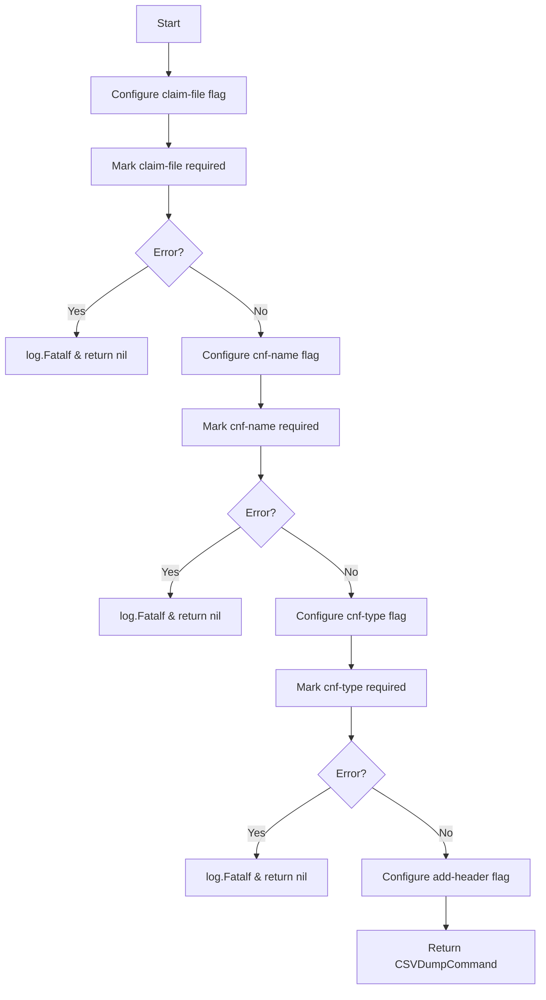

#### 4. Function dependencies (Mermaid)

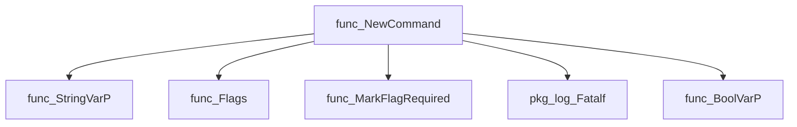

#### 5. Functions calling `NewCommand` (Mermaid)

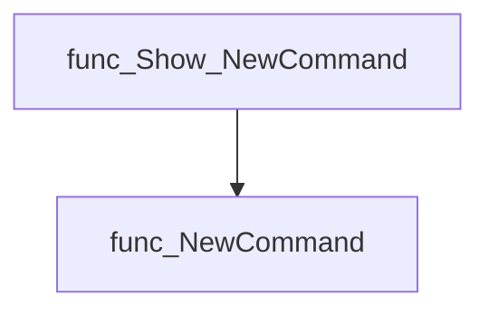

#### 6. Usage example (Go)

```go
// Minimal example invoking NewCommand
package main

import (
    "github.com/redhat-best-practices-for-k8s/certsuite/cmd/certsuite/claim/show/csv"
    "github.com/spf13/cobra"
)

func main() {
    // Retrieve the CSV command
    csvCmd := csv.NewCommand()

    // Add it to a root or parent command as needed
    var rootCmd = &cobra.Command{Use: "certsuite"}
    rootCmd.AddCommand(csvCmd)

    // Execute the CLI
    if err := rootCmd.Execute(); err != nil {
        panic(err)
    }
}
```

---

## Local Functions

### buildCSV

**buildCSV** - Transforms a parsed claim schema into CSV rows, adding remediation, CNF type, and mandatory/optional flags.


#### Signature (Go)
```go
func buildCSV(claimScheme *claim.Schema, cnfType string, catalogMap map[string]claimschema.TestCaseDescription) (resultsCSVRecords [][]string)
```

#### Summary Table
| Aspect | Details |
|--------|---------|
| **Purpose** | Transforms a parsed claim schema into CSV rows, adding remediation, CNF type, and mandatory/optional flags. |
| **Parameters** | `claimScheme *claim.Schema` – the parsed claim data.<br>`cnfType string` – optional CNF type; defaults to `"NonTelco"` if empty.<br>`catalogMap map[string]claimschema.TestCaseDescription` – mapping of test IDs to catalog metadata. |
| **Return value** | `[][]string` – slice of CSV records ready for writing. |
| **Key dependencies** | Calls to the built‑in `append` function (three times). |
| **Side effects** | None; purely functional. Generates data but does not modify globals or perform I/O. |
| **How it fits the package** | Used by `dumpCsv` to produce the CSV output shown to users; central to the CSV generation flow. |

#### Internal workflow (Mermaid)
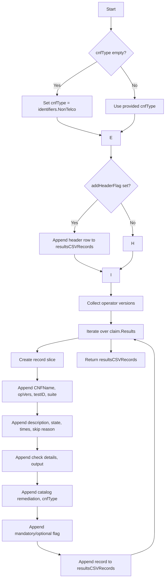

#### Function dependencies (Mermaid)
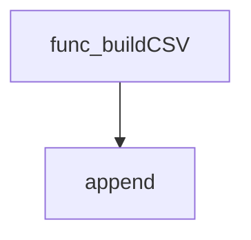

#### Functions calling `buildCSV` (Mermaid)
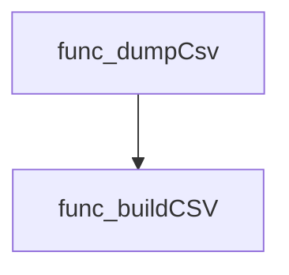

#### Usage example (Go)
```go
// Minimal example invoking buildCSV
claimScheme, _ := claim.Parse("path/to/claim.yaml")
cnfType := "MyCNF"
catalogMap := map[string]claimschema.TestCaseDescription{
    "test1": {Remediation: "restart pod"},
}
csvRows := buildCSV(claimScheme, cnfType, catalogMap)
// csvRows can now be written with a csv.Writer
```

---

### buildCatalogByID

**buildCatalogByID** - Constructs a mapping from each test case identifier to its corresponding `TestCaseDescription` by iterating over the global catalog.


#### Signature (Go)
```go
func buildCatalogByID() (catalogMap map[string]claimschema.TestCaseDescription)
```

#### Summary Table
| Aspect | Details |
|--------|---------|
| **Purpose** | Constructs a mapping from each test case identifier to its corresponding `TestCaseDescription` by iterating over the global catalog. |
| **Parameters** | None |
| **Return value** | A map whose keys are test case IDs (`string`) and values are `claimschema.TestCaseDescription`. |
| **Key dependencies** | - `make(map[string]claimschema.TestCaseDescription)`<br>- Iteration over `identifiers.Catalog` (global slice) |
| **Side effects** | No external state changes; purely functional. |
| **How it fits the package** | Supplies the catalog lookup table used by CSV generation logic (`dumpCsv`). |

#### Internal workflow
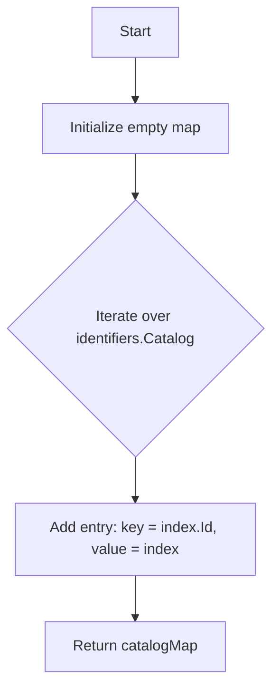

#### Function dependencies
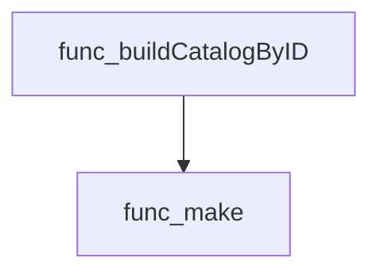

#### Functions calling `buildCatalogByID`
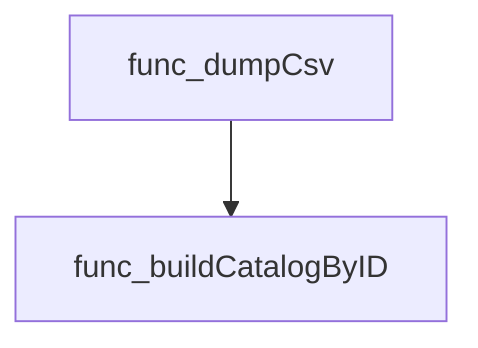

#### Usage example (Go)
```go
// Minimal example invoking buildCatalogByID
func main() {
    catalog := buildCatalogByID()
    // Example: look up a test case by ID
    if tc, ok := catalog["TC-001"]; ok {
        fmt.Printf("Test case %s: %+v\n", "TC-001", tc)
    }
}
```

---

### dumpCsv

**dumpCsv** - Reads a claim JSON file, validates its version, maps CNF names to types, builds a CSV representation of test results, and writes it to standard output.


#### Signature (Go)
```go
func dumpCsv(_ *cobra.Command, _ []string) error
```

#### Summary Table
| Aspect | Details |
|--------|---------|
| **Purpose** | Reads a claim JSON file, validates its version, maps CNF names to types, builds a CSV representation of test results, and writes it to standard output. |
| **Parameters** | `_ *cobra.Command` – command context (unused)<br>`_ []string` – command arguments (unused) |
| **Return value** | `error` – non‑nil if any step fails (parsing, version check, file loading, CSV writing). |
| **Key dependencies** | <ul><li>`log.SetOutput`, `log.Fatalf` – for logging to stderr</li><li>`claim.Parse` – loads the claim schema from JSON</li><li>`claim.CheckVersion` – validates claim format version</li><li>`loadCNFTypeMap` – reads CNF name‑to‑type mapping from a CSV file</li><li>`buildCatalogByID` – constructs a map of test case descriptions</li><li>`buildCSV` – builds the CSV records slice</li><li>`csv.NewWriter`, `writer.WriteAll`, `writer.Flush`, `writer.Error` – CSV I/O to stdout</li></ul> |
| **Side effects** | Writes log messages to stderr; outputs CSV data to stdout; may terminate program via `log.Fatalf`. |
| **How it fits the package** | Serves as the action handler for the “show csv” sub‑command of the certsuite CLI, converting claim results into a consumable tabular format. |

#### Internal workflow (Mermaid)
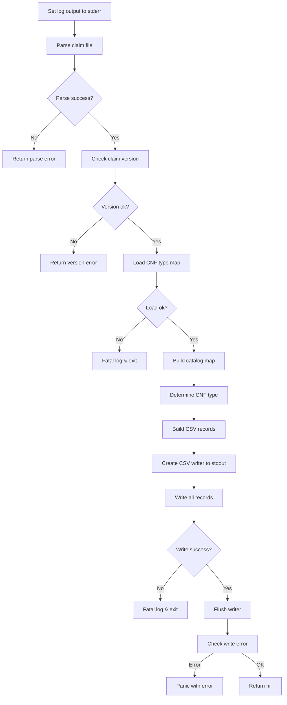

#### Function dependencies (Mermaid)
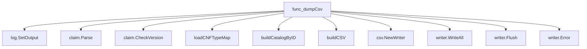

#### Functions calling `dumpCsv` (Mermaid)
None – this function is currently not referenced elsewhere in the package.

#### Usage example (Go)
```go
// Minimal example invoking dumpCsv
import (
	"github.com/spf13/cobra"
)

func main() {
	cmd := &cobra.Command{
		RunE: dumpCsv,
	}
	if err := cmd.Execute(); err != nil {
		fmt.Println("Error:", err)
	}
}
```

---

### loadCNFTypeMap

**loadCNFTypeMap** - Reads a JSON file located at `path` and unmarshals its contents into a `map[string]string` that associates CNF names with their types.


#### Signature (Go)

```go
func loadCNFTypeMap(path string) (CNFTypeMap map[string]string, err error)
```

#### Summary Table

| Aspect | Details |
|--------|---------|
| **Purpose** | Reads a JSON file located at `path` and unmarshals its contents into a `map[string]string` that associates CNF names with their types. |
| **Parameters** | `path string – filesystem path to the JSON mapping file` |
| **Return value** | `CNFTypeMap map[string]string, err error – the populated map or an error if any step fails` |
| **Key dependencies** | • `os.Open`, `file.Close`<br>• `io.ReadAll`<br>• `encoding/json.Unmarshal`<br>• `fmt.Errorf`, `fmt.Println` |
| **Side effects** | Opens and reads a file; no global state is modified. |
| **How it fits the package** | Supplies the CNF name‑to‑type mapping used by higher‑level CSV generation logic (`dumpCsv`). |

#### Internal workflow (Mermaid)

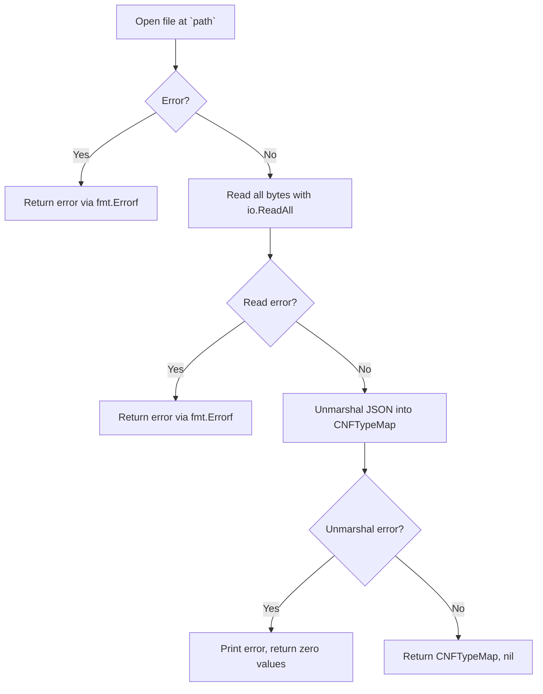

#### Function dependencies (Mermaid)

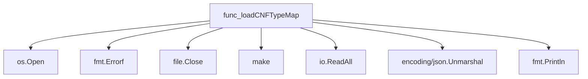

#### Functions calling `loadCNFTypeMap` (Mermaid)

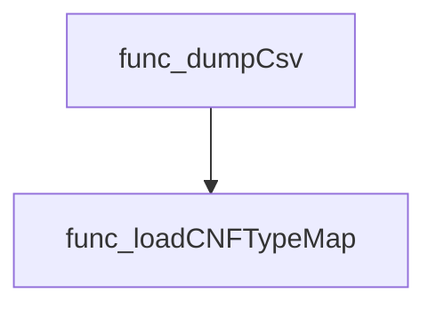

#### Usage example (Go)

```go
// Minimal example invoking loadCNFTypeMap
package main

import (
	"fmt"
	"log"

	"github.com/redhat-best-practices-for-k8s/certsuite/cmd/certsuite/claim/show/csv"
)

func main() {
	cnfMap, err := csv.loadCNFTypeMap("cnf_types.json")
	if err != nil {
		log.Fatalf("Failed to load CNF type map: %v", err)
	}
	fmt.Println("Loaded mapping:", cnfMap)
}
```

---

---

