# Package failures

**Path**: `cmd/certsuite/claim/show/failures`

## Table of Contents

- [Overview](#overview)
- [Structs](#structs)
  - [FailedTestCase](#failedtestcase)
  - [FailedTestSuite](#failedtestsuite)
  - [NonCompliantObject](#noncompliantobject)
  - [ObjectSpec](#objectspec)
- [Exported Functions](#exported-functions)
  - [NewCommand](#newcommand)
  - [ObjectSpec.AddField](#objectspec.addfield)
  - [ObjectSpec.MarshalJSON](#objectspec.marshaljson)
- [Local Functions](#local-functions)
  - [getFailedTestCasesByTestSuite](#getfailedtestcasesbytestsuite)
  - [getNonCompliantObjectsFromFailureReason](#getnoncompliantobjectsfromfailurereason)
  - [parseOutputFormatFlag](#parseoutputformatflag)
  - [parseTargetTestSuitesFlag](#parsetargettestsuitesflag)
  - [printFailuresJSON](#printfailuresjson)
  - [printFailuresText](#printfailurestext)
  - [showFailures](#showfailures)

## Overview

Handles displaying failed test cases from a claim file in either JSON or plain text, allowing filtering by specific test suites.

### Key Features

- Parses and validates claim files against expected format version
- Filters failures per user‑supplied test suite list
- Outputs results in pretty‑printed JSON or human‑readable text

### Design Notes

- Uses cobra commands for CLI integration; flags are parsed globally before execution
- Error handling is strict – fatal logs abort on invalid input
- JSON output requires all fields present, otherwise empty objects are returned

### Structs Summary

| Name | Purpose |
|------|----------|
| [**FailedTestCase**](#failedtestcase) | One-line purpose |
| [**FailedTestSuite**](#failedtestsuite) | Represents a test suite containing one or more failed test cases |
| [**NonCompliantObject**](#noncompliantobject) | Struct definition |
| [**ObjectSpec**](#objectspec) | One‑line purpose |

### Exported Functions Summary

| Name | Purpose |
|------|----------|
| [func NewCommand()(*cobra.Command)](#newcommand) | Function implementation |
| [func (spec *ObjectSpec) AddField(key, value string)](#objectspec.addfield) | Adds a field to the `Fields` slice of an `ObjectSpec`, storing a key/value pair. |
| [func (spec *ObjectSpec) MarshalJSON() ([]byte, error)](#objectspec.marshaljson) | Converts an `ObjectSpec` into its JSON representation. If the spec has no fields it returns an empty JSON object (`{}`). |

### Local Functions Summary

| Name | Purpose |
|------|----------|
| [func getFailedTestCasesByTestSuite(     claimResultsByTestSuite map[string][]*claim.TestCaseResult,     targetTestSuites map[string]bool, ) []FailedTestSuite](#getfailedtestcasesbytestsuite) | Transforms raw test‑case results into a slice of `FailedTestSuite`, each containing only the failed cases that belong to suites requested by the caller. |
| [func getNonCompliantObjectsFromFailureReason(string) ([]NonCompliantObject, error)](#getnoncompliantobjectsfromfailurereason) | Converts the `checkDetails` string of a failed test case into a slice of `NonCompliantObject`s by decoding JSON and mapping report fields. |
| [func parseOutputFormatFlag() (string, error)](#parseoutputformatflag) | Validates that the global flag `outputFormatFlag` matches one of the formats listed in `availableOutputFormats`. Returns the format string if valid. |
| [func parseTargetTestSuitesFlag() map[string]bool](#parsetargettestsuitesflag) | Parses the global flag that lists test suite names, creating a lookup map where each key is a suite name and the value indicates inclusion. |
| [func printFailuresJSON(testSuites []FailedTestSuite)](#printfailuresjson) | Serialises a slice of `FailedTestSuite` into pretty‑printed JSON and writes it to standard output. |
| [func(testSuites []FailedTestSuite)()](#printfailurestext) | Iterates over failed test suites and prints each suite, its failing test cases, and detailed failure reasons to standard output. |
| [func showFailures(_ *cobra.Command, _ []string) error](#showfailures) | Parses a claim file, validates its format version, extracts failed test cases per suite, and prints them in the requested output format (JSON or plain text). |

## Structs

### FailedTestCase


A representation of a test case that has failed during a certification run.

#### Fields
| Field | Type | Description |
|-------|------|-------------|
| `TestCaseName` | `string` | The unique identifier for the test case. |
| `TestCaseDescription` | `string` | A human‑readable explanation of what the test verifies. |
| `CheckDetails` | `string` | Optional details about why the test failed, typically including diagnostic messages or error summaries. |
| `NonCompliantObjects` | `[]NonCompliantObject` | Optional list of objects that did not satisfy the test’s compliance criteria; each entry provides context for the failure. |

#### Purpose
The `FailedTestCase` struct encapsulates all information related to a single failed certification test. It is used when generating reports or displaying failures to users, allowing consumers to understand which test failed, why it failed, and which Kubernetes objects contributed to the non‑compliance.

#### Related functions (if any)
| Function | Purpose |
|----------|---------|
| *none* |  |

---

---

### FailedTestSuite


#### Fields
| Field | Type | Description |
|-------|------|-------------|
| `TestSuiteName` | `string` | The name of the test suite that produced failures. Serialized as JSON key `name`. |
| `FailingTestCases` | `[]FailedTestCase` | Slice holding each failed test case within this suite. Serialized as JSON key `failures`. |

#### Purpose
The `FailedTestSuite` struct aggregates all failing test cases for a particular test suite. It is used when summarizing claim results, allowing callers to easily report or serialize failures per suite.

#### Related functions
| Function | Purpose |
|----------|---------|
| `getFailedTestCasesByTestSuite` | Builds a slice of `FailedTestSuite` objects by iterating over claim results and collecting only failed test cases. |
| `printFailuresJSON` | Marshals a slice of `FailedTestSuite` into JSON for output. |
| `printFailuresText` | Formats and prints each `FailedTestSuite` and its contained failures to standard output in human‑readable form. |

---

---

### NonCompliantObject

<!-- DEBUG: Struct NonCompliantObject exists in bundle but ParsedOK=false, Fields=3 -->
**Purpose**: Custom object type needed to provide a different JSON serialization than
the one in claim's test cases' skipReason field.

**Fields**:

| Field | Type | Description |
|-------|------|--------------|
| `Type` | `string` | The Kubernetes resource kind (e.g., `"Pod"`, `"Deployment"`). |
| `Reason` | `string` | Human‑readable explanation of why the object is non‑compliant. |
| `Spec` | `ObjectSpec` | A map of field names to values that describe the object's specification at the time of failure. |

---

### ObjectSpec


Represents a generic specification consisting of an arbitrary list of key/value pairs.

---

#### Fields
| Field | Type | Description |
|-------|------|-------------|
| `Fields` | `[]struct{ Key, Value string }` | A slice holding zero or more name–value entries that describe the object. Each entry has a `Key` and a corresponding `Value`, both strings.

---

#### Purpose
`ObjectSpec` serves as a lightweight container for metadata about an object. By storing arbitrary key/value pairs it can be used to attach additional information without defining a rigid schema. The struct is primarily manipulated through its helper methods, which allow adding fields and serializing the collection into JSON.

---

#### Related functions
| Function | Purpose |
|----------|---------|
| `AddField` | Appends a new key/value pair to the `Fields` slice. |
| `MarshalJSON` | Serializes the `ObjectSpec` into a compact JSON object; if no fields are present it returns an empty object (`{}`). |

---

## Exported Functions

### NewCommand

<!-- DEBUG: Function NewCommand exists in bundle but ParsedOK=false -->
**Signature**: `func()(*cobra.Command)`

**Purpose**: 

---

### ObjectSpec.AddField

**AddField** - Adds a field to the `Fields` slice of an `ObjectSpec`, storing a key/value pair.


#### Signature (Go)
```go
func (spec *ObjectSpec) AddField(key, value string)
```

#### Summary Table
| Aspect | Details |
|--------|---------|
| **Purpose** | Adds a field to the `Fields` slice of an `ObjectSpec`, storing a key/value pair. |
| **Parameters** | `key string` – the field name; `value string` – the corresponding value. |
| **Return value** | None (the method mutates the receiver). |
| **Key dependencies** | Calls the built‑in `append` function to extend the slice. |
| **Side effects** | Mutates the `spec.Fields` slice in place, appending a new struct containing the key and value. No external I/O or concurrency concerns. |
| **How it fits the package** | Used when building `NonCompliantObject` instances from parsed JSON; each object’s spec is populated with relevant fields that caused non‑compliance. |

#### Internal workflow (Mermaid)
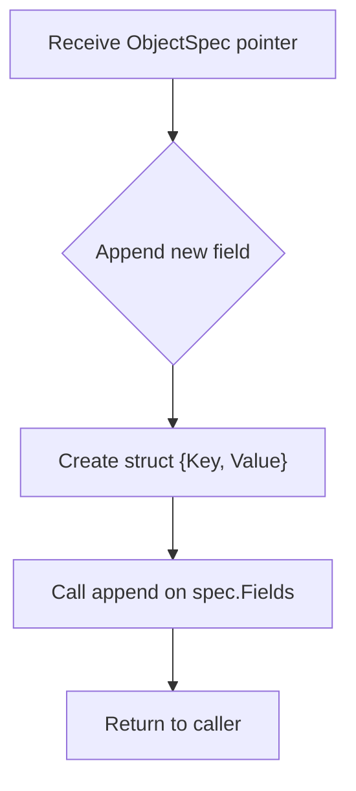

#### Function dependencies (Mermaid)
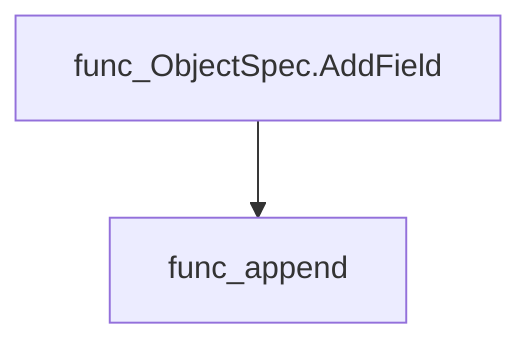

#### Functions calling `ObjectSpec.AddField` (Mermaid)
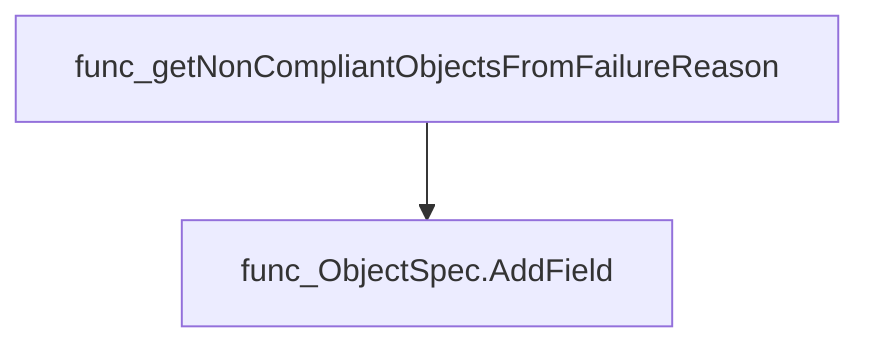

#### Usage example (Go)
```go
// Minimal example invoking ObjectSpec.AddField
var spec failures.ObjectSpec
spec.AddField("replicas", "3")
spec.AddField("image", "nginx:latest")

fmt.Printf("%+v\n", spec)
// Output: {Fields:[{Key:replicas Value:3} {Key:image Value:nginx:latest}]}
```

---

### ObjectSpec.MarshalJSON

**MarshalJSON** - Converts an `ObjectSpec` into its JSON representation. If the spec has no fields it returns an empty JSON object (`{}`).


#### Signature (Go)
```go
func (spec *ObjectSpec) MarshalJSON() ([]byte, error)
```

#### Summary Table
| Aspect | Details |
|--------|---------|
| **Purpose** | Converts an `ObjectSpec` into its JSON representation. If the spec has no fields it returns an empty JSON object (`{}`). |
| **Parameters** | *none* – operates on the receiver `spec`. |
| **Return value** | `[]byte` containing the JSON string; `error` is always `nil` in current implementation. |
| **Key dependencies** | • `len` (builtin) to check field count.<br>• `fmt.Sprintf` from the standard library for formatting key/value pairs. |
| **Side effects** | None – purely functional, no state mutation or I/O. |
| **How it fits the package** | Used by the failures sub‑package to provide a JSON representation of claim failure objects when displaying results. |

#### Internal workflow (Mermaid)
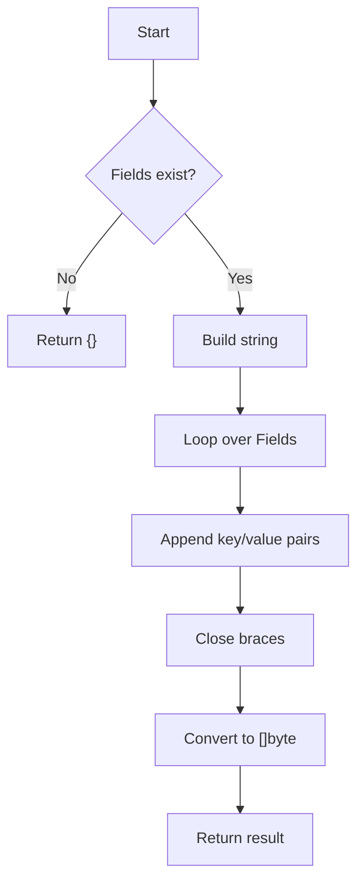

#### Function dependencies (Mermaid)
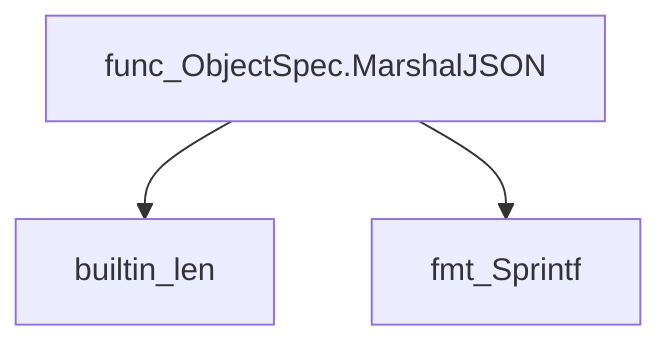

#### Functions calling `ObjectSpec.MarshalJSON` (Mermaid)
None – this function is currently not referenced elsewhere in the package.

#### Usage example (Go)
```go
// Minimal example invoking ObjectSpec.MarshalJSON
spec := &failures.ObjectSpec{
    Fields: []failures.Field{
        {Key: "name", Value: "example"},
        {Key: "status", Value: "failed"},
    },
}
data, err := spec.MarshalJSON()
if err != nil {
    log.Fatalf("marshal error: %v", err)
}
fmt.Println(string(data)) // {"name":"example","status":"failed"}
```

---

## Local Functions

### getFailedTestCasesByTestSuite

**getFailedTestCasesByTestSuite** - Transforms raw test‑case results into a slice of `FailedTestSuite`, each containing only the failed cases that belong to suites requested by the caller.


#### Signature (Go)

```go
func getFailedTestCasesByTestSuite(
    claimResultsByTestSuite map[string][]*claim.TestCaseResult,
    targetTestSuites map[string]bool,
) []FailedTestSuite
```

#### Summary Table

| Aspect | Details |
|--------|---------|
| **Purpose** | Transforms raw test‑case results into a slice of `FailedTestSuite`, each containing only the failed cases that belong to suites requested by the caller. |
| **Parameters** | `claimResultsByTestSuite` – map from suite name to all test‑case results; <br>`targetTestSuites` – optional set of suite names to include (nil means “all”). |
| **Return value** | Slice of `FailedTestSuite`, each holding the suite name and its failing test cases. |
| **Key dependencies** | * `getNonCompliantObjectsFromFailureReason` – parses detailed failure reasons.<br>* Standard library: `fmt.Fprintf`, `os.Stderr`. |
| **Side effects** | Writes error messages to standard error when a failure reason cannot be parsed. No mutation of input maps. |
| **How it fits the package** | Used by `showFailures` to prepare data for JSON or text output, filtering out passing cases and non‑relevant suites. |

#### Internal workflow (Mermaid)

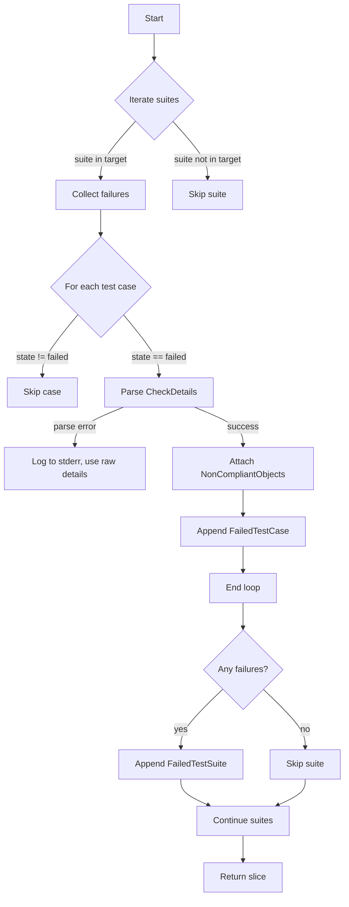

#### Function dependencies (Mermaid)

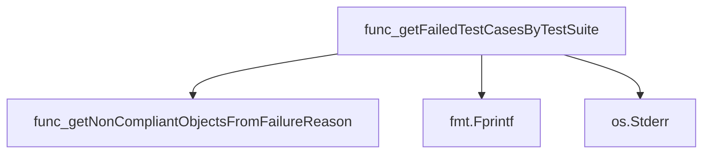

#### Functions calling `getFailedTestCasesByTestSuite` (Mermaid)

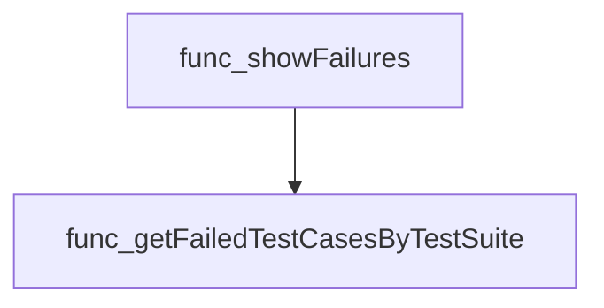

#### Usage example (Go)

```go
// Minimal example invoking getFailedTestCasesByTestSuite

import (
    "github.com/redhat-best-practices-for-k8s/certsuite/cmd/certsuite/claim"
)

// Assume claimResults and targetSuites are already populated.
failedSuites := getFailedTestCasesByTestSuite(claimResults, targetSuites)
for _, suite := range failedSuites {
    fmt.Printf("Suite: %s\n", suite.TestSuiteName)
    for _, tc := range suite.FailingTestCases {
        fmt.Printf("- %s: %s\n", tc.TestCaseName, tc.CheckDetails)
    }
}
```

---

### getNonCompliantObjectsFromFailureReason

**getNonCompliantObjectsFromFailureReason** - Converts the `checkDetails` string of a failed test case into a slice of `NonCompliantObject`s by decoding JSON and mapping report fields.


#### Signature (Go)

```go
func getNonCompliantObjectsFromFailureReason(string) ([]NonCompliantObject, error)
```

#### Summary Table

| Aspect | Details |
|--------|---------|
| **Purpose** | Converts the `checkDetails` string of a failed test case into a slice of `NonCompliantObject`s by decoding JSON and mapping report fields. |
| **Parameters** | `checkDetails string – JSON payload containing compliant and non‑compliant objects from a test result.` |
| **Return value** | `([]NonCompliantObject, error) – slice of parsed objects or an error if the payload cannot be decoded.` |
| **Key dependencies** | • `encoding/json.Unmarshal`<br>• `fmt.Errorf`<br>• `len`<br>• `append`<br>• `ObjectSpec.AddField` (method on `NonCompliantObject.Spec`) |
| **Side effects** | No state mutation; only local variable creation and error handling. |
| **How it fits the package** | Used by the failure‑report generator to extract detailed non‑compliance information from test results, enabling richer output for end users. |

#### Internal workflow (Mermaid)

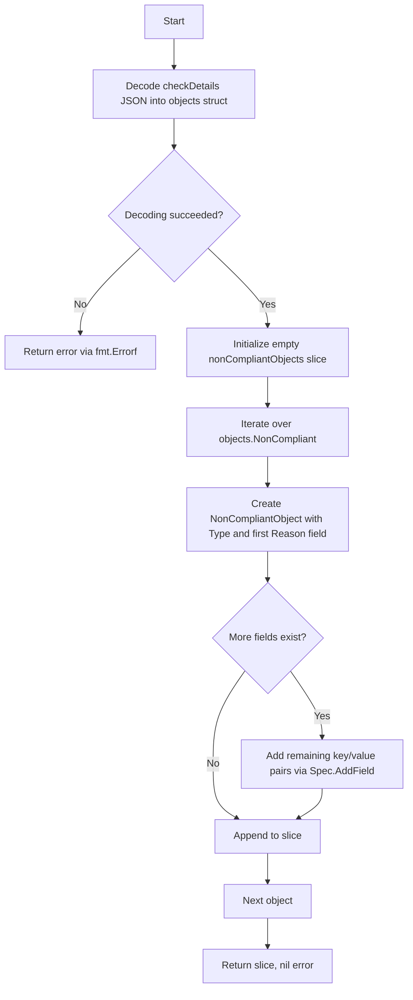

#### Function dependencies (Mermaid)

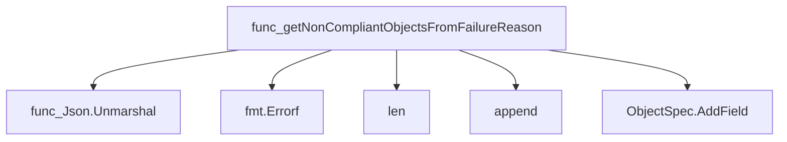

#### Functions calling `getNonCompliantObjectsFromFailureReason` (Mermaid)

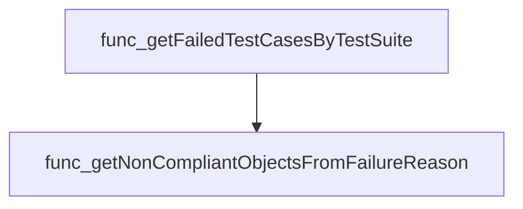

#### Usage example (Go)

```go
// Minimal example invoking getNonCompliantObjectsFromFailureReason
import (
	"fmt"
	"github.com/redhat-best-practices-for-k8s/certsuite/cmd/certsuite/claim/show/failures"
)

func main() {
	checkDetails := `{
		"CompliantObjectsOut": [],
		"NonCompliantObjectsOut": [
			{
				"ObjectType": "Pod",
				"ObjectFieldsKeys": ["name", "namespace"],
				"ObjectFieldsValues": ["nginx-pod", "default"]
			}
		]
	}`

	objects, err := failures.getNonCompliantObjectsFromFailureReason(checkDetails)
	if err != nil {
		fmt.Println("Error:", err)
		return
	}

	for _, obj := range objects {
		fmt.Printf("Type: %s, Reason: %s\n", obj.Type, obj.Reason)
	}
}
```

---

### parseOutputFormatFlag

**parseOutputFormatFlag** - Validates that the global flag `outputFormatFlag` matches one of the formats listed in `availableOutputFormats`. Returns the format string if valid.


#### Signature (Go)

```go
func parseOutputFormatFlag() (string, error)
```

#### Summary Table

| Aspect | Details |
|--------|---------|
| **Purpose** | Validates that the global flag `outputFormatFlag` matches one of the formats listed in `availableOutputFormats`. Returns the format string if valid. |
| **Parameters** | None |
| **Return value** | *string* – the chosen output format; *error* – non‑nil if the flag is not recognised. |
| **Key dependencies** | • `fmt.Errorf` – constructs error messages<br>• Access to package‑level variables: `outputFormatFlag`, `availableOutputFormats` |
| **Side effects** | None (pure function) |
| **How it fits the package** | Used by command handlers (e.g., `showFailures`) to decide how test results should be rendered. |

#### Internal workflow

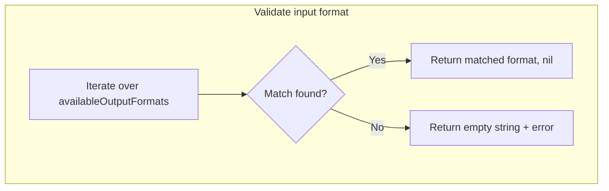

#### Function dependencies

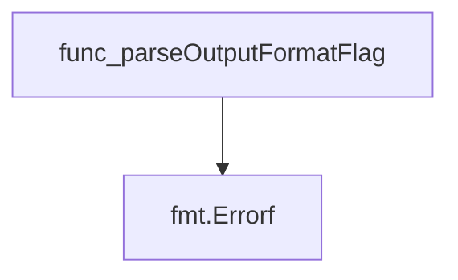

#### Functions calling `parseOutputFormatFlag`

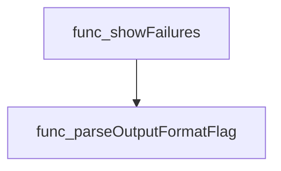

#### Usage example (Go)

```go
// Minimal example invoking parseOutputFormatFlag
package main

import (
	"fmt"
	"github.com/redhat-best-practices-for-k8s/certsuite/cmd/certsuite/claim/show/failures"
)

func main() {
	// Assume the global flag has been set elsewhere.
	format, err := failures.ParseOutputFormatFlag()
	if err != nil {
		fmt.Println("Error:", err)
		return
	}
	fmt.Println("Chosen output format:", format)
}
```

> **Note**: The function is unexported; callers must use a wrapper or be in the same package.

---

### parseTargetTestSuitesFlag

**parseTargetTestSuitesFlag** - Parses the global flag that lists test suite names, creating a lookup map where each key is a suite name and the value indicates inclusion.


#### Signature (Go)
```go
func parseTargetTestSuitesFlag() map[string]bool
```

#### Summary Table
| Aspect | Details |
|--------|---------|
| **Purpose** | Parses the global flag that lists test suite names, creating a lookup map where each key is a suite name and the value indicates inclusion. |
| **Parameters** | None |
| **Return value** | `map[string]bool` – a map of target suite names to `true`; returns `nil` when no suites are specified. |
| **Key dependencies** | • `strings.Split` (splits comma‑separated string)<br>• `strings.TrimSpace` (removes surrounding whitespace) |
| **Side effects** | None; purely functional, only reads the global `testSuitesFlag`. |
| **How it fits the package** | Used by `showFailures` to determine which test suites should be displayed in failure reports. |

#### Internal workflow
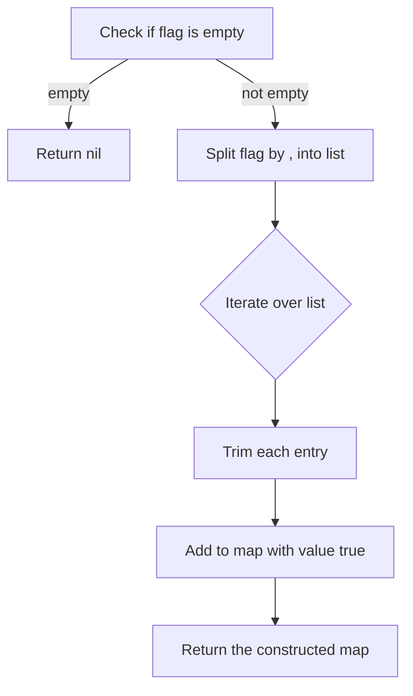

#### Function dependencies
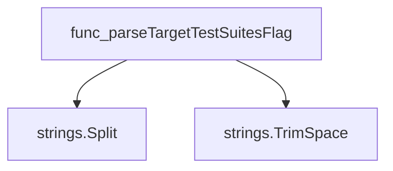

#### Functions calling `parseTargetTestSuitesFlag`
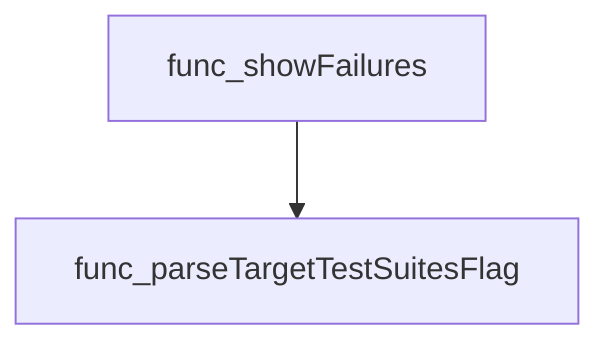

#### Usage example (Go)
```go
// Minimal example invoking parseTargetTestSuitesFlag
suites := parseTargetTestSuitesFlag()
if suites != nil {
    fmt.Println("Target test suites:", suites)
} else {
    fmt.Println("No target test suites specified")
}
```

---

### printFailuresJSON

**printFailuresJSON** - Serialises a slice of `FailedTestSuite` into pretty‑printed JSON and writes it to standard output.


#### Signature (Go)

```go
func printFailuresJSON(testSuites []FailedTestSuite)
```

#### Summary Table

| Aspect | Details |
|--------|---------|
| **Purpose** | Serialises a slice of `FailedTestSuite` into pretty‑printed JSON and writes it to standard output. |
| **Parameters** | `testSuites []FailedTestSuite` – collection of failed test suites to serialise. |
| **Return value** | none (void). The function terminates the program on marshal error. |
| **Key dependencies** | * `encoding/json.MarshalIndent` – formats JSON with indentation.<br>* `log.Fatalf` – logs a fatal error and exits if marshalling fails.<br>* `fmt.Printf` – outputs the resulting JSON string.<br>* `string(bytes)` – converts the byte slice to a string. |
| **Side effects** | * Writes to stdout via `fmt.Printf`. <br>* Calls `log.Fatalf`, which aborts the process on error. |
| **How it fits the package** | Part of the command‑line tool for displaying claim failures; invoked by `showFailures` when JSON output is requested. |

#### Internal workflow (Mermaid)

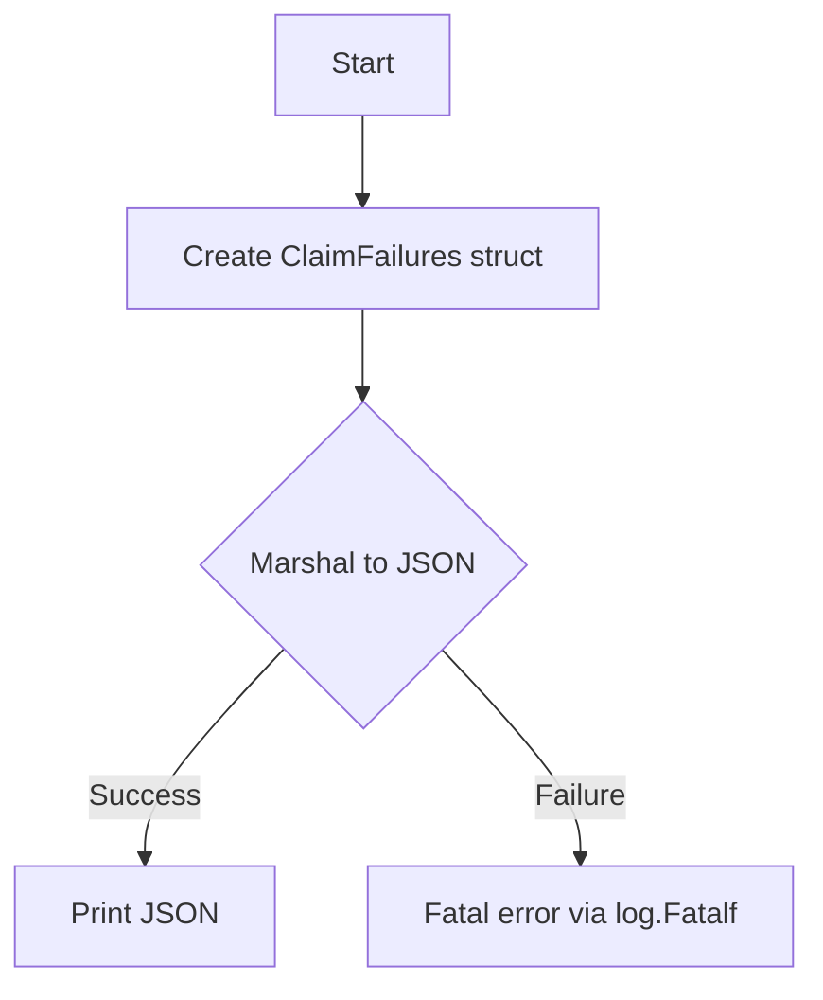

#### Function dependencies (Mermaid)

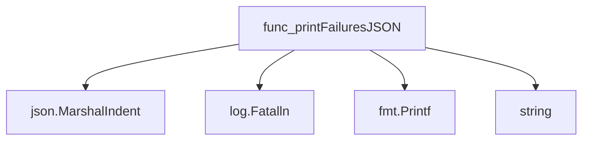

#### Functions calling `printFailuresJSON` (Mermaid)

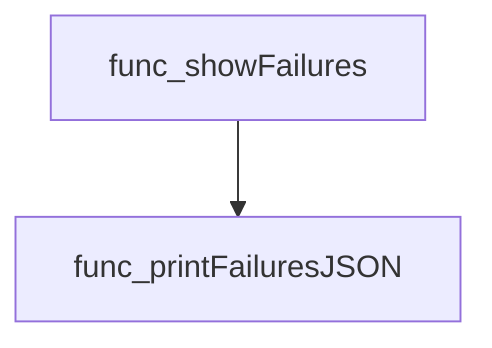

#### Usage example (Go)

```go
// Minimal example invoking printFailuresJSON
package main

import (
	"github.com/redhat-best-practices-for-k8s/certsuite/cmd/certsuite/claim/show/failures"
)

func main() {
	suites := []failures.FailedTestSuite{
		{ /* populate fields */ },
	}
	failures.printFailuresJSON(suites)
}
```

---

### printFailuresText

**printFailuresText** - Iterates over failed test suites and prints each suite, its failing test cases, and detailed failure reasons to standard output.


#### Signature (Go)
```go
func(testSuites []FailedTestSuite)()
```

#### Summary Table
| Aspect | Details |
|--------|---------|
| **Purpose** | Iterates over failed test suites and prints each suite, its failing test cases, and detailed failure reasons to standard output. |
| **Parameters** | `testSuites []FailedTestSuite` – A slice of custom structs representing test suites that contain failures. |
| **Return value** | None (side‑effect only). |
| **Key dependencies** | • `fmt.Printf` for formatted output.<br>• Built‑in `len` to determine if a test case has non‑compliant objects. |
| **Side effects** | Writes human‑readable failure information to `stdout`; does not modify input data or other global state. |
| **How it fits the package** | Serves as the text‑output handler for the *failures* subcommand, called by `showFailures` after parsing claim results. |

#### Internal workflow (Mermaid)
```mermaid
flowchart TD
  A["Start"] --> B{"Iterate over testSuites"}
  B -->|"for each ts"| C["Print Test Suite: <name>"]
  C --> D{"Iterate over ts.FailingTestCases"}
  D -->|"for each tc"| E["Print   Test Case: <name>"]
  E --> F["Print     Description: <desc>"]
  F --> G{"len(tc.NonCompliantObjects) == 0"}
  G -- Yes --> H["Print     Failure reason: <CheckDetails>"]
  G -- No --> I["Print     Failure reasons:"]
  I --> J{"Iterate over tc.NonCompliantObjects"}
  J -->|"for each obj"| K["Print       %2d - Type: %s, Reason: %s"]
  K --> L["Print fields of obj.Spec.Fields"]
  L --> J
  H --> B
  K --> J
```

#### Function dependencies (Mermaid)
```mermaid
graph TD
  func_printFailuresText --> fmt_Printf
  func_printFailuresText --> builtin_len
```

#### Functions calling `printFailuresText` (Mermaid)
```mermaid
graph TD
  showFailures --> func_printFailuresText
```

#### Usage example (Go)
```go
// Minimal example invoking printFailuresText
var suites []FailedTestSuite // assume this is populated elsewhere
printFailuresText(suites)
```

---

### showFailures

**showFailures** - Parses a claim file, validates its format version, extracts failed test cases per suite, and prints them in the requested output format (JSON or plain text).


#### Signature (Go)
```go
func showFailures(_ *cobra.Command, _ []string) error
```

#### Summary Table
| Aspect | Details |
|--------|---------|
| **Purpose** | Parses a claim file, validates its format version, extracts failed test cases per suite, and prints them in the requested output format (JSON or plain text). |
| **Parameters** | `_ *cobra.Command` – command context (unused), `_ []string` – arguments (unused) |
| **Return value** | `error` – non‑nil if parsing, validation, or printing fails. |
| **Key dependencies** | • `parseOutputFormatFlag()` – obtains output format flag<br>• `claim.Parse()` – reads and unmarshals claim file<br>• `claim.CheckVersion()` – validates claim schema version<br>• `getFailedTestCasesByTestSuite()` – filters failed test cases<br>• `printFailuresJSON()` / `printFailuresText()` – renders results |
| **Side effects** | Reads a file from disk, writes to stdout/stderr (formatted failures or error messages). No global state mutation. |
| **How it fits the package** | Entry point for the `show failures` subcommand of the `certsuite claim show` CLI, orchestrating parsing, filtering, and output formatting. |

#### Internal workflow
```mermaid
flowchart TD
  A["parseOutputFormatFlag"] --> B["claim.Parse"]
  B --> C["claim.CheckVersion"]
  C --> D["build resultsByTestSuite map"]
  D --> E["parseTargetTestSuitesFlag"]
  E --> F["getFailedTestCasesByTestSuite"]
  F --> G{"outputFormat"}
  G -->|"JSON"| H["printFailuresJSON"]
  G -->|"Text"| I["printFailuresText"]
```

#### Function dependencies
```mermaid
graph TD
  func_showFailures --> func_parseOutputFormatFlag
  func_showFailures --> func_Parse
  func_showFailures --> func_CheckVersion
  func_showFailures --> func_getFailedTestCasesByTestSuite
  func_showFailures --> func_printFailuresJSON
  func_showFailures --> func_printFailuresText
```

#### Functions calling `showFailures`
None – this function is currently not referenced elsewhere in the package.

#### Usage example (Go)
```go
// Minimal example invoking showFailures
cmd := &cobra.Command{Use: "failures"}
_ = cmd.Execute() // internally calls showFailures when the subcommand is run
```

---

---

