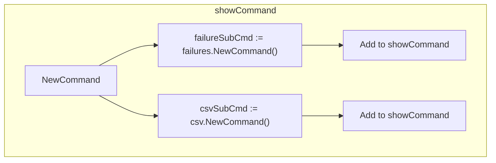
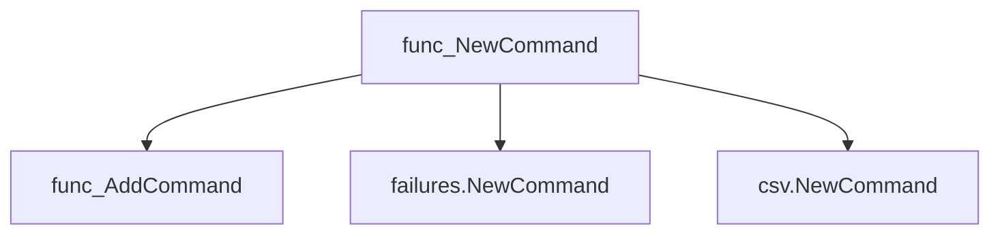
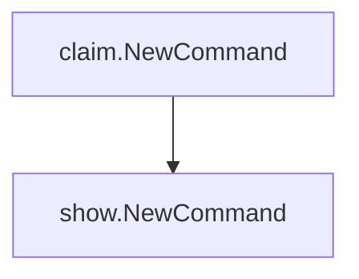

# Package show

**Path**: `cmd/certsuite/claim/show`

## Table of Contents

- [Overview](#overview)
- [Exported Functions](#exported-functions)
  - [NewCommand](#newcommand)

## Overview

Failed to parse JSON response, but content appears to contain package information.

### Exported Functions Summary

| Name | Purpose |
|------|----------|
| [func NewCommand() *cobra.Command](#newcommand) | Creates a Cobra command that aggregates sub‑commands for displaying claim information. |

## Exported Functions

### NewCommand

**NewCommand** - Creates a Cobra command that aggregates sub‑commands for displaying claim information.


#### Signature (Go)

```go
func NewCommand() *cobra.Command
```

#### Summary Table

| Aspect | Details |
|--------|---------|
| **Purpose** | Creates a Cobra command that aggregates sub‑commands for displaying claim information. |
| **Parameters** | None |
| **Return value** | A pointer to the root `*cobra.Command` representing the “show” command. |
| **Key dependencies** | • Calls `AddCommand` on the internal `showCommand`.  <br>• Instantiates sub‑commands via `failures.NewCommand()` and `csv.NewCommand()`. |
| **Side effects** | No global state changes; only returns a new command structure. |
| **How it fits the package** | Serves as the entry point for the *show* feature, wiring together failure display and CSV dump capabilities under a single command group. |

#### Internal workflow (Mermaid)



#### Function dependencies (Mermaid)



#### Functions calling `NewCommand` (Mermaid)



#### Usage example (Go)

```go
// Minimal example invoking NewCommand
package main

import (
	"github.com/redhat-best-practices-for-k8s/certsuite/cmd/certsuite/claim/show"
	"os"

	"github.com/spf13/cobra"
)

func main() {
	cmd := show.NewCommand()
	if err := cmd.Execute(); err != nil {
		os.Exit(1)
	}
}
```

---

---

