# Package catalog

**Path**: `cmd/certsuite/generate/catalog`

## Table of Contents

- [Overview](#overview)
- [Structs](#structs)
  - [Entry](#entry)
- [Exported Functions](#exported-functions)
  - [CreatePrintableCatalogFromIdentifiers](#createprintablecatalogfromidentifiers)
  - [GetSuitesFromIdentifiers](#getsuitesfromidentifiers)
  - [NewCommand](#newcommand)
- [Local Functions](#local-functions)
  - [addPreflightTestsToCatalog](#addpreflightteststocatalog)
  - [emitTextFromFile](#emittextfromfile)
  - [generateJS](#generatejs)
  - [outputIntro](#outputintro)
  - [outputJS](#outputjs)
  - [outputSccCategories](#outputscccategories)
  - [outputTestCases](#outputtestcases)
  - [runGenerateMarkdownCmd](#rungeneratemarkdowncmd)
  - [scenarioIDToText](#scenarioidtotext)
  - [summaryToMD](#summarytomd)

## Overview

The catalog package generates documentation for the Red Hat Best Practices Test Suite, producing Markdown and JSON representations that list all test cases, their metadata, and statistics.

### Key Features

- Creates a printable catalogue structure by grouping identifiers per suite
- Builds comprehensive Markdown output including intro, test details, SCC categories, and summary statistics
- Exports commands to generate catalog documentation via Cobra CLI

### Design Notes

- Assumes identifiers contain Suite field for grouping; unknown suites result in empty groups
- Handles missing scenario IDs gracefully by mapping to "Unknown Scenario"
- Best practice: invoke NewCommand() to register subcommands before execution

### Structs Summary

| Name | Purpose |
|------|----------|
| [**Entry**](#entry) | Represents a single catalog item |

### Exported Functions Summary

| Name | Purpose |
|------|----------|
| [func CreatePrintableCatalogFromIdentifiers(keys []claim.Identifier) map[string][]Entry](#createprintablecatalogfromidentifiers) | Groups identifiers by their `Suite` field to produce a printable catalogue structure. |
| [func GetSuitesFromIdentifiers(keys []claim.Identifier) []string](#getsuitesfromidentifiers) | Returns a slice containing the distinct `Suite` values found in the supplied `claim.Identifier` list. |
| [func NewCommand() *cobra.Command](#newcommand) | Constructs and returns a `*cobra.Command` that represents the top‑level CLI entry point for generating catalog documentation. |

### Local Functions Summary

| Name | Purpose |
|------|----------|
| [func addPreflightTestsToCatalog()](#addpreflightteststocatalog) | Gathers all preflight operator and container checks, extracts their metadata, and registers each as a catalog entry for the certsuite test suite. |
| [func emitTextFromFile(filename string) error](#emittextfromfile) | Reads the entire content of a given file and writes it directly to standard output, enabling inclusion of static text such as catalog documentation. |
| [func generateJS(_ *cobra.Command, _ []string) error](#generatejs) | Produces a JSON representation of the package’s classification identifiers and prints it to standard output. |
| [func outputIntro() (out string)](#outputintro) | Builds a static introduction for the Red Hat Best Practices Test Suite catalog, returning it as a single Markdown-formatted string. |
| [func()](#outputjs) | Serialises the global `identifiers.Classification` map to indented JSON, logs an error if marshalling fails, and writes the result to standard output. |
| [func outputSccCategories() (sccCategories string)](#outputscccategories) | Builds a Markdown block that explains the four security context categories used in the generated catalog, including introductory text and detailed descriptions for each category. |
| [func outputTestCases() (outString string, summary catalogSummary)](#outputtestcases) | Builds a Markdown string that documents all test cases in the catalog, including metadata such as ID, description, remediation, best‑practice references, impact statements, tags and scenario classifications. It also compiles statistics on tests per suite and per scenario into a `catalogSummary`. |
| [func runGenerateMarkdownCmd(_ *cobra.Command, _ []string) error](#rungeneratemarkdowncmd) | Creates a complete Markdown document describing the Red Hat Best Practices Test Suite for Kubernetes and writes it to standard output. |
| [func scenarioIDToText(id string) (text string)](#scenarioidtotext) | Maps known scenario IDs to friendly names; returns `"Unknown Scenario"` for unknown values. |
| [func(catalogSummary)(string)](#summarytomd) | Builds a Markdown string summarizing total test cases, suites, and per‑suite/per‑scenario counts for the certsuite catalog. |

## Structs

### Entry

| Field      | Type           | Description |
|------------|----------------|-------------|
| `testName` | `string`       | Human‑readable name of the test, derived from an identifier’s ID. |
| `identifier` | `claim.Identifier` | The underlying identifier containing metadata such as URL and version; used to locate the test definition. |

#### Purpose  

The `Entry` struct aggregates the information required for generating a printable catalog of tests. Each instance maps a suite name (extracted from an `Identifier`) to its corresponding test details, enabling downstream formatting and output.

#### Related functions

| Function | Purpose |
|----------|---------|
| `CreatePrintableCatalogFromIdentifiers` | Builds a map from suite names to slices of `Entry`, populating each entry with the test’s ID and identifier. |

---

## Exported Functions

### CreatePrintableCatalogFromIdentifiers

**CreatePrintableCatalogFromIdentifiers** - Groups identifiers by their `Suite` field to produce a printable catalogue structure.

#### 1) Signature (Go)

```go
func CreatePrintableCatalogFromIdentifiers(keys []claim.Identifier) map[string][]Entry
```

#### 2) Summary Table

| Aspect | Details |
|--------|---------|
| **Purpose** | Groups identifiers by their `Suite` field to produce a printable catalogue structure. |
| **Parameters** | `keys []claim.Identifier – list of test identifiers (URL, ID, suite name, etc.)` |
| **Return value** | `map[string][]Entry` – mapping from suite names to slices of `Entry`, each containing the test name and its identifier. |
| **Key dependencies** | • Calls built‑in `make` to create the map<br>• Uses slice `append` to populate entries |
| **Side effects** | None (pure function; no I/O, global state mutation, or concurrency) |
| **How it fits the package** | Provides a lightweight data structure used by higher‑level functions (e.g., `outputTestCases`) to format and output test case documentation. |

#### 3) Internal workflow (Mermaid)

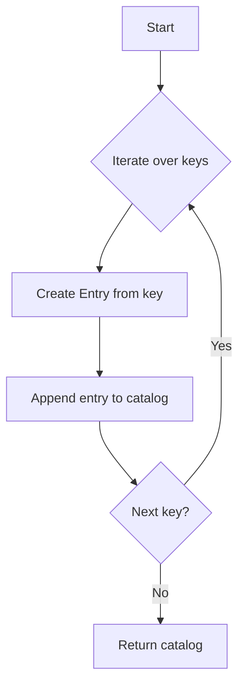

#### 4) Function dependencies (Mermaid)

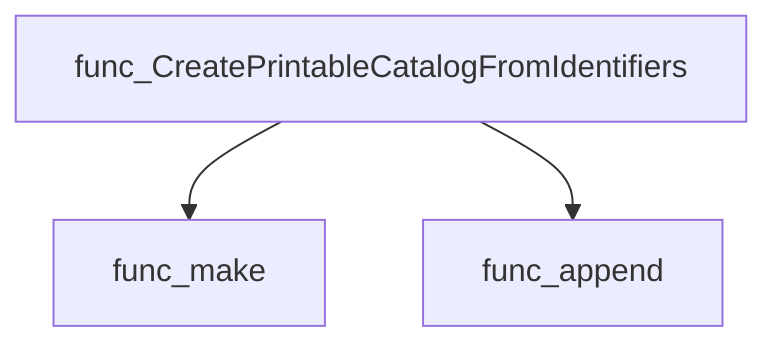

#### 5) Functions calling `CreatePrintableCatalogFromIdentifiers` (Mermaid)

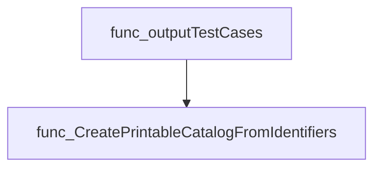

#### 6) Usage example (Go)

```go
// Minimal example invoking CreatePrintableCatalogFromIdentifiers
package main

import (
    "fmt"
    "github.com/redhat-best-practices-for-k8s/certsuite/cmd/certsuite/generate/catalog"
    "github.com/redhat-best-practices-for-k8s/certsuite/claim"
)

func main() {
    // Example identifiers
    ids := []claim.Identifier{
        {Id: "TestA", Suite: "Suite1"},
        {Id: "TestB", Suite: "Suite2"},
        {Id: "TestC", Suite: "Suite1"},
    }

    catalogMap := catalog.CreatePrintableCatalogFromIdentifiers(ids)

    for suite, entries := range catalogMap {
        fmt.Printf("Suite: %s\n", suite)
        for _, e := range entries {
            fmt.Printf("- %s (ID: %s)\n", e.testName, e.identifier.Id)
        }
    }
}
```

---

---

### GetSuitesFromIdentifiers

**GetSuitesFromIdentifiers** - Returns a slice containing the distinct `Suite` values found in the supplied `claim.Identifier` list.

#### Signature (Go)

```go
func GetSuitesFromIdentifiers(keys []claim.Identifier) []string
```

#### Summary Table

| Aspect | Details |
|--------|---------|
| **Purpose** | Returns a slice containing the distinct `Suite` values found in the supplied `claim.Identifier` list. |
| **Parameters** | `keys []claim.Identifier` – identifiers to inspect |
| **Return value** | `[]string` – unique suite names |
| **Key dependencies** | • `append` (built‑in) <br>• `arrayhelper.Unique` from `github.com/redhat-best-practices-for-k8s/certsuite/pkg/arrayhelper` |
| **Side effects** | None; purely functional. |
| **How it fits the package** | Used by catalog generation routines to build a list of test‑suite names for display and summary statistics. |

#### Internal workflow (Mermaid)

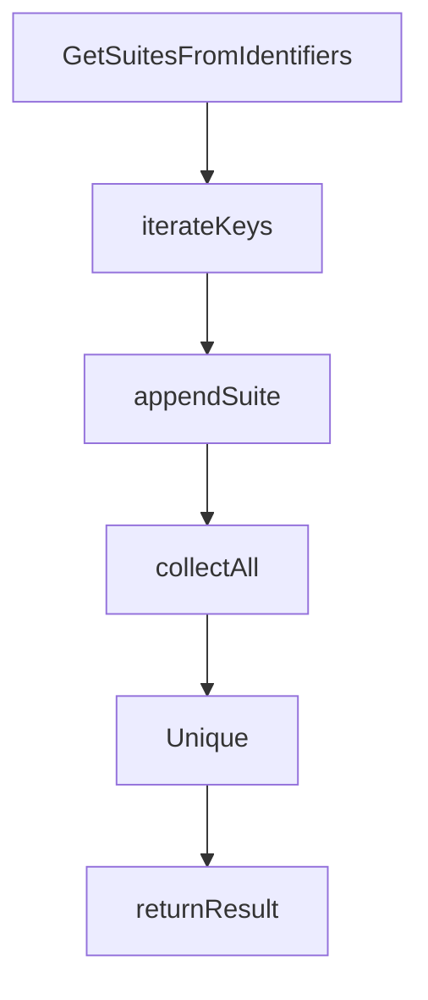

#### Function dependencies (Mermaid)

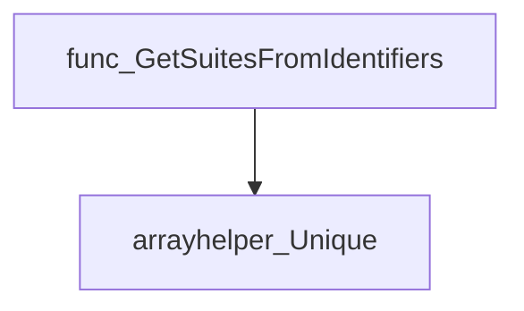

#### Functions calling `GetSuitesFromIdentifiers` (Mermaid)

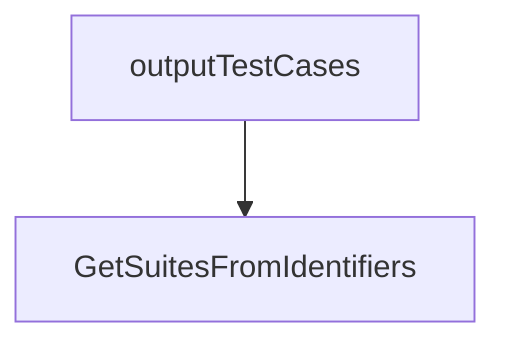

#### Usage example (Go)

```go
// Minimal example invoking GetSuitesFromIdentifiers
package main

import (
 "fmt"

 "github.com/redhat-best-practices-for-k8s/certsuite/pkg/claim"
)

func main() {
 ids := []claim.Identifier{
  {Suite: "Network"},
  {Suite: "Security"},
  {Suite: "Network"},
 }
 suites := GetSuitesFromIdentifiers(ids)
 fmt.Println(suites) // Output: [Network Security]
}
```

---

### NewCommand

**NewCommand** - Constructs and returns a `*cobra.Command` that represents the top‑level CLI entry point for generating catalog documentation.

#### Signature (Go)

```go
func NewCommand() *cobra.Command
```

#### Summary Table

| Aspect | Details |
|--------|---------|
| **Purpose** | Constructs and returns a `*cobra.Command` that represents the top‑level CLI entry point for generating catalog documentation. |
| **Parameters** | None |
| **Return value** | A pointer to a `cobra.Command` configured with subcommands for markdown generation. |
| **Key dependencies** | • Calls `generateCmd.AddCommand(markdownGenerateCmd)`<br>• Calls `generateCmd.AddCommand(markdownGenerateClassification)` |
| **Side effects** | Mutates the global `generateCmd` by registering two sub‑commands; no external I/O or concurrency is performed. |
| **How it fits the package** | Provides the command that the higher‑level generate CLI aggregates, enabling catalog‑specific generation features. |

#### Internal workflow (Mermaid)

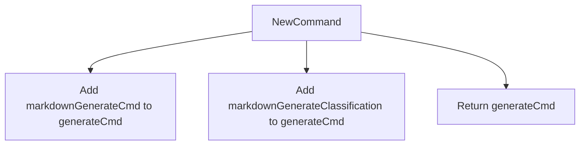

#### Function dependencies (Mermaid)

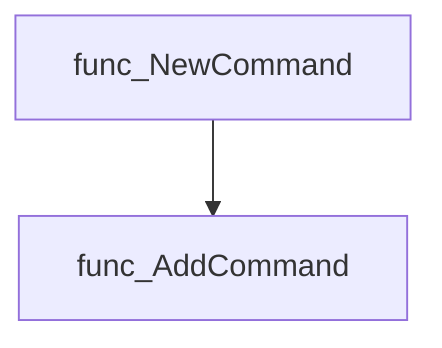

#### Functions calling `NewCommand` (Mermaid)

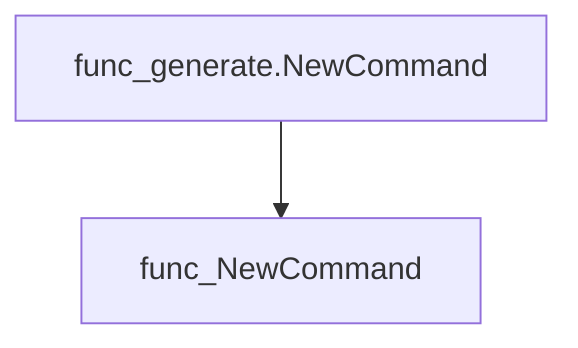

#### Usage example (Go)

```go
// Minimal example invoking NewCommand
package main

import (
    "github.com/redhat-best-practices-for-k8s/certsuite/cmd/certsuite/generate/catalog"
)

func main() {
    cmd := catalog.NewCommand()
    // In a real application you would execute the command:
    // if err := cmd.Execute(); err != nil { panic(err) }
}
```

---

## Local Functions

### addPreflightTestsToCatalog

**addPreflightTestsToCatalog** - Gathers all preflight operator and container checks, extracts their metadata, and registers each as a catalog entry for the certsuite test suite.

#### Signature (Go)

```go
func addPreflightTestsToCatalog()
```

#### Summary Table

| Aspect | Details |
|--------|---------|
| **Purpose** | Gathers all preflight operator and container checks, extracts their metadata, and registers each as a catalog entry for the certsuite test suite. |
| **Parameters** | None |
| **Return value** | None (side‑effect only) |
| **Key dependencies** | • `artifacts.NewMapWriter` – creates an in‑memory writer for preflight artifacts.<br>• `artifacts.ContextWithWriter` – injects the writer into a context.<br>• `plibOperator.NewCheck`, `plibContainer.NewCheck` – instantiate generic check objects.<br>• `check.List` – retrieves operator/container checks.<br>• `identifiers.AddCatalogEntry` – registers each test in the global catalog. |
| **Side effects** | • Populates the global `identifiers.Catalog` map with entries for every discovered preflight test.<br>• Emits error logs via `log.Error` when artifact creation or check listing fails. |
| **How it fits the package** | Called by `outputTestCases` to enrich the catalog before generating the final documentation and summary. |

#### Internal workflow (Mermaid)

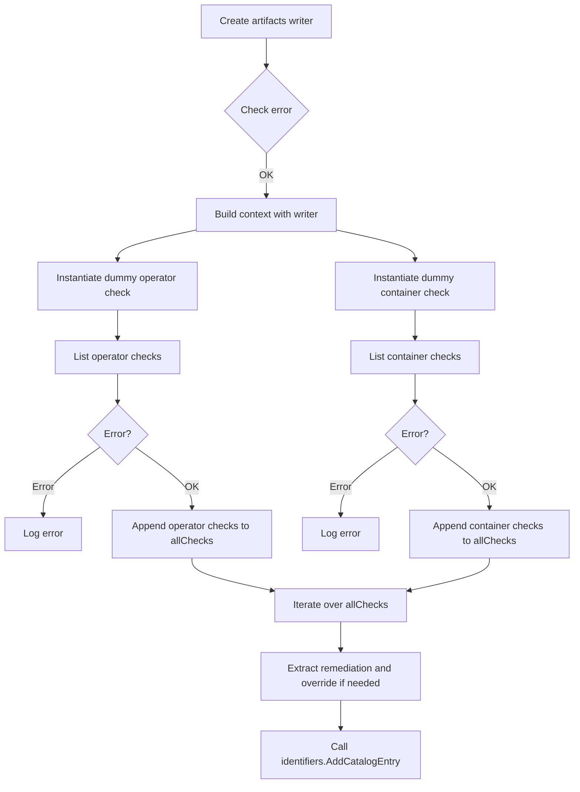

#### Function dependencies (Mermaid)

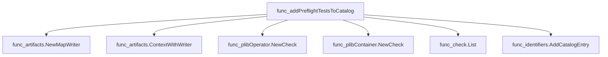

#### Functions calling `addPreflightTestsToCatalog` (Mermaid)

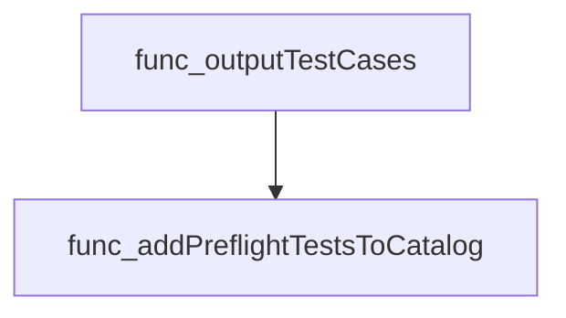

#### Usage example (Go)

```go
// The function is invoked implicitly during catalog generation.
outputTestCases()   // Internally calls addPreflightTestsToCatalog()
```

---

### emitTextFromFile

**emitTextFromFile** - Reads the entire content of a given file and writes it directly to standard output, enabling inclusion of static text such as catalog documentation.

#### Signature (Go)

```go
func emitTextFromFile(filename string) error
```

#### Summary Table

| Aspect | Details |
|--------|---------|
| **Purpose** | Reads the entire content of a given file and writes it directly to standard output, enabling inclusion of static text such as catalog documentation. |
| **Parameters** | `filename string` – Path to the file whose contents are to be streamed. |
| **Return value** | `error` – Non‑nil if reading the file fails; otherwise nil after successful printing. |
| **Key dependencies** | • `os.ReadFile` – Reads file into memory.<br>• `fmt.Print` – Outputs text to stdout.<br>• `string` conversion of byte slice to string. |
| **Side effects** | Performs I/O by reading a file and writing to standard output; does not modify program state. |
| **How it fits the package** | Utility helper used during catalog generation to embed static Markdown files (e.g., CATALOG.md) into the generated output without requiring runtime parsing or templating. |

#### Internal workflow

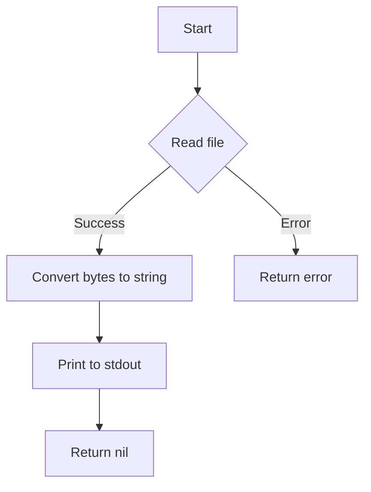

#### Function dependencies

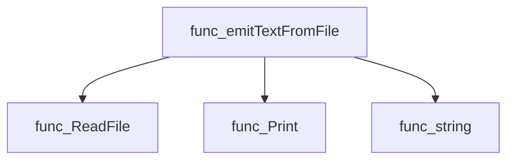

#### Functions calling `emitTextFromFile`

None – this function is currently not referenced elsewhere in the package.

#### Usage example (Go)

```go
// Minimal example invoking emitTextFromFile
package main

import (
 "log"
)

func main() {
 if err := emitTextFromFile(“example.txt”); err != nil {
  log.Fatalf(“failed to emit text: %v”, err)
 }
}
```

---

---

### generateJS

**generateJS** - Produces a JSON representation of the package’s classification identifiers and prints it to standard output.

#### Signature (Go)

```go
func generateJS(_ *cobra.Command, _ []string) error
```

#### Summary Table

| Aspect | Details |
|--------|---------|
| **Purpose** | Produces a JSON representation of the package’s classification identifiers and prints it to standard output. |
| **Parameters** | `*cobra.Command` – command context (unused), `[]string` – arguments slice (unused). |
| **Return value** | `error` – always `nil`; function does not propagate errors from its internal logic. |
| **Key dependencies** | Calls `outputJS()` which marshals `identifiers.Classification`. Uses standard library packages: `encoding/json`, `fmt`, and a logging package (`log`). |
| **Side effects** | Writes formatted JSON to stdout; logs error if marshalling fails. No state mutation in the caller’s context. |
| **How it fits the package** | Serves as a sub‑command handler within the `catalog` command group, enabling users to request classification data in JavaScript/JSON form. |

#### Internal workflow

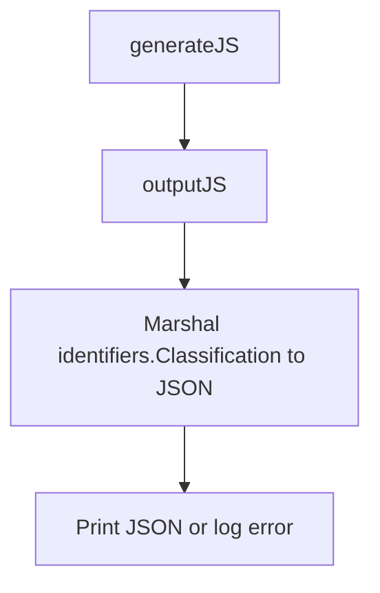

#### Function dependencies

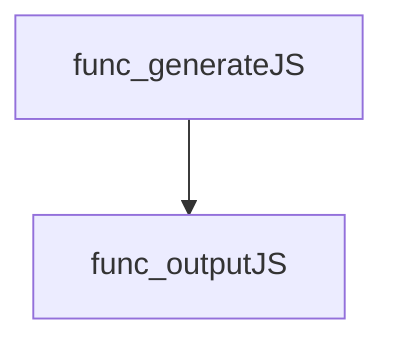

#### Functions calling `generateJS`

None – this function is currently not referenced elsewhere in the package.

#### Usage example (Go)

```go
// Minimal example invoking generateJS
cmd := &cobra.Command{}
err := generateJS(cmd, []string{})
if err != nil {
    fmt.Println("Error:", err)
}
```

---

---

### outputIntro

**outputIntro** - Builds a static introduction for the Red Hat Best Practices Test Suite catalog, returning it as a single Markdown-formatted string.

#### Signature (Go)

```go
func outputIntro() (out string)
```

#### Summary Table

| Aspect | Details |
|--------|---------|
| **Purpose** | Builds a static introduction for the Red Hat Best Practices Test Suite catalog, returning it as a single Markdown-formatted string. |
| **Parameters** | None |
| **Return value** | `string` – concatenated header and introductory paragraph ready to be written to stdout or included in larger documentation. |
| **Key dependencies** | • Standard library string literals; no external packages are invoked. |
| **Side effects** | No state mutation, I/O, or concurrency; purely functional. |
| **How it fits the package** | Supplies the opening text that precedes all test‑case listings in the generated catalog markdown. |

#### Internal workflow (Mermaid)

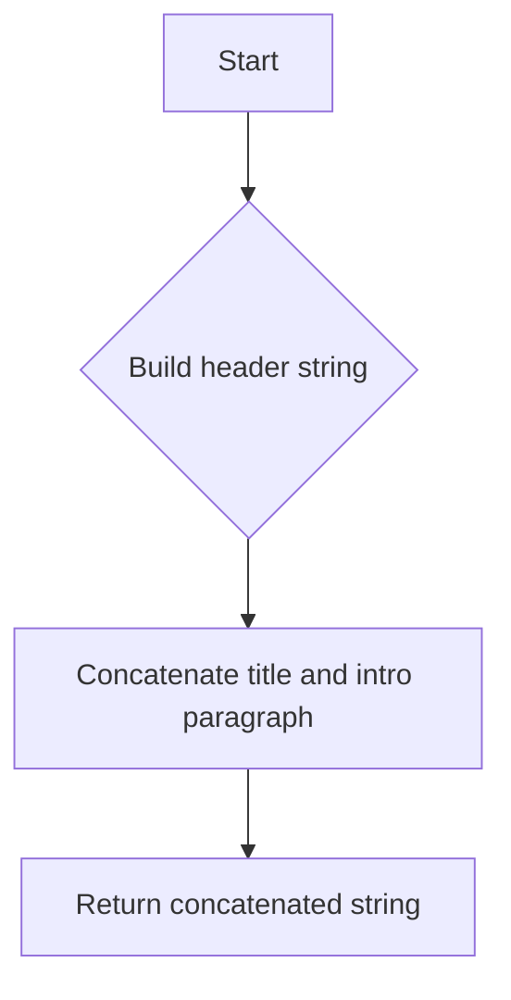

#### Function dependencies (Mermaid)

None – this function is currently not referenced elsewhere in the package.

#### Functions calling `outputIntro` (Mermaid)

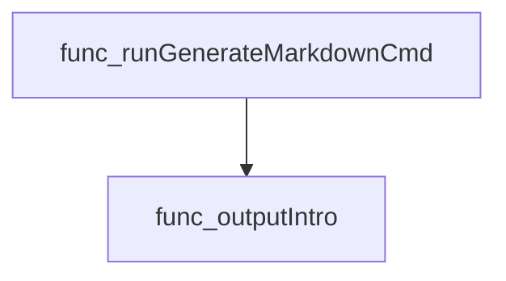

#### Usage example (Go)

```go
// Minimal example invoking outputIntro (note: unexported within its package)
package main

import (
 "fmt"

 "github.com/redhat-best-practices-for-k8s/certsuite/cmd/certsuite/generate/catalog"
)

func main() {
 intro := catalog.outputIntro()
 fmt.Println(intro)
}
```

---

### outputJS

**outputJS** - Serialises the global `identifiers.Classification` map to indented JSON, logs an error if marshalling fails, and writes the result to standard output.

#### Signature (Go)

```go
func()
```

#### Summary Table

| Aspect | Details |
|--------|---------|
| **Purpose** | Serialises the global `identifiers.Classification` map to indented JSON, logs an error if marshalling fails, and writes the result to standard output. |
| **Parameters** | None |
| **Return value** | None (void) |
| **Key dependencies** | • `encoding/json.MarshalIndent` – formatting JSON<br>• `github.com/redhat-best-practices-for-k8s/certsuite/internal/log.Logger.Error` – error logging<br>• `fmt.Printf` – output to stdout |
| **Side effects** | Writes to stdout; may emit log entries on failure. No state mutation. |
| **How it fits the package** | Used by the command‑line generator (`generateJS`) to expose the classification data structure as JSON for downstream tools or users. |

#### Internal workflow (Mermaid)

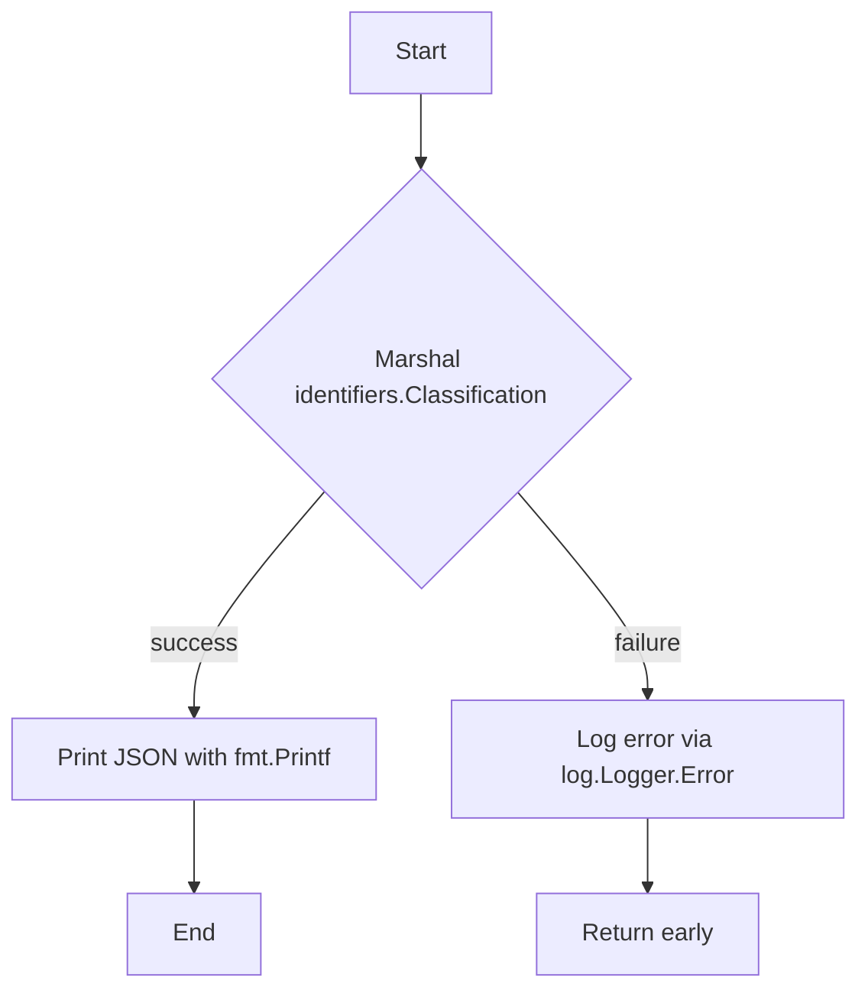

#### Function dependencies (Mermaid)

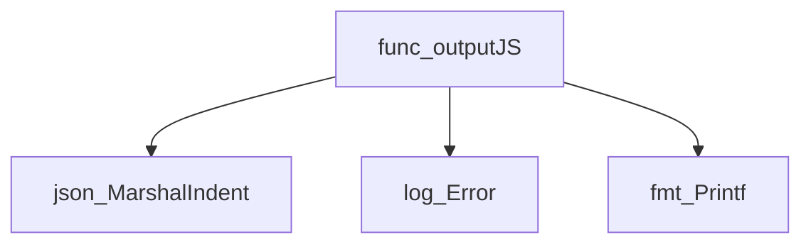

#### Functions calling `outputJS` (Mermaid)

```mermaid
graph TD
  func_generateJS --> func_outputJS
```

#### Usage example (Go)

```go
// Minimal example invoking outputJS
func main() {
    // In the real program this is called via a Cobra command.
    outputJS()
}
```

---

### outputSccCategories

**outputSccCategories** - Builds a Markdown block that explains the four security context categories used in the generated catalog, including introductory text and detailed descriptions for each category.

#### 1) Signature (Go)

```go
func outputSccCategories() (sccCategories string)
```

#### 2) Summary Table

| Aspect | Details |
|--------|---------|
| **Purpose** | Builds a Markdown block that explains the four security context categories used in the generated catalog, including introductory text and detailed descriptions for each category. |
| **Parameters** | None |
| **Return value** | `sccCategories` – a formatted string containing the complete Security Context Categories section. |
| **Key dependencies** | *None* – relies only on string concatenation and literal text. |
| **Side effects** | No state mutation or I/O; purely functional. |
| **How it fits the package** | Called by `runGenerateMarkdownCmd` to append category information to the final Markdown output of the catalog generator. |

#### 3) Internal workflow (Mermaid)

```mermaid
flowchart TD
  A["Start"] --> B["Initialize header string"]
  B --> C["Define introductory paragraph"]
  C --> D["Compose first category block"]
  D --> E["Compose second category block"]
  E --> F["Compose third category block"]
  F --> G["Compose fourth category block"]
  G --> H["Concatenate all parts"]
  H --> I["Return result string"]
```

#### 4) Function dependencies (Mermaid)

None – this function is currently not referenced elsewhere in the package.

```mermaid
graph TD
  func_outputSccCategories
```

#### 5) Functions calling `outputSccCategories` (Mermaid)

```mermaid
graph TD
  func_runGenerateMarkdownCmd --> func_outputSccCategories
```

#### 6) Usage example (Go)

```go
// Minimal example invoking outputSccCategories
package main

import (
 "fmt"
 "github.com/redhat-best-practices-for-k8s/certsuite/cmd/certsuite/generate/catalog"
)

func main() {
 sccSection := catalog.OutputSccCategories()
 fmt.Println(sccSection)
}
```

*(Note: `OutputSccCategories` would need to be exported for external use; in the original code it is unexported.)*

---

### outputTestCases

**outputTestCases** - Builds a Markdown string that documents all test cases in the catalog, including metadata such as ID, description, remediation, best‑practice references, impact statements, tags and scenario classifications. It also compiles statistics on tests per suite and per scenario into a `catalogSummary`.

#### Signature (Go)

```go
func outputTestCases() (outString string, summary catalogSummary)
```

#### Summary Table

| Aspect | Details |
|--------|---------|
| **Purpose** | Builds a Markdown string that documents all test cases in the catalog, including metadata such as ID, description, remediation, best‑practice references, impact statements, tags and scenario classifications. It also compiles statistics on tests per suite and per scenario into a `catalogSummary`. |
| **Parameters** | none |
| **Return value** | *outString* – Markdown text to be printed; <br>*summary* – `catalogSummary` containing counts of suites, tests, and scenario‑level data. |
| **Key dependencies** | • `addPreflightTestsToCatalog()`<br>• `CreatePrintableCatalogFromIdentifiers(keys)`<br>• `GetSuitesFromIdentifiers(keys)`<br>• `sort.Slice`, `sort.Strings`<br>• `fmt.Sprintf`, `strings.ReplaceAll`, `strings.Contains`, `strings.ToLower`<br>• Global maps: `identifiers.Catalog`, `identifiers.ImpactMap` |
| **Side effects** | *Modifies* the global catalog by adding preflight tests.<br>*Writes* to standard output via callers (e.g., `runGenerateMarkdownCmd`).<br>No external I/O beyond logging and potential program exit on missing impact statement. |
| **How it fits the package** | Central routine for turning in‑memory test identifiers into human‑readable documentation used by the catalog generation command. It is invoked by `runGenerateMarkdownCmd` to produce the “Test Case list” section of the generated Markdown file. |

#### Internal workflow (Mermaid)

```mermaid
flowchart TD
  A["Start"] --> B["addPreflightTestsToCatalog"]
  B --> C["Build keys slice from identifiers.Catalog"]
  C --> D["Sort keys by Id"]
  D --> E["CreatePrintableCatalogFromIdentifiers(keys)"]
  E --> F{"catalog nil?"}
  F -- Yes --> G["Return empty results"]
  F -- No --> H["GetSuitesFromIdentifiers(keys)"]
  H --> I["Sort suite names"]
  I --> J["Initialize summary maps"]
  J --> K["Loop over suites"]
  K --> L["Append suite header to outString"]
  L --> M["Loop over tests in suite"]
  M --> N["Update per‑suite & total counters"]
  N --> O["Build tags string"]
  O --> P["Collect scenario keys"]
  P --> Q["Update testPerScenario map"]
  Q --> R["Sort scenario keys"]
  R --> S["Create classification table"]
  S --> T["Append test header and properties to outString"]
  T --> U["Check impact statement; log error & exit if missing"]
  U --> V["Append tags and classification string"]
  V --> M
  K --> G
  G --> H
```

#### Function dependencies (Mermaid)

```mermaid
graph TD
  func_outputTestCases --> addPreflightTestsToCatalog
  func_outputTestCases --> CreatePrintableCatalogFromIdentifiers
  func_outputTestCases --> GetSuitesFromIdentifiers
  func_outputTestCases --> sort_Slice
  func_outputTestCases --> sort_Strings
  func_outputTestCases --> fmt_Sprintf
  func_outputTestCases --> strings_ReplaceAll
  func_outputTestCases --> strings_Contains
  func_outputTestCases --> strings_ToLower
```

#### Functions calling `outputTestCases` (Mermaid)

```mermaid
graph TD
  runGenerateMarkdownCmd --> outputTestCases
```

#### Usage example (Go)

```go
// Minimal example invoking outputTestCases
package main

import (
    "github.com/redhat-best-practices-for-k8s/certsuite/cmd/certsuite/generate/catalog"
)

func main() {
    md, summary := catalog.OutputTestCases()
    // md contains the Markdown string
    // summary holds aggregated statistics
    println(md)
    println("Total suites:", summary.TotalSuites())
}
```

*(Note: `OutputTestCases` is a public wrapper that internally calls the unexported `outputTestCases`. If calling directly, use `catalog.outputTestCases()` within the same package.)*

---

### runGenerateMarkdownCmd

**runGenerateMarkdownCmd** - Creates a complete Markdown document describing the Red Hat Best Practices Test Suite for Kubernetes and writes it to standard output.

#### Signature (Go)

```go
func runGenerateMarkdownCmd(_ *cobra.Command, _ []string) error
```

#### Summary Table

| Aspect | Details |
|--------|---------|
| **Purpose** | Creates a complete Markdown document describing the Red Hat Best Practices Test Suite for Kubernetes and writes it to standard output. |
| **Parameters** | `_ *cobra.Command` – command context (unused)<br>`_ []string` – arguments (unused) |
| **Return value** | `error` – always `nil`; errors are not expected in this routine. |
| **Key dependencies** | • `outputIntro()`<br>• `outputTestCases()`<br>• `summaryToMD(catalogSummary)`<br>• `outputSccCategories()`<br>• `fmt.Fprintf(os.Stdout, …)` |
| **Side effects** | Writes the assembled Markdown string to `os.Stdout`. No state is mutated. |
| **How it fits the package** | Entry point for the `generate catalog` command; orchestrates sub‑functions that build each section of the catalog. |

#### Internal workflow (Mermaid)

```mermaid
flowchart TD
  runGenerateMarkdownCmd --> outputIntro
  runGenerateMarkdownCmd --> outputTestCases
  runGenerateMarkdownCmd --> summaryToMD
  runGenerateMarkdownCmd --> outputSccCategories
  runGenerateMarkdownCmd --> fmt.Fprintf
```

#### Function dependencies (Mermaid)

```mermaid
graph TD
  func_runGenerateMarkdownCmd --> func_outputIntro
  func_runGenerateMarkdownCmd --> func_outputTestCases
  func_runGenerateMarkdownCmd --> func_summaryToMD
  func_runGenerateMarkdownCmd --> func_outputSccCategories
  func_runGenerateMarkdownCmd --> fmt.Fprintf
```

#### Functions calling `runGenerateMarkdownCmd` (Mermaid)

None – this function is currently not referenced elsewhere in the package.

#### Usage example (Go)

```go
// Minimal example invoking runGenerateMarkdownCmd
package main

import (
    "github.com/spf13/cobra"
)

func main() {
    // In real usage, this would be bound to a cobra.Command.
    cmd := &cobra.Command{}
    if err := runGenerateMarkdownCmd(cmd, nil); err != nil {
        panic(err)
    }
}
```

---

### scenarioIDToText

**scenarioIDToText** - Maps known scenario IDs to friendly names; returns `"Unknown Scenario"` for unknown values.

#### Signature (Go)

```go
func scenarioIDToText(id string) (text string)
```

#### Summary Table

| Aspect | Details |
|--------|---------|
| **Purpose** | Maps known scenario IDs to friendly names; returns `"Unknown Scenario"` for unknown values. |
| **Parameters** | `id string` – the raw identifier (e.g., `identifiers.FarEdge`). |
| **Return value** | `text string` – a descriptive label suitable for display in output. |
| **Key dependencies** | Uses constants from the `identifiers` package (`FarEdge`, `Telco`, `NonTelco`, `Extended`). |
| **Side effects** | None. Pure function; no state changes or I/O. |
| **How it fits the package** | Provides a lookup helper for rendering scenario information in catalog output and summaries. |

#### Internal workflow (Mermaid)

```mermaid
flowchart TD
  A["Start"] --> B{"switch id"}
  B -->|"FarEdge"| C["text = \Far-Edge\"]
  B -->|"Telco"| D["text = \Telco\"]
  B -->|"NonTelco"| E["text = \Non-Telco\"]
  B -->|"Extended"| F["text = \Extended\"]
  B -->|"default"| G["text = \Unknown Scenario\"]
  C --> H["Return text"]
  D --> H
  E --> H
  F --> H
  G --> H
```

#### Function dependencies (Mermaid)

None – this function is currently not referenced elsewhere in the package.

#### Functions calling `scenarioIDToText` (Mermaid)

```mermaid
graph TD
  func_outputTestCases --> func_scenarioIDToText
```

#### Usage example (Go)

```go
// Minimal example invoking scenarioIDToText
package main

import (
    "fmt"
    "github.com/redhat-best-practices-for-k8s/certsuite/cmd/certsuite/generate/catalog"
)

func main() {
    fmt.Println(catalog.ScenarioIDToText("FarEdge")) // prints: Far-Edge
}
```

---

### summaryToMD

**summaryToMD** - Builds a Markdown string summarizing total test cases, suites, and per‑suite/per‑scenario counts for the certsuite catalog.

#### Signature (Go)

```go
func(catalogSummary)(string)
```

#### Summary Table

| Aspect | Details |
|--------|---------|
| **Purpose** | Builds a Markdown string summarizing total test cases, suites, and per‑suite/per‑scenario counts for the certsuite catalog. |
| **Parameters** | `aSummary` *catalogSummary – data structure holding aggregated statistics. |
| **Return value** | A formatted Markdown string (`out`). |
| **Key dependencies** | • `fmt.Sprintf` (multiple uses) <br>• `make`, `len`, `append` (slice construction)<br>• `sort.Strings` (ordering keys) |
| **Side effects** | None – purely functional; only returns a string. |
| **How it fits the package** | Used by the command that prints the full Markdown output for the catalog (`runGenerateMarkdownCmd`). |

#### Internal workflow (Mermaid)

```mermaid
flowchart TD
  A["Start"] --> B["Add header text"]
  B --> C["Insert totals"]
  C --> D["Create suite table"]
  D --> E["Sort suite keys"]
  E --> F["Loop suites → append rows"]
  F --> G["Blank line"]
  G --> H["Create scenario tables"]
  H --> I["Sort scenario keys"]
  I --> J["Loop scenarios → append rows"]
  J --> K["Return string"]
```

#### Function dependencies (Mermaid)

```mermaid
graph TD
  func_summaryToMD --> fmt.Sprintf
  func_summaryToMD --> make
  func_summaryToMD --> len
  func_summaryToMD --> append
  func_summaryToMD --> sort.Strings
```

#### Functions calling `summaryToMD` (Mermaid)

```mermaid
graph TD
  func_runGenerateMarkdownCmd --> func_summaryToMD
```

#### Usage example (Go)

```go
// Minimal example invoking summaryToMD
package main

import (
    "github.com/redhat-best-practices-for-k8s/certsuite/cmd/certsuite/generate/catalog"
)

func main() {
    // Assume we have a populated catalogSummary instance
    var s catalog.catalogSummary
    // ... populate s ...

    md := summaryToMD(s)
    println(md) // prints the Markdown summary
}
```

---
