# Package config

**Path**: `cmd/certsuite/generate/config`

## Table of Contents

- [Overview](#overview)
- [Structs](#structs)
- [Exported Functions](#exported-functions)
  - [NewCommand](#newcommand)
- [Local Functions](#local-functions)
  - [createCertSuiteResourcesConfiguration](#createcertsuiteresourcesconfiguration)
  - [createCollectorConfiguration](#createcollectorconfiguration)
  - [createConfiguration](#createconfiguration)
  - [createExceptionsConfiguration](#createexceptionsconfiguration)
  - [createSettingsConfiguration](#createsettingsconfiguration)
  - [generateConfig](#generateconfig)
  - [getAnswer](#getanswer)
  - [loadAcceptedKernelTaints](#loadacceptedkerneltaints)
  - [loadCRDfilters](#loadcrdfilters)
  - [loadHelmCharts](#loadhelmcharts)
  - [loadManagedDeployments](#loadmanageddeployments)
  - [loadManagedStatefulSets](#loadmanagedstatefulsets)
  - [loadNamespaces](#loadnamespaces)
  - [loadNonScalableDeployments](#loadnonscalabledeployments)
  - [loadNonScalableStatefulSets](#loadnonscalablestatefulsets)
  - [loadOperatorLabels](#loadoperatorlabels)
  - [loadPodLabels](#loadpodlabels)
  - [loadProbeDaemonSetNamespace](#loadprobedaemonsetnamespace)
  - [loadProtocolNames](#loadprotocolnames)
  - [loadServices](#loadservices)
  - [saveConfiguration](#saveconfiguration)
  - [showConfiguration](#showconfiguration)

## Overview

Provides a command‑line interface for creating, inspecting and saving a CertSuite test configuration. It presents interactive menus that let users specify namespaces, labels, CRD filters, excluded Helm charts, protocol names, services and other runtime settings, then serialises the resulting `configuration.TestConfiguration` to YAML.

### Key Features

- Interactive prompt UI built with promptui and custom text styling for selecting resources and exceptions
- Integration with cobra as a sub‑command of the Certsuite generate tool
- Automatic loading and parsing of user input into structured configuration objects

### Design Notes

- All configuration is held in a package‑level variable `certsuiteConfig` that is mutated by helper loaders; this simplifies interaction but limits concurrency safety
- Menus loop until the user chooses “previous menu” or an error occurs, providing a guided wizard experience
- The code relies on global state and external packages (color, promptui) for styling, which may affect testability

### Structs Summary

| Name | Purpose |
|------|----------|

### Exported Functions Summary

| Name | Purpose |
|------|----------|
| [func() *cobra.Command](#newcommand) | Returns a pre‑configured `*cobra.Command` that implements the `config` subcommand of the Certsuite generate tool. |

### Local Functions Summary

| Name | Purpose |
|------|----------|
| [func createCertSuiteResourcesConfiguration()](#createcertsuiteresourcesconfiguration) | Presents an interactive menu allowing users to specify Kubernetes namespaces, pod/operator labels, CRD filters, and managed deployments/statefulsets for CertSuite runs. |
| [func createCollectorConfiguration()](#createcollectorconfiguration) | Builds a command‑line UI for selecting a collector configuration option, looping until the user selects “previous menu” or an error occurs. |
| [func()()](#createconfiguration) | Launches an interactive prompt that lets users configure various sections of the CertSuite settings. |
| [func createExceptionsConfiguration()](#createexceptionsconfiguration) | Presents a prompt‑based interface that allows users to configure various exception lists (kernel taints, Helm charts, protocol names, services, non‑scalable deployments and stateful sets). Each selection triggers the loading of user input into the global configuration. |
| [func createSettingsConfiguration()](#createsettingsconfiguration) | Presents an interactive prompt to configure runtime settings, currently only the Probe DaemonSet namespace. |
| [func generateConfig()](#generateconfig) | Provides a command‑line interface that lets the user create, view or save a test configuration for Cert Suite. |
| [func getAnswer(prompt, syntax, example string) []string](#getanswer) | Displays an interactive prompt with styled text, reads a line from standard input, splits it by commas into fields, trims whitespace, and returns the resulting slice. |
| [func loadAcceptedKernelTaints(taints []string)](#loadacceptedkerneltaints) | Stores a list of accepted kernel taint names in the global `certsuiteConfig`. |
| [func([]string)()](#loadcrdfilters) | Parses user‑supplied CRD filter strings, converts them into `CrdFilter` objects, and stores them in the global configuration. |
| [func loadHelmCharts(helmCharts []string)](#loadhelmcharts) | Populates the global configuration with a list of Helm chart names that should be excluded from scanning. |
| [func loadManagedDeployments([]string)](#loadmanageddeployments) | Populates the global configuration with user‑supplied managed deployment names, resetting any previous entries. |
| [func loadManagedStatefulSets(statefulSets []string)](#loadmanagedstatefulsets) | Stores a list of StatefulSet names that should be considered managed by CertSuite. The function clears any existing entries and replaces them with the supplied slice. |
| [func loadNamespaces(namespaces []string)](#loadnamespaces) | Builds a slice of `configuration.Namespace` objects from raw namespace strings and assigns it to `certsuiteConfig.TargetNameSpaces`. |
| [func loadNonScalableDeployments(nonScalableDeployments []string)](#loadnonscalabledeployments) | Parses a slice of strings describing non‑scalable deployments and populates the global configuration with structured objects for later use. |
| [func loadNonScalableStatefulSets(nonScalableStatefulSets []string)](#loadnonscalablestatefulsets) | Parses a slice of strings describing StatefulSets that should not be subjected to scaling tests and stores them in the global configuration. Each string is expected to contain `name/namespace`. |
| [func loadOperatorLabels(operatorLabels []string)](#loadoperatorlabels) | Stores a slice of operator label strings into the global configuration, replacing any existing list. |
| [func loadPodLabels(podLabels []string)](#loadpodlabels) | Stores a list of pod labels to be used as filters when selecting pods under test. It replaces any previously stored label set with the new slice. |
| [func loadProbeDaemonSetNamespace(namespace []string)](#loadprobedaemonsetnamespace) | Persists the first element of a string slice as the namespace used by the Probe DaemonSet in the global configuration. |
| [func loadProtocolNames(protocolNames []string)](#loadprotocolnames) | Replaces the current set of valid protocol names in `certsuiteConfig` with a new list supplied by the caller. |
| [func loadServices(services []string)](#loadservices) | Stores the supplied list of service names in the global configuration, resetting any previous ignore list. |
| [func (*configuration.TestConfiguration)()](#saveconfiguration) | Serialises the current `TestConfiguration`, prompts the user for an output file name, and writes the YAML to that file. |
| [func(*configuration.TestConfiguration)()](#showconfiguration) | Renders the current `TestConfiguration` as a pretty‑printed YAML string and writes it to standard output. |

## Structs

## Exported Functions

### NewCommand

**NewCommand** - Returns a pre‑configured `*cobra.Command` that implements the `config` subcommand of the Certsuite generate tool.


#### Signature (Go)
```go
func() *cobra.Command
```

#### Summary Table
| Aspect | Details |
|--------|---------|
| **Purpose** | Returns a pre‑configured `*cobra.Command` that implements the `config` subcommand of the Certsuite generate tool. |
| **Parameters** | None |
| **Return value** | A pointer to the Cobra command instance that can be added to the parent CLI hierarchy. |
| **Key dependencies** | • `github.com/spf13/cobra` (for `*cobra.Command`) <br>• The package’s own `generateConfigCmd` variable, which holds the actual command implementation |
| **Side effects** | No observable state changes or I/O; it merely provides a reference to an existing command object. |
| **How it fits the package** | Acts as the public factory function for the configuration subcommand, enabling other packages (e.g., `cmd/certsuite/generate`) to register this command within the overall CLI tree. |

#### Internal workflow (Mermaid)
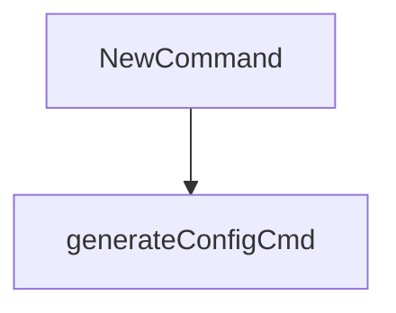

#### Function dependencies (Mermaid)
None – this function is currently not referenced elsewhere in the package.

#### Functions calling `NewCommand` (Mermaid)
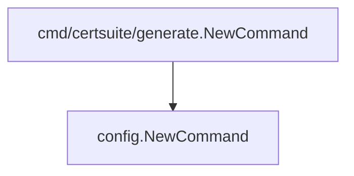

#### Usage example (Go)
```go
// Minimal example invoking NewCommand
package main

import (
    "github.com/redhat-best-practices-for-k8s/certsuite/cmd/certsuite/generate/config"
)

func main() {
    cmd := config.NewCommand()
    // cmd can now be added to a parent Cobra command or executed directly.
}
```

---

## Local Functions

### createCertSuiteResourcesConfiguration

**createCertSuiteResourcesConfiguration** - Presents an interactive menu allowing users to specify Kubernetes namespaces, pod/operator labels, CRD filters, and managed deployments/statefulsets for CertSuite runs.


#### Signature (Go)
```go
func createCertSuiteResourcesConfiguration()
```

#### Summary Table
| Aspect | Details |
|--------|---------|
| **Purpose** | Presents an interactive menu allowing users to specify Kubernetes namespaces, pod/operator labels, CRD filters, and managed deployments/statefulsets for CertSuite runs. |
| **Parameters** | None |
| **Return value** | None |
| **Key dependencies** | `strings.ReplaceAll`, `strings.ToLower`, `strings.Contains`; `promptui.Select` (interactive prompt); `log.Printf`; helper functions: `loadNamespaces`, `loadPodLabels`, `loadOperatorLabels`, `loadCRDfilters`, `loadManagedDeployments`, `loadManagedStatefulSets`; `getAnswer`. |
| **Side effects** | Modifies global configuration (`certsuiteConfig`) via the load* helpers; writes to stdout/stderr through prompts and logs. |
| **How it fits the package** | Invoked from `createConfiguration` when the user selects the “CertSuite Resources” option, enabling dynamic runtime configuration of what resources CertSuite will evaluate. |

#### Internal workflow (Mermaid)
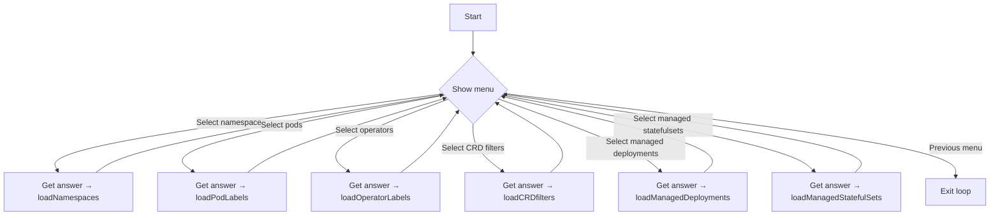

#### Function dependencies (Mermaid)
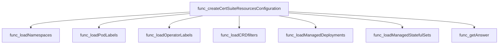

#### Functions calling `createCertSuiteResourcesConfiguration` (Mermaid)
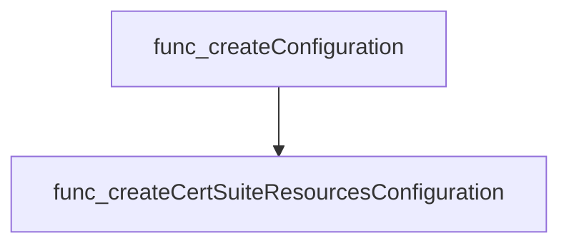

#### Usage example (Go)
```go
// The function is called indirectly by createConfiguration when the user selects
// the “CertSuite Resources” menu option. A direct call would simply launch the
// interactive prompt for configuring resources.

func main() {
    // Trigger configuration flow
    createConfiguration()
}
```

---

### createCollectorConfiguration

**createCollectorConfiguration** - Builds a command‑line UI for selecting a collector configuration option, looping until the user selects “previous menu” or an error occurs.


Creates an interactive prompt that lets the user choose a collector option from a predefined list and handles the selection loop until the user exits.

```go
func createCollectorConfiguration()
```

| Aspect | Details |
|--------|---------|
| **Purpose** | Builds a command‑line UI for selecting a collector configuration option, looping until the user selects “previous menu” or an error occurs. |
| **Parameters** | none |
| **Return value** | none (the function performs side effects only) |
| **Key dependencies** | `strings.ReplaceAll`, `strings.ToLower`, `strings.Contains`, `promptui.Select.Run`, `log.Printf` |
| **Side effects** | Reads user input via terminal, logs errors to stdout, and exits the loop based on user choice. No state is returned or modified outside its local scope. |
| **How it fits the package** | Part of the `config` subpackage that assembles configuration prompts; this function specifically handles collector‑related options within a generation workflow. |

#### Internal workflow

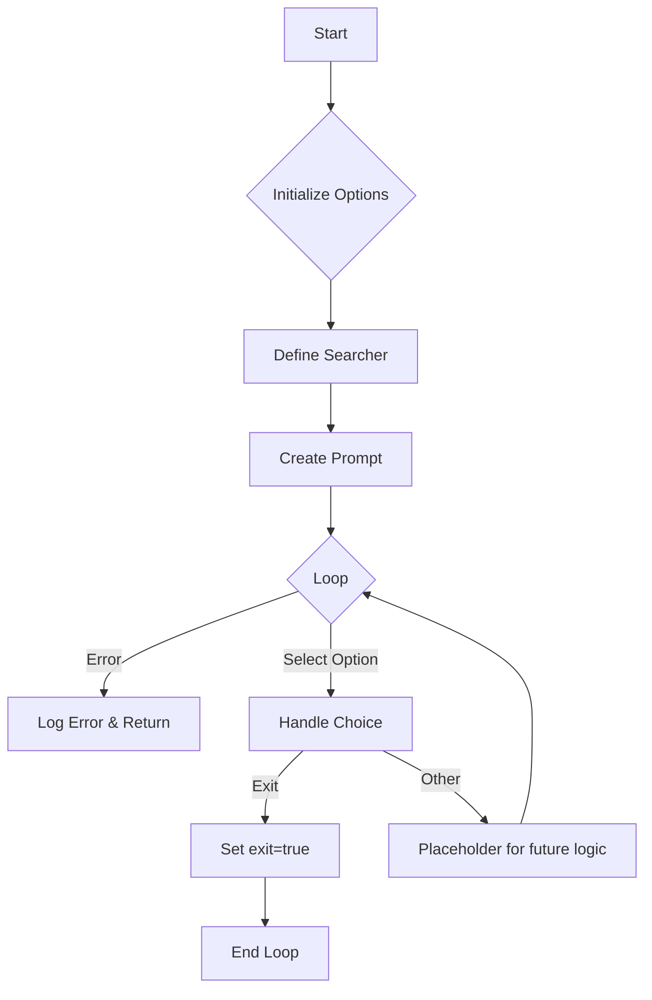

#### Function dependencies

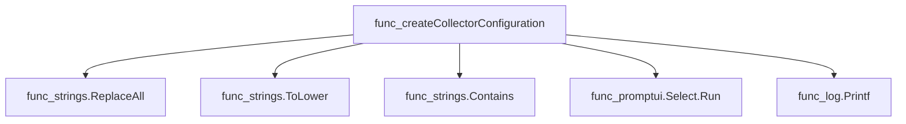

#### Functions calling `createCollectorConfiguration`

None – this function is currently not referenced elsewhere in the package.

#### Usage example

```go
// Minimal example invoking createCollectorConfiguration
func main() {
    // The function performs its work internally; no return value.
    createCollectorConfiguration()
}
```

---

### createConfiguration

**createConfiguration** - Launches an interactive prompt that lets users configure various sections of the CertSuite settings.


#### Signature (Go)
```go
func()()
```

#### Summary Table
| Aspect | Details |
|--------|---------|
| **Purpose** | Launches an interactive prompt that lets users configure various sections of the CertSuite settings. |
| **Parameters** | None |
| **Return value** | None |
| **Key dependencies** | - `promptui.Select` for user interaction<br>- `createCertSuiteResourcesConfiguration`<br>- `createExceptionsConfiguration`<br>- `createSettingsConfiguration` |
| **Side effects** | Displays prompts, updates global configuration state via the called section‑specific functions. |
| **How it fits the package** | Acts as the entry point for manual configuration within the *config* subpackage, invoked by the higher‑level `generateConfig` routine. |

#### Internal workflow (Mermaid)
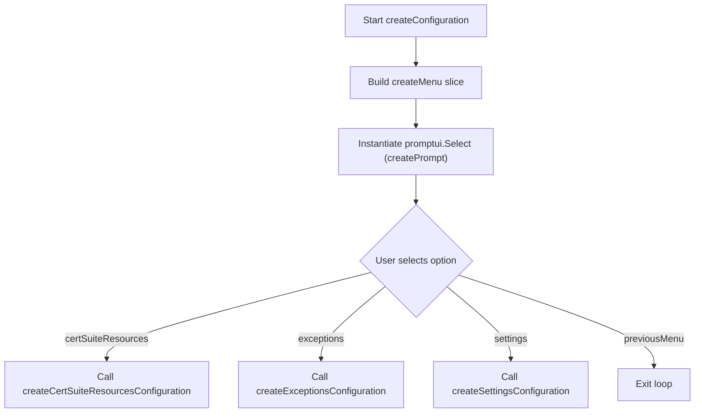

#### Function dependencies (Mermaid)
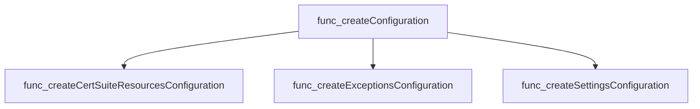

#### Functions calling `createConfiguration` (Mermaid)
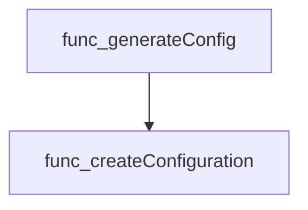

#### Usage example (Go)
```go
// Minimal example invoking createConfiguration
package main

import (
    "github.com/redhat-best-practices-for-k8s/certsuite/cmd/certsuite/generate/config"
)

func main() {
    // This will launch the interactive configuration menu.
    config.createConfiguration()
}
```

---

### createExceptionsConfiguration

**createExceptionsConfiguration** - Presents a prompt‑based interface that allows users to configure various exception lists (kernel taints, Helm charts, protocol names, services, non‑scalable deployments and stateful sets). Each selection triggers the loading of user input into the global configuration.


#### Signature (Go)
```go
func createExceptionsConfiguration()
```

#### Summary Table
| Aspect | Details |
|--------|---------|
| **Purpose** | Presents a prompt‑based interface that allows users to configure various exception lists (kernel taints, Helm charts, protocol names, services, non‑scalable deployments and stateful sets). Each selection triggers the loading of user input into the global configuration. |
| **Parameters** | None |
| **Return value** | None |
| **Key dependencies** | *`strings.ReplaceAll`, `strings.ToLower`, `strings.Contains`* – used for search filtering.<br>*`promptui.Select`* – drives the interactive menu.<br>*`log.Printf`* – error logging.<br>*`getAnswer`*, *`loadAcceptedKernelTaints`*, *`loadHelmCharts`*, *`loadProtocolNames`*, *`loadServices`*, *`loadNonScalableDeployments`*, *`loadNonScalableStatefulSets`* – functions invoked based on user selection. |
| **Side effects** | Mutates global configuration variables (`certsuiteConfig.*`) via the load functions.<br>Writes error messages to standard logging output.<br>Blocks execution until the user exits the menu loop. |
| **How it fits the package** | Part of the `config` sub‑package in the CertSuite command generator; it is called from `createConfiguration()` when the “exceptions” option is chosen, enabling end‑users to tailor exception rules for subsequent test runs. |

#### Internal workflow (Mermaid)
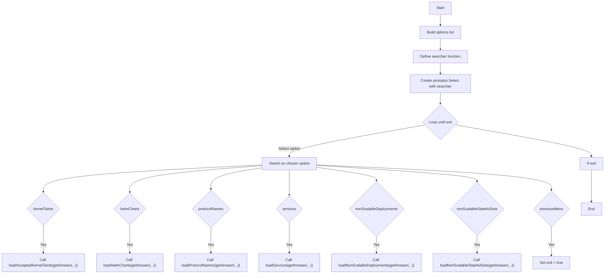

#### Function dependencies (Mermaid)
```mermaid
graph TD
  func_createExceptionsConfiguration --> strings.ReplaceAll
  func_createExceptionsConfiguration --> strings.ToLower
  func_createExceptionsConfiguration --> strings.Contains
  func_createExceptionsConfiguration --> promptui.Select
  func_createExceptionsConfiguration --> log.Printf
  func_createExceptionsConfiguration --> getAnswer
  func_createExceptionsConfiguration --> loadAcceptedKernelTaints
  func_createExceptionsConfiguration --> loadHelmCharts
  func_createExceptionsConfiguration --> loadProtocolNames
  func_createExceptionsConfiguration --> loadServices
  func_createExceptionsConfiguration --> loadNonScalableDeployments
  func_createExceptionsConfiguration --> loadNonScalableStatefulSets
```

#### Functions calling `createExceptionsConfiguration` (Mermaid)
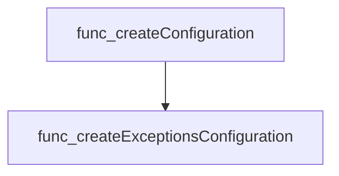

#### Usage example (Go)
```go
// Minimal example invoking createExceptionsConfiguration
func main() {
    // The function is normally called from the interactive menu system.
    // Here we call it directly to trigger the exceptions configuration flow.
    createExceptionsConfiguration()
}
```

---

### createSettingsConfiguration

**createSettingsConfiguration** - Presents an interactive prompt to configure runtime settings, currently only the Probe DaemonSet namespace.


#### Signature (Go)

```go
func createSettingsConfiguration()
```

#### Summary Table

| Aspect | Details |
|--------|---------|
| **Purpose** | Presents an interactive prompt to configure runtime settings, currently only the Probe DaemonSet namespace. |
| **Parameters** | None |
| **Return value** | None (side‑effects only) |
| **Key dependencies** | `promptui.Select`, `log.Printf`, `loadProbeDaemonSetNamespace`, `getAnswer` |
| **Side effects** | Reads user input, updates global configuration (`certsuiteConfig.ProbeDaemonSetNamespace`), logs errors. |
| **How it fits the package** | Part of a CLI wizard that builds a complete configuration; called from `createConfiguration`. |

#### Internal workflow (Mermaid)

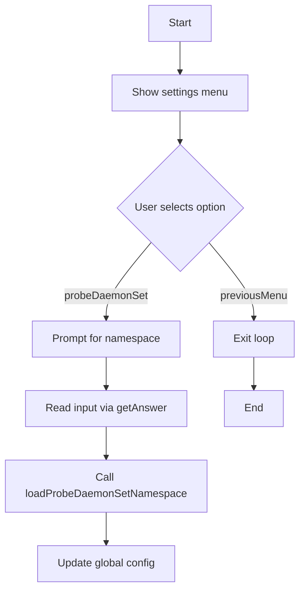

#### Function dependencies (Mermaid)

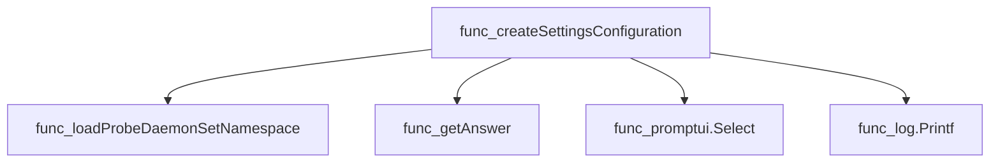

#### Functions calling `createSettingsConfiguration` (Mermaid)

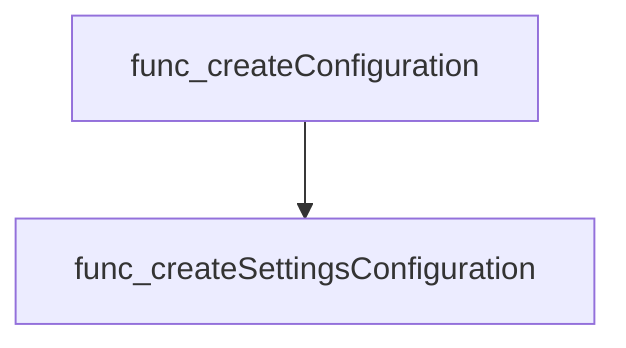

#### Usage example (Go)

```go
// Minimal example invoking createSettingsConfiguration
package main

import (
	"github.com/redhat-best-practices-for-k8s/certsuite/cmd/certsuite/generate/config"
)

func main() {
	// The function is part of a larger wizard; calling it directly will start the settings prompt.
	config.CreateSettingsConfiguration()
}
```

---

---

### generateConfig

**generateConfig** - Provides a command‑line interface that lets the user create, view or save a test configuration for Cert Suite.


#### 1) Signature (Go)

```go
func generateConfig()
```

#### 2) Summary Table

| Aspect | Details |
|--------|---------|
| **Purpose** | Provides a command‑line interface that lets the user create, view or save a test configuration for Cert Suite. |
| **Parameters** | None |
| **Return value** | None |
| **Key dependencies** | • `promptui.Select` – builds menu prompts.<br>• `log.Printf` – logs prompt errors.<br>• `createConfiguration`, `showConfiguration`, `saveConfiguration` – sub‑functions that perform the actual actions. |
| **Side effects** | Interacts with the terminal, writes log output, and modifies global configuration state (`certsuiteConfig`). |
| **How it fits the package** | Acts as the top‑level driver for the configuration sub‑command in the Cert Suite CLI. |

#### 3) Internal workflow (Mermaid)

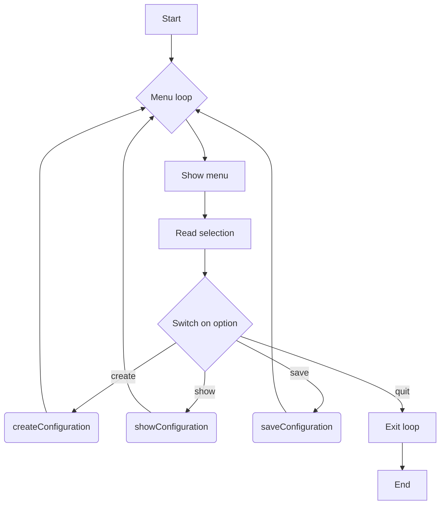

#### 4) Function dependencies (Mermaid)

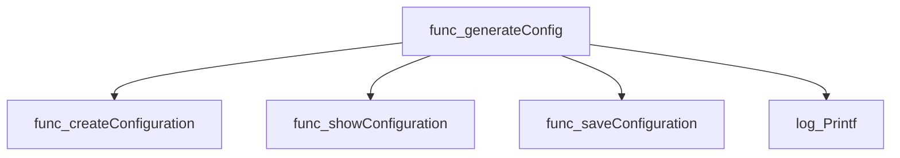

#### 5) Functions calling `generateConfig` (Mermaid)

None – this function is currently not referenced elsewhere in the package.

#### 6) Usage example (Go)

```go
// Minimal example invoking generateConfig
func main() {
    // The command line tool calls this during its configuration phase.
    generateConfig()
}
```

---

### getAnswer

**getAnswer** - Displays an interactive prompt with styled text, reads a line from standard input, splits it by commas into fields, trims whitespace, and returns the resulting slice.


```go
func getAnswer(prompt, syntax, example string) []string
```

| Aspect | Details |
|--------|---------|
| **Purpose** | Displays an interactive prompt with styled text, reads a line from standard input, splits it by commas into fields, trims whitespace, and returns the resulting slice. |
| **Parameters** | `prompt` (string) – question shown to the user; <br>`syntax` (string) – description of accepted syntax; <br>`example` (string) – example value for guidance |
| **Return value** | `[]string` – cleaned list of values entered by the user (or `nil` if input could not be read) |
| **Key dependencies** | • `github.com/fatih/color` (HiCyanString, CyanString, WhiteString)<br>• `fmt`<br>• `bufio.NewScanner`, `scanner.Scan()`, `scanner.Err()`<br>• `log.Printf`<br>• `strings.Split`, `strings.TrimSpace` |
| **Side effects** | Prints styled prompt to stdout; logs an error via the standard logger if input cannot be read. |
| **How it fits the package** | Central helper for interactive configuration of CertSuite resources, exceptions, and settings by converting user‑supplied CSV strings into slices that other loader functions consume. |

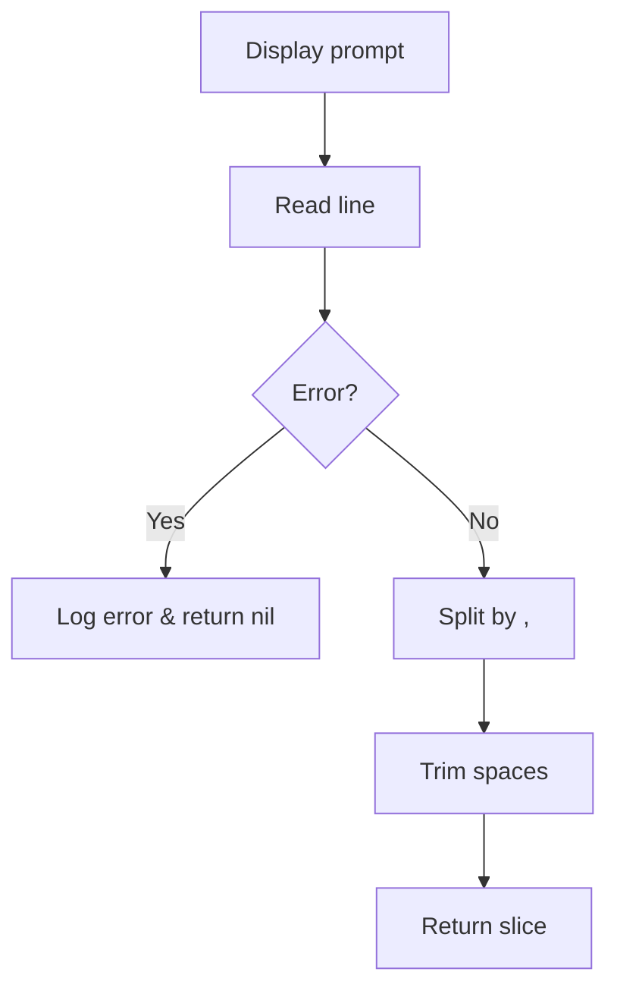

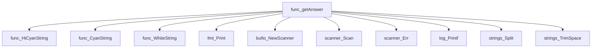

```mermaid
graph TD
  func_createCertSuiteResourcesConfiguration --> func_getAnswer
  func_createExceptionsConfiguration --> func_getAnswer
  func_createSettingsConfiguration --> func_getAnswer
```

#### Usage example

```go
// Minimal example invoking getAnswer
package main

import (
	"fmt"
	"github.com/redhat-best-practices-for-k8s/certsuite/cmd/certsuite/generate/config"
)

func main() {
	values := config.GetAnswer(
		"Enter comma‑separated namespaces:",
		"<namespace1>,<namespace2>",
		"myapp,prod",
	)
	fmt.Printf("You entered: %v\n", values)
}
```

*(Note: `GetAnswer` is unexported; the example assumes it is in the same package or exported for demonstration.)*

---

### loadAcceptedKernelTaints

**loadAcceptedKernelTaints** - Stores a list of accepted kernel taint names in the global `certsuiteConfig`.


#### Signature (Go)

```go
func loadAcceptedKernelTaints(taints []string)
```

#### Summary Table

| Aspect | Details |
|--------|---------|
| **Purpose** | Stores a list of accepted kernel taint names in the global `certsuiteConfig`. |
| **Parameters** | `taints []string` – slice of taint identifiers to be accepted. |
| **Return value** | None (side‑effect only). |
| **Key dependencies** | • `append` <br>• `configuration.AcceptedKernelTaintsInfo` <br>• global variable `certsuiteConfig.AcceptedKernelTaints` |
| **Side effects** | Mutates the slice `certsuiteConfig.AcceptedKernelTaints`; clears previous entries. |
| **How it fits the package** | Part of the interactive configuration wizard; called when the user selects kernel taints to accept. |

#### Internal workflow (Mermaid)

```mermaid
flowchart TD
  A["Receive taint list"] --> B{"Clear existing config"}
  B --> C["Iterate over each taint"]
  C --> D["Create AcceptedKernelTaintsInfo struct"]
  D --> E["Append to certsuiteConfig.AcceptedKernelTaints"]
```

#### Function dependencies (Mermaid)

```mermaid
graph TD
  func_loadAcceptedKernelTaints --> append
```

#### Functions calling `loadAcceptedKernelTaints` (Mermaid)

```mermaid
graph TD
  func_createExceptionsConfiguration --> func_loadAcceptedKernelTaints
```

#### Usage example (Go)

```go
// Minimal example invoking loadAcceptedKernelTaints
func main() {
    // Example taints entered by the user
    taints := []string{"NoSchedule", "PreferNoExecute"}
    loadAcceptedKernelTaints(taints)
}
```

---

### loadCRDfilters

**loadCRDfilters** - Parses user‑supplied CRD filter strings, converts them into `CrdFilter` objects, and stores them in the global configuration.


#### Signature (Go)
```go
func([]string)()
```

#### Summary Table
| Aspect | Details |
|--------|---------|
| **Purpose** | Parses user‑supplied CRD filter strings, converts them into `CrdFilter` objects, and stores them in the global configuration. |
| **Parameters** | `crdFilters []string` – each element is of the form `"name/scalable"`, where *scalable* is a boolean string (`"true"`/`"false"`). |
| **Return value** | None (updates package‑level state). |
| **Key dependencies** | • `strings.Split`<br>• `strconv.ParseBool`<br>• `log.Printf`<br>• `append`<br>• `configuration.CrdFilter` struct from the configuration package. |
| **Side effects** | 1. Resets `certsuiteConfig.CrdFilters` to an empty slice.<br>2. Logs a message if a filter cannot be parsed and aborts further processing.<br>3. Populates `certsuiteConfig.CrdFilters` with new entries. |
| **How it fits the package** | Called during interactive configuration to capture CRD filtering options that influence subsequent certificate suite generation. |

#### Internal workflow (Mermaid)
```mermaid
flowchart TD
  A["Start"] --> B{"Iterate over crdFilters"}
  B --> C["Split string by /"]
  C --> D["Extract name and scalable part"]
  D --> E["Parse scalable to bool"]
  E -->|"Error"| F["Log error & exit"]
  E --> G["Create CrdFilter struct"]
  G --> H["Append to certsuiteConfig.CrdFilters"]
  H --> B
```

#### Function dependencies (Mermaid)
```mermaid
graph TD
  func_loadCRDfilters --> func_strings_Split
  func_loadCRDfilters --> func_strconv_ParseBool
  func_loadCRDfilters --> func_log_Printf
  func_loadCRDfilters --> func_append
  func_loadCRDfilters --> configuration_CrdFilter
```

#### Functions calling `loadCRDfilters` (Mermaid)
```mermaid
graph TD
  func_createCertSuiteResourcesConfiguration --> func_loadCRDfilters
```

#### Usage example (Go)
```go
// Minimal example invoking loadCRDfilters
func main() {
    // Example input: filter "deployment/true" means use only CRDs with suffix "deployment" that are scalable.
    filters := []string{"deployment/true", "service/false"}
    loadCRDfilters(filters)

    // certsuiteConfig.CrdFilters is now populated and can be inspected.
}
```

---

### loadHelmCharts

**loadHelmCharts** - Populates the global configuration with a list of Helm chart names that should be excluded from scanning.


#### 1) Signature (Go)

```go
func loadHelmCharts(helmCharts []string)
```

#### 2) Summary Table

| Aspect | Details |
|--------|---------|
| **Purpose** | Populates the global configuration with a list of Helm chart names that should be excluded from scanning. |
| **Parameters** | `helmCharts []string –` slice of chart names entered by the user. |
| **Return value** | None (void). |
| **Key dependencies** | • `append` function<br>• `configuration.SkipHelmChartList` type<br>• Global variable `certsuiteConfig.SkipHelmChartList` |
| **Side effects** | Resets and then mutates the global slice `certsuiteConfig.SkipHelmChartList`. No external I/O. |
| **How it fits the package** | Called from the interactive configuration routine to capture user‑specified Helm chart exclusions for later use during scan generation. |

#### 3) Internal workflow (Mermaid)

```mermaid
flowchart TD
    A["Start"] --> B{"Reset SkipHelmChartList"}
    B --> C["Iterate over helmCharts"]
    C --> D["Create SkipHelmChartList entry"]
    D --> E["Append to certsuiteConfig.SkipHelmChartList"]
    E --> F["End"]
```

#### 4) Function dependencies (Mermaid)

```mermaid
graph TD
  func_loadHelmCharts --> append
```

#### 5) Functions calling `loadHelmCharts` (Mermaid)

```mermaid
graph TD
  func_createExceptionsConfiguration --> func_loadHelmCharts
```

#### 6) Usage example (Go)

```go
// Minimal example invoking loadHelmCharts
func main() {
    charts := []string{"nginx", "redis"}
    loadHelmCharts(charts)
}
```

---

### loadManagedDeployments

**loadManagedDeployments** - Populates the global configuration with user‑supplied managed deployment names, resetting any previous entries.


#### Signature (Go)

```go
func loadManagedDeployments([]string)
```

#### Summary Table

| Aspect | Details |
|--------|---------|
| **Purpose** | Populates the global configuration with user‑supplied managed deployment names, resetting any previous entries. |
| **Parameters** | `deployments []string` – slice of deployment identifiers to be recorded. |
| **Return value** | None (the function modifies a package‑level variable). |
| **Key dependencies** | • Calls the built‑in `append` function to build a slice of `configuration.ManagedDeploymentsStatefulsets`. <br>• Relies on the global `certsuiteConfig` struct from the same package. |
| **Side effects** | Overwrites `certsuiteConfig.ManagedDeployments`, causing state mutation that other parts of the program will read later. No I/O or concurrency occurs. |
| **How it fits the package** | Part of an interactive configuration builder; invoked when a user selects "managed deployments" from the prompt menu to capture their choices into the cert‑suite configuration. |

#### Internal workflow (Mermaid)

```mermaid
flowchart TD
  A["Start"] --> B{"Reset ManagedDeployments"}
  B --> C["Loop over input slice"]
  C --> D["Create ManagedDeploymentsStatefulsets{Name: deployment}"]
  D --> E["Append to certsuiteConfig.ManagedDeployments"]
  E --> F["End"]
```

#### Function dependencies (Mermaid)

```mermaid
graph TD
  func_loadManagedDeployments --> func_append
```

#### Functions calling `loadManagedDeployments` (Mermaid)

```mermaid
graph TD
  func_createCertSuiteResourcesConfiguration --> func_loadManagedDeployments
```

#### Usage example (Go)

```go
// Minimal example invoking loadManagedDeployments
deployments := []string{"nginx-deploy", "redis-operator"}
loadManagedDeployments(deployments)
```

---

### loadManagedStatefulSets

**loadManagedStatefulSets** - Stores a list of StatefulSet names that should be considered managed by CertSuite. The function clears any existing entries and replaces them with the supplied slice.


#### 1) Signature (Go)

```go
func loadManagedStatefulSets(statefulSets []string)
```

#### 2) Summary Table

| Aspect | Details |
|--------|---------|
| **Purpose** | Stores a list of StatefulSet names that should be considered managed by CertSuite. The function clears any existing entries and replaces them with the supplied slice. |
| **Parameters** | `statefulSets []string` – Slice containing the names of StatefulSets to manage. |
| **Return value** | None (void). Modifies package‑level configuration state. |
| **Key dependencies** | • Calls the built‑in `append` function.<br>• Relies on the global variable `certsuiteConfig`. |
| **Side effects** | * Resets `certsuiteConfig.ManagedStatefulsets` to an empty slice.<br>* Appends new entries, each wrapped in a `configuration.ManagedDeploymentsStatefulsets` struct. |
| **How it fits the package** | Part of the interactive configuration wizard; invoked when the user selects “managed StatefulSets” from the resource picker. It updates the runtime config used later to generate cert‑suite resources. |

#### 3) Internal workflow (Mermaid)

```mermaid
flowchart TD
    A["Start"] --> B{"Clear existing list"}
    B --> C["Iterate over input slice"]
    C --> D["Create ManagedDeploymentsStatefulsets struct"]
    D --> E["Append to certsuiteConfig.ManagedStatefulsets"]
    E --> F["End"]
```

#### 4) Function dependencies (Mermaid)

```mermaid
graph TD
    func_loadManagedStatefulSets --> append
```

#### 5) Functions calling `loadManagedStatefulSets` (Mermaid)

```mermaid
graph TD
    createCertSuiteResourcesConfiguration --> loadManagedStatefulSets
```

#### 6) Usage example (Go)

```go
// Minimal example invoking loadManagedStatefulSets
import "github.com/redhat-best-practices-for-k8s/certsuite/cmd/certsuite/generate/config"

func main() {
    // Suppose the user entered these StatefulSet names:
    statefulSets := []string{"redis", "mongo"}

    // Load them into the configuration
    config.loadManagedStatefulSets(statefulSets)

    // certsuiteConfig.ManagedStatefulsets now contains two entries.
}
```

---

---

### loadNamespaces

**loadNamespaces** - Builds a slice of `configuration.Namespace` objects from raw namespace strings and assigns it to `certsuiteConfig.TargetNameSpaces`.

Collects a list of namespace names, converts them into the package’s configuration type, and stores them in the global configuration object.

#### Signature (Go)
```go
func loadNamespaces(namespaces []string)
```

#### Summary Table
| Aspect | Details |
|--------|---------|
| **Purpose** | Builds a slice of `configuration.Namespace` objects from raw namespace strings and assigns it to `certsuiteConfig.TargetNameSpaces`. |
| **Parameters** | `namespaces []string – list of namespace names entered by the user.` |
| **Return value** | None. |
| **Key dependencies** | • `append` (built‑in) <br>• `configuration.Namespace` type <br>• global `certsuiteConfig` variable |
| **Side effects** | Mutates the global `certsuiteConfig.TargetNameSpaces`; no I/O or concurrency. |
| **How it fits the package** | Used by the interactive configuration flow to record which namespaces should be scanned for certificates. |

#### Internal workflow (Mermaid)
```mermaid
flowchart TD
  A["Start"] --> B["Clear certsuiteConfig.TargetNameSpaces"]
  B --> C{"Iterate over input slice"}
  C -->|"For each namespace"| D["Create configuration.Namespace"]
  D --> E["Append to certsuiteConfig.TargetNameSpaces"]
  E --> F["Finish"]
```

#### Function dependencies (Mermaid)
```mermaid
graph TD
  func_loadNamespaces --> func_append
```

#### Functions calling `loadNamespaces` (Mermaid)
```mermaid
graph TD
  func_createCertSuiteResourcesConfiguration --> func_loadNamespaces
```

#### Usage example (Go)
```go
// Minimal example invoking loadNamespaces
namespaces := []string{"default", "kube-system"}
loadNamespaces(namespaces)
// certsuiteConfig.TargetNameSpaces now contains two Namespace entries.
```

---

### loadNonScalableDeployments

**loadNonScalableDeployments** - Parses a slice of strings describing non‑scalable deployments and populates the global configuration with structured objects for later use.


#### 1️⃣ Signature (Go)

```go
func loadNonScalableDeployments(nonScalableDeployments []string)
```

#### 2️⃣ Summary Table

| Aspect | Details |
|--------|---------|
| **Purpose** | Parses a slice of strings describing non‑scalable deployments and populates the global configuration with structured objects for later use. |
| **Parameters** | `nonScalableDeployments []string` – each element is expected to be in the format `"name/namespace"`. |
| **Return value** | None (the function mutates package‑level state). |
| **Key dependencies** | • `strings.Split`, <br>• `len`, <br>• `log.Println`, <br>• `append` on a slice. |
| **Side effects** | • Resets `certsuiteConfig.SkipScalingTestDeployments` to nil.<br>• Appends parsed deployment info to that slice.<br>• Logs an error and aborts parsing if any entry is malformed. |
| **How it fits the package** | Used by the interactive configuration builder (`createExceptionsConfiguration`) to store user‑provided exceptions for scaling tests. |

#### 3️⃣ Internal workflow (Mermaid)

```mermaid
flowchart TD
    A["Start"] --> B{"Reset config slice"}
    B --> C["Iterate over input strings"]
    C --> D{"Split by /"}
    D -->|"valid"| E["Extract name & namespace"]
    E --> F["Create SkipScalingTestDeploymentsInfo"]
    F --> G["Append to config slice"]
    D -->|"invalid"| H["Log error & exit"]
    G --> I["Continue loop"]
    I --> J{"Loop finished?"}
    J -->|"yes"| K["End"]
```

#### 4️⃣ Function dependencies (Mermaid)

```mermaid
graph TD
  func_loadNonScalableDeployments --> strings.Split
  func_loadNonScalableDeployments --> len
  func_loadNonScalableDeployments --> log.Println
  func_loadNonScalableDeployments --> append
```

#### 5️⃣ Functions calling `loadNonScalableDeployments` (Mermaid)

```mermaid
graph TD
  func_createExceptionsConfiguration --> func_loadNonScalableDeployments
```

#### 6️⃣ Usage example (Go)

```go
// Minimal example invoking loadNonScalableDeployments
package main

import (
    "github.com/redhat-best-practices-for-k8s/certsuite/cmd/certsuite/generate/config"
)

func main() {
    // Example input: deployments that should be skipped during scaling tests.
    nonScalable := []string{
        "frontend/production",
        "backend/testing",
    }

    config.loadNonScalableDeployments(nonScalable)
}
```

---

### loadNonScalableStatefulSets

**loadNonScalableStatefulSets** - Parses a slice of strings describing StatefulSets that should not be subjected to scaling tests and stores them in the global configuration. Each string is expected to contain `name/namespace`.


#### Signature (Go)

```go
func loadNonScalableStatefulSets(nonScalableStatefulSets []string)
```

#### Summary Table

| Aspect | Details |
|--------|---------|
| **Purpose** | Parses a slice of strings describing StatefulSets that should not be subjected to scaling tests and stores them in the global configuration. Each string is expected to contain `name/namespace`. |
| **Parameters** | `nonScalableStatefulSets []string` – list of identifiers in `"name/namespace"` format. |
| **Return value** | none (updates shared state). |
| **Key dependencies** | • `strings.Split` – split each entry on `/`. <br>• `len` – validate field count.<br>• `log.Println` – error logging for malformed entries.<br>• `append` – add parsed objects to the configuration slice. |
| **Side effects** | Mutates the global variable `certsuiteConfig.SkipScalingTestStatefulSets`, overwriting any previous value and appending new items. Logs a message if an entry cannot be parsed. |
| **How it fits the package** | Part of the interactive configuration flow; called from `createExceptionsConfiguration` when the user selects the “Non‑Scalable StatefulSets” option. It populates the set of StatefulSets that will bypass scaling tests during certsuite execution. |

#### Internal workflow (Mermaid)

```mermaid
flowchart TD
  A["Start"] --> B{"Reset SkipScalingTestStatefulSets"}
  B --> C["Iterate over input slice"]
  C --> D["Split entry on /"]
  D --> E{"Check field count == 2"}
  E -- No --> F["Log error & exit loop"]
  E -- Yes --> G["Create SkipScalingTestStatefulSetsInfo"]
  G --> H["Append to config.SkipScalingTestStatefulSets"]
  H --> C
  C --> I["End"]
```

#### Function dependencies (Mermaid)

```mermaid
graph TD
  func_loadNonScalableStatefulSets --> strings.Split
  func_loadNonScalableStatefulSets --> log.Println
  func_loadNonScalableStatefulSets --> append
```

#### Functions calling `loadNonScalableStatefulSets` (Mermaid)

```mermaid
graph TD
  func_createExceptionsConfiguration --> func_loadNonScalableStatefulSets
```

#### Usage example (Go)

```go
// Minimal example invoking loadNonScalableStatefulSets
import (
    "github.com/redhat-best-practices-for-k8s/certsuite/cmd/certsuite/generate/config"
)

func main() {
    // Example entries: "my-app/default" and "db-prod/production"
    inputs := []string{"my-app/default", "db-prod/production"}
    config.loadNonScalableStatefulSets(inputs)
}
```

---

---

### loadOperatorLabels

**loadOperatorLabels** - Stores a slice of operator label strings into the global configuration, replacing any existing list.


#### Signature (Go)
```go
func loadOperatorLabels(operatorLabels []string)
```

#### Summary Table
| Aspect | Details |
|--------|---------|
| **Purpose** | Stores a slice of operator label strings into the global configuration, replacing any existing list. |
| **Parameters** | `operatorLabels []string` – The new set of labels to apply to operators under test. |
| **Return value** | None (void). |
| **Key dependencies** | * `certsuiteConfig` – a package‑level variable holding the current configuration. |
| **Side effects** | Mutates the global `certsuiteConfig.OperatorsUnderTestLabels` field; no I/O or concurrency actions. |
| **How it fits the package** | Used by the interactive prompt workflow to update operator labels after user input, ensuring subsequent resource generation uses the latest values. |

#### Internal workflow (Mermaid)
```mermaid
flowchart TD
  A["Receive slice of labels"] --> B["Clear existing config"]
  B --> C["Assign new labels to certsuiteConfig.OperatorsUnderTestLabels"]
```

#### Function dependencies (Mermaid)
None – this function is currently not referenced elsewhere in the package.

#### Functions calling `loadOperatorLabels` (Mermaid)
```mermaid
graph TD
  func_createCertSuiteResourcesConfiguration --> func_loadOperatorLabels
```

#### Usage example (Go)
```go
// Minimal example invoking loadOperatorLabels
labels := []string{"app=nginx", "tier=backend"}
loadOperatorLabels(labels)
// certsuiteConfig.OperatorsUnderTestLabels now contains the provided labels
```

---

### loadPodLabels

**loadPodLabels** - Stores a list of pod labels to be used as filters when selecting pods under test. It replaces any previously stored label set with the new slice.


#### Signature (Go)

```go
func loadPodLabels(podLabels []string)
```

#### Summary Table

| Aspect | Details |
|--------|---------|
| **Purpose** | Stores a list of pod labels to be used as filters when selecting pods under test. It replaces any previously stored label set with the new slice. |
| **Parameters** | `podLabels []string` – a slice containing pod label selectors (e.g., `"app=web"`, `"tier=frontend"`). |
| **Return value** | None. The function mutates global configuration state. |
| **Key dependencies** | • `certsuiteConfig.PodsUnderTestLabels` – the global configuration struct field that holds pod labels. |
| **Side effects** | Updates the global `certsuiteConfig.PodsUnderTestLabels` slice; no I/O or concurrency is involved. |
| **How it fits the package** | Part of the interactive CLI for building a certificate suite configuration; invoked when the user selects the “Pods” option in the resource picker. |

#### Internal workflow (Mermaid)

```mermaid
flowchart TD
  A["Start"] --> B["Clear existing pod labels"]
  B --> C["Assign new podLabels slice to config"]
  C --> D["End"]
```

#### Function dependencies

None – this function is currently not referenced elsewhere in the package.

#### Functions calling `loadPodLabels` (Mermaid)

```mermaid
graph TD
  func_createCertSuiteResourcesConfiguration --> func_loadPodLabels
```

#### Usage example (Go)

```go
// Minimal example invoking loadPodLabels
package main

import (
	"github.com/redhat-best-practices-for-k8s/certsuite/cmd/certsuite/generate/config"
)

func main() {
	labels := []string{"app=web", "tier=frontend"}
	config.LoadPodLabels(labels) // Note: the function is unexported; in real usage it is called from within the same package.
}
```

> **Note:** `loadPodLabels` is an unexported helper, so external packages cannot call it directly. It is used internally during the interactive configuration process.

---

### loadProbeDaemonSetNamespace

**loadProbeDaemonSetNamespace** - Persists the first element of a string slice as the namespace used by the Probe DaemonSet in the global configuration.


```go
func loadProbeDaemonSetNamespace(namespace []string)
```

| Aspect | Details |
|--------|---------|
| **Purpose** | Persists the first element of a string slice as the namespace used by the Probe DaemonSet in the global configuration. |
| **Parameters** | `namespace []string` – list of namespaces provided by the user; only the first entry is considered. |
| **Return value** | None (void). |
| **Key dependencies** | Assigns to the exported variable `certsuiteConfig.ProbeDaemonSetNamespace`. |
| **Side effects** | Mutates the global configuration state; no I/O or concurrency operations occur. |
| **How it fits the package** | Part of an interactive CLI that gathers settings from the user and writes them into the shared configuration used to generate Kubernetes manifests. |

#### Internal workflow
```mermaid
flowchart TD
  A["Receive namespace slice"] -->|"set"| B["certsuiteConfig.ProbeDaemonSetNamespace = namespace["0"]"]
```

#### Function dependencies
None – this function is currently not referenced elsewhere in the package.

#### Functions calling `loadProbeDaemonSetNamespace`
```mermaid
graph TD
  func_createSettingsConfiguration --> func_loadProbeDaemonSetNamespace
```

#### Usage example (Go)
```go
// Minimal example invoking loadProbeDaemonSetNamespace
func main() {
    // Simulate user selecting a namespace
    selected := []string{"my-namespace"}
    loadProbeDaemonSetNamespace(selected)

    fmt.Println(certsuiteConfig.ProbeDaemonSetNamespace) // Output: my-namespace
}
```

---

### loadProtocolNames

**loadProtocolNames** - Replaces the current set of valid protocol names in `certsuiteConfig` with a new list supplied by the caller.


#### Signature (Go)
```go
func loadProtocolNames(protocolNames []string) 
```

#### Summary Table
| Aspect | Details |
|--------|---------|
| **Purpose** | Replaces the current set of valid protocol names in `certsuiteConfig` with a new list supplied by the caller. |
| **Parameters** | *protocolNames* []string – slice containing the protocol names to be accepted by the suite. |
| **Return value** | None. The function performs an assignment and has no return values. |
| **Key dependencies** | - `certsuiteConfig.ValidProtocolNames` (global configuration variable). |
| **Side effects** | Mutates the global configuration state; does not perform I/O or launch goroutines. |
| **How it fits the package** | Part of the interactive configuration builder that collects user‑supplied options and updates the shared configuration object used by subsequent generation logic. |

#### Internal workflow (Mermaid)
```mermaid
flowchart TD
  A["Receive protocolNames slice"] --> B["Clear certsuiteConfig.ValidProtocolNames"]
  B --> C["Assign new slice to certsuiteConfig.ValidProtocolNames"]
```

#### Function dependencies (Mermaid)

None – this function is currently not referenced elsewhere in the package.

#### Functions calling `loadProtocolNames` (Mermaid)
```mermaid
graph TD
  func_createExceptionsConfiguration --> func_loadProtocolNames
```

#### Usage example (Go)
```go
// Minimal example invoking loadProtocolNames
import (
    “fmt”
)

func main() {
    // Example list of protocol names to accept
    protocols := []string{“http”, “https”, “tcp”}

    // Load them into the configuration
    loadProtocolNames(protocols)

    // Verify that they were set
    fmt.Println(certsuiteConfig.ValidProtocolNames)
}
```

---

### loadServices

**loadServices** - Stores the supplied list of service names in the global configuration, resetting any previous ignore list.


#### 1. Signature (Go)
```go
func loadServices(services []string)
```

#### 2. Summary Table
| Aspect | Details |
|--------|---------|
| **Purpose** | Stores the supplied list of service names in the global configuration, resetting any previous ignore list. |
| **Parameters** | `services []string` – slice of service names to be ignored during generation. |
| **Return value** | None (void). |
| **Key dependencies** | - Direct assignment to `certsuiteConfig.ServicesIgnoreList`. |
| **Side effects** | Mutates the global `certsuiteConfig.ServicesIgnoreList` variable; no I/O or concurrency. |
| **How it fits the package** | Used by the interactive configuration flow to set which services should be excluded from certificate generation. |

#### 3. Internal workflow (Mermaid)
```mermaid
flowchart TD
  subgraph Load Services
    A["Start"] --> B{"Reset Ignore List"}
    B --> C["Assign New List"]
    C --> D["End"]
  end
```

#### 4. Function dependencies (Mermaid)

None – this function is currently not referenced elsewhere in the package.

#### 5. Functions calling `loadServices` (Mermaid)
```mermaid
graph TD
  func_createExceptionsConfiguration --> func_loadServices
```

#### 6. Usage example (Go)
```go
// Minimal example invoking loadServices
servicesToIgnore := []string{"kube-system", "metrics-server"}
loadServices(servicesToIgnore)
// certsuiteConfig.ServicesIgnoreList now contains the two services
```

---

### saveConfiguration

**saveConfiguration** - Serialises the current `TestConfiguration`, prompts the user for an output file name, and writes the YAML to that file.


#### Signature (Go)
```go
func (*configuration.TestConfiguration)()
```

#### Summary Table
| Aspect | Details |
|--------|---------|
| **Purpose** | Serialises the current `TestConfiguration`, prompts the user for an output file name, and writes the YAML to that file. |
| **Parameters** | `config *configuration.TestConfiguration` – the configuration instance to be saved. |
| **Return value** | None (the function performs side‑effects only). |
| **Key dependencies** | • `yaml.Marshal` – converts the struct to YAML<br>• `promptui.Prompt.Run` – obtains file name from user<br>• `os.WriteFile` – writes data to disk<br>• `log.Printf`, `fmt.Println`, `color.GreenString` – provide user feedback |
| **Side effects** | • Writes a YAML file to the filesystem.<br>• Prints status messages to standard output and error streams. |
| **How it fits the package** | Called from the interactive menu in `generateConfig`; allows users to persist their current configuration for later use or sharing. |

#### Internal workflow (Mermaid)
```mermaid
flowchart TD
  A["Start"] --> B["Marshal config to YAML"]
  B --> C{"Error?"}
  C -- Yes --> D["Log error & exit"]
  C -- No --> E["Prompt user for file name"]
  E --> F{"Error?"}
  F -- Yes --> G["Log prompt error & exit"]
  F -- No --> H["Write YAML to file"]
  H --> I{"Error?"}
  I -- Yes --> J["Log write error & exit"]
  I -- No --> K["Print success message"]
  K --> L["End"]
```

#### Function dependencies (Mermaid)
```mermaid
graph TD
  func_saveConfiguration --> yaml.Marshal
  func_saveConfiguration --> log.Printf
  func_saveConfiguration --> promptui.Prompt.Run
  func_saveConfiguration --> os.WriteFile
  func_saveConfiguration --> fmt.Println
  func_saveConfiguration --> color.GreenString
```

#### Functions calling `saveConfiguration` (Mermaid)
```mermaid
graph TD
  func_generateConfig --> func_saveConfiguration
```

#### Usage example (Go)
```go
// Minimal example invoking saveConfiguration
package main

import (
    "github.com/redhat-best-practices-for-k8s/certsuite/cmd/certsuite/generate/config"
    configuration "github.com/redhat-best-practices-for-k8s/certsuite/cmd/certsuite/generate/configuration"
)

func main() {
    cfg := &configuration.TestConfiguration{
        // populate fields as needed
    }
    config.Save(cfg) // internally calls saveConfiguration via the public wrapper if available
}
```

---

### showConfiguration

**showConfiguration** - Renders the current `TestConfiguration` as a pretty‑printed YAML string and writes it to standard output.


#### Signature (Go)

```go
func(*configuration.TestConfiguration)()
```

#### Summary Table

| Aspect | Details |
|--------|---------|
| **Purpose** | Renders the current `TestConfiguration` as a pretty‑printed YAML string and writes it to standard output. |
| **Parameters** | `<config> *configuration.TestConfiguration` – pointer to the configuration instance to display. |
| **Return value** | None. |
| **Key dependencies** | • `yaml.Marshal` (gopkg.in/yaml.v2) <br>• `log.Printf` (standard library) <br>• `fmt.Println` (standard library) <br>• `string` conversion of YAML bytes |
| **Side effects** | Writes to stdout; logs an error if marshaling fails. No mutation of the input configuration. |
| **How it fits the package** | Used by the interactive CLI menu (`generateConfig`) to allow users to view the current configuration before saving or modifying it. |

#### Internal workflow (Mermaid)

```mermaid
flowchart TD
  A["Start"] --> B{"Marshal config"}
  B -- success --> C["Convert bytes → string"]
  C --> D["Print header"]
  D --> E["Print YAML"]
  E --> F["Print footer"]
  B -- failure --> G["Log error"]
```

#### Function dependencies (Mermaid)

```mermaid
graph TD
  func_showConfiguration --> yaml.Marshal
  func_showConfiguration --> log.Printf
  func_showConfiguration --> fmt.Println
  func_showConfiguration --> string
```

#### Functions calling `showConfiguration` (Mermaid)

```mermaid
graph TD
  func_generateConfig --> func_showConfiguration
```

#### Usage example (Go)

```go
// Minimal example invoking showConfiguration
package main

import (
	"github.com/redhat-best-practices-for-k8s/certsuite/cmd/certsuite/generate/config"
	"gitlab.com/example/project/configuration"
)

func main() {
	cfg := &configuration.TestConfiguration{
		Name:  "example",
		Value: "demo",
	}
	config.showConfiguration(cfg)
}
```

---

