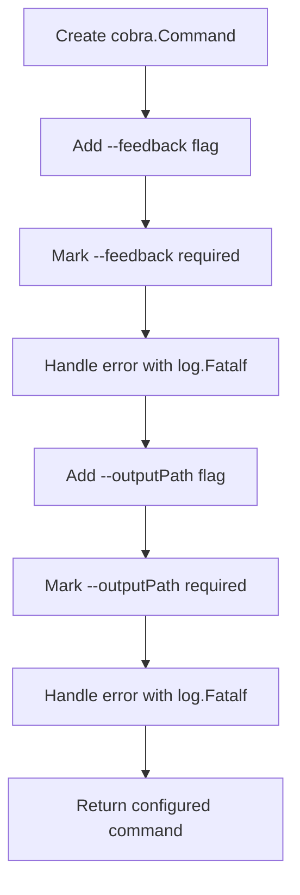
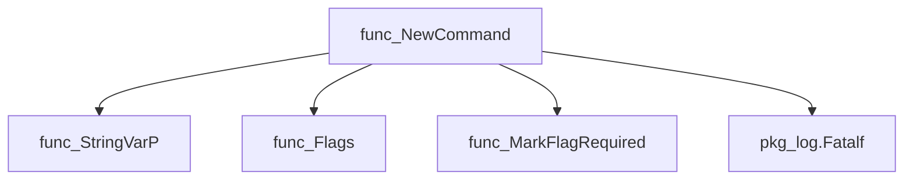
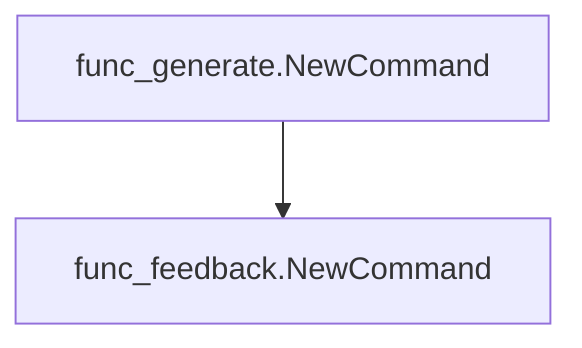
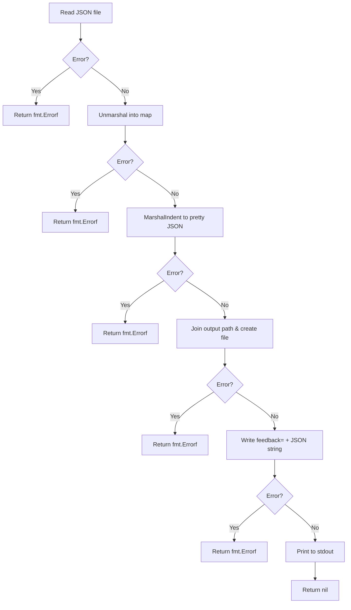
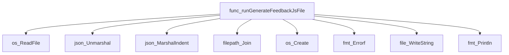

# Package feedback

**Path**: `cmd/certsuite/generate/feedback`

## Table of Contents

- [Overview](#overview)
- [Exported Functions](#exported-functions)
  - [NewCommand](#newcommand)
- [Local Functions](#local-functions)
  - [runGenerateFeedbackJsFile](#rungeneratefeedbackjsfile)

## Overview

The feedback package provides a Cobra‑based CLI command that reads a JSON file containing user feedback and emits a JavaScript file suitable for inclusion in the CertSuite web UI.

### Key Features

- Creates a ‘generate‑feedback’ command with required flags for input and output paths
- Parses the JSON source, pretty‑prints it as JavaScript prefixed by `feedback=`
- Writes the resulting script to the specified directory while also printing it to stdout

### Design Notes

- The package relies on Cobra for flag handling and command structure; callers must invoke NewCommand to register it
- Error reporting is performed via fmt.Errorf, with fatal errors logged using log.Fatalf during option validation
- The runGenerateFeedbackJsFile function is intentionally unexported; it is used as the RunE handler of the command

### Exported Functions Summary

| Name | Purpose |
|------|----------|
| [func NewCommand() *cobra.Command](#newcommand) | Builds a CLI command named “generate‑feedback” that reads a JSON feedback source and writes a JavaScript file for use in the CertSuite web UI. |

### Local Functions Summary

| Name | Purpose |
|------|----------|
| [func runGenerateFeedbackJsFile(_ *cobra.Command, _ []string) error](#rungeneratefeedbackjsfile) | Reads a JSON feedback file, pretty‑prints its contents as JavaScript by prefixing with `feedback=`, writes the result to `feedback.js` in the output directory, and prints it to stdout. |

## Exported Functions

### NewCommand

**NewCommand** - Builds a CLI command named “generate‑feedback” that reads a JSON feedback source and writes a JavaScript file for use in the CertSuite web UI.


Creates and configures the Cobra command that generates a `feedback.js` file from a provided `feedback.json`.

#### Signature (Go)
```go
func NewCommand() *cobra.Command
```

#### Summary Table
| Aspect | Details |
|--------|---------|
| **Purpose** | Builds a CLI command named “generate‑feedback” that reads a JSON feedback source and writes a JavaScript file for use in the CertSuite web UI. |
| **Parameters** | None |
| **Return value** | A fully‑initialized `*cobra.Command` ready to be added to a parent command tree. |
| **Key dependencies** | • `github.com/spf13/cobra` (command creation, flag handling)  <br>• `log.Fatalf` from the standard library for error reporting |
| **Side effects** | Registers required flags (`--feedback`, `-f`; `--outputPath`, `-o`) on the command and validates them; logs fatal errors if flag marking fails. No external I/O occurs at construction time. |
| **How it fits the package** | The function is the public entry point for the *feedback* sub‑command within the CertSuite generate CLI. It is invoked by the top‑level `generate.NewCommand` to compose the full command hierarchy. |

#### Internal workflow (Mermaid)


#### Function dependencies (Mermaid)


#### Functions calling `NewCommand` (Mermaid)


#### Usage example (Go)
```go
// Minimal example invoking NewCommand
package main

import (
	"github.com/redhat-best-practices-for-k8s/certsuite/cmd/certsuite/generate/feedback"
)

func main() {
	cmd := feedback.NewCommand()
	if err := cmd.Execute(); err != nil {
		panic(err)
	}
}
```

---

## Local Functions

### runGenerateFeedbackJsFile

**runGenerateFeedbackJsFile** - Reads a JSON feedback file, pretty‑prints its contents as JavaScript by prefixing with `feedback=`, writes the result to `feedback.js` in the output directory, and prints it to stdout.


#### 1) Signature (Go)

```go
func runGenerateFeedbackJsFile(_ *cobra.Command, _ []string) error
```

#### 2) Summary Table

| Aspect | Details |
|--------|---------|
| **Purpose** | Reads a JSON feedback file, pretty‑prints its contents as JavaScript by prefixing with `feedback=`, writes the result to `feedback.js` in the output directory, and prints it to stdout. |
| **Parameters** | `_ *cobra.Command` – command context (unused); `<- []string>` – command arguments (unused). |
| **Return value** | `error` – nil on success; otherwise an error describing any I/O or JSON processing failure. |
| **Key dependencies** | • `os.ReadFile`, `os.Create`, `file.WriteString` – file I/O<br>• `encoding/json.Unmarshal`, `encoding/json.MarshalIndent` – JSON parsing/formatting<br>• `fmt.Errorf`, `fmt.Println` – error handling and output<br>• `path/filepath.Join` – path construction |
| **Side effects** | • Creates or overwrites `<feedbackOutputPath>/feedback.js`. <br>• Writes the JavaScript content to that file. <br>• Prints the same content to stdout. |
| **How it fits the package** | Part of the `generate/feedback` sub‑command; transforms stored JSON feedback into a form usable by client‑side scripts. |

#### 3) Internal workflow (Mermaid)



#### 4) Function dependencies (Mermaid)



#### 5) Functions calling `runGenerateFeedbackJsFile` (Mermaid)

None – this function is currently not referenced elsewhere in the package.

#### 6) Usage example (Go)

```go
// Minimal example invoking runGenerateFeedbackJsFile
package main

import (
	"github.com/redhat-best-practices-for-k8s/certsuite/cmd/certsuite/generate/feedback"
	"github.com/spf13/cobra"
)

func main() {
	cmd := &cobra.Command{}
	if err := feedback.runGenerateFeedbackJsFile(cmd, nil); err != nil {
		panic(err)
	}
}
```

---

---

