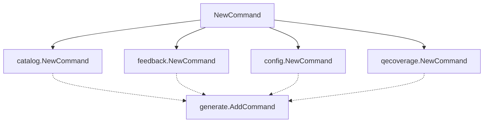
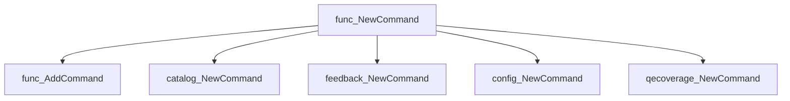
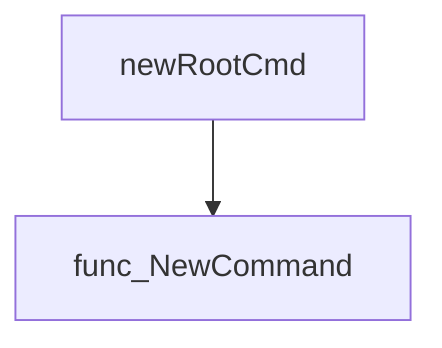

# Package generate

**Path**: `cmd/certsuite/generate`

## Table of Contents

- [Overview](#overview)
- [Exported Functions](#exported-functions)
  - [NewCommand](#newcommand)

## Overview

The generate package builds a top‑level Cobra command that groups all generation subcommands used by the certsuite CLI.

### Key Features

- Creates a single entry point for multiple generation tasks (catalog, feedback, config, qe_coverage).
- Uses Cobra to provide standard command-line flags and help output.
- Organises generation logic into separate packages for modularity.

### Design Notes

- Assumes internal use within the certsuite binary; no exported structs.
- Does not expose configuration beyond subcommand flags—limitations if external integration is needed.
- Best practice: call NewCommand from the root command builder to register all generate actions.

### Exported Functions Summary

| Name | Purpose |
|------|----------|
| [func NewCommand() *cobra.Command](#newcommand) | Constructs and returns a Cobra command that aggregates all sub‑commands for the *generate* feature set. |

## Exported Functions

### NewCommand

**NewCommand** - Constructs and returns a Cobra command that aggregates all sub‑commands for the *generate* feature set.


#### Signature (Go)

```go
func NewCommand() *cobra.Command
```

#### Summary Table

| Aspect | Details |
|--------|---------|
| **Purpose** | Constructs and returns a Cobra command that aggregates all sub‑commands for the *generate* feature set. |
| **Parameters** | None |
| **Return value** | `*cobra.Command` – the root *generate* command ready to be added to the CLI tree. |
| **Key dependencies** | • `generate.AddCommand(catalog.NewCommand())`<br>• `generate.AddCommand(feedback.NewCommand())`<br>• `generate.AddCommand(config.NewCommand())`<br>• `generate.AddCommand(qecoverage.NewCommand())` |
| **Side effects** | Adds the sub‑commands to the local `generate` command instance. No external I/O or global state changes occur. |
| **How it fits the package** | Acts as the entry point for all *generate* related actions, wiring together catalog generation, feedback file creation, configuration exports, and QE coverage reporting. |

#### Internal workflow (Mermaid)



#### Function dependencies (Mermaid)



#### Functions calling `NewCommand` (Mermaid)



#### Usage example (Go)

```go
// Minimal example invoking NewCommand
package main

import (
	"github.com/redhat-best-practices-for-k8s/certsuite/cmd/certsuite/generate"
)

func main() {
	generateCmd := generate.NewCommand()
	// The returned command can now be added to a root command or executed directly.
}
```

---

