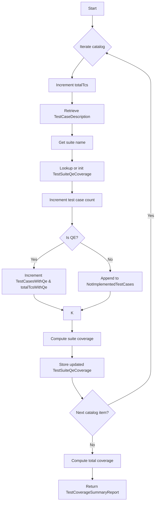
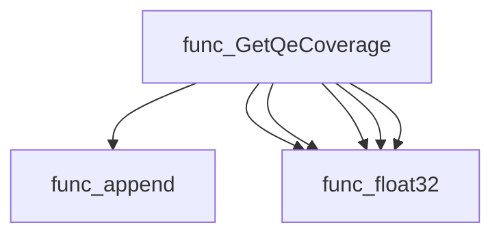
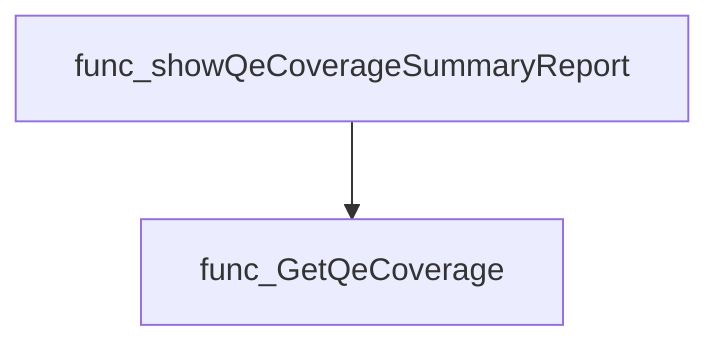
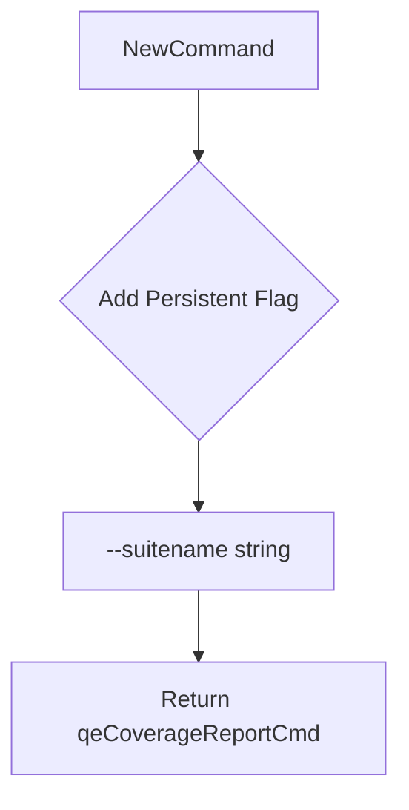
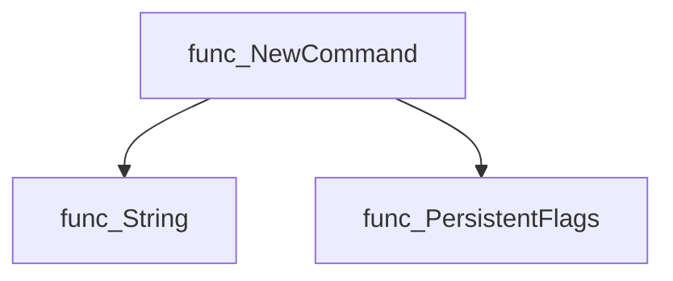
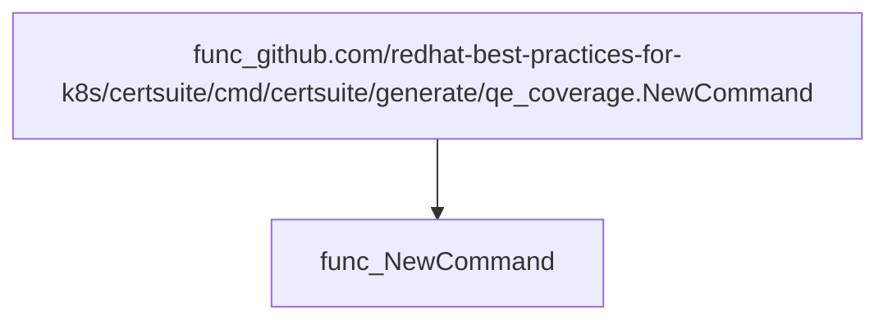
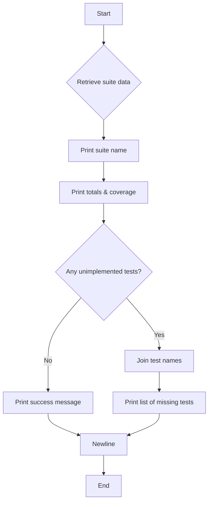
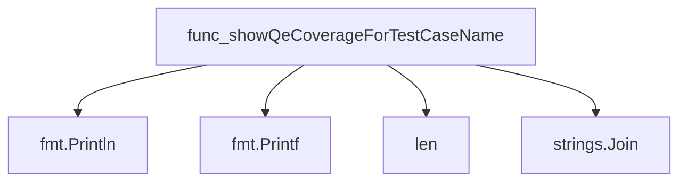
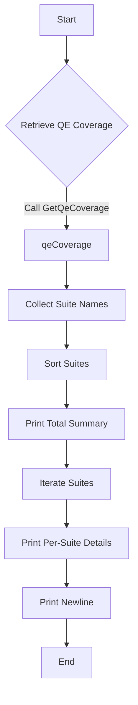
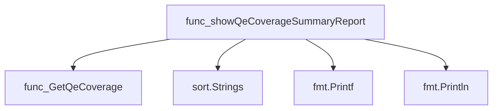

# Package qecoverage

**Path**: `cmd/certsuite/generate/qe_coverage`

## Table of Contents

- [Overview](#overview)
- [Structs](#structs)
  - [TestCoverageSummaryReport](#testcoveragesummaryreport)
  - [TestSuiteQeCoverage](#testsuiteqecoverage)
- [Exported Functions](#exported-functions)
  - [GetQeCoverage](#getqecoverage)
  - [NewCommand](#newcommand)
- [Local Functions](#local-functions)
  - [showQeCoverageForTestCaseName](#showqecoveragefortestcasename)
  - [showQeCoverageSummaryReport](#showqecoveragesummaryreport)

## Overview

Provides a command‑line tool for reporting which test cases in a catalog are covered by QE (Quality Engineering) and summarises coverage statistics per suite and overall.

### Key Features

- Aggregates QE coverage across all catalog test cases into structured summary reports
- Outputs human‑readable coverage details for individual suites or the entire catalog
- Integrates with Cobra to expose a CLI command that accepts suite selection via flags

### Design Notes

- Coverage data is derived from claim identifiers; assumes each test case has a unique identifier and optional QE implementation flag
- The report generation sorts suites alphabetically for deterministic output, but does not handle missing coverage data gracefully – unknown entries are omitted
- Best practice: invoke `NewCommand()` during CLI initialization so the command appears under the generate sub‑command

### Structs Summary

| Name | Purpose |
|------|----------|
| [**TestCoverageSummaryReport**](#testcoveragesummaryreport) | One-line purpose |
| [**TestSuiteQeCoverage**](#testsuiteqecoverage) | One-line purpose |

### Exported Functions Summary

| Name | Purpose |
|------|----------|
| [func GetQeCoverage(catalog map[claim.Identifier]claim.TestCaseDescription) TestCoverageSummaryReport](#getqecoverage) | Aggregates QE coverage metrics across all test cases in a catalog, producing per‑suite and overall statistics. |
| [func NewCommand() *cobra.Command](#newcommand) | Constructs and configures a `*cobra.Command` that reports which tests are not covered by QE for a specified suite. |

### Local Functions Summary

| Name | Purpose |
|------|----------|
| [func showQeCoverageForTestCaseName(suiteName string, qeCoverage TestCoverageSummaryReport)](#showqecoveragefortestcasename) | Outputs a human‑readable report detailing the number of test cases, overall QE coverage percentage, and any unimplemented tests for the specified suite. |
| [func showQeCoverageSummaryReport()](#showqecoveragesummaryreport) | Computes test‑suite level QE coverage from the catalog, orders suites alphabetically, and outputs a formatted summary to stdout. |

## Structs

### TestCoverageSummaryReport

A summary of quality‑engineering (QE) coverage for a catalog of test cases.

#### Fields

| Field | Type | Description |
|-------|------|-------------|
| `CoverageByTestSuite` | `map[string]TestSuiteQeCoverage` | Mapping from each test suite name to its QE coverage details. Each entry contains the number of test cases, how many are QE‑covered, unimplemented ones, and the calculated percentage. |
| `TotalCoveragePercentage` | `float32` | Overall QE coverage across all suites, expressed as a percentage (0–100). Calculated as `multiplier * (totalTcsWithQe / totalTcs)`. |
| `TestCasesTotal` | `int` | Total number of test cases processed from the catalog. |
| `TestCasesWithQe` | `int` | Count of test cases that are marked as QE‑covered (`tcDescription.Qe == true`). |

#### Purpose

This struct aggregates coverage data after scanning a collection of test case descriptions. It enables downstream reporting and diagnostics by providing both per‑suite metrics and an overall summary, facilitating quick identification of suites lacking QE support.

#### Related functions

| Function | Purpose |
|----------|---------|
| `GetQeCoverage` | Builds a `TestCoverageSummaryReport` from a catalog of test cases, computing per‑suite and total coverage statistics. |
| `showQeCoverageForTestCaseName` | Prints human‑readable QE coverage information for a specific suite using the data stored in a `TestCoverageSummaryReport`. |

---

---

### TestSuiteQeCoverage

A container that holds metrics about the quality‑engine coverage of a test suite.

| Field | Type | Description |
|-------|------|-------------|
| `TestCases` | `int` | Total number of test cases defined in the suite. |
| `TestCasesWithQe` | `int` | Number of those test cases that have been annotated or linked to quality‑engine (QE) data. |
| `Coverage` | `float32` | Proportion of QE‑linked test cases relative to the total, expressed as a decimal between 0 and 1. |
| `NotImplementedTestCases` | `[]string` | Slice containing identifiers of test cases that are present in the suite but lack any QE implementation or coverage data. |

#### Purpose

The `TestSuiteQeCoverage` struct aggregates coverage information for a single test suite. It is used to report how many tests have corresponding quality‑engine records, calculate overall coverage percentage, and list those tests that remain unimplemented from a QE perspective.

#### Related functions (if any)

| Function | Purpose |
|----------|---------|
| *None* | No specific functions are defined in the provided context. |

---

---

## Exported Functions

### GetQeCoverage

**GetQeCoverage** - Aggregates QE coverage metrics across all test cases in a catalog, producing per‑suite and overall statistics.

#### 1) Signature (Go)

```go
func GetQeCoverage(catalog map[claim.Identifier]claim.TestCaseDescription) TestCoverageSummaryReport
```

#### 2) Summary Table

| Aspect | Details |
|--------|---------|
| **Purpose** | Aggregates QE coverage metrics across all test cases in a catalog, producing per‑suite and overall statistics. |
| **Parameters** | `catalog map[claim.Identifier]claim.TestCaseDescription` – mapping of claim identifiers to their descriptions (including whether the test case is QE‑enabled). |
| **Return value** | `TestCoverageSummaryReport` – contains coverage percentages per suite, total coverage, and counts of test cases with/without QE. |
| **Key dependencies** | • `append` (slice append)<br>• `float32` conversion<br>• `multiplier` constant (implicit in the package) |
| **Side effects** | None – purely functional; only reads input map and returns a new struct. |
| **How it fits the package** | Serves as the core calculation routine for generating QE coverage reports used by CLI utilities such as `showQeCoverageSummaryReport`. |

#### 3) Internal workflow (Mermaid)



#### 4) Function dependencies (Mermaid)



#### 5) Functions calling `GetQeCoverage` (Mermaid)



#### 6) Usage example (Go)

```go
// Minimal example invoking GetQeCoverage
import (
    "github.com/redhat-best-practices-for-k8s/certsuite/cmd/certsuite/generate/qe_coverage"
    "github.com/redhat-best-practices-for-k8s/certsuite/claim"
)

func main() {
    // Assume identifiers.Catalog is a pre‑populated map[claim.Identifier]claim.TestCaseDescription
    coverageReport := qe_coverage.GetQeCoverage(identifiers.Catalog)
    
    fmt.Printf("Total QE Coverage: %.2f%%\n", coverageReport.TotalCoveragePercentage)
}
```

---

### NewCommand

**NewCommand** - Constructs and configures a `*cobra.Command` that reports which tests are not covered by QE for a specified suite.

#### 1. Signature (Go)

```go
func NewCommand() *cobra.Command
```

#### 2. Summary Table

| Aspect | Details |
|--------|---------|
| **Purpose** | Constructs and configures a `*cobra.Command` that reports which tests are not covered by QE for a specified suite. |
| **Parameters** | None |
| **Return value** | A pointer to the configured `cobra.Command`. |
| **Key dependencies** | *Calls `qeCoverageReportCmd.PersistentFlags().String(...)` to add a `--suitename` flag.<br>* Relies on the global `qeCoverageReportCmd` variable (defined elsewhere in the package). |
| **Side effects** | Mutates the command’s persistent flags; no external I/O or concurrency. |
| **How it fits the package** | Provides the entry point for the QE coverage sub‑command, which is added to the main generate command tree. |

#### 3. Internal workflow (Mermaid)



#### 4. Function dependencies (Mermaid)



#### 5. Functions calling `NewCommand` (Mermaid)



#### 6. Usage example (Go)

```go
// Minimal example invoking NewCommand
package main

import (
 "github.com/redhat-best-practices-for-k8s/certsuite/cmd/certsuite/generate/qe_coverage"
)

func main() {
 cmd := qe_coverage.NewCommand()
 // cmd can now be added to a root command or executed directly.
}
```

---

## Local Functions

### showQeCoverageForTestCaseName

**showQeCoverageForTestCaseName** - Outputs a human‑readable report detailing the number of test cases, overall QE coverage percentage, and any unimplemented tests for the specified suite.

```go
func showQeCoverageForTestCaseName(suiteName string, qeCoverage TestCoverageSummaryReport)
```

| Aspect | Details |
|--------|---------|
| **Purpose** | Outputs a human‑readable report detailing the number of test cases, overall QE coverage percentage, and any unimplemented tests for the specified suite. |
| **Parameters** | `suiteName string –` name of the test suite to report.<br>`qeCoverage TestCoverageSummaryReport –` aggregated coverage data that contains per‑suite statistics. |
| **Return value** | None (void). |
| **Key dependencies** | • `fmt.Println`, `fmt.Printf`<br>• `len` (builtin)<br>• `strings.Join` |
| **Side effects** | Writes formatted text to standard output; no state mutation beyond printing. |
| **How it fits the package** | Acts as a helper for the QE coverage generator, formatting and displaying results for individual test suites. |

#### Internal workflow



#### Function dependencies



#### Functions calling `showQeCoverageForTestCaseName`

None – this function is currently not referenced elsewhere in the package.

#### Usage example (Go)

```go
// Minimal example invoking showQeCoverageForTestCaseName
package main

import (
    "github.com/redhat-best-practices-for-k8s/certsuite/cmd/certsuite/generate/qe_coverage"
)

func main() {
    // Assume we have a populated TestCoverageSummaryReport named report.
    var report qe_coverage.TestCoverageSummaryReport
    // Populate report with data as required by the application.

    // Show coverage for a specific suite
    qe_coverage.showQeCoverageForTestCaseName("MySuite", report)
}
```

---

### showQeCoverageSummaryReport

**showQeCoverageSummaryReport** - Computes test‑suite level QE coverage from the catalog, orders suites alphabetically, and outputs a formatted summary to stdout.

#### Signature (Go)

```go
func showQeCoverageSummaryReport()
```

#### Summary Table

| Aspect | Details |
|--------|---------|
| **Purpose** | Computes test‑suite level QE coverage from the catalog, orders suites alphabetically, and outputs a formatted summary to stdout. |
| **Parameters** | None |
| **Return value** | None |
| **Key dependencies** | • `GetQeCoverage` (from same package)  <br>• `sort.Strings` (standard library)  <br>• `fmt.Printf`, `fmt.Println` (standard library)  <br>• `identifiers.Catalog` (global catalog of test cases) |
| **Side effects** | Writes formatted text to standard output; no state mutation. |
| **How it fits the package** | Helper that displays the QE coverage data generated by `GetQeCoverage`, used during command‑line execution of the certificate suite generator. |

#### Internal workflow (Mermaid)



#### Function dependencies (Mermaid)



#### Functions calling `showQeCoverageSummaryReport` (Mermaid)

None – this function is currently not referenced elsewhere in the package.

#### Usage example (Go)

```go
// Minimal example invoking showQeCoverageSummaryReport
func main() {
    // Assuming identifiers.Catalog has been populated elsewhere
    showQeCoverageSummaryReport()
}
```

---
