# Package info

**Path**: `cmd/certsuite/info`

## Table of Contents

- [Overview](#overview)
- [Exported Functions](#exported-functions)
  - [NewCommand](#newcommand)
- [Local Functions](#local-functions)
  - [adjustLineMaxWidth](#adjustlinemaxwidth)
  - [getMatchingTestIDs](#getmatchingtestids)
  - [getTestDescriptionsFromTestIDs](#gettestdescriptionsfromtestids)
  - [printTestCaseInfoBox](#printtestcaseinfobox)
  - [printTestList](#printtestlist)
  - [showInfo](#showinfo)

## Overview

The `info` package supplies the ``certsuite info`` command that displays metadata about test cases from the internal catalog. It can list matching test IDs or render a colored information box for each case.

### Key Features

- Provides persistent flags to filter tests by label expression and toggle detailed display
- Automatically adapts terminal width to keep output boxes readable
- Formats output with colors, alignment, and word‑wrapping for clear presentation

### Design Notes

- Assumes the presence of an internal checks database; errors are returned if loading fails
- Limits line width based on current terminal size plus a configurable padding
- Best practice: invoke via ``certsuite info`` after ensuring the catalog is initialized

### Exported Functions Summary

| Name | Purpose |
|------|----------|
| [func NewCommand() *cobra.Command](#newcommand) | Builds and returns a configured `*cobra.Command` that displays information about test cases. It sets up persistent flags, enforces required flags, and handles error reporting. |

### Local Functions Summary

| Name | Purpose |
|------|----------|
| [func adjustLineMaxWidth()](#adjustlinemaxwidth) | Determines the current terminal width and, if it is smaller than the pre‑set maximum line length plus padding, reduces `lineMaxWidth` so that output boxes fit comfortably. |
| [func getMatchingTestIDs(labelExpr string) ([]string, error)](#getmatchingtestids) | Builds a list of internal test‑case IDs whose labels satisfy the supplied expression. |
| [func getTestDescriptionsFromTestIDs([]string) []claim.TestCaseDescription](#gettestdescriptionsfromtestids) | Looks up each provided test‑case ID in the global `identifiers.Catalog` and collects the corresponding `claim.TestCaseDescription` objects. |
| [func printTestCaseInfoBox(testCase *claim.TestCaseDescription)](#printtestcaseinfobox) | Renders a visually distinct box in the terminal containing the identifier, description, remediation, exceptions, and best‑practice reference of a test case. The output is colorized and wrapped to fit the current console width. |
| [func printTestList(testIDs []string)](#printtestlist) | Outputs a neatly bordered table listing each supplied test ID. |
| [func showInfo(cmd *cobra.Command, _ []string) error](#showinfo) | Retrieves test case identifiers that match a label expression, optionally prints a list of them, or shows a formatted information box for each matched test case. |

## Exported Functions

### NewCommand

**NewCommand** - Builds and returns a configured `*cobra.Command` that displays information about test cases. It sets up persistent flags, enforces required flags, and handles error reporting.

#### 1) Signature (Go)

```go
func NewCommand() *cobra.Command
```

#### 2) Summary Table

| Aspect | Details |
|--------|---------|
| **Purpose** | Builds and returns a configured `*cobra.Command` that displays information about test cases. It sets up persistent flags, enforces required flags, and handles error reporting. |
| **Parameters** | None |
| **Return value** | A pointer to the constructed `cobra.Command`. Returns `nil` if flag registration fails. |
| **Key dependencies** | • `infoCmd.PersistentFlags().StringP`, `BoolP` – define flags<br>• `infoCmd.MarkPersistentFlagRequired` – makes “test-label” mandatory<br>• `fmt.Fprintf(os.Stderr, …)` – error output on failure |
| **Side effects** | Registers persistent command‑line flags and writes to standard error if flag marking fails. No other global state is modified. |
| **How it fits the package** | Provides the CLI entry point for the *info* sub‑command; used by `newRootCmd` to add the command to the root command tree. |

#### 3) Internal workflow (Mermaid)

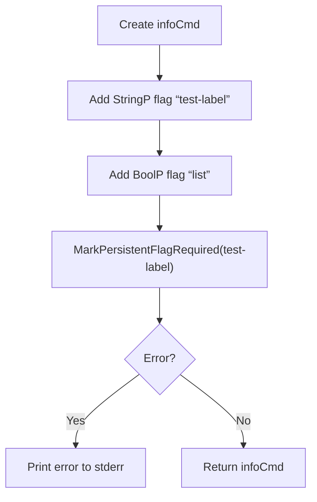

#### 4) Function dependencies (Mermaid)

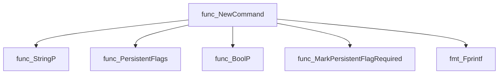

#### 5) Functions calling `NewCommand` (Mermaid)

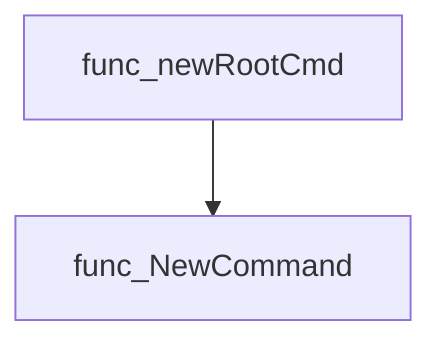

#### 6) Usage example (Go)

```go
// Minimal example invoking NewCommand
package main

import (
 "github.com/redhat-best-practices-for-k8s/certsuite/cmd/certsuite/info"
)

func main() {
 cmd := info.NewCommand()
 if cmd == nil {
  return // handle error if needed
 }
 _ = cmd.Execute() // run the command (in real usage, part of a larger CLI)
}
```

---

## Local Functions

### adjustLineMaxWidth

**adjustLineMaxWidth** - Determines the current terminal width and, if it is smaller than the pre‑set maximum line length plus padding, reduces `lineMaxWidth` so that output boxes fit comfortably.

#### Signature (Go)

```go
func adjustLineMaxWidth()
```

#### Summary Table

| Aspect | Details |
|--------|---------|
| **Purpose** | Determines the current terminal width and, if it is smaller than the pre‑set maximum line length plus padding, reduces `lineMaxWidth` so that output boxes fit comfortably. |
| **Parameters** | None |
| **Return value** | None (void) |
| **Key dependencies** | *Calls* <br>• `golang.org/x/term.IsTerminal(0)` – checks if stdout is a terminal.<br>• `golang.org/x/term.GetSize(0)` – retrieves the current terminal width. |
| **Side effects** | Mutates the package‑level variable `lineMaxWidth` based on terminal size; may early‑return without changes if not a terminal or an error occurs. No I/O beyond querying terminal properties. |
| **How it fits the package** | Adjusts formatting parameters before printing test case information boxes in `showInfo`. Ensures that box content does not exceed the visible terminal width, improving readability on smaller terminals. |

#### Internal workflow (Mermaid)

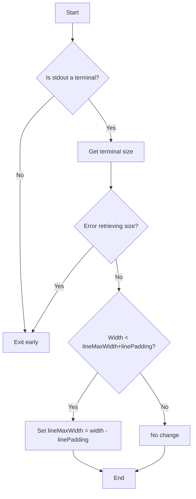

#### Function dependencies (Mermaid)

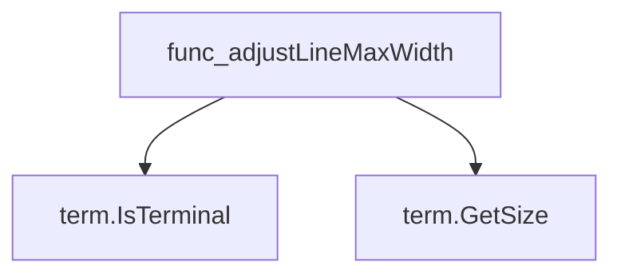

#### Functions calling `adjustLineMaxWidth` (Mermaid)

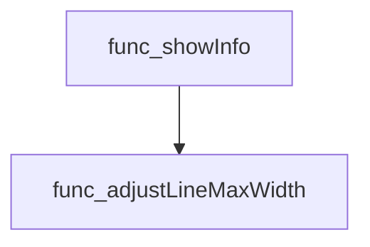

#### Usage example (Go)

```go
// Minimal example invoking adjustLineMaxWidth
package main

import (
 "github.com/redhat-best-practices-for-k8s/certsuite/cmd/certsuite/info"
)

func main() {
 info.adjustLineMaxWidth()
}
```

---

### getMatchingTestIDs

**getMatchingTestIDs** - Builds a list of internal test‑case IDs whose labels satisfy the supplied expression.

#### Signature (Go)

```go
func getMatchingTestIDs(labelExpr string) ([]string, error)
```

#### Summary Table

| Aspect | Details |
|--------|---------|
| **Purpose** | Builds a list of internal test‑case IDs whose labels satisfy the supplied expression. |
| **Parameters** | `labelExpr` – A label filter expressed as a string (e.g., `"all"`, `"security,network"`). |
| **Return value** | `[]string` – Matching test‑case identifiers; `error` if initialization or filtering fails. |
| **Key dependencies** | • `checksdb.InitLabelsExprEvaluator(labelExpr)`<br>• `certsuite.LoadInternalChecksDB()`<br>• `checksdb.FilterCheckIDs()` |
| **Side effects** | • Configures the global label evaluator used by `checksdb`. <br>• Loads all internal check definitions into memory. No I/O or concurrency beyond those functions. |
| **How it fits the package** | Used by command‑line utilities to filter and display test cases based on user‑supplied labels. |

#### Internal workflow (Mermaid)

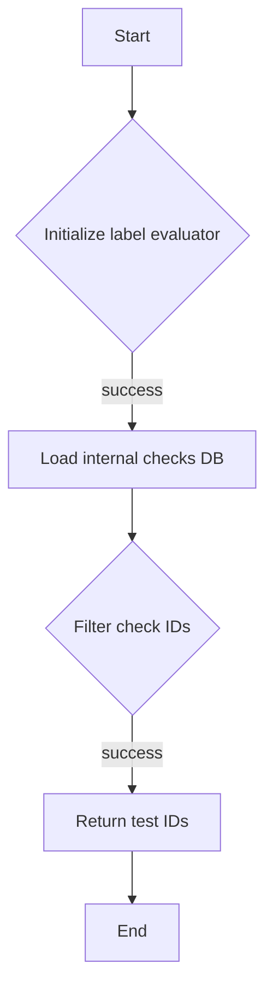

#### Function dependencies (Mermaid)

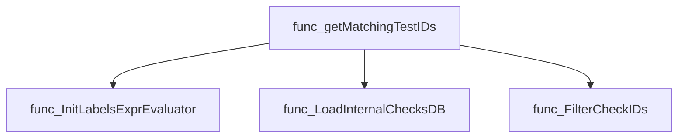

#### Functions calling `getMatchingTestIDs` (Mermaid)

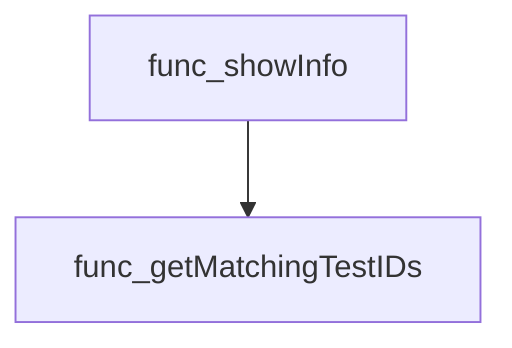

#### Usage example (Go)

```go
// Minimal example invoking getMatchingTestIDs
package main

import (
 "fmt"

 "github.com/redhat-best-practices-for-k8s/certsuite/cmd/certsuite/info"
)

func main() {
 testIDs, err := info.getMatchingTestIDs("security")
 if err != nil {
  fmt.Printf("Error: %v\n", err)
  return
 }
 for _, id := range testIDs {
  fmt.Println(id)
 }
}
```

---

---

### getTestDescriptionsFromTestIDs

**getTestDescriptionsFromTestIDs** - Looks up each provided test‑case ID in the global `identifiers.Catalog` and collects the corresponding `claim.TestCaseDescription` objects.

#### Signature (Go)

```go
func getTestDescriptionsFromTestIDs([]string) []claim.TestCaseDescription
```

#### Summary Table

| Aspect | Details |
|--------|---------|
| **Purpose** | Looks up each provided test‑case ID in the global `identifiers.Catalog` and collects the corresponding `claim.TestCaseDescription` objects. |
| **Parameters** | `testIDs []string – list of test case identifiers to resolve` |
| **Return value** | `[]claim.TestCaseDescription – ordered slice of descriptions matching the input IDs; empty if none found` |
| **Key dependencies** | • `identifiers.Catalog` (map of catalog entries)<br>• `append` function |
| **Side effects** | No state mutation or I/O. Purely functional. |
| **How it fits the package** | Supplies detailed test‑case information to higher‑level functions such as `showInfo`, enabling user‑friendly output and further processing. |

#### Internal workflow (Mermaid)

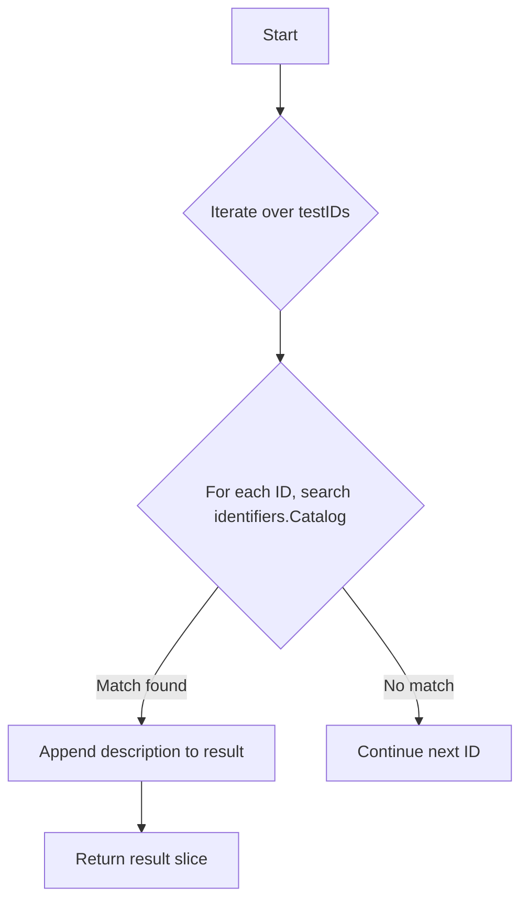

#### Function dependencies (Mermaid)

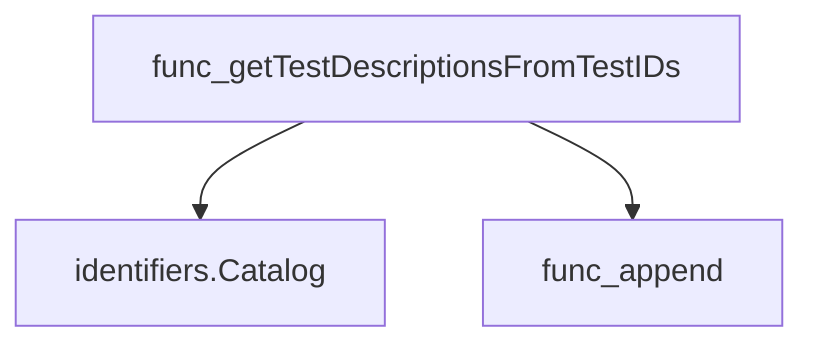

#### Functions calling `getTestDescriptionsFromTestID​s` (Mermaid)

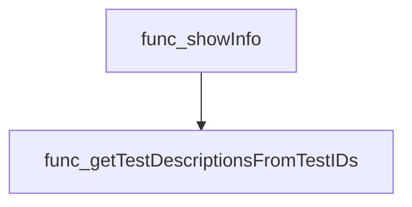

#### Usage example (Go)

```go
// Minimal example invoking getTestDescriptionsFromTestIDs
testIDs := []string{"TC001", "TC002"}
descriptions := getTestDescriptionsFromTestIDs(testIDs)

for _, d := range descriptions {
    fmt.Printf("ID: %s, Name: %s\n", d.ID, d.Name)
}
```

---

### printTestCaseInfoBox

**printTestCaseInfoBox** - Renders a visually distinct box in the terminal containing the identifier, description, remediation, exceptions, and best‑practice reference of a test case. The output is colorized and wrapped to fit the current console width.

#### Signature (Go)

```go
func printTestCaseInfoBox(testCase *claim.TestCaseDescription)
```

#### Summary Table

| Aspect | Details |
|--------|---------|
| **Purpose** | Renders a visually distinct box in the terminal containing the identifier, description, remediation, exceptions, and best‑practice reference of a test case. The output is colorized and wrapped to fit the current console width. |
| **Parameters** | `testCase *claim.TestCaseDescription` – pointer to a struct that holds all textual fields for a test case (identifier, description, remediation, etc.). |
| **Return value** | None; prints directly to standard output. |
| **Key dependencies** | • `strings.Repeat` – creates border lines.<br>• `fmt.Println`, `fmt.Printf` – output functions.<br>• `cli.LineColor`, `cli.LineAlignCenter`, `cli.LineAlignLeft` – text styling and alignment helpers.<br>• `cli.WrapLines` – splits long paragraphs into width‑constrained slices. |
| **Side effects** | Writes to `os.Stdout`; relies on global variables `lineMaxWidth` and `linePadding`. No state mutation beyond console output. |
| **How it fits the package** | Part of the `info` command suite; called by `showInfo` to present detailed information about each selected test case in a user‑friendly format. |

#### Internal workflow (Mermaid)

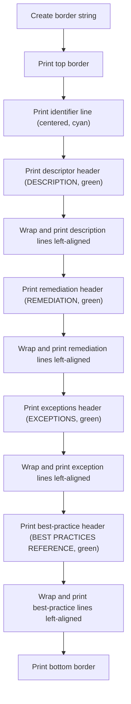

#### Function dependencies (Mermaid)

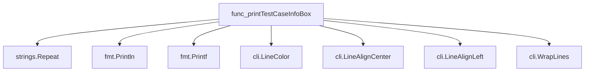

#### Functions calling `printTestCaseInfoBox` (Mermaid)

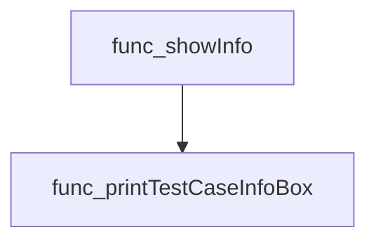

#### Usage example (Go)

```go
// Minimal example invoking printTestCaseInfoBox
package main

import (
 "github.com/redhat-best-practices-for-k8s/certsuite/internal/claim"
)

func main() {
 desc := &claim.TestCaseDescription{
  Identifier:            claim.Identifier{Id: "TC-001"},
  Description:           "This test verifies X.",
  Remediation:           "Ensure Y is configured.",
  ExceptionProcess:      "Exceptions apply when Z.",
  BestPracticeReference: "See RFC 1234 for details.",
 }
 printTestCaseInfoBox(desc)
}
```

---

### printTestList

**printTestList** - Outputs a neatly bordered table listing each supplied test ID.

#### Signature (Go)

```go
func printTestList(testIDs []string)
```

#### Summary Table

| Aspect | Details |
|--------|---------|
| **Purpose** | Outputs a neatly bordered table listing each supplied test ID. |
| **Parameters** | `testIDs []string` – slice of test case identifiers to display. |
| **Return value** | None (void). |
| **Key dependencies** | • `fmt.Println` – prints horizontal separators and the header/footer.<br>• `fmt.Printf` – formats each ID within the table width. |
| **Side effects** | Writes directly to standard output; no state mutation or concurrency. |
| **How it fits the package** | Utility helper used by `showInfo` when the user requests a list of available test cases (`--list`). |

#### Internal workflow (Mermaid)

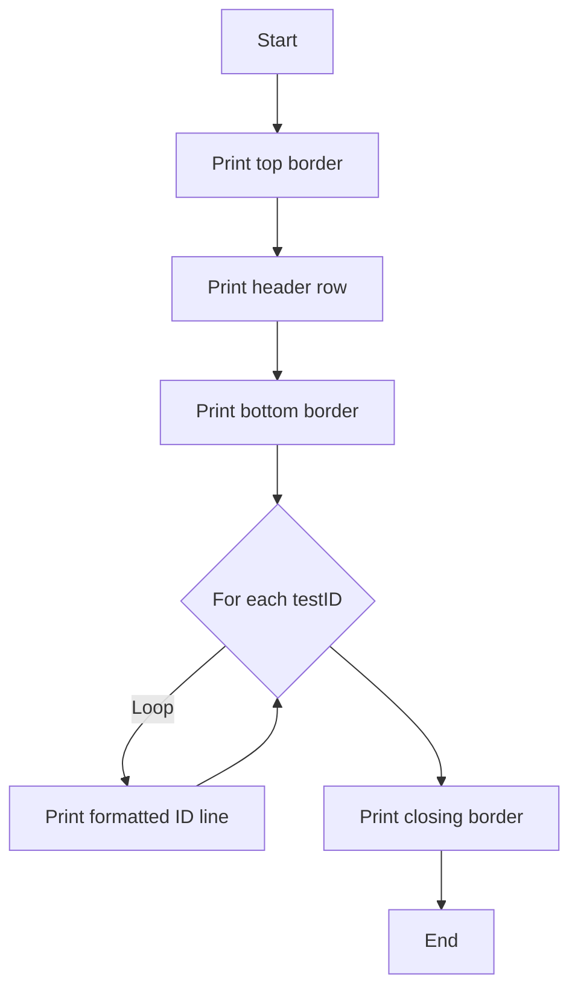

#### Function dependencies (Mermaid)

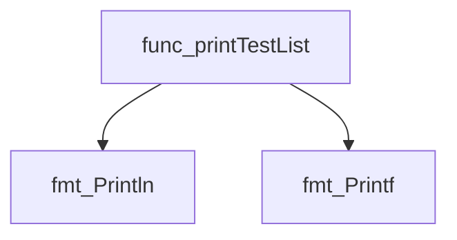

#### Functions calling `printTestList` (Mermaid)

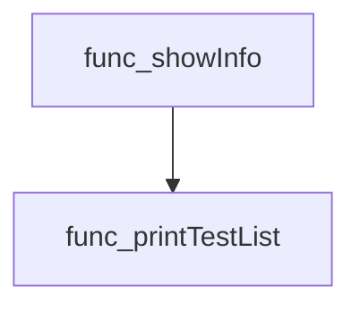

#### Usage example (Go)

```go
// Minimal example invoking printTestList
package main

import (
 "github.com/redhat-best-practices-for-k8s/certsuite/cmd/certsuite/info"
)

func main() {
 testIDs := []string{"testA", "testB", "testC"}
 info.printTestList(testIDs)
}
```

---

---

### showInfo

**showInfo** - Retrieves test case identifiers that match a label expression, optionally prints a list of them, or shows a formatted information box for each matched test case.

#### Signature (Go)

```go
func showInfo(cmd *cobra.Command, _ []string) error
```

#### Summary Table

| Aspect | Details |
|--------|---------|
| **Purpose** | Retrieves test case identifiers that match a label expression, optionally prints a list of them, or shows a formatted information box for each matched test case. |
| **Parameters** | `cmd *cobra.Command` – command context; `_ []string` – positional arguments (ignored). |
| **Return value** | `error` – returned if any lookup or formatting step fails. |
| **Key dependencies** | • `cmd.Flags().GetString("test-label")`<br>• `cmd.Flags().GetBool("list")`<br>• `getMatchingTestIDs(labelExpr string)`<br>• `printTestList([]string)`<br>• `getTestDescriptionsFromTestIDs([]string)`<br>• `adjustLineMaxWidth()`<br>• `printTestCaseInfoBox(*claim.TestCaseDescription)` |
| **Side effects** | • Reads command flags.<br>• Writes formatted output to standard output.<br>• Calls helper functions that may access global state (e.g., `certsuite.LoadInternalChecksDB()`). |
| **How it fits the package** | Acts as the main execution routine for the `info` sub‑command of the CertSuite CLI, orchestrating user input parsing, data retrieval, and presentation. |

#### Internal workflow

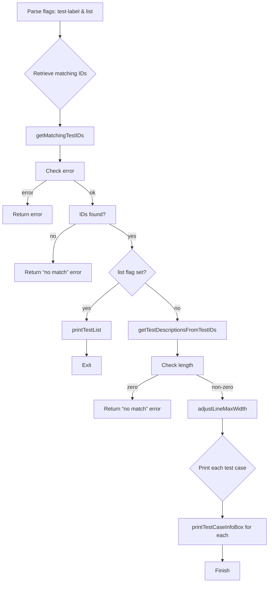

#### Function dependencies

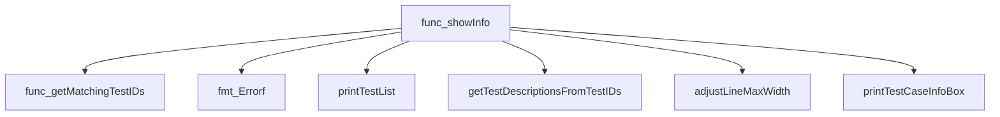

#### Functions calling `showInfo`

None – this function is currently not referenced elsewhere in the package.

#### Usage example (Go)

```go
// Minimal example invoking showInfo
package main

import (
 "github.com/spf13/cobra"
)

func main() {
 cmd := &cobra.Command{}
 // Assume flags are set up elsewhere
 if err := showInfo(cmd, nil); err != nil {
  fmt.Println("Error:", err)
 }
}
```

---
