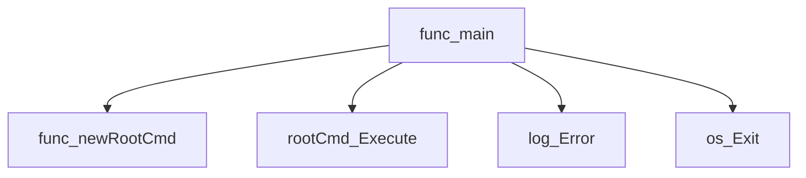
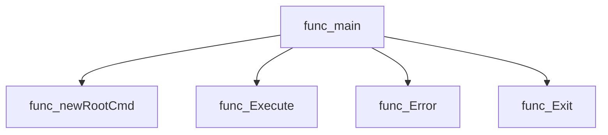
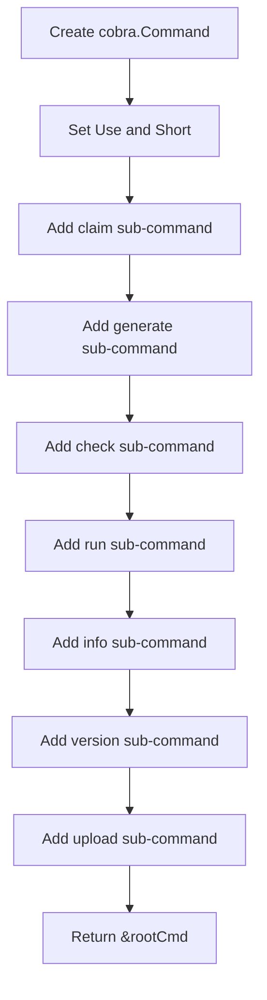
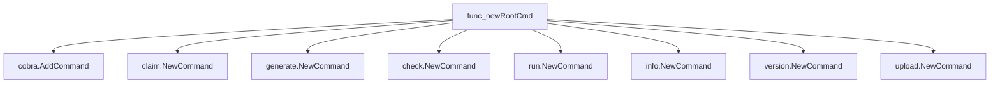
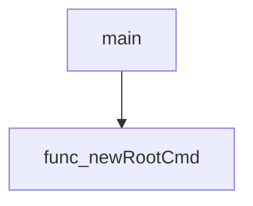

# Package main

**Path**: `cmd/certsuite`

## Table of Contents

- [Overview](#overview)
- [Local Functions](#local-functions)
  - [main](#main)
  - [newRootCmd](#newrootcmd)

## Overview

Provides the entry point for the Certsuite CLI by creating a root cobra command and executing it.

### Key Features

- Initializes a cobra.Command that aggregates all sub‑commands (claim, generate, check, run, info, version, upload).
- Handles execution errors by logging via internal/log and exiting with non‑zero status.

### Design Notes

- Errors are surfaced through a logger before terminating to aid debugging.
- The root command is built lazily in newRootCmd to keep initialization logic separate from execution.

### Local Functions Summary

| Name | Purpose |
|------|----------|
| [func()()](#main) | Initializes the root command and starts the CLI execution loop, handling errors by logging them and exiting with a non‑zero status. |
| [func()(*cobra.Command)](#newrootcmd) | Builds and returns a *cobra.Command that serves as the entry point for the Certsuite CLI, wiring all sub‑commands together. |

## Local Functions

### main

**main** - Initializes the root command and starts the CLI execution loop, handling errors by logging them and exiting with a non‑zero status.

#### Signature (Go)

```go
func()()
```

#### Summary Table

| Aspect | Details |
|--------|---------|
| **Purpose** | Initializes the root command and starts the CLI execution loop, handling errors by logging them and exiting with a non‑zero status. |
| **Parameters** | None |
| **Return value** | None (empty tuple) |
| **Key dependencies** | `newRootCmd() *cobra.Command` – builds the command tree.<br>`rootCmd.Execute()` – runs the CLI.<br>`log.Error(msg string, args ...any)` – logs any execution error.<br>`os.Exit(code int)` – terminates the process on failure. |
| **Side effects** | Creates a command hierarchy in memory; may write to standard output or error streams via Cobra and log package; exits the program if an error occurs. |
| **How it fits the package** | Serves as the program’s main function, orchestrating the startup sequence for the `certsuite` command line tool. |

#### Internal workflow (Mermaid)



#### Function dependencies (Mermaid)

The `main` function calls the following functions:



#### Functions calling `main` (Mermaid)

None – this function is currently not referenced elsewhere in the package.

#### Usage example (Go)

```go
// Minimal example invoking main()
func main() {
    // The program starts automatically when executed; no explicit call needed.
}
```

---

### newRootCmd

**newRootCmd** - Builds and returns a *cobra.Command that serves as the entry point for the Certsuite CLI, wiring all sub‑commands together.

#### Signature (Go)

```go
func()(*cobra.Command)
```

#### Summary Table

| Aspect | Details |
|--------|---------|
| **Purpose** | Builds and returns a *cobra.Command that serves as the entry point for the Certsuite CLI, wiring all sub‑commands together. |
| **Parameters** | None |
| **Return value** | `*cobra.Command` – fully configured root command with child commands added. |
| **Key dependencies** | • Calls `AddCommand` on the root command to attach sub‑commands.<br>• Invokes `NewCommand()` from the following packages:<br>  - `claim`<br>  - `generate`<br>  - `check`<br>  - `run`<br>  - `info`<br>  - `version`<br>  - `upload` |
| **Side effects** | No external I/O; only mutates the internal state of the root command by adding child commands. |
| **How it fits the package** | This function is used in `main()` to create the command tree that `cobra.Command.Execute()` will run, enabling the CLI functionality. |

#### Internal workflow



#### Function dependencies



#### Functions calling `newRootCmd`



#### Usage example (Go)

```go
// Minimal example invoking newRootCmd
func main() {
    root := newRootCmd()
    if err := root.Execute(); err != nil {
        log.Fatal(err)
    }
}
```

---
