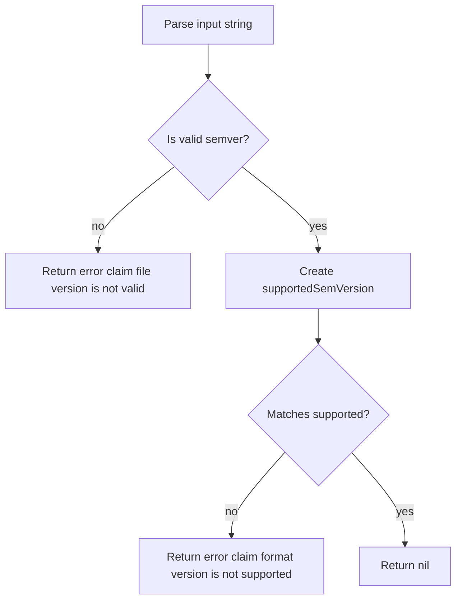
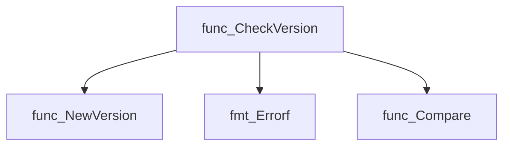
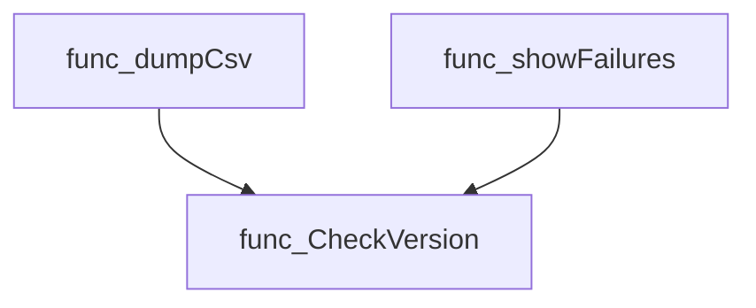
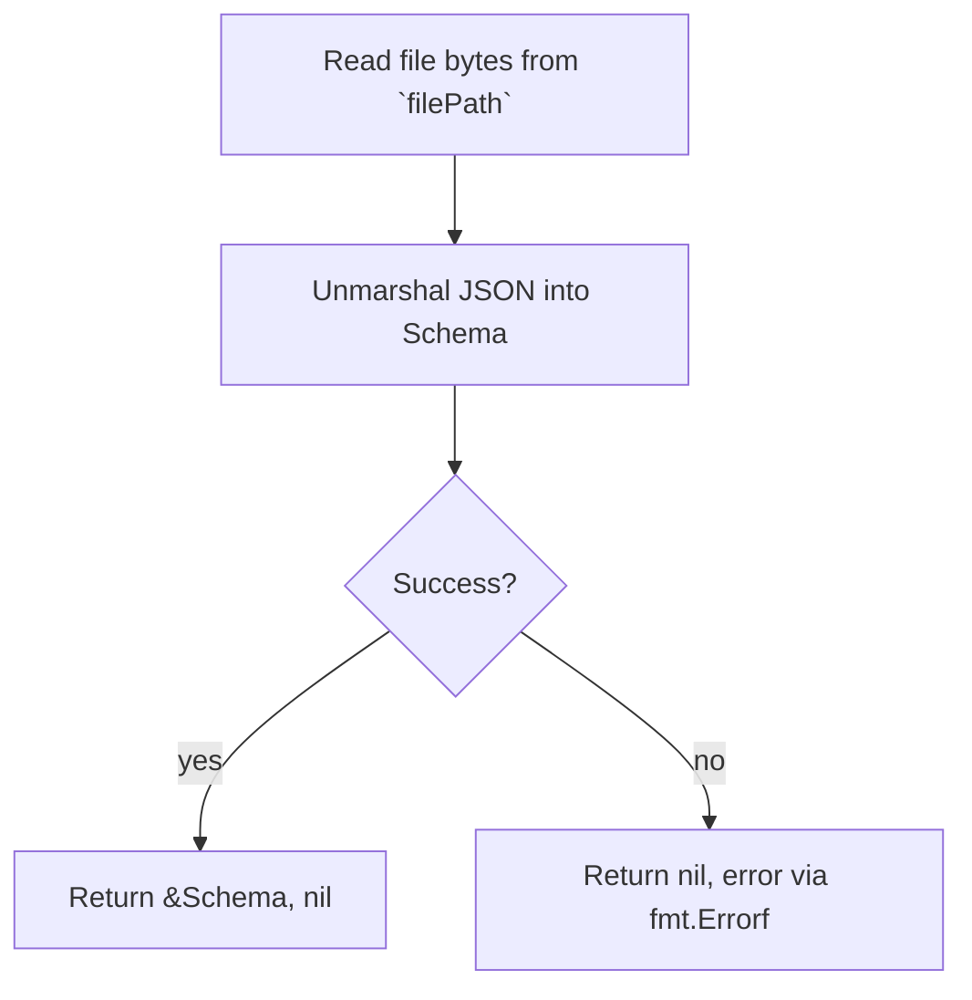
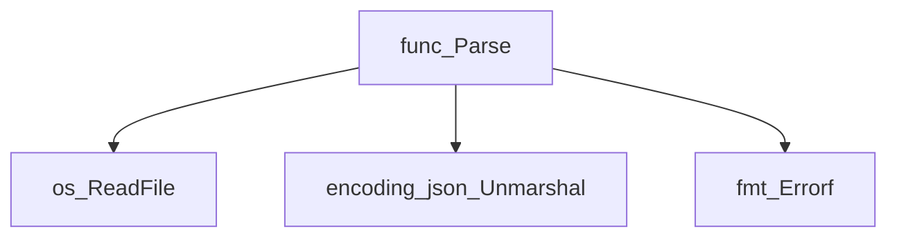
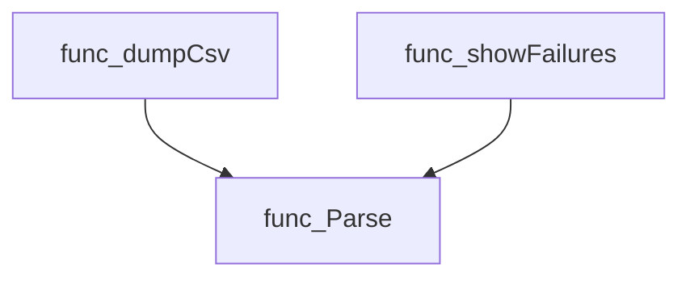

# Package claim

**Path**: `cmd/certsuite/pkg/claim`

## Table of Contents

- [Overview](#overview)
- [Structs](#structs)
  - [Configurations](#configurations)
  - [Nodes](#nodes)
  - [Schema](#schema)
  - [TestCaseID](#testcaseid)
  - [TestCaseRawResult](#testcaserawresult)
  - [TestCaseResult](#testcaseresult)
  - [TestOperator](#testoperator)
- [Exported Functions](#exported-functions)
  - [CheckVersion](#checkversion)
  - [Parse](#parse)

## Overview

Failed to parse JSON response, but content appears to contain package information.

### Structs Summary

| Name | Purpose |
|------|----------|
| [**Configurations**](#configurations) | Struct definition |
| [**Nodes**](#nodes) | One-line purpose |
| [**Schema**](#schema) | One‑line purpose |
| [**TestCaseID**](#testcaseid) | One-line purpose |
| [**TestCaseRawResult**](#testcaserawresult) | Struct definition |
| [**TestCaseResult**](#testcaseresult) | Struct definition |
| [**TestOperator**](#testoperator) | Struct definition |

### Exported Functions Summary

| Name | Purpose |
|------|----------|
| [func CheckVersion(version string) error](#checkversion) | Ensures that the supplied claim file version matches the single supported semantic‑version used by the application. |
| [func Parse(filePath string) (*Schema, error)](#parse) | Reads the specified file, unmarshals its JSON content into a `Schema` struct and returns it. |

## Structs

### Configurations

<!-- DEBUG: Struct Configurations exists in bundle but ParsedOK=false, Fields=0 -->
**Purpose**:

**Fields**:

| Field | Type | Description |
|-------|------|--------------|
| `Config` | `interface{}` | Field documentation |
| `AbnormalEvents` | `[]interface{}` | Field documentation |
| `TestOperators` | `[]TestOperator` | Field documentation |

---

### Nodes

A container for collected information about Kubernetes nodes.

#### Fields

| Field       | Type      | Description |
|-------------|-----------|-------------|
| NodesSummary | interface{} | Summary data about the node (e.g., status, resource usage). Populated from JSON field `nodeSummary`. |
| CniNetworks  | interface{} | Information on CNI plugins installed on the node. Corresponds to JSON field `cniPlugins`. |
| NodesHwInfo  | interface{} | Hardware details of the node such as CPU and memory specifications. Maps to JSON field `nodesHwInfo`. |
| CsiDriver    | interface{} | Details about CSI drivers present on the node, linked with JSON field `csiDriver`. |

#### Purpose  

The `Nodes` struct aggregates diverse data collected from a Kubernetes cluster’s nodes. Each field holds opaque data (represented as `interface{}`) that can be marshaled to or unmarshaled from JSON. This structure is used when reporting node‑level metrics, validating infrastructure compliance, or passing node information between components of the certsuite tool.

#### Related functions  

No methods are defined directly on this struct. It is primarily a data holder used by other packages in the `claim` module.

---

### Schema

Represents the top‑level structure of a claim file, containing configurations, node information, test results and version metadata.

#### Fields

| Field | Type | Description |
|-------|------|-------------|
| Claim | struct{Configurations; Nodes Nodes; Results TestSuiteResults; Versions officialClaimScheme.Versions} | Encapsulates the core data of a claim. `Configurations` holds runtime settings; `Nodes` lists target nodes; `Results` stores test outcomes; `Versions` records schema and component versions. |

#### Purpose

The `Schema` struct models the JSON payload expected by the certsuite tool when loading or generating claim files. It groups all relevant information under a single `claim` key, enabling straightforward marshaling/unmarshaling with Go’s `encoding/json`.

#### Related functions

| Function | Purpose |
|----------|---------|
| Parse | Reads a file from disk, unmarshals its JSON contents into a `Schema`, and returns the populated struct or an error. |

---

### TestCaseID

Represents a unique identifier for an individual test case within a certification suite, including its suite association and any tagging information.

#### Fields

| Field | Type   | Description |
|-------|--------|-------------|
| `ID`   | string | Unique test‑case identifier (e.g., `"TC001"`). |
| `Suite` | string | Name of the certification suite that contains this test case. |
| `Tags`  | string | Comma‑separated list of tags applied to the test case for filtering or categorization purposes. |

#### Purpose

The `TestCaseID` struct encapsulates metadata required to reference and locate a specific test case across different suites and tooling contexts. It is typically used when generating reports, mapping results back to source tests, or applying filters based on suite membership or tags.

#### Related functions (none)

---

### TestCaseRawResult

<!-- DEBUG: Struct TestCaseRawResult exists in bundle but ParsedOK=false, Fields=0 -->
**Purpose**:

**Fields**:

| Field | Type | Description |
|-------|------|--------------|
| `Name` | `string` | Field documentation |
| `Status` | `string` | Field documentation |

---

### TestCaseResult

<!-- DEBUG: Struct TestCaseResult exists in bundle but ParsedOK=false, Fields=0 -->
**Purpose**:

**Fields**:

| Field | Type | Description |
|-------|------|--------------|
| `CapturedTestOutput` | `string` | Field documentation |
| `Duration` | `int` | Field documentation |
| `FailureLineContent` | `string` | Field documentation |
| `SkipReason` | `string` | Field documentation |
| `TestID` | `struct{ID string; Suite string; Tags string}` | Field documentation |
| `CatalogInfo` | `struct{BestPracticeReference string; Description string; ExceptionProcess string; Remediation string}` | Field documentation |
| `CategoryClassification` | `map[string]string` | Field documentation |
| `EndTime` | `string` | Field documentation |
| `FailureLocation` | `string` | Field documentation |
| `CheckDetails` | `string` | Field documentation |
| `StartTime` | `string` | Field documentation |
| `State` | `string` | Field documentation |

---

### TestOperator

<!-- DEBUG: Struct TestOperator exists in bundle but ParsedOK=false, Fields=0 -->
**Purpose**:

**Fields**:

| Field | Type | Description |
|-------|------|--------------|
| `Namespace` | `string` | Field documentation |
| `Version` | `string` | Field documentation |
| `Name` | `string` | Field documentation |

---

## Exported Functions

### CheckVersion

**CheckVersion** - Ensures that the supplied claim file version matches the single supported semantic‑version used by the application.

#### 1) Signature (Go)

```go
func CheckVersion(version string) error
```

#### 2) Summary Table

| Aspect | Details |
|--------|---------|
| **Purpose** | Ensures that the supplied claim file version matches the single supported semantic‑version used by the application. |
| **Parameters** | `version` (string) – The version string extracted from a claim file. |
| **Return value** | `error` – Nil if the version is valid and supported; otherwise an error describing the mismatch or parsing failure. |
| **Key dependencies** | • `semver.NewVersion` (github.com/Masterminds/semver) <br>• `fmt.Errorf` (standard library) |
| **Side effects** | None – purely functional. |
| **How it fits the package** | Acts as a guard for all claim‑processing routines, preventing downstream logic from operating on unsupported formats. |

#### 3) Internal workflow



#### 4) Function dependencies



#### 5) Functions calling `CheckVersion`



#### 6) Usage example

```go
// Minimal example invoking CheckVersion
package main

import (
    "fmt"
    "github.com/redhat-best-practices-for-k8s/certsuite/cmd/certsuite/pkg/claim"
)

func main() {
    if err := claim.CheckVersion("v1.0.0"); err != nil {
        fmt.Printf("Unsupported claim format: %v\n", err)
        return
    }
    fmt.Println("Claim version is supported.")
}
```

---

---

### Parse

**Parse** - Reads the specified file, unmarshals its JSON content into a `Schema` struct and returns it.

Parses a JSON claim file into an in‑memory `Schema`.

```go
func Parse(filePath string) (*Schema, error)
```

| Aspect | Details |
|--------|---------|
| **Purpose** | Reads the specified file, unmarshals its JSON content into a `Schema` struct and returns it. |
| **Parameters** | `filePath string – path to the claim file` |
| **Return value** | `(*Schema, error) – parsed schema or an error describing what went wrong` |
| **Key dependencies** | • `os.ReadFile`<br>• `encoding/json.Unmarshal`<br>• `fmt.Errorf` (twice for different failure contexts) |
| **Side effects** | None beyond reading the file; no global state is mutated. |
| **How it fits the package** | Core helper used by various command‑line subcommands to load claim data before further processing or validation. |

#### Internal workflow



#### Function dependencies



#### Functions calling `Parse`



#### Usage example

```go
// Minimal example invoking Parse
package main

import (
    "fmt"
    "github.com/redhat-best-practices-for-k8s/certsuite/cmd/certsuite/pkg/claim"
)

func main() {
    schema, err := claim.Parse("path/to/claim.json")
    if err != nil {
        fmt.Printf("Failed to parse claim: %v\n", err)
        return
    }
    fmt.Printf("Parsed claim: %+v\n", schema)
}
```

---
