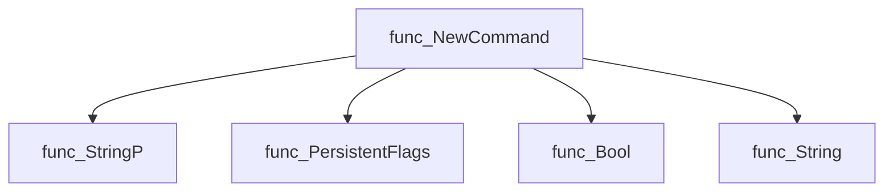
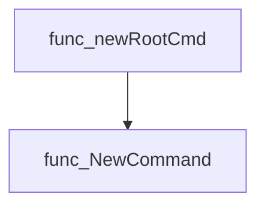
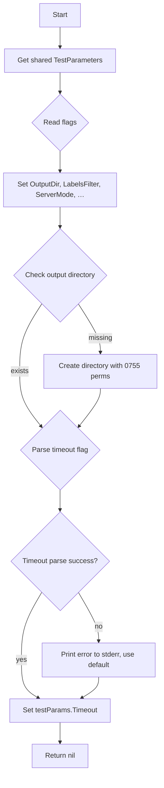
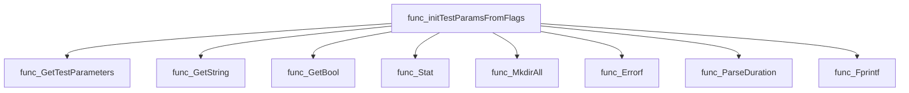
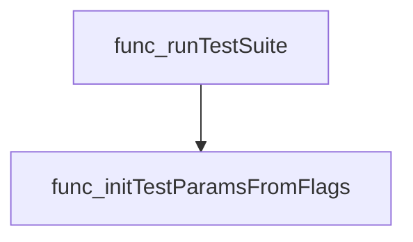
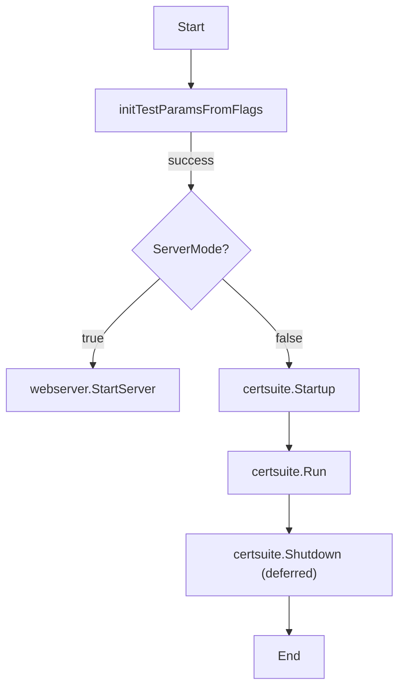
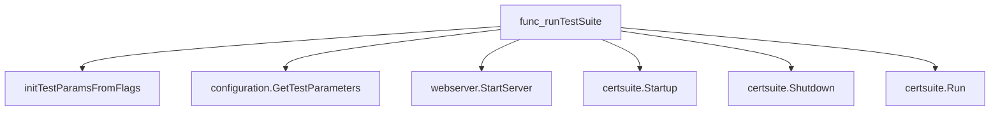

```mermaid
flowchart TD
  A["Start"] --> B{"Configure Flags"}
  B --> C["StringP: output-dir"]
  B --> D["StringP: label-filter"]
  B --> E["String: timeout"]
  B --> F["StringP: config-file"]
  B --> G["StringP: kubeconfig"]
  B --> H["Bool: server-mode"]
  B --> I["Bool: omit-artifacts-zip-file"]
  B --> J["String: log-level"]
  B --> K["String: offline-db"]
  B --> L["String: preflight-dockerconfig"]
  B --> M["Bool: intrusive"]
  B --> N["Bool: allow-preflight-insecure"]
  B --> O["Bool: include-web-files"]
  B --> P["Bool: enable-data-collection"]
  B --> Q["Bool: create-xml-junit-file"]
  B --> R["String: certsuite-probe-image"]
  B --> S["String: daemonset-cpu-req"]
  B --> T["String: daemonset-cpu-lim"]
  B --> U["String: daemonset-mem-req"]
  B --> V["String: daemonset-mem-lim"]
  B --> W["Bool: sanitize-claim"]
  B --> X["Bool: allow-non-running"]
  B --> Y["String: connect-api-key"]
  B --> Z["String: connect-project-id"]
  B --> AA["String: connect-api-base-url"]
  B --> AB["String: connect-api-proxy-url"]
  B --> AC["String: connect-api-proxy-port"]
  AC --> D["Return runCmd"]
```

# Package run

**Path**: `cmd/certsuite/run`

## Table of Contents

- [Overview](#overview)
- [Exported Functions](#exported-functions)
  - [NewCommand](#newcommand)
- [Local Functions](#local-functions)
  - [initTestParamsFromFlags](#inittestparamsfromflags)
  - [runTestSuite](#runtestsuite)

## Overview

The package implements the `run` sub‑command of certsuite. It parses command‑line flags, prepares test parameters, optionally starts an HTTP server for remote execution, and runs the certification tests locally.

### Key Features

- Configures a cobra.Command with persistent flags for output directory, timeout, and various test options
- Initializes shared TestParameters from flag values and ensures output directories exist
- Supports both stand‑alone test execution and server mode via webserver.StartServer

### Design Notes

- Relies on cobra’s PersistentFlags to share options across subcommands; errors during init abort the run with a fatal log
- Test parameters are stored in a singleton accessed by configuration.GetTestParameters, which may be shared across packages
- When running in server mode the command starts an HTTP listener and blocks until shutdown, otherwise it runs tests synchronously

### Exported Functions Summary

| Name | Purpose |
|------|----------|
| [func NewCommand() *cobra.Command](#newcommand) | Creates and configures a `cobra.Command` for the `run` sub‑command, adding all required persistent flags. |

### Local Functions Summary

| Name | Purpose |
|------|----------|
| [func initTestParamsFromFlags(cmd *cobra.Command) error](#inittestparamsfromflags) | Reads CLI flag values into the shared `TestParameters` structure and prepares the output directory and timeout value. |
| [func runTestSuite(cmd *cobra.Command, _ []string) error](#runtestsuite) | Initializes test parameters from CLI flags and runs the suite either in server mode or as a stand‑alone process. |

## Exported Functions

### NewCommand

**NewCommand** - Creates and configures a `cobra.Command` for the `run` sub‑command, adding all required persistent flags.


#### Signature (Go)
```go
func NewCommand() *cobra.Command
```

#### Summary Table
| Aspect | Details |
|--------|---------|
| **Purpose** | Creates and configures a `cobra.Command` for the `run` sub‑command, adding all required persistent flags. |
| **Parameters** | none |
| **Return value** | A pointer to the configured `*cobra.Command`. |
| **Key dependencies** | Calls various flag‑registration helpers on `runCmd.PersistentFlags()` such as `StringP`, `Bool`, and `String`. |
| **Side effects** | Mutates the global `runCmd` by attaching flags; returns a command object used in the CLI tree. |
| **How it fits the package** | Provides the executable entry point for running tests, exposing configuration options to users of the certsuite CLI. |

#### Internal workflow (Mermaid)


#### Function dependencies (Mermaid)


#### Functions calling `NewCommand` (Mermaid)


#### Usage example (Go)
```go
// Minimal example invoking NewCommand to obtain the command tree.
cmd := run.NewCommand()
if err := cmd.Execute(); err != nil {
    fmt.Fprintln(os.Stderr, err)
    os.Exit(1)
}
```

---

## Local Functions

### initTestParamsFromFlags

**initTestParamsFromFlags** - Reads CLI flag values into the shared `TestParameters` structure and prepares the output directory and timeout value.


#### Signature (Go)

```go
func initTestParamsFromFlags(cmd *cobra.Command) error
```

#### Summary Table

| Aspect | Details |
|--------|---------|
| **Purpose** | Reads CLI flag values into the shared `TestParameters` structure and prepares the output directory and timeout value. |
| **Parameters** | `cmd *cobra.Command` – Cobra command from which flags are read. |
| **Return value** | `error` – non‑nil if a required operation (e.g., creating the output folder or parsing the timeout) fails. |
| **Key dependencies** | • `configuration.GetTestParameters()`<br>• `cmd.Flags().GetString`, `GetBool`<br>• `os.Stat`, `os.MkdirAll`<br>• `fmt.Errorf`, `fmt.Fprintf`<br>• `time.ParseDuration` |
| **Side effects** | Modifies the global test‑parameter instance; creates a directory if missing; writes error messages to standard error when timeout parsing fails. |
| **How it fits the package** | Called by `runTestSuite` during command execution to set up runtime configuration before launching either the server or standalone test runner. |

#### Internal workflow (Mermaid)



#### Function dependencies (Mermaid)



#### Functions calling `initTestParamsFromFlags` (Mermaid)



#### Usage example (Go)

```go
// Minimal example invoking initTestParamsFromFlags
package main

import (
	"github.com/spf13/cobra"
	cmd "github.com/redhat-best-practices-for-k8s/certsuite/cmd/certsuite/run"
)

func main() {
	root := &cobra.Command{Use: "certsuite"}
	if err := cmd.initTestParamsFromFlags(root); err != nil {
		panic(err)
	}
}
```

---

---

### runTestSuite

**runTestSuite** - Initializes test parameters from CLI flags and runs the suite either in server mode or as a stand‑alone process.


#### Signature (Go)
```go
func runTestSuite(cmd *cobra.Command, _ []string) error
```

#### Summary Table
| Aspect | Details |
|--------|---------|
| **Purpose** | Initializes test parameters from CLI flags and runs the suite either in server mode or as a stand‑alone process. |
| **Parameters** | `cmd *cobra.Command` – command instance containing flag values; `_ []string` – unused arguments (ignored). |
| **Return value** | `error` – always nil; fatal errors are handled via `log.Fatal`. |
| **Key dependencies** | - `initTestParamsFromFlags(cmd)`<br>- `configuration.GetTestParameters()`<br>- `webserver.StartServer(outputDir)`<br>- `certsuite.Startup()`, `certsuite.Shutdown()`, `certsuite.Run(labelsFilter, outputFolder)` |
| **Side effects** | • Parses and stores flags into global test parameters.<br>• Starts an HTTP server if `ServerMode` is true.<br>• Invokes the core run logic which performs checks, generates reports, and may interact with external APIs.<br>• Logs information and exits on fatal errors. |
| **How it fits the package** | Entry point for the `certsuite run` command; orchestrates configuration, mode selection, and execution flow. |

#### Internal workflow (Mermaid)


#### Function dependencies (Mermaid)


#### Functions calling `runTestSuite` (Mermaid)
None – this function is currently not referenced elsewhere in the package.

#### Usage example (Go)
```go
// Minimal example invoking runTestSuite
package main

import (
    "github.com/spf13/cobra"
)

func main() {
    cmd := &cobra.Command{}
    // Flags would be added here in real usage.
    if err := runTestSuite(cmd, nil); err != nil {
        panic(err)
    }
}
```

---

---

