# Package resultsspreadsheet

**Path**: `cmd/certsuite/upload/results_spreadsheet`

## Table of Contents

- [Overview](#overview)
- [Exported Functions](#exported-functions)
  - [CreateSheetsAndDriveServices](#createsheetsanddriveservices)
  - [GetHeaderIndicesByColumnNames](#getheaderindicesbycolumnnames)
  - [GetHeadersFromSheet](#getheadersfromsheet)
  - [GetHeadersFromValueRange](#getheadersfromvaluerange)
  - [GetSheetIDByName](#getsheetidbyname)
  - [MoveSpreadSheetToFolder](#movespreadsheettofolder)
  - [NewCommand](#newcommand)
- [Local Functions](#local-functions)
  - [addBasicFilterToSpreadSheet](#addbasicfiltertospreadsheet)
  - [addDescendingSortFilterToSheet](#adddescendingsortfiltertosheet)
  - [addFilterByFailedAndMandatoryToSheet](#addfilterbyfailedandmandatorytosheet)
  - [createConclusionsSheet](#createconclusionssheet)
  - [createDriveFolder](#createdrivefolder)
  - [createRawResultsSheet](#createrawresultssheet)
  - [createSingleWorkloadRawResultsSheet](#createsingleworkloadrawresultssheet)
  - [createSingleWorkloadRawResultsSpreadSheet](#createsingleworkloadrawresultsspreadsheet)
  - [extractFolderIDFromURL](#extractfolderidfromurl)
  - [generateResultsSpreadSheet](#generateresultsspreadsheet)
  - [prepareRecordsForSpreadSheet](#preparerecordsforspreadsheet)
  - [readCSV](#readcsv)

## Overview

Creates a Google Sheets spreadsheet that aggregates raw test results and derives high‑level conclusions for each workload, then uploads the sheet to a specified Google Drive folder.

### Key Features

- Transforms CSV test output into a formatted Google Sheet with headers and truncation logic
- Automates filtering and sorting (e.g., failed/mandatory tests, descending order) on every tab
- Generates per‑workload result sheets and a consolidated conclusions sheet, then moves the file to a Drive folder

### Design Notes

- Uses Sheets API v4 and Drive API v3 with OAuth credentials supplied via a JSON key file
- All filtering and sorting are applied through batch update requests for efficiency
- The package assumes the CSV follows a fixed schema; missing columns trigger an error

### Exported Functions Summary

| Name | Purpose |
|------|----------|
| [func CreateSheetsAndDriveServices(credentials string) (*sheets.Service, *drive.Service, error)](#createsheetsanddriveservices) | Instantiates authenticated Google Sheets and Google Drive service clients using the supplied credentials file. |
| [func GetHeaderIndicesByColumnNames(headers, names []string) ([]int, error)](#getheaderindicesbycolumnnames) | Returns the zero‑based positions of each requested column name within a slice of header strings. If any name is absent, an error is returned. |
| [func GetHeadersFromSheet(sheet *sheets.Sheet) []string](#getheadersfromsheet) | Returns a slice containing the string values of all cells in the first row (header row) of the supplied sheet. |
| [func GetHeadersFromValueRange(sheetsValues *sheets.ValueRange) []string](#getheadersfromvaluerange) | Returns the column header names from the first row of a Google Sheets value range, converting each cell to its string representation. |
| [func GetSheetIDByName(spreadsheet *sheets.Spreadsheet, name string) (int64, error)](#getsheetidbyname) | Looks up a sheet’s internal ID within a Google Sheets spreadsheet using the sheet’s title. |
| [func MoveSpreadSheetToFolder(srv *drive.Service, folder *drive.File, spreadsheet *sheets.Spreadsheet) error](#movespreadsheettofolder) | Relocates an existing spreadsheet to a target Drive folder by updating its parent references. |
| [func NewCommand() *cobra.Command](#newcommand) | Builds and configures the `uploadResultSpreadSheetCmd` Cobra command, defining its flags and marking required ones. |

### Local Functions Summary

| Name | Purpose |
|------|----------|
| [func addBasicFilterToSpreadSheet(srv *sheets.Service, spreadsheet *sheets.Spreadsheet) error](#addbasicfiltertospreadsheet) | Iterates over all sheets within the provided `spreadsheet` and sets a basic filter covering each sheet’s full range. The function ensures that every tab has filtering enabled, enabling later sort or filter operations. |
| [func addDescendingSortFilterToSheet(srv *sheets.Service, spreadsheet *sheets.Spreadsheet, sheetName, colName string) error](#adddescendingsortfiltertosheet) | Sorts a specified column (`colName`) in descending order on the given sheet (`sheetName`) of a Google Sheets document. |
| [func addFilterByFailedAndMandatoryToSheet(srv *sheets.Service, spreadsheet *sheets.Spreadsheet, sheetName string) error](#addfilterbyfailedandmandatorytosheet) | Applies a basic filter to the specified sheet so that only rows where the *State* column equals `"failed"` and the *Mandatory/Optional* column equals `"Mandatory"` are displayed. |
| [func createConclusionsSheet(     sheetsService *sheets.Service,     driveService  *drive.Service,     rawResultsSheet *sheets.Sheet,     mainResultsFolderID string, ) (*sheets.Sheet, error)](#createconclusionssheet) | Builds a new Google Sheets tab that lists each unique workload from the raw results, including category, version, OCP version, and a hyperlink to a dedicated results spreadsheet. |
| [func createDriveFolder(srv *drive.Service, folderName, parentFolderID string) (*drive.File, error)](#createdrivefolder) | Creates a sub‑folder under the specified `parentFolderID` with the name `folderName`. If a folder of that name already exists in the parent, an error is returned. |
| [func createRawResultsSheet(fp string) (*sheets.Sheet, error)](#createrawresultssheet) | Reads a CSV file and converts its contents into a `*sheets.Sheet` suitable for inclusion in a Google Spreadsheet. |
| [func createSingleWorkloadRawResultsSheet(rawResultsSheet *sheets.Sheet, workloadName string) (*sheets.Sheet, error)](#createsingleworkloadrawresultssheet) | Builds a new sheet containing only the rows that belong to `workloadName`. The resulting sheet keeps all original columns from `rawResultsSheet` and prefixes two extra columns: “Owner/TechLead Conclusion” and “Next Step Actions”. |
| [func createSingleWorkloadRawResultsSpreadSheet(sheetService *sheets.Service, driveService *drive.Service, folder *drive.File, rawResultsSheet *sheets.Sheet, workloadName string) (*sheets.Spreadsheet, error)](#createsingleworkloadrawresultsspreadsheet) | Builds a new Google Sheets file containing only the rows that belong to `workloadName`, adds two extra columns for conclusions and next‑step AI, applies filtering on failed/mandatory tests, moves the sheet into the specified Drive folder, and returns the created spreadsheet. |
| [func extractFolderIDFromURL(u string) (string, error)](#extractfolderidfromurl) | Parses a Google Drive shareable URL and returns the last path segment, which is the folder ID. |
| [func generateResultsSpreadSheet()](#generateresultsspreadsheet) | Orchestrates the creation of a spreadsheet that stores raw test output and derived conclusions, uploads it to Google Drive, and applies filtering/sorting. |
| [func prepareRecordsForSpreadSheet(records [][]string) []*sheets.RowData](#preparerecordsforspreadsheet) | Transforms a 2‑D slice of string values (`records`) into a slice of `*sheets.RowData` suitable for populating a Google Sheets spreadsheet. It normalises cell content by truncating overly long strings, replacing line breaks with spaces, and ensuring empty cells contain a single space to avoid layout issues. |
| [func readCSV(string) ([][]string, error)](#readcsv) | Loads the contents of a CSV file located at the given path and returns all rows as a two‑dimensional slice of strings. |

## Exported Functions

### CreateSheetsAndDriveServices

**CreateSheetsAndDriveServices** - Instantiates authenticated Google Sheets and Google Drive service clients using the supplied credentials file.

```go
func CreateSheetsAndDriveServices(credentials string) (*sheets.Service, *drive.Service, error)
```

| Aspect | Details |
|--------|---------|
| **Purpose** | Instantiates authenticated Google Sheets and Google Drive service clients using the supplied credentials file. |
| **Parameters** | `credentials string` – Path to a JSON credentials file for a Google Cloud Service Account. |
| **Return value** | `<*sheets.Service, *drive.Service, error>` – The Sheets client, the Drive client, and an error if creation fails. |
| **Key dependencies** | • `context.TODO()` <br>• `sheets.NewService` with `option.WithCredentialsFile(credentials)` <br>• `drive.NewService` with `option.WithCredentialsFile(credentials)` <br>• `fmt.Errorf` for error wrapping |
| **Side effects** | None; the function only creates and returns service objects. |
| **How it fits the package** | Provides a single entry point to obtain authenticated clients needed for generating test‑result spreadsheets in the *resultsspreadsheet* package. |

#### Internal workflow (Mermaid)

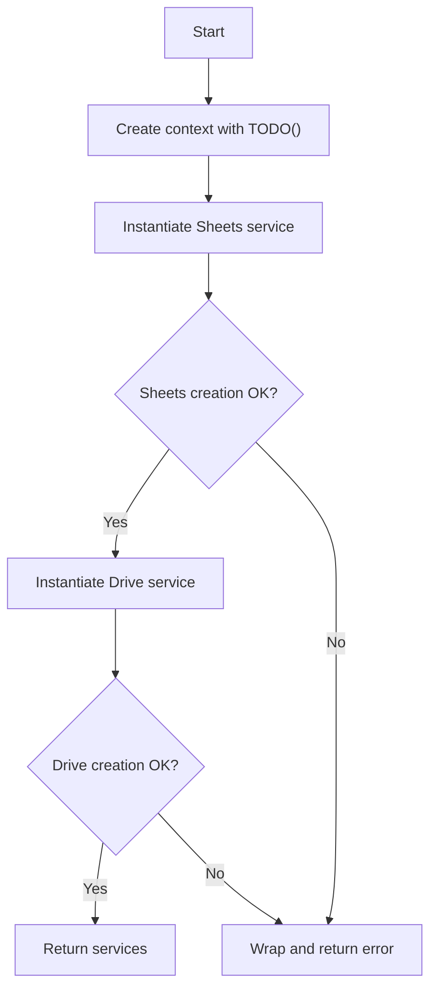

#### Function dependencies (Mermaid)

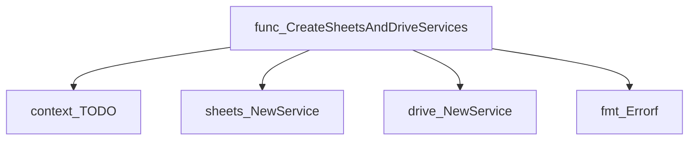

#### Functions calling `CreateSheetsAndDriveServices` (Mermaid)

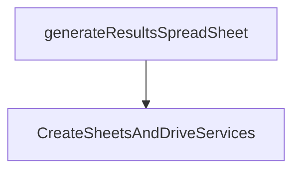

#### Usage example (Go)

```go
// Minimal example invoking CreateSheetsAndDriveServices
package main

import (
    "log"

    "github.com/redhat-best-practices-for-k8s/certsuite/cmd/certsuite/upload/results_spreadsheet"
)

func main() {
    credsPath := "/path/to/credentials.json"

    sheetSvc, driveSvc, err := resultsspreadsheet.CreateSheetsAndDriveServices(credsPath)
    if err != nil {
        log.Fatalf("Failed to create services: %v", err)
    }

    // Use sheetSvc and driveSvc for further operations...
    _ = sheetSvc
    _ = driveSvc
}
```

---

### GetHeaderIndicesByColumnNames

**GetHeaderIndicesByColumnNames** - Returns the zero‑based positions of each requested column name within a slice of header strings. If any name is absent, an error is returned.

#### Signature (Go)

```go
func GetHeaderIndicesByColumnNames(headers, names []string) ([]int, error)
```

#### Summary Table

| Aspect | Details |
|--------|---------|
| **Purpose** | Returns the zero‑based positions of each requested column name within a slice of header strings. If any name is absent, an error is returned. |
| **Parameters** | `headers []string` – list of all column headers.<br>`names []string` – column names to locate. |
| **Return value** | `([]int, error)` – slice containing the index for each requested name or an error if a name cannot be found. |
| **Key dependencies** | *`fmt.Errorf` – constructs descriptive errors.<br>* Built‑in `append`. |
| **Side effects** | None; pure function with no state mutation or I/O. |
| **How it fits the package** | Utility for mapping human‑readable header names to spreadsheet indices, used by higher‑level sheet manipulation functions (e.g., sorting, filtering). |

#### Internal workflow

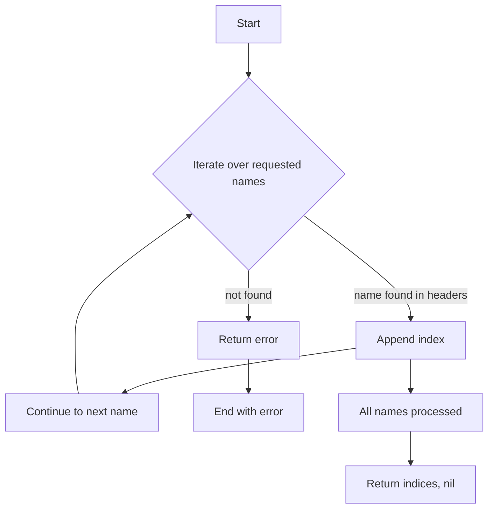

#### Function dependencies

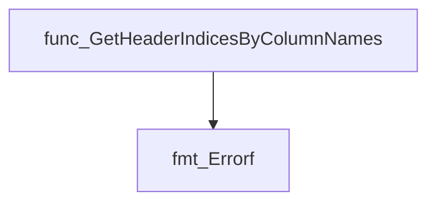

#### Functions calling `GetHeaderIndicesByColumnNames`

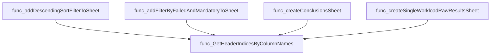

#### Usage example (Go)

```go
// Minimal example invoking GetHeaderIndicesByColumnNames
package main

import (
 "fmt"
 "log"

 "github.com/redhat-best-practices-for-k8s/certsuite/cmd/certsuite/upload/results_spreadsheet"
)

func main() {
 headers := []string{"Name", "Age", "Country"}
 names   := []string{"Age", "Country"}

 indices, err := resultsspreadsheet.GetHeaderIndicesByColumnNames(headers, names)
 if err != nil {
  log.Fatalf("lookup failed: %v", err)
 }
 fmt.Printf("Indices for %v are %v\n", names, indices) // Output: Indices for [Age Country] are [1 2]
}
```

---

### GetHeadersFromSheet

**GetHeadersFromSheet** - Returns a slice containing the string values of all cells in the first row (header row) of the supplied sheet.

#### Signature (Go)

```go
func GetHeadersFromSheet(sheet *sheets.Sheet) []string
```

#### Summary Table

| Aspect | Details |
|--------|---------|
| **Purpose** | Returns a slice containing the string values of all cells in the first row (header row) of the supplied sheet. |
| **Parameters** | `sheet` – pointer to a `sheets.Sheet` object from the Google Sheets API; represents the spreadsheet data structure. |
| **Return value** | `[]string` – ordered list of header names extracted from the first row. |
| **Key dependencies** | • `github.com/google/go-github/v32/api/sheets` (for the `Sheet`, `RowData`, `CellData`, and `ExtendedValue` types)<br>• Go standard library (`append`) |
| **Side effects** | None; purely functional, no mutation of input or external state. |
| **How it fits the package** | Provides a helper to retrieve header names used by other functions (e.g., mapping column indices, constructing new sheets). It centralizes header extraction logic for consistency across spreadsheet operations. |

#### Internal workflow (Mermaid)

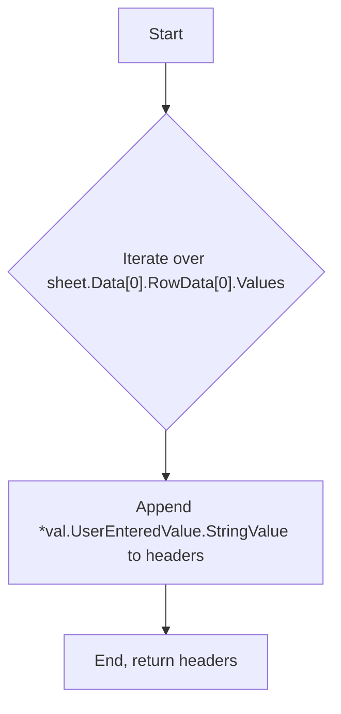

#### Function dependencies (Mermaid)

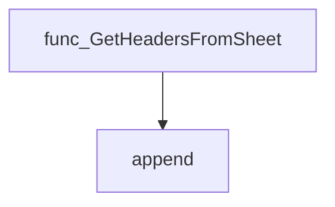

#### Functions calling `GetHeadersFromSheet` (Mermaid)

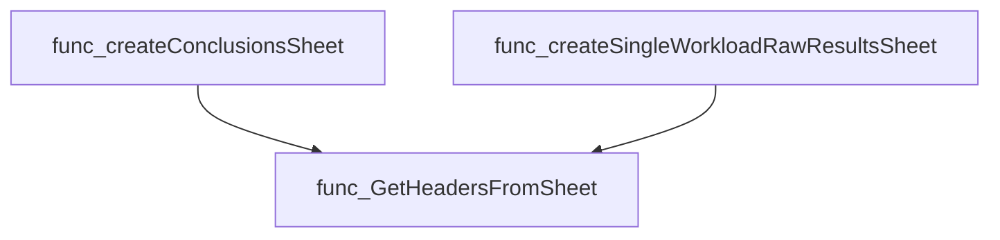

#### Usage example (Go)

```go
// Minimal example invoking GetHeadersFromSheet
package main

import (
    "fmt"
    sheets "github.com/google/go-github/v32/api/sheets"
)

func main() {
    // Assume rawSheet is obtained from Google Sheets API elsewhere.
    var rawSheet *sheets.Sheet

    headers := GetHeadersFromSheet(rawSheet)
    fmt.Println("Column headers:", headers)
}
```

---

---

### GetHeadersFromValueRange

**GetHeadersFromValueRange** - Returns the column header names from the first row of a Google Sheets value range, converting each cell to its string representation.

#### 1. Signature (Go)

```go
func GetHeadersFromValueRange(sheetsValues *sheets.ValueRange) []string
```

#### 2. Summary Table

| Aspect | Details |
|--------|---------|
| **Purpose** | Returns the column header names from the first row of a Google Sheets value range, converting each cell to its string representation. |
| **Parameters** | `sheetsValues *sheets.ValueRange` – the raw values returned by the Sheets API (`sheets.Values.Get`). |
| **Return value** | `[]string` – an ordered slice containing the header names as strings. |
| **Key dependencies** | • `fmt.Sprint` (to convert cell values to string)<br>• `append` built‑in for building the slice |
| **Side effects** | None; purely functional and side‑effect free. |
| **How it fits the package** | Provides a reusable helper for other spreadsheet manipulation functions that need header metadata, such as filtering or sorting operations in `results_spreadsheet`. |

#### 3. Internal workflow (Mermaid)

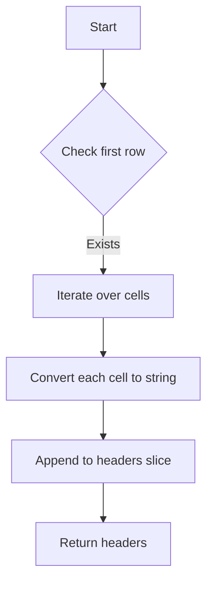

#### 4. Function dependencies (Mermaid)

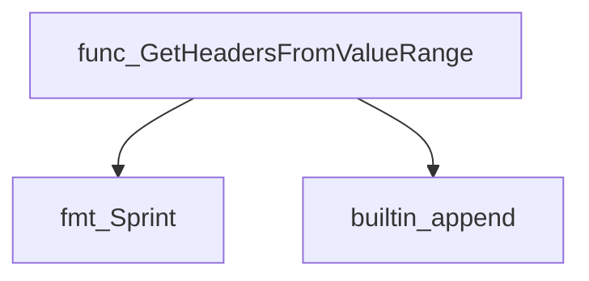

#### 5. Functions calling `GetHeadersFromValueRange` (Mermaid)

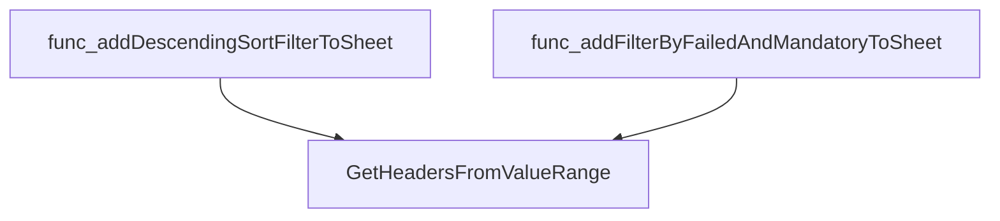

#### 6. Usage example (Go)

```go
// Minimal example invoking GetHeadersFromValueRange
package main

import (
    "fmt"
    sheets "google.golang.org/api/sheets/v4"
)

func main() {
    // Assume we already fetched values from a sheet
    var values *sheets.ValueRange
    // ... populate values ...

    headers := GetHeadersFromValueRange(values)
    fmt.Println("Sheet headers:", headers)
}
```

---

---

### GetSheetIDByName

**GetSheetIDByName** - Looks up a sheet’s internal ID within a Google Sheets spreadsheet using the sheet’s title.

#### Signature (Go)

```go
func GetSheetIDByName(spreadsheet *sheets.Spreadsheet, name string) (int64, error)
```

#### Summary Table

| Aspect | Details |
|--------|---------|
| **Purpose** | Looks up a sheet’s internal ID within a Google Sheets spreadsheet using the sheet’s title. |
| **Parameters** | `spreadsheet *sheets.Spreadsheet` – parsed spreadsheet data; `name string` – desired sheet title |
| **Return value** | `int64` – the matching sheet’s ID; `error` – nil on success or a descriptive error if not found |
| **Key dependencies** | - `fmt.Errorf` for error construction<br>- Iteration over `spreadsheet.Sheets` |
| **Side effects** | None (pure function) |
| **How it fits the package** | Enables other utilities to reference sheets by ID when constructing API requests (e.g., sorting or filtering). |

#### Internal workflow

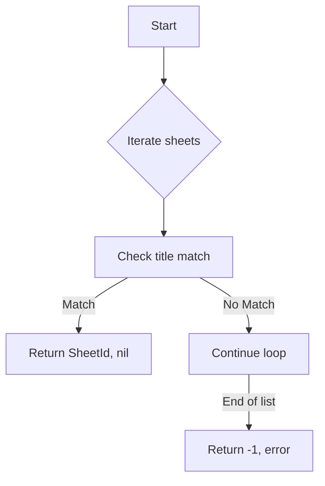

#### Function dependencies

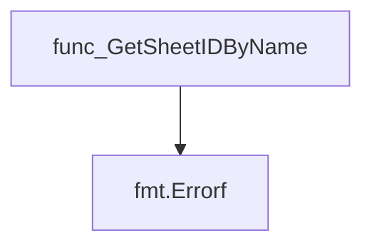

#### Functions calling `GetSheetIDByName`

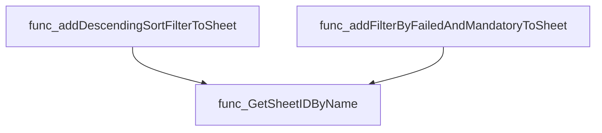

#### Usage example (Go)

```go
// Minimal example invoking GetSheetIDByName
import (
    "fmt"
    sheets "google.golang.org/api/sheets/v4"
)

func main() {
    // Assume `srv` is an authorized *sheets.Service and a spreadsheet has been fetched.
    srv := /* ... */
    ss, err := srv.Spreadsheets.Get("spreadsheetId").Do()
    if err != nil {
        panic(err)
    }

    sheetID, err := GetSheetIDByName(ss, "Results")
    if err != nil {
        fmt.Printf("Error: %v\n", err)
        return
    }
    fmt.Printf("Sheet ID for 'Results': %d\n", sheetID)
}
```

---

### MoveSpreadSheetToFolder

**MoveSpreadSheetToFolder** - Relocates an existing spreadsheet to a target Drive folder by updating its parent references.

```go
func MoveSpreadSheetToFolder(srv *drive.Service, folder *drive.File, spreadsheet *sheets.Spreadsheet) error
```

| Aspect | Details |
|--------|---------|
| **Purpose** | Relocates an existing spreadsheet to a target Drive folder by updating its parent references. |
| **Parameters** | `srv` – Google Drive service; `folder` – destination folder file metadata; `spreadsheet` – spreadsheet to move. |
| **Return value** | `error` – non‑nil if any API call fails or the file cannot be relocated. |
| **Key dependencies** | • `srv.Files.Get(...).Fields("parents").Do()` <br>• `srv.Files.Update(...).AddParents(folder.Id)`<br>• `updateCall.RemoveParents(parent)`<br>• `log.Fatalf` for fatal errors |
| **Side effects** | Calls Google Drive API to modify file parents; logs and exits on failure. |
| **How it fits the package** | Used after a spreadsheet is created to place it under the appropriate folder in the Drive hierarchy. |

#### Internal workflow

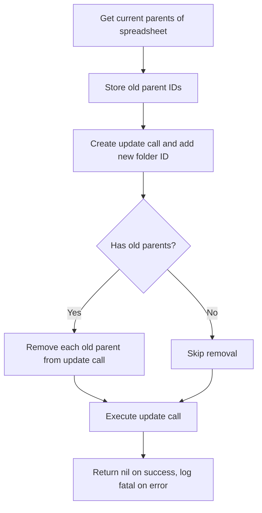

#### Function dependencies

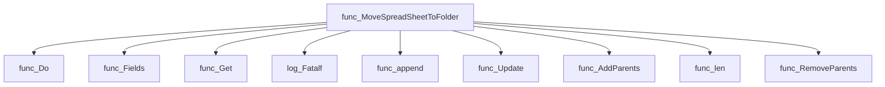

#### Functions calling `MoveSpreadSheetToFolder`

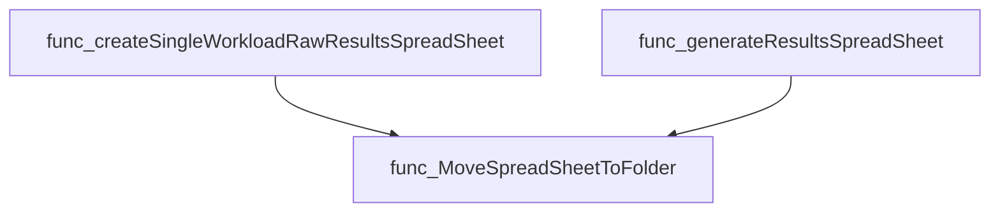

#### Usage example (Go)

```go
// Minimal example invoking MoveSpreadSheetToFolder
import (
    "github.com/googleapis/google-api-go-client/drive/v3"
    "google.golang.org/api/sheets/v4"
)

func example() error {
    // Assume srv, folder, and spreadsheet are already initialized.
    var srv *drive.Service   // Google Drive service
    var folder *drive.File   // Destination folder metadata
    var spreadsheet *sheets.Spreadsheet // Spreadsheet to move

    return MoveSpreadSheetToFolder(srv, folder, spreadsheet)
}
```

---

### NewCommand

**NewCommand** - Builds and configures the `uploadResultSpreadSheetCmd` Cobra command, defining its flags and marking required ones.

#### Signature (Go)

```go
func NewCommand() *cobra.Command
```

#### Summary Table

| Aspect | Details |
|--------|---------|
| **Purpose** | Builds and configures the `uploadResultSpreadSheetCmd` Cobra command, defining its flags and marking required ones. |
| **Parameters** | None |
| **Return value** | A fully configured `*cobra.Command` ready to be added to a parent command. |
| **Key dependencies** | • `uploadResultSpreadSheetCmd.Flags().StringVarP` – defines string flags.<br>• `uploadResultSpreadSheetCmd.MarkFlagRequired` – enforces required flags.<br>• `log.Fatalf` – logs fatal errors when flag validation fails. |
| **Side effects** | Modifies the global `uploadResultSpreadSheetCmd` variable by adding flags; may terminate the program via `log.Fatalf`. |
| **How it fits the package** | Provides the CLI entry point for uploading spreadsheets, used by the top‑level upload command. |

#### Internal workflow (Mermaid)

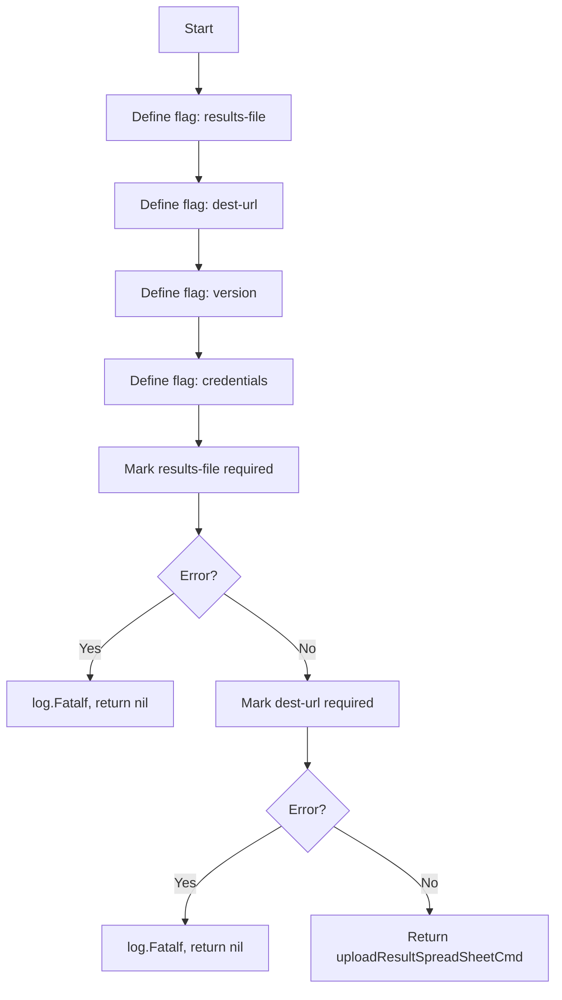

#### Function dependencies (Mermaid)

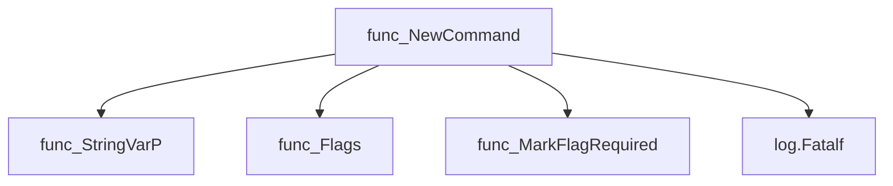

#### Functions calling `NewCommand` (Mermaid)

```mermaid
graph TD
  upload.NewCommand --> func_NewCommand
```

#### Usage example (Go)

```go
// Minimal example invoking NewCommand
package main

import (
    "github.com/redhat-best-practices-for-k8s/certsuite/cmd/certsuite/upload/results_spreadsheet"
)

func main() {
    cmd := results_spreadsheet.NewCommand()
    // Normally you would add this to a parent command and execute.
    _ = cmd
}
```

---

## Local Functions

### addBasicFilterToSpreadSheet

**addBasicFilterToSpreadSheet** - Iterates over all sheets within the provided `spreadsheet` and sets a basic filter covering each sheet’s full range. The function ensures that every tab has filtering enabled, enabling later sort or filter operations.

#### Signature (Go)

```go
func addBasicFilterToSpreadSheet(srv *sheets.Service, spreadsheet *sheets.Spreadsheet) error
```

#### Summary Table

| Aspect | Details |
|--------|---------|
| **Purpose** | Iterates over all sheets within the provided `spreadsheet` and sets a basic filter covering each sheet’s full range. The function ensures that every tab has filtering enabled, enabling later sort or filter operations. |
| **Parameters** | `srv *sheets.Service –` client for Google Sheets API; <br>`spreadsheet *sheets.Spreadsheet –` the spreadsheet to modify |
| **Return value** | `error –` non‑nil if any API call fails |
| **Key dependencies** | • Calls `append` on a slice of `*sheets.Request` <br>• Builds `SetBasicFilterRequest` and `BasicFilter` structs <br>• Invokes `srv.Spreadsheets.BatchUpdate(...).Do()` to apply changes |
| **Side effects** | Modifies the spreadsheet stored in Google Sheets by adding filters; performs a network request to the API. No local state is altered. |
| **How it fits the package** | Part of the results‑spreadsheet utility, this helper finalises the sheet layout before the application of more specific sort or filter rules (e.g., `addDescendingSortFilterToSheet`). It is called from `generateResultsSpreadSheet`. |

#### Internal workflow

```mermaid
flowchart TD
  A["Start"] --> B{"For each sheet in spreadsheet"}
  B --> C["Create SetBasicFilterRequest"]
  C --> D["Append to requests slice"]
  B --> E{"End loop"}
  E --> F["BatchUpdate API call"]
  F --> G{"Success?"}
  G -- Yes --> H["Return nil"]
  G -- No --> I["Return error"]
```

#### Function dependencies

```mermaid
graph TD
  func_addBasicFilterToSpreadSheet --> func_append
  func_addBasicFilterToSpreadSheet --> func_Do
  func_addBasicFilterToSpreadSheet --> func_BatchUpdate
```

#### Functions calling `addBasicFilterToSpreadSheet`

```mermaid
graph TD
  func_generateResultsSpreadSheet --> func_addBasicFilterToSpreadSheet
```

#### Usage example (Go)

```go
// Minimal example invoking addBasicFilterToSpreadSheet
srv, _ := sheets.NewService(ctx)
spreadsheet, _ := srv.Spreadsheets.Get("SPREADSHEET_ID").Do()
if err := addBasicFilterToSpreadSheet(srv, spreadsheet); err != nil {
    log.Fatalf("Failed to apply basic filters: %v", err)
}
```

---

---

### addDescendingSortFilterToSheet

**addDescendingSortFilterToSheet** - Sorts a specified column (`colName`) in descending order on the given sheet (`sheetName`) of a Google Sheets document.

#### Signature (Go)

```go
func addDescendingSortFilterToSheet(srv *sheets.Service, spreadsheet *sheets.Spreadsheet, sheetName, colName string) error
```

#### Summary Table

| Aspect | Details |
|--------|---------|
| **Purpose** | Sorts a specified column (`colName`) in descending order on the given sheet (`sheetName`) of a Google Sheets document. |
| **Parameters** | `srv *sheets.Service` – client for interacting with Google Sheets API.<br>`spreadsheet *sheets.Spreadsheet` – target spreadsheet object.<br>`sheetName string` – name of the sheet to sort.<br>`colName string` – header name of the column to sort by. |
| **Return value** | `error` – non‑nil if any step fails (e.g., API call errors, missing headers). |
| **Key dependencies** | • `srv.Spreadsheets.Values.Get(...).Do()`<br>• `GetHeadersFromValueRange`<br>• `GetHeaderIndicesByColumnNames`<br>• `GetSheetIDByName`<br>• `srv.Spreadsheets.BatchUpdate(...).Do()` |
| **Side effects** | Mutates the spreadsheet on Google Sheets by applying a sort operation; no local state changes. |
| **How it fits the package** | Used during result‑sheet generation to ensure the conclusion sheet is sorted by category before being presented to users. |

#### Internal workflow (Mermaid)

```mermaid
flowchart TD
  A["Get sheet values"] --> B["Extract headers"]
  B --> C["Find header index for colName"]
  C --> D["Retrieve sheet ID"]
  D --> E["Create SortRange request"]
  E --> F["BatchUpdate spreadsheet with sort"]
```

#### Function dependencies (Mermaid)

```mermaid
graph TD
  func_addDescendingSortFilterToSheet --> func_GetHeadersFromValueRange
  func_addDescendingSortFilterToSheet --> func_GetHeaderIndicesByColumnNames
  func_addDescendingSortFilterToSheet --> func_GetSheetIDByName
  func_addDescendingSortFilterToSheet --> srv.Spreadsheets.Values.Get
  func_addDescendingSortFilterToSheet --> srv.Spreadsheets.BatchUpdate
```

#### Functions calling `addDescendingSortFilterToSheet` (Mermaid)

```mermaid
graph TD
  func_generateResultsSpreadSheet --> func_addDescendingSortFilterToSheet
```

#### Usage example (Go)

```go
// Minimal example invoking addDescendingSortFilterToSheet
srv, _, err := CreateSheetsAndDriveServices(credentials)
if err != nil {
    log.Fatalf("Unable to create services: %v", err)
}

spreadsheet, err := srv.Spreadsheets.Get(spreadsheetID).Do()
if err != nil {
    log.Fatalf("Unable to retrieve spreadsheet: %v", err)
}

if err = addDescendingSortFilterToSheet(srv, spreadsheet, "Conclusion", "Category"); err != nil {
    log.Fatalf("Failed to apply descending sort filter: %v", err)
}
```

---

### addFilterByFailedAndMandatoryToSheet

**addFilterByFailedAndMandatoryToSheet** - Applies a basic filter to the specified sheet so that only rows where the *State* column equals `"failed"` and the *Mandatory/Optional* column equals `"Mandatory"` are displayed.

#### Signature (Go)

```go
func addFilterByFailedAndMandatoryToSheet(srv *sheets.Service, spreadsheet *sheets.Spreadsheet, sheetName string) error
```

#### Summary Table

| Aspect | Details |
|--------|---------|
| **Purpose** | Applies a basic filter to the specified sheet so that only rows where the *State* column equals `"failed"` and the *Mandatory/Optional* column equals `"Mandatory"` are displayed. |
| **Parameters** | `srv` – Google Sheets API service; `spreadsheet` – target spreadsheet object; `sheetName` – name of the sheet to filter. |
| **Return value** | `error` – non‑nil if any API call or header lookup fails. |
| **Key dependencies** | - `srv.Spreadsheets.Values.Get`<br>- `GetHeadersFromValueRange`<br>- `GetHeaderIndicesByColumnNames`<br>- `GetSheetIDByName`<br>- `srv.Spreadsheets.BatchUpdate` |
| **Side effects** | Sends a batch update request to Google Sheets, modifying the sheet’s filter settings. No local state is changed. |
| **How it fits the package** | Used during spreadsheet creation to pre‑configure the results view for end users, ensuring only relevant rows are visible by default. |

#### Internal workflow (Mermaid)

```mermaid
flowchart TD
    A["Retrieve sheet values"] --> B["Extract headers"]
    B --> C["Find column indices for State and Mandatory/Optional"]
    C --> D["Get sheet ID by name"]
    D --> E["Build filter request"]
    E --> F["Send batch update to Sheets API"]
```

#### Function dependencies (Mermaid)

```mermaid
graph TD
  func_addFilterByFailedAndMandatoryToSheet --> func_Do
  func_addFilterByFailedAndMandatoryToSheet --> func_Get
  func_addFilterByFailedAndMandatoryToSheet --> func_Errorf
  func_addFilterByFailedAndMandatoryToSheet --> func_GetHeadersFromValueRange
  func_addFilterByFailedAndMandatoryToSheet --> func_GetHeaderIndicesByColumnNames
  func_addFilterByFailedAndMandatoryToSheet --> func_GetSheetIDByName
  func_addFilterByFailedAndMandatoryToSheet --> func_BatchUpdate
```

#### Functions calling `addFilterByFailedAndMandatoryToSheet` (Mermaid)

```mermaid
graph TD
  func_createSingleWorkloadRawResultsSpreadSheet --> func_addFilterByFailedAndMandatoryToSheet
```

#### Usage example (Go)

```go
// Minimal example invoking addFilterByFailedAndMandatoryToSheet
package main

import (
 "log"

 sheets "google.golang.org/api/sheets/v4"
)

func main() {
 // Assume srv is an authenticated *sheets.Service and spreadsheet has been created.
 var srv *sheets.Service      // initialized elsewhere
 var spreadsheet *sheets.Spreadsheet // previously created
 sheetName := "results"

 if err := addFilterByFailedAndMandatoryToSheet(srv, spreadsheet, sheetName); err != nil {
  log.Fatalf("failed to apply filter: %v", err)
 }
}
```

---

### createConclusionsSheet

**createConclusionsSheet** - Builds a new Google Sheets tab that lists each unique workload from the raw results, including category, version, OCP version, and a hyperlink to a dedicated results spreadsheet.

#### Signature (Go)

```go
func createConclusionsSheet(
    sheetsService *sheets.Service,
    driveService  *drive.Service,
    rawResultsSheet *sheets.Sheet,
    mainResultsFolderID string,
) (*sheets.Sheet, error)
```

#### Summary Table

| Aspect | Details |
|--------|---------|
| **Purpose** | Builds a new Google Sheets tab that lists each unique workload from the raw results, including category, version, OCP version, and a hyperlink to a dedicated results spreadsheet. |
| **Parameters** | `sheetsService *sheets.Service` – client for Sheets API.<br>`driveService *drive.Service` – client for Drive API.<br>`rawResultsSheet *sheets.Sheet` – sheet containing raw test data.<br>`mainResultsFolderID string` – ID of the parent folder where results will be stored. |
| **Return value** | `(*sheets.Sheet, error)` – the constructed conclusion sheet or an error if processing fails. |
| **Key dependencies** | • `createDriveFolder` – creates a sub‑folder for per‑workload spreadsheets.<br>• `GetHeadersFromSheet`, `GetHeaderIndicesByColumnNames` – locate columns in raw data.<br>• `createSingleWorkloadRawResultsSpreadSheet` – generates individual workload result files and returns their URLs. |
| **Side effects** | • Creates a Drive folder “Results Per Workload”.<br>• Calls Sheets API to build the conclusion sheet (but does not upload it).<br>• Generates hyperlinks that reference newly created spreadsheets. |
| **How it fits the package** | Part of the spreadsheet generation pipeline; invoked by `generateResultsSpreadSheet` after creating the raw results sheet, and before assembling the final workbook. |

#### Internal workflow (Mermaid)

```mermaid
flowchart TD
    A["Start"] --> B["Create “Results Per Workload” folder"]
    B --> C["Read headers from rawResultsSheet"]
    C --> D["Get indices for workload name/type/version"]
    D --> E{"Validate data exists"}
    E -- No --> F["Return error: no workloads"]
    E -- Yes --> G["Iterate rows to gather unique workload names"]
    G --> H["For each unique name"]
    H --> I["Build row values (category, version, OCP, name)"]
    I --> J["Create single workload results spreadsheet"]
    J --> K["Insert hyperlink formula into Results column"]
    K --> L["Append row to conclusionsSheetRows"]
    L --> M["Repeat for next workload"]
    M --> N["Assemble final Sheet object with headers and rows"]
    N --> O["Return conclusionSheet"]
```

#### Function dependencies (Mermaid)

```mermaid
graph TD
  createConclusionsSheet --> createDriveFolder
  createConclusionsSheet --> GetHeadersFromSheet
  createConclusionsSheet --> GetHeaderIndicesByColumnNames
  createConclusionsSheet --> createSingleWorkloadRawResultsSpreadSheet
```

#### Functions calling `createConclusionsSheet` (Mermaid)

```mermaid
graph TD
  generateResultsSpreadSheet --> createConclusionsSheet
```

#### Usage example (Go)

```go
// Minimal example invoking createConclusionsSheet
package main

import (
    "log"
    "github.com/google/go-github/v50/github" // placeholder for actual imports
    resultsspreadsheet "github.com/redhat-best-practices-for-k8s/certsuite/cmd/certsuite/upload/results_spreadsheet"
)

func main() {
    // Assume sheetsService, driveService are already authenticated clients.
    var sheetsService *sheets.Service   // initialized elsewhere
    var driveService  *drive.Service    // initialized elsewhere

    rawSheet := &sheets.Sheet{ /* populated with raw test data */ }
    parentFolderID := "root-folder-id"

    conclusionSheet, err := resultsspreadsheet.CreateConclusionsSheet(
        sheetsService,
        driveService,
        rawSheet,
        parentFolderID,
    )
    if err != nil {
        log.Fatalf("Failed to create conclusions sheet: %v", err)
    }

    // conclusionSheet can now be added to a spreadsheet or further processed.
}
```

*Note:* The example omits authentication and actual data population for brevity.

---

### createDriveFolder

**createDriveFolder** - Creates a sub‑folder under the specified `parentFolderID` with the name `folderName`. If a folder of that name already exists in the parent, an error is returned.

#### Signature (Go)

```go
func createDriveFolder(srv *drive.Service, folderName, parentFolderID string) (*drive.File, error)
```

#### Summary Table

| Aspect | Details |
|--------|---------|
| **Purpose** | Creates a sub‑folder under the specified `parentFolderID` with the name `folderName`. If a folder of that name already exists in the parent, an error is returned. |
| **Parameters** | *srv – Google Drive service client <br>*folderName – desired folder title <br> *parentFolderID – ID of the parent folder |
| **Return value** | *drive.File – metadata of the created folder (or `nil` on error) <br> error – description if creation or lookup fails |
| **Key dependencies** | • `fmt.Sprintf`, `fmt.Errorf` <br> • `srv.Files.List()`, `.Q()`, `.Fields()` <br> • `srv.Files.Create()` <br> • `len(files.Files)` check |
| **Side effects** | Network calls to Google Drive API: listing existing files and creating a new folder. No local state is mutated. |
| **How it fits the package** | Utility used by higher‑level spreadsheet generation functions to organize results into folders on Drive before uploading sheets. |

#### Internal workflow (Mermaid)

```mermaid
flowchart TD
  A["Build File metadata"] --> B["Construct query string"]
  B --> C["List files in parent folder"]
  C --> D{"Folder exists?"}
  D -- Yes --> E["Return error “folder already exists”"]
  D -- No --> F["Create new folder"]
  F --> G["Return created folder"]
```

#### Function dependencies (Mermaid)

```mermaid
graph TD
  func_createDriveFolder --> fmt.Sprintf
  func_createDriveFolder --> fmt.Errorf
  func_createDriveFolder --> srv.Files.List
  func_createDriveFolder --> Q
  func_createDriveFolder --> Fields
  func_createDriveFolder --> Do
  func_createDriveFolder --> len
  func_createDriveFolder --> srv.Files.Create
```

#### Functions calling `createDriveFolder` (Mermaid)

```mermaid
graph TD
  func_createConclusionsSheet --> func_createDriveFolder
  func_generateResultsSpreadSheet --> func_createDriveFolder
```

#### Usage example (Go)

```go
// Minimal example invoking createDriveFolder
package main

import (
 "log"

 "google.golang.org/api/drive/v3"
)

func main() {
 // Assume srv is an authorized *drive.Service.
 var srv *drive.Service // placeholder for actual service creation

 parentID := "root"      // ID of the folder under which to create
 folderName := "Results" // Desired sub‑folder name

 folder, err := createDriveFolder(srv, folderName, parentID)
 if err != nil {
  log.Fatalf("Failed to create folder: %v", err)
 }
 log.Printf("Created folder ID: %s", folder.Id)
}
```

---

### createRawResultsSheet

**createRawResultsSheet** - Reads a CSV file and converts its contents into a `*sheets.Sheet` suitable for inclusion in a Google Spreadsheet.

#### Signature (Go)

```go
func createRawResultsSheet(fp string) (*sheets.Sheet, error)
```

#### Summary Table

| Aspect | Details |
|--------|---------|
| **Purpose** | Reads a CSV file and converts its contents into a `*sheets.Sheet` suitable for inclusion in a Google Spreadsheet. |
| **Parameters** | `fp string – Path to the CSV file to be processed.` |
| **Return value** | `(*sheets.Sheet, error) – The constructed sheet or an error if reading/conversion fails.` |
| **Key dependencies** | • `readCSV` – Loads raw CSV records.<br>• `prepareRecordsForSpreadSheet` – Formats records into Google Sheets row data.<br>• `fmt.Errorf` – Wraps errors. |
| **Side effects** | No global state changes; only I/O occurs when opening the file via `readCSV`. |
| **How it fits the package** | Provides the raw results sheet that later functions (e.g., `createConclusionsSheet`) consume to build a full test‑results spreadsheet. |

#### Internal workflow

```mermaid
flowchart TD
  A["Start"] --> B{"Read CSV"}
  B --> C{"Error?"}
  C -- Yes --> D["Return error"]
  C -- No --> E["Prepare rows"]
  E --> F["Build Sheet struct"]
  F --> G["Return sheet"]
```

#### Function dependencies

```mermaid
graph TD
  func_createRawResultsSheet --> func_readCSV
  func_createRawResultsSheet --> func_prepareRecordsForSpreadSheet
  func_createRawResultsSheet --> fmt.Errorf
```

#### Functions calling `createRawResultsSheet`

```mermaid
graph TD
  func_generateResultsSpreadSheet --> func_createRawResultsSheet
```

#### Usage example (Go)

```go
// Minimal example invoking createRawResultsSheet
package main

import (
    "log"

    "github.com/redhat-best-practices-for-k8s/certsuite/cmd/certsuite/upload/results_spreadsheet"
)

func main() {
    sheet, err := resultsspreadsheet.createRawResultsSheet("results.csv")
    if err != nil {
        log.Fatalf("Failed to create raw results sheet: %v", err)
    }
    // sheet can now be added to a spreadsheet via the Google Sheets API
    _ = sheet
}
```

---

### createSingleWorkloadRawResultsSheet

**createSingleWorkloadRawResultsSheet** - Builds a new sheet containing only the rows that belong to `workloadName`. The resulting sheet keeps all original columns from `rawResultsSheet` and prefixes two extra columns: “Owner/TechLead Conclusion” and “Next Step Actions”.

#### Signature (Go)

```go
func createSingleWorkloadRawResultsSheet(rawResultsSheet *sheets.Sheet, workloadName string) (*sheets.Sheet, error)
```

#### Summary Table

| Aspect | Details |
|--------|---------|
| **Purpose** | Builds a new sheet containing only the rows that belong to `workloadName`. The resulting sheet keeps all original columns from `rawResultsSheet` and prefixes two extra columns: “Owner/TechLead Conclusion” and “Next Step Actions”. |
| **Parameters** | `rawResultsSheet *sheets.Sheet` – source spreadsheet with multiple workloads.<br>`workloadName string` – name of the workload to filter. |
| **Return value** | `(*sheets.Sheet, error)` – the filtered sheet or an error if the workload cannot be found or headers are missing. |
| **Key dependencies** | • `stringToPointer` (twice) – helper for converting strings to pointers.<br>• `append` – building new row slices.<br>• `GetHeadersFromSheet` – extracts header names from a sheet.<br>• `GetHeaderIndicesByColumnNames` – finds the column index of “CNFName”.<br>• `fmt.Errorf` – error formatting. |
| **Side effects** | No global state is mutated; only the returned sheet is constructed. |
| **How it fits the package** | Used by `createSingleWorkloadRawResultsSpreadSheet` to produce a per‑workload results spreadsheet before uploading to Google Sheets. |

#### Internal workflow (Mermaid)

```mermaid
flowchart TD
  A["Start"] --> B{"Create header row with two new columns"}
  B --> C["Append original headers from raw sheet"]
  C --> D["Get index of CNFName"]
  D --> E{"Iterate over data rows"}
  E -->|"Row matches workload"| F["Prepend empty cells for new columns"]
  E -->|"Row does not match"| G["Skip row"]
  F --> H["Add to filteredRows"]
  G --> H
  H --> I["Build sheets.Sheet struct"]
  I --> J["Return sheet, nil"]
```

#### Function dependencies (Mermaid)

```mermaid
graph TD
  func_createSingleWorkloadRawResultsSheet --> func_stringToPointer
  func_createSingleWorkloadRawResultsSheet --> func_GetHeadersFromSheet
  func_createSingleWorkloadRawResultsSheet --> func_GetHeaderIndicesByColumnNames
  func_createSingleWorkloadRawResultsSheet --> fmt_Errorf
```

#### Functions calling `createSingleWorkloadRawResultsSheet` (Mermaid)

```mermaid
graph TD
  func_createSingleWorkloadRawResultsSpreadSheet --> func_createSingleWorkloadRawResultsSheet
```

#### Usage example (Go)

```go
// Minimal example invoking createSingleWorkloadRawResultsSheet
rawSheet := &sheets.Sheet{ /* populate with data containing multiple workloads */ }
workloadName := "example-workload"

filtered, err := createSingleWorkloadRawResultsSheet(rawSheet, workloadName)
if err != nil {
    log.Fatalf("Failed to filter sheet: %v", err)
}

// filtered now contains only rows for 'example-workload' plus two new columns.
```

---

### createSingleWorkloadRawResultsSpreadSheet

**createSingleWorkloadRawResultsSpreadSheet** - Builds a new Google Sheets file containing only the rows that belong to `workloadName`, adds two extra columns for conclusions and next‑step AI, applies filtering on failed/mandatory tests, moves the sheet into the specified Drive folder, and returns the created spreadsheet.

```go
func createSingleWorkloadRawResultsSpreadSheet(sheetService *sheets.Service, driveService *drive.Service, folder *drive.File, rawResultsSheet *sheets.Sheet, workloadName string) (*sheets.Spreadsheet, error)
```

| Aspect | Details |
|--------|---------|
| **Purpose** | Builds a new Google Sheets file containing only the rows that belong to `workloadName`, adds two extra columns for conclusions and next‑step AI, applies filtering on failed/mandatory tests, moves the sheet into the specified Drive folder, and returns the created spreadsheet. |
| **Parameters** | `sheetService *sheets.Service` – Google Sheets API client<br>`driveService *drive.Service` – Google Drive API client<br>`folder *drive.File` – Destination folder in Drive<br>`rawResultsSheet *sheets.Sheet` – Sheet with all raw test results<br>`workloadName string` – Name of the workload to isolate |
| **Return value** | `(*sheets.Spreadsheet, error)` – The created spreadsheet or an error. |
| **Key dependencies** | • `createSingleWorkloadRawResultsSheet` – prepares sheet data.<br>• `addFilterByFailedAndMandatoryToSheet` – applies a filter on the sheet.<br>• `MoveSpreadSheetToFolder` – relocates the file in Drive.<br>• Standard library: `fmt`, `log`. |
| **Side effects** | Creates a new spreadsheet via Sheets API, updates its properties, adds filter requests, and moves the file in Drive. Logs creation message to stdout. |
| **How it fits the package** | This helper is used by `createConclusionsSheet` to generate individual result files for each workload before linking them in the main conclusions sheet. |

#### Internal workflow

```mermaid
flowchart TD
    A["Call createSingleWorkloadRawResultsSheet"] --> B["Receive sheet data"]
    B --> C["Build Spreadsheet object with title and sheet"]
    C --> D["Create spreadsheet via Sheets API"]
    D --> E["Apply filter on “results” sheet"]
    E --> F["Move spreadsheet into Drive folder"]
    F --> G["Log creation message"]
    G --> H["Return created spreadsheet or error"]
```

#### Function dependencies

```mermaid
graph TD
  func_createSingleWorkloadRawResultsSpreadSheet --> func_createSingleWorkloadRawResultsSheet
  func_createSingleWorkloadRawResultsSpreadSheet --> func_addFilterByFailedAndMandatoryToSheet
  func_createSingleWorkloadRawResultsSpreadSheet --> func_MoveSpreadSheetToFolder
```

#### Functions calling `createSingleWorkloadRawResultsSpreadSheet`

```mermaid
graph TD
  func_createConclusionsSheet --> func_createSingleWorkloadRawResultsSpreadSheet
```

#### Usage example

```go
// Minimal example invoking createSingleWorkloadRawResultsSpreadSheet
package main

import (
    "log"

    sheets "google.golang.org/api/sheets/v4"
    drive "google.golang.org/api/drive/v3"

    "github.com/redhat-best-practices-for-k8s/certsuite/cmd/certsuite/upload/results_spreadsheet"
)

func main() {
    // Assume srvSheets, srvDrive are initialized *sheets.Service and *drive.Service
    var srvSheets *sheets.Service
    var srvDrive *drive.Service

    // Folder where the new spreadsheet should be placed
    folder := &drive.File{Id: "folder-id"}

    // Raw results sheet obtained elsewhere
    rawSheet := &sheets.Sheet{}

    workloadName := "my-workload"

    ss, err := results_spreadsheet.createSingleWorkloadRawResultsSpreadSheet(srvSheets, srvDrive, folder, rawSheet, workloadName)
    if err != nil {
        log.Fatalf("Failed to create spreadsheet: %v", err)
    }
    log.Printf("Spreadsheet created: %s\n", ss.SpreadsheetUrl)
}
```

---

### extractFolderIDFromURL

**extractFolderIDFromURL** - Parses a Google Drive shareable URL and returns the last path segment, which is the folder ID.

Extracts the folder identifier from a Google Drive URL.

#### Signature (Go)

```go
func extractFolderIDFromURL(u string) (string, error)
```

#### Summary Table

| Aspect | Details |
|--------|---------|
| **Purpose** | Parses a Google Drive shareable URL and returns the last path segment, which is the folder ID. |
| **Parameters** | `u string` – the full URL to parse. |
| **Return value** | `string` – the extracted folder ID; `error` if URL parsing fails. |
| **Key dependencies** | • `net/url.Parse`<br>• `strings.Split`<br>• Built‑in `len` function |
| **Side effects** | None (pure function). |
| **How it fits the package** | Utility for locating a root folder in Google Drive before creating or moving spreadsheets. |

#### Internal workflow (Mermaid)

```mermaid
flowchart TD
  A["Receive URL string"] --> B["Parse URL with net/url.Parse"]
  B --> C{"Parsing success?"}
  C -- No --> D["Return empty string and error"]
  C -- Yes --> E["Split parsedURL.Path by /"]
  E --> F["Select last segment as folder ID"]
  F --> G["Return folder ID, nil"]
```

#### Function dependencies (Mermaid)

```mermaid
graph TD
  func_extractFolderIDFromURL --> func_Parse(net/url)
  func_extractFolderIDFromURL --> func_Split(strings)
  func_extractFolderIDFromURL --> len(built‑in)
```

#### Functions calling `extractFolderIDFromURL` (Mermaid)

```mermaid
graph TD
  func_generateResultsSpreadSheet --> func_extractFolderIDFromURL
```

#### Usage example (Go)

```go
// Minimal example invoking extractFolderIDFromURL
url := "https://drive.google.com/drive/folders/1a2B3cD4e5F6g7H8i9J0"
folderID, err := extractFolderIDFromURL(url)
if err != nil {
    log.Fatalf("failed to get folder ID: %v", err)
}
fmt.Println("Folder ID:", folderID)
```

---

### generateResultsSpreadSheet

**generateResultsSpreadSheet** - Orchestrates the creation of a spreadsheet that stores raw test output and derived conclusions, uploads it to Google Drive, and applies filtering/sorting.

#### Signature (Go)

```go
func generateResultsSpreadSheet()
```

#### Summary Table

| Aspect | Details |
|--------|---------|
| **Purpose** | Orchestrates the creation of a spreadsheet that stores raw test output and derived conclusions, uploads it to Google Drive, and applies filtering/sorting. |
| **Parameters** | None |
| **Return value** | None – errors are handled by logging fatal messages which terminate the program. |
| **Key dependencies** | • `CreateSheetsAndDriveServices` – obtains Sheets & Drive clients<br>• `extractFolderIDFromURL` – parses root folder ID from a URL<br>• `createDriveFolder` – creates destination folders in Drive<br>• `createRawResultsSheet` – builds the raw data sheet from CSV<br>• `createConclusionsSheet` – builds the summary sheet<br>• `MoveSpreadSheetToFolder` – relocates the spreadsheet into the target folder<br>• `addBasicFilterToSpreadSheet`, `addDescendingSortFilterToSheet` – apply UI filters |
| **Side effects** | • Creates Google Drive folders and a spreadsheet.<br>• Logs progress and fatal errors to standard output.<br>• Writes no local files; all operations are network‑based. |
| **How it fits the package** | Acts as the entry point for the `resultsspreadsheet` command, wiring together lower‑level helpers to produce a ready‑to‑share artifact. |

#### Internal workflow (Mermaid)

```mermaid
flowchart TD
  A["Start"] --> B["Create Sheets & Drive services"]
  B --> C["Parse root folder ID"]
  C --> D["Create main results folder"]
  D --> E["Generate raw results sheet"]
  E --> F["Generate conclusions sheet"]
  F --> G["Build spreadsheet object"]
  G --> H["Upload spreadsheet to Google Sheets"]
  H --> I["Move spreadsheet into Drive folder"]
  I --> J["Apply basic filter"]
  J --> K["Apply descending sort on “Category” column"]
  K --> L["Print success URL"]
```

#### Function dependencies (Mermaid)

```mermaid
graph TD
  func_generateResultsSpreadSheet --> CreateSheetsAndDriveServices
  func_generateResultsSpreadSheet --> extractFolderIDFromURL
  func_generateResultsSpreadSheet --> createDriveFolder
  func_generateResultsSpreadSheet --> createRawResultsSheet
  func_generateResultsSpreadSheet --> createConclusionsSheet
  func_generateResultsSpreadSheet --> MoveSpreadSheetToFolder
  func_generateResultsSpreadSheet --> addBasicFilterToSpreadSheet
  func_generateResultsSpreadSheet --> addDescendingSortFilterToSheet
```

#### Functions calling `generateResultsSpreadSheet` (Mermaid)

None – this function is currently not referenced elsewhere in the package.

#### Usage example (Go)

```go
// The function has no exported interface; it is invoked internally when running the command.
// A minimal example would simply call it from a main routine after setting required globals.
func main() {
    // Assume credentials, rootFolderURL, resultsFilePath, ocpVersion are set globally.
    generateResultsSpreadSheet()
}
```

---

---

### prepareRecordsForSpreadSheet

**prepareRecordsForSpreadSheet** - Transforms a 2‑D slice of string values (`records`) into a slice of `*sheets.RowData` suitable for populating a Google Sheets spreadsheet. It normalises cell content by truncating overly long strings, replacing line breaks with spaces, and ensuring empty cells contain a single space to avoid layout issues.

#### Signature (Go)

```go
func prepareRecordsForSpreadSheet(records [][]string) []*sheets.RowData
```

#### Summary Table

| Aspect | Details |
|--------|---------|
| **Purpose** | Transforms a 2‑D slice of string values (`records`) into a slice of `*sheets.RowData` suitable for populating a Google Sheets spreadsheet. It normalises cell content by truncating overly long strings, replacing line breaks with spaces, and ensuring empty cells contain a single space to avoid layout issues. |
| **Parameters** | `records [][]string – raw CSV rows (each row is a slice of column values)` |
| **Return value** | `[]*sheets.RowData – formatted rows ready for the Sheets API` |
| **Key dependencies** | • `len` (builtin) <br>• `strings.ReplaceAll` (twice per cell) <br>• `append` (for building slices) |
| **Side effects** | No external I/O or state mutation; purely functional transformation. |
| **How it fits the package** | Used by `createRawResultsSheet` to prepare data before creating a raw results sheet in the spreadsheet upload process. |

#### Internal workflow

```mermaid
flowchart TD
  A["Start"] --> B{"Iterate rows"}
  B --> C["Create empty rowData slice"]
  B --> D["Iterate columns"]
  D --> E{"Check length > limit"}
  E -- Yes --> F["Truncate to cellContentLimit"]
  E -- No --> G["Keep original"]
  D --> H{"Empty string?"}
  H -- Yes --> I["val ="]
  H -- No --> J["val = column value"]
  D --> K["Replace \r\n and \n with space"]
  K --> L["rowData append CellData(val)"]
  C --> M["rows append RowData(rowData)"]
  B --> N{"All rows processed"}
  N --> O["Return rows"]
```

#### Function dependencies

```mermaid
graph TD
  func_prepareRecordsForSpreadSheet --> len
  func_prepareRecordsForSpreadSheet --> strings.ReplaceAll
  func_prepareRecordsForSpreadSheet --> append
```

#### Functions calling `prepareRecordsForSpreadSheet`

```mermaid
graph TD
  createRawResultsSheet --> func_prepareRecordsForSpreadSheet
```

#### Usage example (Go)

```go
// Minimal example invoking prepareRecordsForSpreadSheet
records := [][]string{
    {"Name", "Age"},
    {"Alice", "30"},
    {"Bob", ""},
}
rows := prepareRecordsForSpreadSheet(records)
// rows can now be used to populate a Google Sheets GridData structure.
```

---

### readCSV

**readCSV** - Loads the contents of a CSV file located at the given path and returns all rows as a two‑dimensional slice of strings.

#### Signature (Go)

```go
func readCSV(string) ([][]string, error)
```

#### Summary Table

| Aspect | Details |
|--------|---------|
| **Purpose** | Loads the contents of a CSV file located at the given path and returns all rows as a two‑dimensional slice of strings. |
| **Parameters** | `fp string` – File system path to the CSV file. |
| **Return value** | `[][]string` – Slice of records (each record is a slice of fields).<br>`error` – Error encountered during opening, reading, or parsing the file. |
| **Key dependencies** | • `os.Open` – opens the file.<br>• `file.Close()` – ensures the file descriptor is released.<br>• `csv.NewReader` – creates a CSV reader for the file.<br>• `reader.ReadAll` – parses all records from the file. |
| **Side effects** | • Opens and subsequently closes the specified file.<br>• No modification of global state or external systems. |
| **How it fits the package** | Utility function used by higher‑level spreadsheet generation routines to ingest raw test results stored in CSV format. |

#### Internal workflow (Mermaid)

```mermaid
flowchart TD
  A["Open file at fp"] --> B{"Error?"}
  B -- No --> C["Create csv.Reader"]
  C --> D["ReadAll records"]
  D --> E{"Error?"}
  E -- No --> F["Return records, nil"]
  B -- Yes --> G["Return nil, err"]
  E -- Yes --> H["Return nil, err"]
```

#### Function dependencies (Mermaid)

```mermaid
graph TD
  func_readCSV --> os.Open
  func_readCSV --> file.Close
  func_readCSV --> csv.NewReader
  func_readCSV --> reader.ReadAll
```

#### Functions calling `readCSV` (Mermaid)

```mermaid
graph TD
  func_createRawResultsSheet --> func_readCSV
```

#### Usage example (Go)

```go
// Minimal example invoking readCSV
records, err := readCSV("/path/to/results.csv")
if err != nil {
    log.Fatalf("failed to read CSV: %v", err)
}
fmt.Printf("Read %d rows\n", len(records))
```

---
