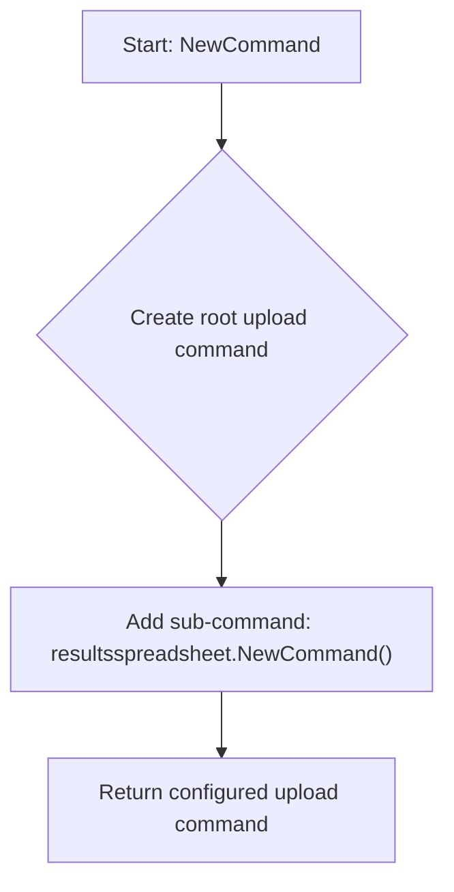
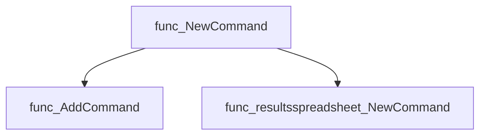
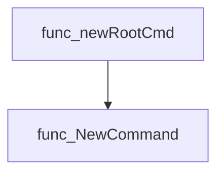

# Package upload

**Path**: `cmd/certsuite/upload`

## Table of Contents

- [Overview](#overview)
- [Exported Functions](#exported-functions)
  - [NewCommand](#newcommand)

## Overview

The `upload` package supplies a Cobra command that serves as the root for uploading results spreadsheets to cloud storage within the certsuite CLI.

### Key Features

- Provides an exported `NewCommand` function that creates the top‑level upload command and aggregates sub‑commands for handling spreadsheet uploads.
- Integrates with the `results_spreadsheet` subpackage to perform the actual upload logic.
- Uses Cobra conventions, enabling easy extension and consistent CLI behavior.
-

### Design Notes

- Relies on Cobra’s command hierarchy; only one exported constructor (`NewCommand`) is provided.
- The package does not expose any structs or interfaces, keeping the API surface minimal.
- Best practice: invoke `upload.NewCommand()` from the main command setup to register the upload functionality.

### Exported Functions Summary

| Name | Purpose |
|------|----------|
| [func NewCommand() *cobra.Command](#newcommand) | Constructs and returns a Cobra command representing the `upload` sub‑command of certsuite. It aggregates sub‑commands that handle uploading results spreadsheets to cloud storage. |

## Exported Functions

### NewCommand

**NewCommand** - Constructs and returns a Cobra command representing the `upload` sub‑command of certsuite. It aggregates sub‑commands that handle uploading results spreadsheets to cloud storage.

#### Signature (Go)

```go
func NewCommand() *cobra.Command
```

#### Summary Table

| Aspect | Details |
|--------|---------|
| **Purpose** | Constructs and returns a Cobra command representing the `upload` sub‑command of certsuite. It aggregates sub‑commands that handle uploading results spreadsheets to cloud storage. |
| **Parameters** | None |
| **Return value** | A pointer to a configured `*cobra.Command`. The returned command contains child commands for specific upload operations (e.g., spreadsheet uploads). |
| **Key dependencies** | • Calls `upload.AddCommand(resultsspreadsheet.NewCommand())`<br>• Relies on the Cobra library (`github.com/spf13/cobra`) to create and manage sub‑commands. |
| **Side effects** | No global state mutation; only creates a new command hierarchy in memory. |
| **How it fits the package** | This function is the entry point for the `upload` feature, exposing it as part of the top‑level certsuite CLI. It registers its child commands so that users can run `certsuite upload ...`. |

#### Internal workflow (Mermaid)



#### Function dependencies (Mermaid)



#### Functions calling `NewCommand` (Mermaid)



#### Usage example (Go)

```go
// Minimal example invoking NewCommand to obtain the upload command.
package main

import (
 "github.com/redhat-best-practices-for-k8s/certsuite/cmd/certsuite/upload"
)

func main() {
 uploadCmd := upload.NewCommand()
 // uploadCmd can now be added to a root Cobra command or executed directly.
}
```

---
