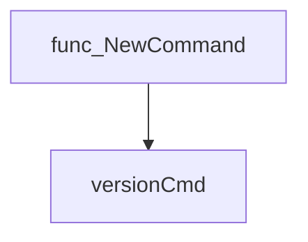
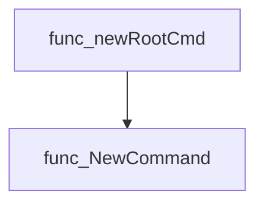
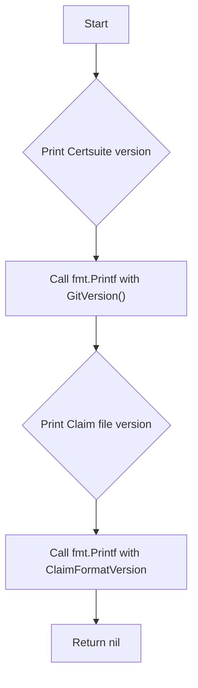
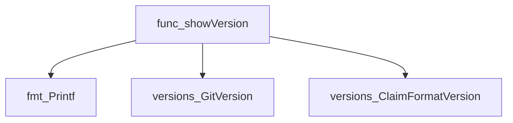

# Package version

**Path**: `cmd/certsuite/version`

## Table of Contents

- [Overview](#overview)
- [Exported Functions](#exported-functions)
  - [NewCommand](#newcommand)
- [Local Functions](#local-functions)
  - [showVersion](#showversion)

## Overview

Provides the `certsuite version` CLI subcommand that outputs the binary’s Git‑based build information and the supported claim file format version.

### Key Features

- Creates a pre‑configured Cobra command for displaying version details
- Utilises the external versions package to obtain the Git commit hash and claim format

### Design Notes

- The command is constructed via an exported factory function (`NewCommand`) rather than being defined globally
- It depends on the `github.com/redhat-best-practices-for-k8s/certsuite/pkg/versions` package for version strings
- Users should invoke `NewCommand()` during root command initialization to register the subcommand

### Exported Functions Summary

| Name | Purpose |
|------|----------|
| [func NewCommand() *cobra.Command](#newcommand) | Returns a pre‑configured `*cobra.Command` that implements the `certsuite version` CLI command. |

### Local Functions Summary

| Name | Purpose |
|------|----------|
| [func showVersion(cmd *cobra.Command, _ []string) error](#showversion) | Displays the binary’s Git‑based version string and the supported claim file format version. |

## Exported Functions

### NewCommand

**NewCommand** - Returns a pre‑configured `*cobra.Command` that implements the `certsuite version` CLI command.


#### Signature (Go)
```go
func NewCommand() *cobra.Command
```

#### Summary Table
| Aspect | Details |
|--------|---------|
| **Purpose** | Returns a pre‑configured `*cobra.Command` that implements the `certsuite version` CLI command. |
| **Parameters** | None |
| **Return value** | A pointer to a `cobra.Command` instance (`versionCmd`) that is defined elsewhere in this package. |
| **Key dependencies** | * Uses the global variable `versionCmd` from the same package.<br>* Relies on the Cobra library for command handling. |
| **Side effects** | None – simply returns an existing object; no state changes or I/O occur within the function itself. |
| **How it fits the package** | Provides a public factory used by the root command builder (`newRootCmd`) to register the `version` sub‑command in the CLI application. |

#### Internal workflow (Mermaid)


#### Function dependencies (Mermaid)
None – this function is currently not referenced elsewhere in the package.

#### Functions calling `NewCommand` (Mermaid)


#### Usage example (Go)
```go
// Minimal example invoking NewCommand
cmd := version.NewCommand()
fmt.Println(cmd.Use)   // prints "version"
```

---

## Local Functions

### showVersion

**showVersion** - Displays the binary’s Git‑based version string and the supported claim file format version.

Prints the current Certsuite and Claim file version information to standard output.

```go
func showVersion(cmd *cobra.Command, _ []string) error
```

| Aspect | Details |
|--------|---------|
| **Purpose** | Displays the binary’s Git‑based version string and the supported claim file format version. |
| **Parameters** | `cmd *cobra.Command` – command context (unused); `_ []string` – positional arguments (ignored). |
| **Return value** | `error` – always `nil`; the function is intended for side‑effects only. |
| **Key dependencies** | • `fmt.Printf` to write to stdout.<br>• `github.com/redhat-best-practices-for-k8s/certsuite/pkg/versions.GitVersion()` for the build metadata.<br>• `github.com/redhat-best-practices-for-k8s/certsuite/pkg/versions.ClaimFormatVersion` constant. |
| **Side effects** | Writes two formatted lines to standard output; no state mutation or concurrency. |
| **How it fits the package** | Used by the CLI’s “version” sub‑command to expose build information to users. |

#### Internal workflow


#### Function dependencies


#### Functions calling `showVersion`
None – this function is currently not referenced elsewhere in the package.

#### Usage example (Go)
```go
// Minimal example invoking showVersion
package main

import (
	"github.com/spf13/cobra"
)

func main() {
	cmd := &cobra.Command{}
	if err := showVersion(cmd, nil); err != nil {
		panic(err)
	}
}
```

---

