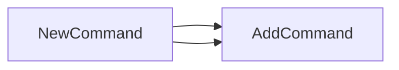

## Package check (github.com/redhat-best-practices-for-k8s/certsuite/cmd/certsuite/check)

# Package `check`

The **`check`** package is a thin wrapper that stitches together the CLI commands for CertSuite’s
*image‑certificate* checks and result handling.  
It lives under `github.com/redhat-best-practices-for-k8s/certsuite/cmd/certsuite/check`.

---

## Global state

| Name      | Type (inferred) | Purpose |
|-----------|-----------------|---------|
| `checkCmd` | `*cobra.Command` | Root command that will be returned by `NewCommand`. It is the entry point for all sub‑commands added in this package. |

> The variable is unexported because it is only used internally when constructing the root
> command tree.

---

## Key function

### `NewCommand() *cobra.Command`

```go
func NewCommand() *cobra.Command
```

* **What it does**  
  - Instantiates a new `checkCmd` root command (via its zero value, which is a `cobra.Command`).  
  - Adds sub‑commands from the two internal packages:
    - `image_cert_status.NewCommand()` – handles checks against image certificates.
    - `results.NewCommand()` – deals with displaying or storing test results.  
  - Returns the fully built command tree so that it can be wired into the top‑level CertSuite CLI.

* **How it works**  

```go
func NewCommand() *cobra.Command {
    // Add subcommands to the root
    checkCmd.AddCommand(image_cert_status.NewCommand())
    checkCmd.AddCommand(results.NewCommand())

    return checkCmd
}
```

  Each `AddCommand` call registers a new child command, allowing users to run e.g.
  
  ```bash
  certsuite check image-cert-status …   # delegated to image_cert_status package
  certsuite check results …             # delegated to results package
  ```

* **Dependencies**  

| Dependency | Why it is needed |
|------------|-----------------|
| `github.com/spf13/cobra` | Provides the command‑line framework. |
| `image_cert_status.NewCommand()` | Supplies the image‑certificate check subcommand. |
| `results.NewCommand()` | Supplies the results subcommand. |

---

## How everything connects

```
certsuite (top level)
  └── check
        ├─ NewCommand() → returns *cobra.Command
        │    ├─ rootCmd := checkCmd
        │    ├─ add image_cert_status.NewCommand()
        │    └─ add results.NewCommand()
        └── sub‑commands:
             ├─ image-cert-status (from image_cert_status package)
             └─ results              (from results package)
```

The `check` command acts purely as a *command router*; it does not contain business logic itself.  
All real functionality lives in the two imported packages, each of which follows the same
Cobra pattern for defining flags and execution logic.

---

## Summary

- **Global**: `checkCmd` – the root Cobra command.
- **Function**: `NewCommand()` builds the command tree by attaching sub‑commands from
  `image_cert_status` and `results`.
- The package itself is a lightweight glue layer; all heavy lifting happens in its child packages.

### Functions

- **NewCommand** — func()(*cobra.Command)

### Globals


### Call graph (exported symbols, partial)



### Symbol docs

- [function NewCommand](symbols/function_NewCommand.md)
