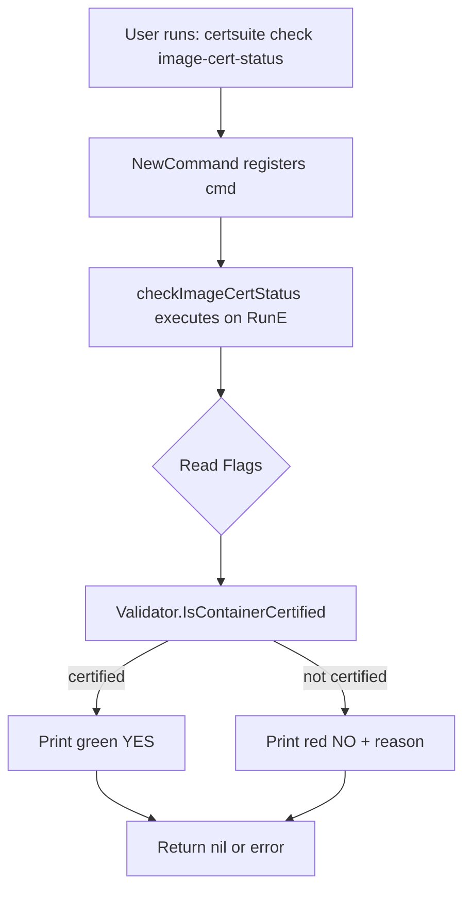
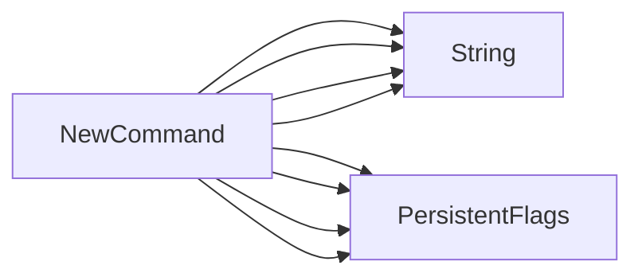

## Package imagecert (github.com/redhat-best-practices-for-k8s/certsuite/cmd/certsuite/check/image_cert_status)

## `imagecert` Package – Overview

| Topic | Summary |
|-------|---------|
| **Purpose** | Implements the `check image-cert-status` command for CertSuite, reporting whether a container image is certified and what policy it satisfies. |
| **Key Exported API** | `NewCommand() *cobra.Command` – creates the Cobra command that gets wired into CertSuite’s CLI tree. |
| **Internal State** | A single unexported global variable: `checkImageCertStatusCmd`, a `*cobra.Command`. |

---

### Global Variable

```go
var checkImageCertStatusCmd *cobra.Command
```

- Holds the command instance created by `NewCommand`.
- Used only internally; not exposed to other packages.

---

### Core Functions

#### 1. `checkImageCertStatus(cmd *cobra.Command, args []string) error`

* **Role** – The actual execution logic for the command.  
* **Workflow**:
  1. **Read Flags** – Uses `cmd.Flags().GetString(...)` to obtain values for
     - `image`
     - `registry-url`
     - `policy-name`
     - `policy-version`
  2. **Validation** – Calls `cmd.GetValidator()` (from the `certdb` package) and checks that the provided image is certified:
     ```go
     if err := validator.IsContainerCertified(image, registryURL, policyName, policyVersion); err != nil {
         // error handling
     }
     ```
  3. **Output** – Prints human‑readable status using `fmt` and color helpers from `github.com/fatih/color`.  
     - Certified → green “YES”
     - Not certified → red “NO” plus reason.
  4. **Error Handling** – Returns descriptive errors for missing flags or validation failures.

#### 2. `NewCommand() *cobra.Command`

* **Role** – Constructs and configures the Cobra command that will be registered under CertSuite’s CLI tree.  
* **Key Steps**:
  - Instantiates `checkImageCertStatusCmd` with usage, short description, and the RunE handler set to `checkImageCertStatus`.
  - Declares persistent flags (`image`, `registry-url`, `policy-name`, `policy-version`) using `cmd.PersistentFlags().String(...)`.
  - Enforces flag rules:
    * `MarkFlagsRequiredTogether` – ensures that `image` is always supplied with the other three flags.
    * `MarkFlagsMutuallyExclusive` – guarantees no conflicting combinations (e.g., image vs. registry only).
* **Return** – The fully configured command pointer.

---

### How Things Connect



1. **CLI entry point** (`certsuite check image-cert-status`) triggers Cobra’s command lookup.
2. `NewCommand` supplies the command definition to Cobra during initialization.
3. When executed, `checkImageCertStatus` pulls flag values, delegates certification logic to `certdb.Validator`, and formats output.

---

### Dependencies

| Package | Role |
|---------|------|
| `github.com/fatih/color` | ANSI color helpers for terminal output. |
| `github.com/redhat-best-practices-for-k8s/oct/pkg/certdb` | Provides the `Validator` interface and certification logic. |
| `github.com/spf13/cobra` | CLI framework; handles command registration, flag parsing, and execution flow. |

---

### Summary

The `imagecert` package is a thin wrapper around CertSuite’s validation engine that exposes a user‑friendly CLI subcommand. It relies on Cobra for argument handling and `certdb.Validator` for the actual certification check, presenting results with colorized console output. The design keeps all state local to the command instance (`checkImageCertStatusCmd`) and offers no exported types beyond the constructor.

### Functions

- **NewCommand** — func()(*cobra.Command)

### Globals


### Call graph (exported symbols, partial)



### Symbol docs

- [function NewCommand](symbols/function_NewCommand.md)
