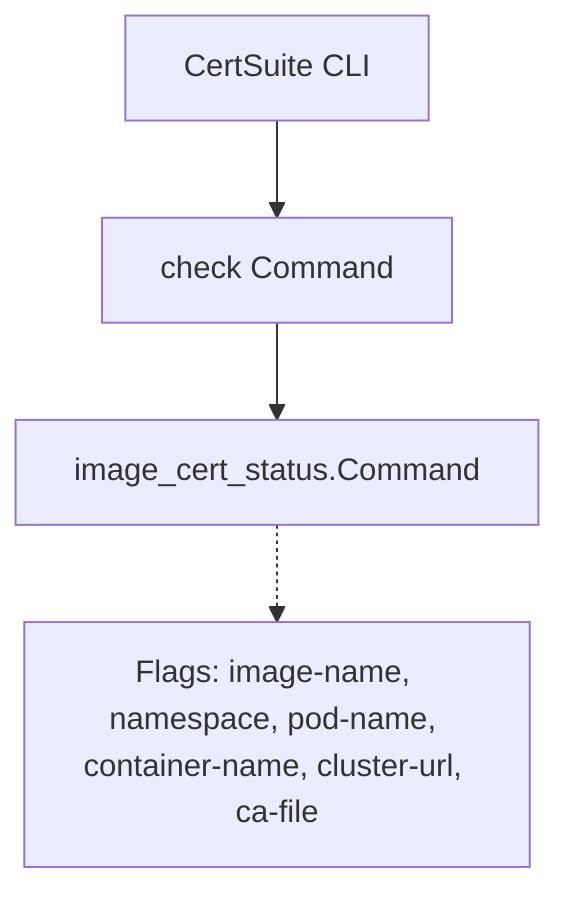

NewCommand` – CLI entry point for the *image‑cert‑status* sub‑command

```go
func NewCommand() (*cobra.Command)
```

---

## Purpose  
Creates and configures a **Cobra** command that checks the status of container image certificates.  
The returned `*cobra.Command` is intended to be added to the top‑level *check* command of the CertSuite CLI.

---

## Inputs / Outputs  

| Parameter | Type | Description |
|-----------|------|-------------|
| none | – | The function receives no arguments; all configuration comes from package‑wide defaults and flag values. |

| Return value | Type | Meaning |
|--------------|------|---------|
| `*cobra.Command` | pointer to a Cobra command | Fully configured command ready for execution. Returns `nil` only if an internal error occurs (which never happens in the current implementation). |

---

## Key Flag Configuration  

The function registers **six persistent string flags** on the command:

| Flag name | Description |
|-----------|-------------|
| `--image-name` | Target image name to inspect. |
| `--namespace` | Kubernetes namespace where the image is deployed. |
| `--pod-name` | Pod name that runs the target container. |
| `--container-name` | Specific container inside the pod. |
| `--cluster-url` | URL of the cluster API server (optional; may default to in‑cluster config). |
| `--ca-file` | Path to a custom CA bundle for TLS verification. |

> **Flag relationships**  
> *All six flags are required together* – the command will fail if any subset is omitted.  
> Flags are also marked as *mutually exclusive*, preventing conflicting combinations (e.g., specifying both `--pod-name` and `--container-name` without a namespace).

These constraints are enforced via:

```go
MarkFlagsRequiredTogether(...)
MarkFlagsMutuallyExclusive(...)
```

---

## Dependencies & Side Effects  

| Dependency | Role |
|------------|------|
| `github.com/spf13/cobra` | Provides the command structure, flag handling, and execution plumbing. |
| Global variable `checkImageCertStatusCmd` | Holds the constructed command; used elsewhere in the package to register sub‑commands. |

The function has **no observable side effects** beyond populating the global variable. It does not modify any external state or perform I/O.

---

## Package Context  

*Package*: `imagecert` (path:  
`github.com/redhat-best-practices-for-k8s/certsuite/cmd/certsuite/check/image_cert_status`)  

This package implements a single sub‑command of the CertSuite CLI that verifies whether a container image has an appropriate certificate attached. `NewCommand` is the public entry point that creates this command; callers typically invoke it during application bootstrap:

```go
checkCmd.AddCommand(imagecert.NewCommand())
```

---

## Suggested Mermaid Diagram (Optional)



This visual clarifies how the command fits into the overall CLI hierarchy.
