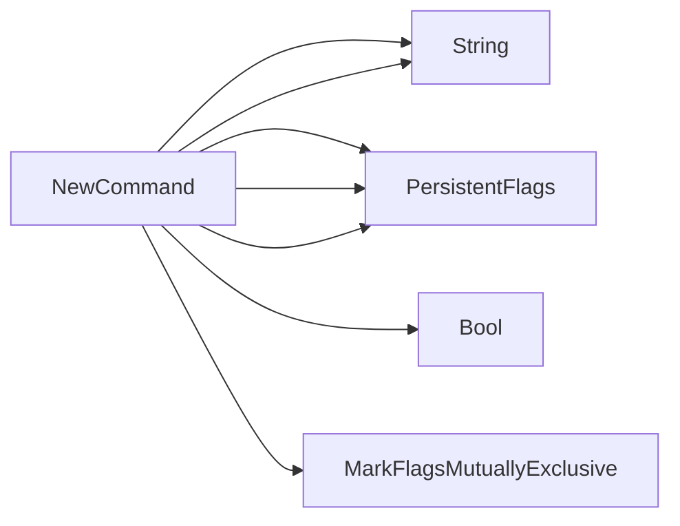

## Package results (github.com/redhat-best-practices-for-k8s/certsuite/cmd/certsuite/check/results)

### Structs

- **TestCaseList** (exported) — 3 fields, 0 methods
- **TestResults** (exported) — 1 fields, 0 methods

### Functions

- **NewCommand** — func()(*cobra.Command)

### Globals

### Call graph (exported symbols, partial)

### Symbol docs

- [struct TestCaseList](symbols/struct_TestCaseList.md)
- [struct TestResults](symbols/struct_TestResults.md)
- [function NewCommand](symbols/function_NewCommand.md)
