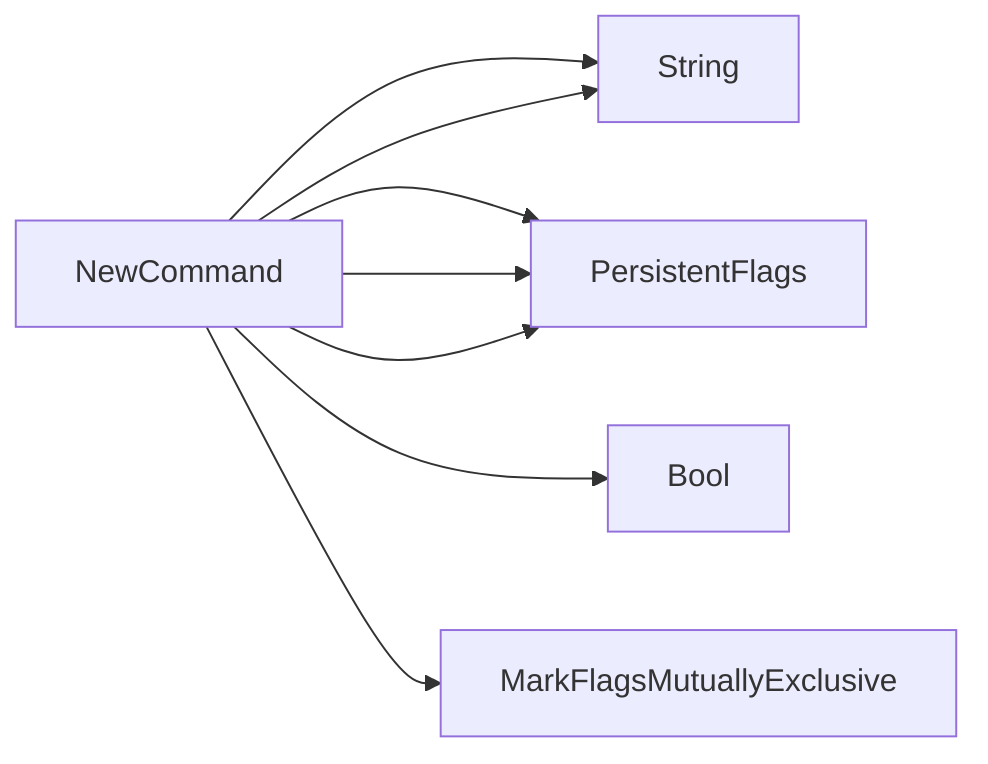

## Package results (github.com/redhat-best-practices-for-k8s/certsuite/cmd/certsuite/check/results)

## Overview of the **results** package

The `results` command is a sub‑command of the Certsuite CLI that compares current test results with an expected baseline, optionally generating a YAML template for new or updated expectations.

| Area | Summary |
|------|---------|
| **Purpose** | Load the latest test result file (`*.db`) and an optional expected result file (`*.yaml`), compare them, report mismatches, and exit with status 1 if any are found. It also can create a template YAML containing the current results. |
| **Core Data Structures** | `TestCaseList`, `TestResults` (wrapper) |
| **Key Globals / Constants** | `checkResultsCmd` (internal Cobra command), file name/permission constants, result status strings |
| **Primary Functions** | `NewCommand`, `checkResults`, `getTestResultsDB`, `getExpectedTestResults`, `generateTemplateFile`, `printTestResultsMismatch` |

---

### Data Structures

```go
type TestCaseList struct {
    Fail []string // test names that failed
    Pass []string // test names that passed
    Skip []string // test names that were skipped
}
```

*Used only as a payload container for YAML output.*

```go
type TestResults struct {
    embedded TestCaseList // anonymous field; exported via TestResults itself
}
```

`TestResults` is the top‑level structure used when marshalling to YAML.  
Because `embedded` is an anonymous field, its fields are promoted and can be accessed directly as `r.Fail`, `r.Pass`, etc.

> **Note:** No methods are defined on these structs; they serve purely for data representation.

---

### Global Variables & Constants

| Name | Type | Purpose |
|------|------|---------|
| `checkResultsCmd` | *cobra.Command* (unexported) | Holds the Cobra command object created in `NewCommand`. |
| `TestResultsTemplateFileName` | string | `"results-template.yaml"` – default output name for a generated template. |
| `TestResultsTemplateFilePermissions` | os.FileMode | `0644` – file permissions for generated YAML. |
| `resultPass`, `resultFail`, `resultSkip`, `resultMiss` | string | Literal result markers used when parsing the DB (`"PASS"`, `"FAIL"`, `"SKIP"`, `"MISS"`). |

---

### Command Wiring

```go
func NewCommand() *cobra.Command {
    // create & configure a new Cobra command:
    //   - flags: --results-file, --expected-results-file, --generate-template
    //   - mutually exclusive flag enforcement
    //   - run function set to checkResults
}
```

`NewCommand()` returns the configured `*cobra.Command`.  
The actual logic is in `checkResults`, which is assigned as the command’s `RunE`.

---

### Execution Flow (`checkResults`)

1. **Read flags** – results file path, expected results file path, generate‑template flag.
2. **Load current DB** via `getTestResultsDB`.
3. If a template is requested:
   * Build a map of test case → result string.
   * Call `generateTemplateFile` to write YAML.
4. Otherwise, load the expected YAML with `getExpectedTestResults`.
5. Compare each test case:
   * Collect mismatches into slices for failed and missed tests.
6. If mismatches exist:
   * Print a formatted table via `printTestResultsMismatch`.
   * Exit with status 1 (`os.Exit(1)`).
7. If everything matches, simply exit with status 0.

---

### Supporting Helpers

| Function | Role |
|----------|------|
| **`getTestResultsDB(dbPath string)`** | Opens the DB file, scans line‑by‑line, parses each test case and its result using a regex (`^(\S+)\s+(\w+)$`). Builds a `map[string]string`. Handles I/O errors. |
| **`getExpectedTestResults(filePath string)`** | Reads YAML into a map via `yaml.Unmarshal`. Returns an error if file missing or malformed. |
| **`generateTemplateFile(results map[string]string)`** | Marshals the results map to indented YAML, writes it to disk with defined permissions. Handles write errors. |
| **`printTestResultsMismatch(failures []string, expected, actual map[string]string)`** | Pretty‑prints mismatches: for each failed test, shows expected vs actual values; also lists missing tests (present in DB but not in expected). Uses `fmt.Printf`, `strings.Repeat`. |

---

### Example Workflow

```bash
# Compare current results against an existing template
certsuite check results \
    --results-file=/tmp/test.db \
    --expected-results-file=baseline.yaml

# Generate a new template from the latest DB
certsuite check results \
    --results-file=/tmp/test.db \
    --generate-template
```

If any test result diverges, the command prints something like:

```
Test results mismatch:
  ────────────────────────────────
  TestA: expected PASS, got FAIL
  TestB: expected SKIP, got PASS
  ...
```

and exits with status 1.

---

### Suggested Mermaid Diagram

```mermaid
flowchart TD
    A[User] -->|runs certsuite check results| B(checkResultsCmd)
    B --> C{flags}
    C -->|--results-file| D[getTestResultsDB]
    C -->|--expected-results-file| E[getExpectedTestResults]
    C -->|--generate-template| F[generateTemplateFile]
    D --> G{compare}
    G -->|mismatch| H[printTestResultsMismatch] --> I[os.Exit(1)]
    G -->|no mismatch| J[exit 0]
```

---

**Bottom line:**  
The package provides a lightweight, flag‑driven tool for validating that the current state of test results matches a stored expectation, with convenient support for generating those expectations. All logic is read‑only; the package never mutates any global state beyond the command object itself.

### Structs

- **TestCaseList** (exported) — 3 fields, 0 methods
- **TestResults** (exported) — 1 fields, 0 methods

### Functions

- **NewCommand** — func()(*cobra.Command)

### Globals


### Call graph (exported symbols, partial)



### Symbol docs

- [struct TestCaseList](symbols/struct_TestCaseList.md)
- [struct TestResults](symbols/struct_TestResults.md)
- [function NewCommand](symbols/function_NewCommand.md)
