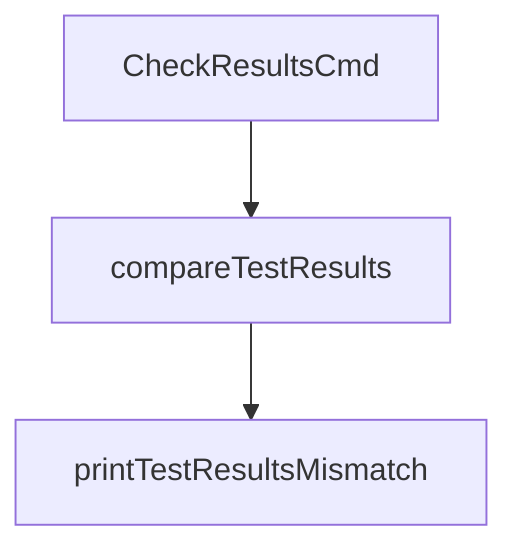

printTestResultsMismatch`

| Item | Details |
|------|---------|
| **Package** | `github.com/redhat-best-practices-for-k8s/certsuite/cmd/certsuite/check/results` |
| **Visibility** | Unexported (`private`) – used only within this file. |
| **Signature** | `func([]string, map[string]string, map[string]string)()` |

---

## Purpose

`printTestResultsMismatch` is a helper that formats and writes a human‑readable summary of test result mismatches to the standard output.  
It is invoked when the command line tool has detected differences between expected and actual results for one or more tests.

The function receives:

1. **`mismatchTests []string`** – list of test names that had a mismatch.
2. **`expected map[string]string`** – mapping from test name to its *expected* result string (`pass`, `fail`, etc.).
3. **`actual   map[string]string`** – mapping from test name to its *actual* result string.

The function does not return any value; it only prints diagnostic information.

---

## How It Works

1. **Header**  
   ```go
   fmt.Printf("Test results mismatch\n")
   fmt.Println(strings.Repeat("-", 30))
   ```
   A title and a separator line are printed first.

2. **Per‑test comparison**  
   For each test in `mismatchTests` the function prints:
   * Test name (left‑aligned, width = 30)
   * Expected result (`%s`)
   * Actual result (`%s`)  

   Example row:  
   ```
   my-test-name                 : pass -> fail
   ```

3. **Footer**  
   A final line of dashes is printed to visually close the block.

---

## Dependencies

| Dependency | Role |
|------------|------|
| `fmt.Printf`, `fmt.Println` | Standard I/O formatting and printing. |
| `strings.Repeat` | Generates repeated dash characters for separators. |

No external packages or global state are used.

---

## Side Effects

* Writes to **standard output** (`os.Stdout`) via the `fmt` functions.
* Does **not modify** any of its arguments (all reads only).
* Has no return value; it simply performs I/O.

---

## Relationship to Package

Within the *results* command, this function is called by the higher‑level logic that compares two sets of test results (e.g., expected vs. actual).  
It is intentionally small and focused so that its behavior can be unit‑tested independently if needed.



---
