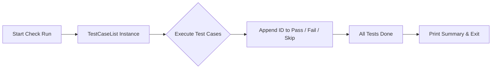

TestCaseList` – Package‑wide Result Aggregator

### Overview
`TestCaseList` is a lightweight container used throughout the **certsuite** command‑line tool to keep track of test case outcomes after a validation run.  
It lives in the `results` package (`github.com/redhat-best-practices-for-k8s/certsuite/cmd/certsuite/check/results`) and is exported so that other packages (e.g., the main CLI, report generators, or external tools) can read test status data.

```
type TestCaseList struct {
    Fail []string // IDs of test cases that failed
    Pass []string // IDs of test cases that passed
    Skip []string // IDs of test cases that were skipped
}
```

### Purpose & Typical Usage
- **Aggregation** – After executing a suite of tests, each test case reports its result. The caller appends the test ID to one of the three slices.
- **Reporting** – Higher‑level modules iterate over `Pass`, `Fail`, and `Skip` to produce human‑readable summaries or JSON/CSV exports.
- **Metrics** – Counts (`len(t.Fail)`, etc.) feed into overall pass/fail ratios displayed in CLI output.

The struct is deliberately minimal: it holds only the raw lists of identifiers. No methods are defined; all manipulation occurs via direct field access by consumers.

### Dependencies & Side‑Effects
| Dependency | Effect |
|------------|--------|
| `strings` (or other ID format helpers) | Not part of this type, but callers often use string utilities to format IDs before appending. |
| No external packages are imported in this file; the struct is self‑contained. |

Because it contains only slices of strings, there are **no side effects** beyond normal Go slice semantics:
- Appending to a field can reallocate the underlying array.
- Sorting or deduplication must be performed by callers if required.

### Integration with the Package
`TestCaseList` is used as follows in the broader `check` command:

1. A `TestCaseList` instance is created at the start of a check run.  
2. Each test case function (e.g., `CheckAPIVersion`, `CheckRBAC`) returns its status and appends its ID to the appropriate slice.
3. After all tests finish, the main command iterates over the slices to print results and exit with a non‑zero status if any failures exist.

A simple Mermaid diagram illustrating this flow:



### Summary
- **Exported**: Yes – other packages can read/write the slices.
- **No methods**: Interaction is purely field assignment.
- **Key role**: Central repository for test outcomes, enabling reporting and exit‑code logic across the certsuite tool.

---
