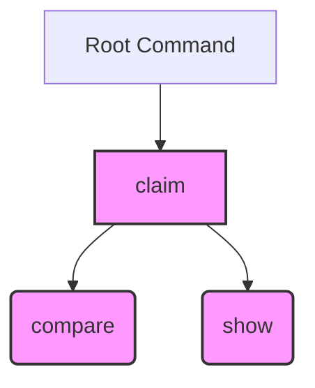
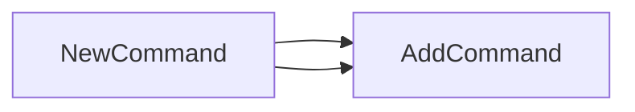

## Package claim (github.com/redhat-best-practices-for-k8s/certsuite/cmd/certsuite/claim)

# Overview – `github.com/redhat-best-practices-for-k8s/certsuite/cmd/certsuite/claim`

This package implements the **`certsuite claim`** top‑level CLI command that bundles two sub‑commands:

| Sub‑command | Purpose |
|-------------|---------|
| `compare`   | Compare a certificate against a reference set. (implemented in `cmd/certsuite/claim/compare`) |
| `show`      | Show information about a certificate claim. (implemented in `cmd/certsuite/claim/show`) |

The package itself contains only a single exported constructor (`NewCommand`) that creates the Cobra command hierarchy.

---

## Key Elements

### Global Variables
- **`claimCommand`**  
  A package‑level variable that holds the `*cobra.Command` instance returned by `NewCommand`. It is not exported, so other packages refer to it only through the returned value from `NewCommand`.

### Exported Functions
| Function | Signature | Responsibility |
|----------|-----------|----------------|
| **`NewCommand()`** | `func() *cobra.Command` | Builds a new Cobra command called `"claim"`. It registers two sub‑commands (`compare.NewCommand()` and `show.NewCommand()`) using `AddCommand`. The function returns the fully constructed command so that it can be attached to the root CLI in `cmd/certsuite/main.go`. |

### Internal Flow
1. **Construction**  
   `NewCommand` creates a new Cobra command with `Use: "claim"` and a brief description.  
2. **Sub‑command Registration**  
   It calls `AddCommand` twice, passing the constructors from the `compare` and `show` subpackages:
   ```go
   claimCmd.AddCommand(compare.NewCommand())
   claimCmd.AddCommand(show.NewCommand())
   ```
3. **Return**  
   The fully built command is returned to the caller.

---

## Relationship Diagram (Mermaid)



- **Root** – The main `certsuite` command (defined elsewhere).  
- **Claim** – This package’s command.  
- **Compare / Show** – Sub‑commands provided by their respective subpackages.

---

## Summary

The `claim` package is intentionally lightweight: it merely stitches together the two functional sub‑commands (`compare` and `show`) under a common parent command using Cobra. All logic for certificate comparison or display resides in the dedicated subpackages; this file only orchestrates the CLI hierarchy.

### Functions

- **NewCommand** — func()(*cobra.Command)

### Globals


### Call graph (exported symbols, partial)



### Symbol docs

- [function NewCommand](symbols/function_NewCommand.md)
