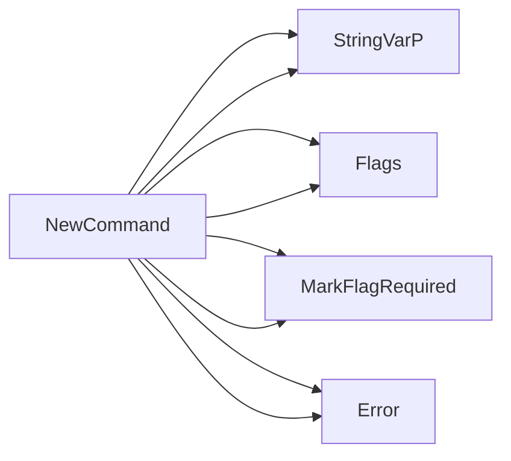

## Package compare (github.com/redhat-best-practices-for-k8s/certsuite/cmd/certsuite/claim/compare)

## Overview of the `github.com/redhat-best-practices-for-k8s/certsuite/cmd/certsuite/claim/compare` package

The **compare** command is a CLI sub‑command that compares two claim files (JSON documents) and prints a diff report.  
It lives under the main `certsuite` binary, inside the *claim* namespace.

| Section | What you’ll find |
|---------|------------------|
| **Globals** | Flags for the two file paths (`Claim1FilePathFlag`, `Claim2FilePathFlag`) and an internal function variable (`claimCompareFiles`). |
| **Key Functions** | `NewCommand()` – builds the cobra command. <br> `claimCompare()` – Cobra handler that triggers a compare. <br> `claimCompareFilesfunc()` – does the heavy lifting of reading, unmarshalling and diffing two files. <br> `unmarshalClaimFile()` – JSON → `claim.Schema`. |
| **Flow** | 1️⃣ User runs: `certsuite claim compare --claim1=foo.json --claim2=bar.json`  <br> 2️⃣ Cobra parses flags, passes them to `claimCompareFilesfunc`. <br> 3️⃣ The function reads the files, converts them into `claim.Schema`, calls `Compare()` (from the `claim` package), prints a summary and diff report. |

---

### Globals

| Name | Type | Purpose |
|------|------|---------|
| `Claim1FilePathFlag` | `string` | Stores the path to the first claim file (flag: `--claim1`). |
| `Claim2FilePathFlag` | `string` | Stores the path to the second claim file (flag: `--claim2`). |
| `claimCompareFiles` | function variable | Holds a reference to the compare routine. It can be swapped for testing (`nil` in production). |

The flags are bound via `StringVarP` inside `NewCommand()` and marked required with `MarkFlagRequired`.

---

### Core Functions

#### 1. `NewCommand() (*cobra.Command)`

* Builds the Cobra command named **compare**.  
* Sets usage, short description, long help (`longHelp`).  
* Registers two required string flags (`claim1`, `claim2`) that populate the globals above.  
* Assigns the handler `claimCompare`.  

```go
cmd := &cobra.Command{
    Use:   "compare",
    Short: "Compares two claim files",
    RunE:  claimCompare,
}
```

#### 2. `claimCompare(cmd *cobra.Command, args []string) error`

* Called by Cobra when the user executes `certsuite claim compare`.  
* Delegates to `claimCompareFilesfunc` using the global flag values.  
* Any error is logged with `log.Fatal`.

```go
err := claimCompareFilesfunc(Claim1FilePathFlag, Claim2FilePathFlag)
if err != nil {
    log.Fatal(err)
}
```

#### 3. `claimCompareFilesfunc(claim1Path, claim2Path string) error`

The heart of the command:

| Step | Action |
|------|--------|
| **Read** | `os.ReadFile` for each file; errors wrapped with `fmt.Errorf`. |
| **Unmarshal** | Calls `unmarshalClaimFile` to convert JSON bytes into a `claim.Schema`. |
| **Compare** | `claim.Compare(schema1, schema2)` – returns a boolean diff flag and a report string. |
| **Output** | Prints a summary line (“The claims are X the same”) followed by three diff reports (`GetDiffReport`) and finally the raw report. |

All I/O is done through `fmt.Print*`, making it easy to redirect output.

#### 4. `unmarshalClaimFile(data []byte) (claim.Schema, error)`

Simple wrapper around `json.Unmarshal`. Returns a populated `claim.Schema` or an error if JSON is invalid.

---

### How the Pieces Connect

```mermaid
graph TD;
    User[CLI] -->|--claim1 X --claim2 Y| NewCommand();
    NewCommand() --> claimCompare();
    claimCompare() --> claimCompareFilesfunc(Claim1FilePathFlag, Claim2FilePathFlag);
    claimCompareFilesfunc() --> ReadFile(); 
    ReadFile() --> unmarshalClaimFile();
    unmarshalClaimFile() --> claim.Compare();
    claim.Compare() --> Output;
```

* **Flags → globals**: `StringVarP` stores the paths into the two global string variables.  
* **Command handler → compare function**: `claimCompare` is wired as the Cobra `RunE`.  
* **Compare routine → diff logic**: The function reads, unmarshals and delegates to `claim.Compare`, then prints a user‑friendly report.

---

### Key Takeaways

| Aspect | Detail |
|--------|--------|
| **Modularity** | Comparison logic lives in `claimCompareFilesfunc`; it can be unit‑tested independently. |
| **Extensibility** | The global `claimCompareFiles` variable could be overridden for mocks or alternative comparison strategies. |
| **Error handling** | Errors are wrapped with context and surfaced via `log.Fatal`, halting the command on failure. |
| **Output** | Simple console prints; no JSON output, just human‑readable diff reports. |

This package is intentionally lightweight: it merely glues together flag parsing, file I/O, JSON unmarshalling, and the core claim comparison logic defined in the `claim` subpackage.

### Functions

- **NewCommand** — func()(*cobra.Command)

### Globals

- **Claim1FilePathFlag**: string
- **Claim2FilePathFlag**: string

### Call graph (exported symbols, partial)



### Symbol docs

- [function NewCommand](symbols/function_NewCommand.md)
