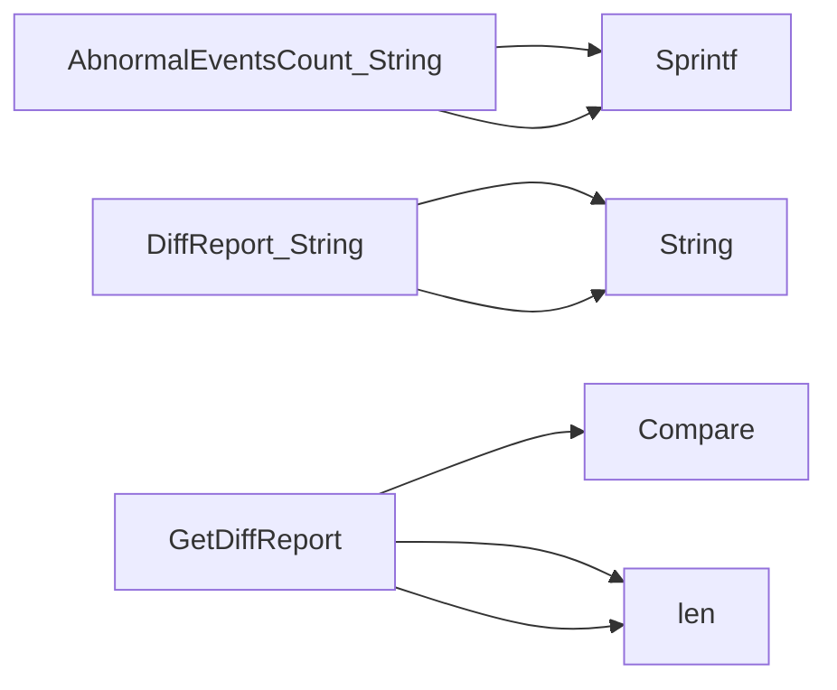

## Package configurations (github.com/redhat-best-practices-for-k8s/certsuite/cmd/certsuite/claim/compare/configurations)

### Structs

- **AbnormalEventsCount** (exported) — 2 fields, 1 methods
- **DiffReport** (exported) — 2 fields, 1 methods

### Functions

- **AbnormalEventsCount.String** — func()(string)
- **DiffReport.String** — func()(string)
- **GetDiffReport** — func(*claim.Configurations, *claim.Configurations)(*DiffReport)

### Call graph (exported symbols, partial)

### Symbol docs

- [struct AbnormalEventsCount](symbols/struct_AbnormalEventsCount.md)
- [struct DiffReport](symbols/struct_DiffReport.md)
- [function AbnormalEventsCount.String](symbols/function_AbnormalEventsCount_String.md)
- [function DiffReport.String](symbols/function_DiffReport_String.md)
- [function GetDiffReport](symbols/function_GetDiffReport.md)
