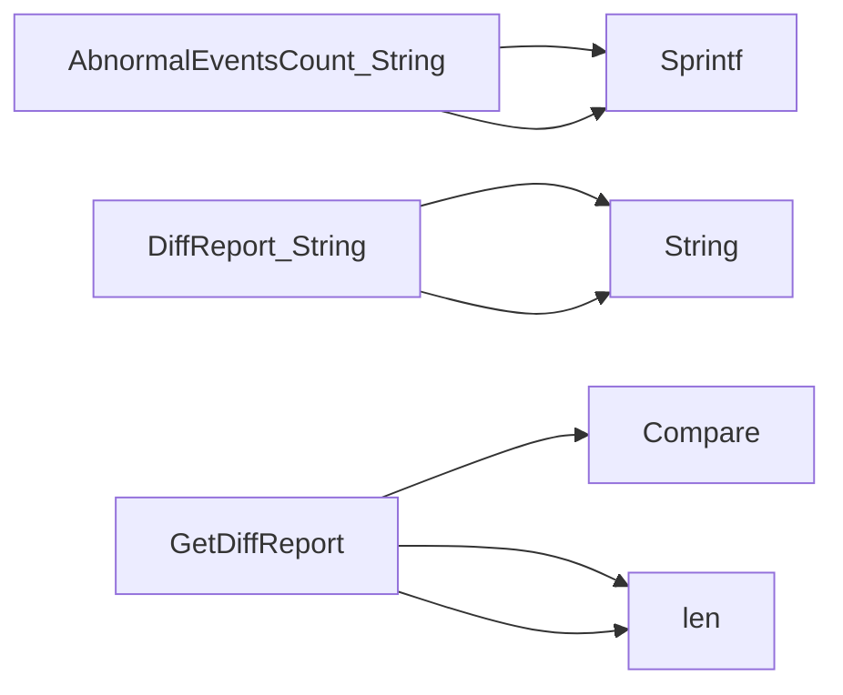

## Package configurations (github.com/redhat-best-practices-for-k8s/certsuite/cmd/certsuite/claim/compare/configurations)

# `configurations` – Claim Comparison Helper

The **`configurations`** package lives under  
`cmd/certsuite/claim/compare/configurations`.  
Its sole purpose is to produce a human‑readable report that shows how two
Kubernetes configuration claims differ.

> *Claims* are the objects produced by CertSuite that describe what a cluster
> should look like.  This module compares two such claims and reports on
> differences in abnormal event counts and on any other structural changes
> captured by the `diff` package.

---

## Data Structures

| Type | Fields | Purpose |
|------|--------|---------|
| **`AbnormalEventsCount`** | `Claim1 int`, `Claim2 int` | Stores how many abnormal events each claim reports.  The two values are compared to highlight a change in the cluster’s health. |
| **`DiffReport`** | `AbnormalEvents AbnormalEventsCount`, <br>`Config *diff.Diffs` | A composite report that contains: <br>• A count comparison (`AbnormalEvents`).<br>• All other differences between the two claims, represented by a `*diff.Diffs`. |

Both types implement `String() string` to allow easy printing.

---

## Key Functions

| Function | Signature | What it does |
|----------|-----------|--------------|
| **`GetDiffReport(claim1, claim2 *claim.Configurations) *DiffReport`** | Returns a pointer to `DiffReport`. | <ul><li>Calls `diff.Compare` (from the local `diff` package) on the two configurations. This produces a `*diff.Diffs` object that lists every field difference.</li><li>Counts abnormal events in each claim (`len(claim1.AbnormalEvents)` etc.) and stores them in an `AbnormalEventsCount` instance.</li><li>Wraps both results into a `DiffReport` and returns it.</li></ul> |
| **`(Ac AbnormalEventsCount) String() string`** | `func() (string)` | Formats the two counts as `"Claim1: X, Claim2: Y"` using `fmt.Sprintf`. |
| **`(Dr DiffReport) String() string`** | `func() (string)` | Delegates to the embedded diff object (`Config.String()`) and concatenates it with the abnormal‑event summary. |

> The package does not expose any global state or constants; all work is done
> via these types and functions.

---

## How It All Connects

```mermaid
flowchart TD
    A[Claim1] -->|Configurations struct| B(AbnormalEventsCount)
    C[Claim2] -->|Configurations struct| D
    E[GetDiffReport] --> F(DiffReport)
    subgraph Diffing
        G[diff.Compare] -- produces --> H(*diff.Diffs)
    end
    F --> I{String()}
```

1. **Input** – Two `*claim.Configurations` values are passed to
   `GetDiffReport`.
2. **Abnormal‑event counts** – The function extracts the length of each claim’s
   `AbnormalEvents` slice, populating an `AbnormalEventsCount`.
3. **Structural diff** – It calls `diff.Compare`, which returns a `*diff.Diffs`
   describing all field differences.
4. **Report assembly** – Both pieces are wrapped into a `DiffReport`.
5. **Presentation** – Calling `String()` on the report yields a concise summary
   that can be printed to logs or CLI output.

---

## Usage Example

```go
import (
    "github.com/redhat-best-practices-for-k8s/certsuite/cmd/certsuite/claim"
    "github.com/redhat-best-practices-for-k8s/certsuite/cmd/certsuite/claim/compare/configurations"
)

func main() {
    oldCfg := claim.Load("old.yaml")
    newCfg := claim.Load("new.yaml")

    report := configurations.GetDiffReport(oldCfg, newCfg)
    fmt.Println(report.String())
}
```

This prints something like:

```
Abnormal events: Claim1: 3, Claim2: 0
Differences:
  - spec.containers[0].image: "nginx:v1" -> "nginx:v2"
  ...
```

---

### Summary

- **`configurations`** is a thin wrapper that turns the raw diff data into a
  user‑friendly report.
- It relies on the `diff.Compare` helper for structural comparison and adds a
  quick check of abnormal event counts.
- The only public API consists of the two structs (`AbnormalEventsCount`,
  `DiffReport`) and the `GetDiffReport` constructor.

### Structs

- **AbnormalEventsCount** (exported) — 2 fields, 1 methods
- **DiffReport** (exported) — 2 fields, 1 methods

### Functions

- **AbnormalEventsCount.String** — func()(string)
- **DiffReport.String** — func()(string)
- **GetDiffReport** — func(*claim.Configurations, *claim.Configurations)(*DiffReport)

### Call graph (exported symbols, partial)



### Symbol docs

- [struct AbnormalEventsCount](symbols/struct_AbnormalEventsCount.md)
- [struct DiffReport](symbols/struct_DiffReport.md)
- [function AbnormalEventsCount.String](symbols/function_AbnormalEventsCount_String.md)
- [function DiffReport.String](symbols/function_DiffReport_String.md)
- [function GetDiffReport](symbols/function_GetDiffReport.md)
