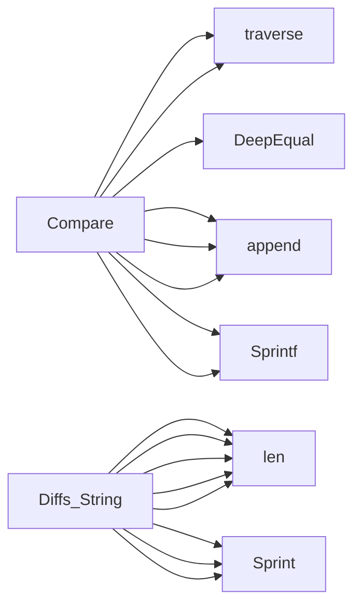

## Package diff (github.com/redhat-best-practices-for-k8s/certsuite/cmd/certsuite/claim/compare/diff)

# `diff` – JSON‑Tree Comparison

The **diff** package implements a lightweight deep comparison of two arbitrary JSON trees that have already been unmarshalled into `interface{}` values (typically using `encoding/json`).  
It is used by the certsuite claim‑comparison logic to show which fields differ between two claim files, and optionally to filter the comparison to specific sub‑trees.

---

## Core Data Structures

| Type | Purpose | Key Fields |
|------|---------|------------|
| **`Diffs`** (exported) | Holds the complete result of a comparison. | `Name string` – label shown in output.<br>`Fields []FieldDiff` – all differing leaf nodes.<br>`FieldsInClaim1Only []string` – paths present only in claim 1.<br>`FieldsInClaim2Only []string` – paths present only in claim 2. |
| **`FieldDiff`** (exported) | Represents a single differing leaf node. | `FieldPath string` – JSON‑path style string (e.g. `/metadata/labels/app`).<br>`Claim1Value interface{}` – value from first claim.<br>`Claim2Value interface{}` – value from second claim. |
| **`field`** (unexported) | Internal helper used by `traverse`. | `Path string`, `Value interface{}` – a leaf node. |

> **Why two structures?**  
> `Diffs` aggregates many `FieldDiff`s and also tracks fields that exist only in one side, so callers can distinguish *difference* vs *absence*.

---

## Key Functions

### 1. `Compare`

```go
func Compare(name string, claim1 interface{}, claim2 interface{}, filters []string) *Diffs
```

* **Inputs**  
  * `name` – label that will appear in the output table (`String()` method).  
  * `claim1`, `claim2` – two JSON trees already unmarshalled.  
  * `filters` – optional list of subtree names (e.g., `"labels"`); only those branches are traversed.

* **Workflow**  
  1. Recursively traverse each claim with `traverse`, collecting all leaf nodes (`[]field`).  
     - When `filters` is non‑empty, traversal stops early if the current path does not match any filter prefix.  
  2. Build maps `path→value` for both claims.  
  3. Compute:
     * **Missing in claim 1** – paths present only in claim 2.  
     * **Missing in claim 2** – paths present only in claim 1.  
     * **Differing values** – paths that exist in both but `!DeepEqual(v1, v2)`.  
  4. Assemble the result into a `Diffs` struct and return.

* **Return value** – pointer to the populated `Diffs`.

### 2. `traverse`

```go
func traverse(node interface{}, path string, filters []string) []field
```

*Recursively walks any JSON node.*

* Handles:
  * Maps (`map[string]interface{}`) → iterate over keys, recurse with `path/key`.  
  * Slices (`[]interface{}`) → iterate by index, recurse with `path/idx`.  
  * Primitive values → return a single `field`.

* Applies the `filters` argument: if none of the filters match the current prefix, the subtree is skipped (performance optimisation for large trees).

### 3. `Diffs.String`

```go
func (d Diffs) String() string
```

* Implements `fmt.Stringer`.  
* Builds a human‑readable table:

```
<name>: Differences
FIELD                           CLAIM 1     CLAIM 2
/jsonpath/to/field1             value1      value2
...

<name>: Only in CLAIM 1
/path/in/claim1

<name>: Only in CLAIM 2
/path/in/claim2
```

* Width of the first two columns is dynamically calculated to fit the longest field path and value.

---

## How They Connect

```mermaid
flowchart TD
    A[User calls Compare(name, c1, c2, filters)]
    B[traverse(c1)] --> C{build map1}
    D[traverse(c2)] --> E{build map2}
    F[Compute missing / differing] --> G[Create Diffs]
    G --> H[Return pointer]
```

* `Compare` orchestrates the process.  
* `traverse` supplies leaf lists for both claims.  
* Comparison logic (`DeepEqual`, set operations) populates the three slices in `Diffs`.  
* The caller can print or otherwise consume the result via `String()`.

---

## Usage Example

```go
var claim1, claim2 map[string]interface{}
json.Unmarshal([]byte(jsonStr1), &claim1)
json.Unmarshal([]byte(jsonStr2), &claim2)

diff := Compare("Claim comparison", claim1, claim2, []string{"metadata/labels"})
fmt.Println(diff) // invokes Diffs.String()
```

---

## Summary

* **`Diffs`** – final report container.  
* **`FieldDiff`** – individual differing leaf nodes.  
* **`Compare`** – public API that walks both trees (optionally filtered), finds missing or unequal fields, and returns a `Diffs`.  
* **`traverse`** – recursive helper that flattens a JSON tree into path/value pairs.  
* The package is intentionally read‑only; it contains no global state or mutating side effects.

This design keeps the comparison logic isolated, testable, and easy to integrate with other parts of certsuite.

### Structs

- **Diffs** (exported) — 4 fields, 1 methods
- **FieldDiff** (exported) — 3 fields, 0 methods
- **field**  — 2 fields, 0 methods

### Functions

- **Compare** — func(string, interface{}, interface{}, []string)(*Diffs)
- **Diffs.String** — func()(string)

### Call graph (exported symbols, partial)



### Symbol docs

- [struct Diffs](symbols/struct_Diffs.md)
- [struct FieldDiff](symbols/struct_FieldDiff.md)
- [function Compare](symbols/function_Compare.md)
- [function Diffs.String](symbols/function_Diffs_String.md)
