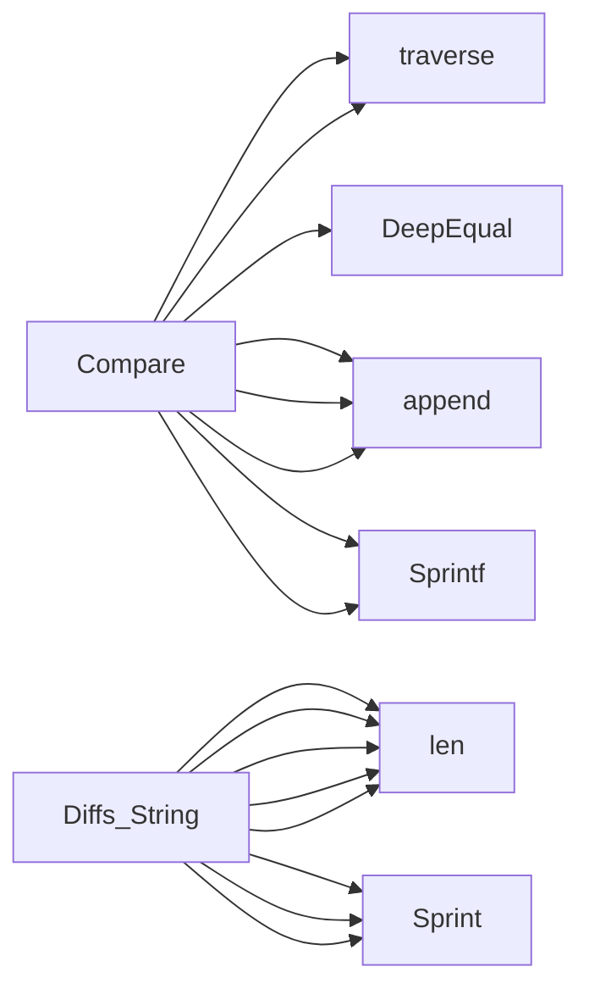

## Package diff (github.com/redhat-best-practices-for-k8s/certsuite/cmd/certsuite/claim/compare/diff)

### Structs

- **Diffs** (exported) — 4 fields, 1 methods
- **FieldDiff** (exported) — 3 fields, 0 methods
- **field**  — 2 fields, 0 methods

### Functions

- **Compare** — func(string, interface{}, interface{}, []string)(*Diffs)
- **Diffs.String** — func()(string)

### Call graph (exported symbols, partial)

### Symbol docs

- [struct Diffs](symbols/struct_Diffs.md)
- [struct FieldDiff](symbols/struct_FieldDiff.md)
- [function Compare](symbols/function_Compare.md)
- [function Diffs.String](symbols/function_Diffs_String.md)
