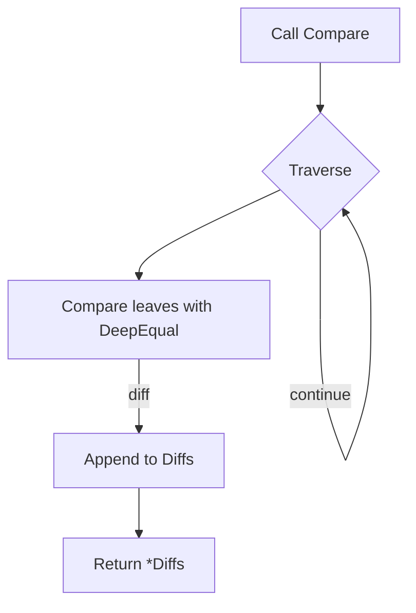

Compare` – Diff a pair of JSON‑decoded values

| Item | Detail |
|------|--------|
| **Signature** | `func Compare(name string, left interface{}, right interface{}, filters []string) *Diffs` |
| **Package** | `github.com/redhat-best-practices-for-k8s/certsuite/cmd/certsuite/claim/compare/diff` |

### Purpose
`Compare` is the public entry point for JSON tree comparison.  
The two values (`left`, `right`) are expected to be the results of `json.Unmarshal`,
i.e. nested maps, slices and primitive Go types that represent a JSON document.
The function walks both trees in parallel, collects every structural or value
difference into a `Diffs` collection, and returns it.

### Parameters

| Name | Type | Role |
|------|------|------|
| `name` | `string` | A human‑readable label for the diff result (used when printing). |
| `left` | `interface{}` | First JSON tree to compare. |
| `right` | `interface{}` | Second JSON tree to compare. |
| `filters` | `[]string` | Optional path prefixes that limit traversal. Only nodes whose
  *absolute* key path starts with one of the strings in this slice are visited.
  Useful for large documents where only a subset of branches is relevant.

### Return value

- `*Diffs`: A pointer to a collection that contains every difference found.
  The struct (not shown here) typically holds slices such as
  `Added`, `Deleted`, `Modified` etc.  
  If the two inputs are identical, the returned object will be empty.

### Core Algorithm

1. **Initial call** – `traverse(name, left, right, filters)`  
   Recursively walks both trees in lockstep.
2. **Value comparison** – When leaf nodes are reached,
   `DeepEqual` is used to detect value changes.
3. **Recording differences** – For each discrepancy, a descriptive message
   (built with `Sprintf`) and the offending key path are appended to the
   appropriate slice in the result (`Diffs`).
4. **Return** – The fully populated `*Diffs` instance is returned.

### Dependencies & Side‑Effects

| Dependency | Role |
|------------|------|
| `traverse` | Recursively walks two trees, applying filters and invoking comparison logic. |
| `DeepEqual` (from `reflect`) | Determines if two leaf values are identical. |
| `append`, `Sprintf` | Build result slices and human‑readable messages. |

No global state is mutated; all work happens locally within the call stack.
The function only reads its arguments and produces a new `Diffs` value.

### How it fits the package

The `diff` package provides utilities to compare JSON structures.  
`Compare` is the high‑level API that callers use, hiding the recursion
details in `traverse`.  The returned `*Diffs` can be inspected or rendered
by other parts of *certsuite*, e.g., for generating claim reports.

**Note:** The implementation details of `traverse` and the structure of
`Diffs` are not shown here, but they follow the same traversal pattern
and data‑collection strategy described above.
