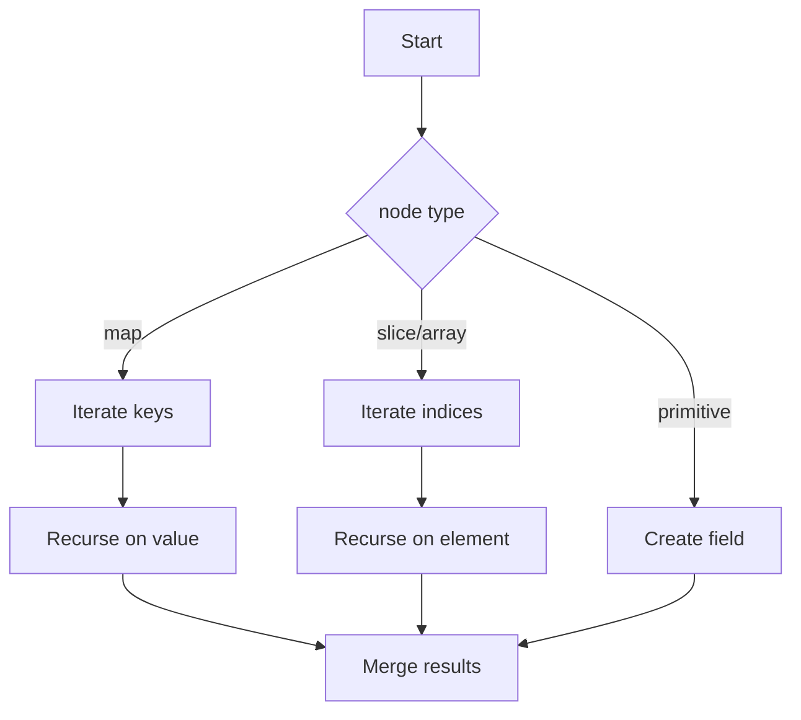

traverse`

| Item | Details |
|------|---------|
| **Package** | `diff` (`github.com/redhat-best-practices-for-k8s/certsuite/cmd/certsuite/claim/compare/diff`) |
| **Signature** | `func traverse(node interface{}, prefix string, parts []string) []field` |
| **Purpose** | Recursively walk a nested data structure (maps, slices, primitives) and produce a flat list of *leaf* fields. Each leaf is represented by the full path that leads to it and its value. This flattened view is used by the diff engine to compare two claims element‑by‑element. |
| **Parameters** | 1. `node interface{}` – The current node in the tree (could be a map, slice/array, or primitive).<br>2. `prefix string` – The prefix that has already been built for this recursion level; usually the parent field name.<br>3. `parts []string` – Accumulated path segments from the root to the current node. This slice is extended during recursion and joined later to form a dotted path. |
| **Return** | `[]field` – A slice of *leaf* fields where each `field` contains:<br>```go\n type field struct {\n     Path  string      // e.g., \"spec.template.spec.containers[0].image\"\n     Value interface{} // the leaf value (string, number, bool, nil…)\n }\n```\nThe slice is ordered by traversal order (depth‑first). |
| **Key Steps** | 1. **Base case** – If `node` is not a map or slice/array, create a `field` with the current path (`strings.Join(parts, ".")`) and return it in a one‑element slice.<br>2. **Map handling** – Iterate over each key/value pair. Build a new path segment: if `prefix` is empty use the key; otherwise append to it (`prefix + "." + key`). Recurse with the value and updated parts (`append(parts, key)`), then merge results.<br>3. **Slice/array handling** – Iterate by index. Convert index to string using `strconv.Itoa(i)`. Build path segment as `[i]` (e.g., `"containers[0]"`) or `"spec.template.spec.containers[0]"`. Recurse with each element and updated parts (`append(parts, fmt.Sprintf("[%d]", i))`).<br>4. **Duplicates** – Before appending a new field, the function checks `strings.Contains` against already collected paths to avoid duplicates (useful when the same leaf can be reached via different routes). |
| **Dependencies** | • `make`, `append` for slice manipulation.<br>• `strconv.Itoa` for converting numeric indices into strings.<br>• `strings.Join` (aliased as `Strings`) to build dotted paths.<br>• `strings.Contains` to guard against duplicate entries. |
| **Side‑Effects** | None – the function is pure; it does not modify its inputs or any global state. |
| **How It Fits the Package** | The *diff* package implements a lightweight comparison engine for certificate claims.  
The engine needs a canonical, flat representation of two claim objects to perform set operations (intersection, difference, etc.). `traverse` supplies this by turning nested JSON‑like structures into a slice of leaf fields that can be compared field‑by‑field. Other helpers in the package (`diff`, `intersect`, `subtract`) call `traverse` on each claim before performing their logic. |

### Suggested Mermaid diagram



This diagram visualises the depth‑first traversal that `traverse` performs.
