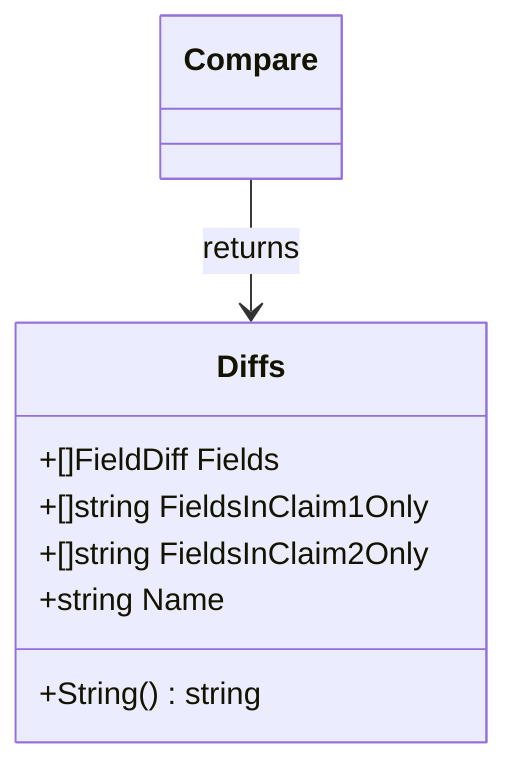

Diffs` – Summary of JSON Differences

| Element | Description |
|---------|-------------|
| **Package** | `github.com/redhat-best-practices-for-k8s/certsuite/cmd/certsuite/claim/compare/diff` |
| **Purpose** | Holds a structured report of all differences found when comparing two arbitrary JSON values (represented as `interface{}` after `json.Unmarshal`). |

---

## Overview

The `Diffs` type is the central data structure returned by the public `Compare` function.  
It aggregates three categories of information:

1. **Field-by‑field mismatches** – every JSON path that exists in both inputs but contains unequal values.
2. **Fields present only in the first claim** – paths that appear in the first JSON object but not in the second.
3. **Fields present only in the second claim** – paths that appear in the second JSON object but not in the first.

The struct also stores a human‑readable name (`Name`) that is used when printing the diff table.

---

## Fields

| Field | Type | Role |
|-------|------|------|
| `Fields` | `[]FieldDiff` | Each element describes a mismatch at a specific JSON path. The corresponding `FieldDiff` struct (defined elsewhere in the package) contains the path, value from claim 1, and value from claim 2. |
| `FieldsInClaim1Only` | `[]string` | List of JSON paths that exist only in the first input. |
| `FieldsInClaim2Only` | `[]string` | List of JSON paths that exist only in the second input. |
| `Name` | `string` | Identifier used when rendering the diff (e.g., “Certificate” or “Subject”). It is prefixed to each section of the string representation. |

---

## How it fits into the package

1. **`Compare`**  
   *Calls* `traverse` twice, once for each input, collecting differences and unique paths.  
   The collected data are assembled into a `Diffs` instance which is then returned.

2. **`String()` (method on `Diffs`)**  
   Formats the contents into a tabular string suitable for console output or logs.  
   It calculates column widths dynamically based on longest path/value, ensuring alignment.

3. **Consumers**  
   External callers typically invoke `Compare(name, claim1, claim2, filters)` to obtain a `*Diffs`, then use either:
   * `diff.String()` – human‑readable report.
   * Direct field access (`Fields`, etc.) – for programmatic handling or testing.

---

## Key Dependencies

| Dependency | Role |
|------------|------|
| `traverse` (internal) | Recursively walks JSON trees, detecting mismatches and unique fields. |
| `DeepEqual` (from Go's reflect package) | Determines value equality during traversal. |
| `fmt.Sprint/Sprintf` | Used in the `String()` method to build formatted output. |

---

## Side‑Effects & Constraints

* **Read‑only** – `Diffs` is constructed by `Compare`; callers should treat it as immutable.
* **Performance** – For very large JSON trees, filtering (`filters []string`) can reduce traversal cost.
* **Nil handling** – If one of the inputs is `nil`, its fields are treated as absent; corresponding entries appear in `FieldsInClaimXOnly`.

---

## Example Usage

```go
var claim1, claim2 map[string]interface{}
json.Unmarshal([]byte(jsonStr1), &claim1)
json.Unmarshal([]byte(jsonStr2), &claim2)

diff := diff.Compare("Certificate", claim1, claim2, nil)
fmt.Println(diff.String())
```

The printed output will show a neatly aligned table of mismatches and unique fields, prefixed by “Certificate”.

---

### Mermaid Diagram (optional)



---
