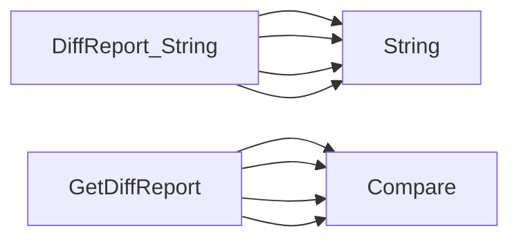

## Package nodes (github.com/redhat-best-practices-for-k8s/certsuite/cmd/certsuite/claim/compare/nodes)

### Structs

- **DiffReport** (exported) — 4 fields, 1 methods

### Functions

- **DiffReport.String** — func()(string)
- **GetDiffReport** — func(*claim.Nodes, *claim.Nodes)(*DiffReport)

### Call graph (exported symbols, partial)

### Symbol docs

- [struct DiffReport](symbols/struct_DiffReport.md)
- [function DiffReport.String](symbols/function_DiffReport_String.md)
- [function GetDiffReport](symbols/function_GetDiffReport.md)
