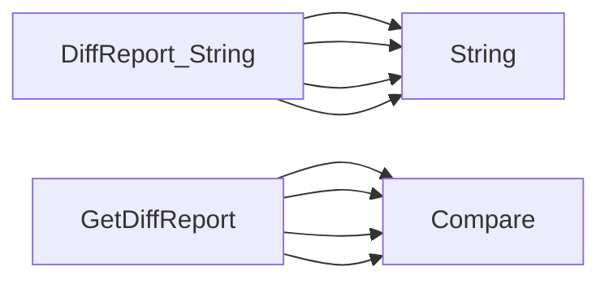

## Package nodes (github.com/redhat-best-practices-for-k8s/certsuite/cmd/certsuite/claim/compare/nodes)

# Overview – `nodes` package  
*Location:* `github.com/redhat-best-practices-for-k8s/certsuite/cmd/certsuite/claim/compare/nodes`

The **nodes** package is responsible for comparing the *node‑level* data that appears in two separate “claim” files.  
A claim file contains a snapshot of cluster state; each node entry includes information about its CNI, CSI and hardware configuration.  
This package builds a concise diff report that can be printed or further processed.

---

## Core Data Structures

| Name | Exported? | Purpose |
|------|-----------|---------|
| `DiffReport` | ✅ | Holds the summary of differences between two claim files at the node level. It contains four fields, each a pointer to a `diff.Diffs` value that represents the diff for a particular section: <br>• **CNI** – Container Network Interface configuration<br>• **CSI** – Container Storage Interface configuration<br>• **Hardware** – Node hardware details (CPU, memory, etc.)<br>• **Nodes** – General node metadata (names, labels, taints, etc.) |

`DiffReport` implements the `Stringer` interface so it can be rendered as a human‑readable table.

---

## Key Functions

### `GetDiffReport`

```go
func GetDiffReport(a, b *claim.Nodes) *DiffReport
```

* **Inputs** – two pointers to `claim.Nodes`, each representing the parsed node data from one claim file.  
* **Process** – for every section (CNI, CSI, Hardware, Nodes) it calls `diff.Compare` with the corresponding values from both claims.  
  The comparison returns a `*diff.Diffs` object that contains added/removed/changed items and is stored in the report.
* **Output** – a fully populated `DiffReport`.

### `DiffReport.String`

```go
func (r DiffReport) String() string
```

* Implements `fmt.Stringer`.  
* Builds a table where each row corresponds to a node that appears in *both* claim files.  
  For nodes missing from one side, the cell contains `"not found in claim[1|2]"`.  
* Internally calls `String()` on each of its four `*diff.Diffs` fields to render their individual tables.

---

## How It All Connects

```mermaid
graph TD;
    ClaimFileA --> |parsed| NodesA["claim.Nodes"];
    ClaimFileB --> |parsed| NodesB["claim.Nodes"];

    GetDiffReport(NodesA,NodesB) --> DiffReport;

    DiffReport.CNI --> diff.Diffs;
    DiffReport.CSI --> diff.Diffs;
    DiffReport.Hardware --> diff.Diffs;
    DiffReport.Nodes --> diff.Diffs;

    DiffReport --> |String()| TableOutput
```

1. Two claim files are parsed into `claim.Nodes` structures (outside this package).  
2. `GetDiffReport` takes those two objects and produces a `DiffReport`.  
3. Each section of the report is generated by delegating to `diff.Compare`, which lives in the sibling `diff` package.  
4. The resulting `DiffReport` can be printed via its `String()` method, giving a clear tabular view of all node‑level differences.

---

## Summary

* **Purpose** – provide a node‑centric diff between two claim files.  
* **Data Flow** – parse → compare per section → aggregate into `DiffReport`.  
* **Output** – human‑readable table with missing‑node markers and detailed diffs for CNI, CSI, Hardware, and Nodes sections.

This structure keeps the comparison logic modular: each section is compared independently while still being presented together in a single report.

### Structs

- **DiffReport** (exported) — 4 fields, 1 methods

### Functions

- **DiffReport.String** — func()(string)
- **GetDiffReport** — func(*claim.Nodes, *claim.Nodes)(*DiffReport)

### Call graph (exported symbols, partial)



### Symbol docs

- [struct DiffReport](symbols/struct_DiffReport.md)
- [function DiffReport.String](symbols/function_DiffReport_String.md)
- [function GetDiffReport](symbols/function_GetDiffReport.md)
