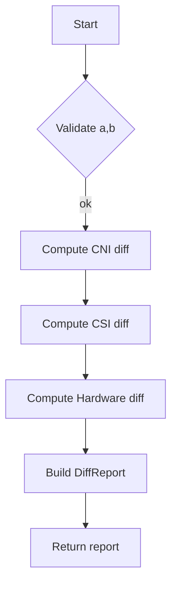

GetDiffReport` – nodes package

## Purpose
`GetDiffReport` builds a **diff report** that shows how two sets of claim nodes differ.  
The function receives:

| Parameter | Type          | Description |
|-----------|---------------|-------------|
| `a`       | `*claim.Nodes` | The first node set (usually the “old” or baseline). |
| `b`       | `*claim.Nodes` | The second node set (the one being compared). |

It returns a pointer to a **`DiffReport`** that contains, for each claim section (CNIs, CSIs, and Hardware), a `diff.Diffs` object produced by the underlying comparison logic.

## Key Dependencies
| Dependency | Role |
|------------|------|
| `claim.Nodes` | Holds collections of node claims. The function expects fully populated nodes structs. |
| `diff.Diffs` (from an internal diff package) | Represents a list of differences between two claim sections. |
| `Compare` (internal helper) | Called four times – once for each section (`CNIs`, `CSIs`, `Hardware`) to compute the diffs. |

The function does **not** modify its inputs; it only reads them to produce a new report.

## Implementation Flow

1. **Input validation** – implicitly ensures that the pointers are non‑nil (panic otherwise).  
2. **Section comparison** – for each of the three claim sections, `Compare` is invoked with the corresponding slices from `a` and `b`. The result is a `diff.Diffs` slice.  
3. **Report assembly** – these diffs are assigned to a new `DiffReport` struct (one field per section).  
4. **Return** – the fully populated report is returned.

## Side‑Effects & Assumptions
- No global state is touched; all work is local to the function call.  
- The caller must ensure that both `claim.Nodes` arguments are correctly initialized; otherwise the comparison may panic or return empty diffs.  

## Role in the Package
Within `github.com/redhat-best-practices-for-k8s/certsuite/cmd/certsuite/claim/compare/nodes`, this function is the public entry point for generating a human‑readable diff between two node claim snapshots. Higher‑level tooling (e.g., CLI commands) invokes it to surface changes in CNIs, CSIs, or hardware configurations across deployments.
