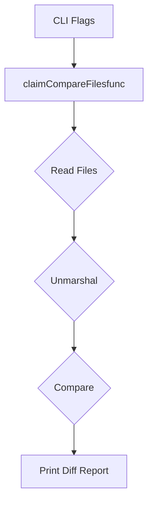

claimCompareFilesfunc`

| Item | Details |
|------|---------|
| **Package** | `compare` (`github.com/redhat-best-practices-for-k8s/certsuite/cmd/certsuite/claim/compare`) |
| **Signature** | `func(string, string) error` |

### Purpose
The function performs a side‑effect‑free comparison of two *Claim* files.  
It is the callback used by the command line flag parser to implement the `certsuite claim compare` subcommand.

1. Reads each file into memory (`io/ioutil.ReadFile`).  
2. Unmarshals the raw JSON/YAML bytes into internal Claim structs via `unmarshalClaimFile`.  
3. Invokes the core comparison routine `Compare`, which returns a slice of differences and an overall status flag.  
4. Prints a human‑readable diff report to stdout using `GetDiffReport` and standard printing functions (`Println`, `Print`).  

The function returns an error only if file I/O or unmarshalling fails; logical mismatches are reported via console output rather than as errors.

### Parameters
| Name | Type | Description |
|------|------|-------------|
| `claim1Path` | `string` | Path to the first Claim file. |
| `claim2Path` | `string` | Path to the second Claim file. |

> **Note:** The parameters are passed by value; the function does not modify them.

### Return Value
* `error` – non‑nil if reading or unmarshalling fails.  
  Successful comparison always returns `nil`; any differences are printed instead of being signalled via the error channel.

### Key Dependencies & Side Effects
| Dependency | Role |
|------------|------|
| `ReadFile` (std lib) | Loads file contents into memory. |
| `unmarshalClaimFile` | Decodes Claim JSON/YAML into internal structures. |
| `Compare` | Performs the actual comparison logic and returns differences. |
| `GetDiffReport` | Formats a diff report for console output. |
| `Println`, `Print` (std lib) | Emit the diff report to stdout. |

The function has **no persistent side effects** beyond printing; it does not alter global state or write files.

### Interaction with Package Globals
- `Claim1FilePathFlag` and `Claim2FilePathFlag` are the command‑line flags that provide the paths passed to this function.
- The variable `claimCompareFiles` holds a reference to this function (used by the flag package as the action for the compare subcommand).

### How It Fits the Package
The `compare` package implements the `certsuite claim compare` CLI feature.  
`claimCompareFilesfunc` is the core routine that drives the comparison workflow: it loads claims, compares them, and reports differences.  
All other functions in this file orchestrate command‑line parsing; this function encapsulates the business logic that can be unit‑tested independently.

---

#### Suggested Mermaid Diagram (package flow)

This diagram illustrates the linear path from command‑line input to output generation.
