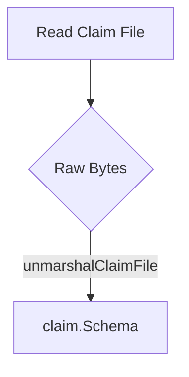

unmarshalClaimFile`

| Item | Detail |
|------|--------|
| **Package** | `github.com/redhat-best-practices-for-k8s/certsuite/cmd/certsuite/claim/compare` |
| **Visibility** | Unexported (`func`) – used only within this package. |
| **Signature** | `func unmarshalClaimFile(data []byte) (claim.Schema, error)` |

### Purpose
Deserialize a byte slice that represents a *claim file* into an in‑memory `claim.Schema` value.  
The function is a small helper used by the command line tool to read the two claim files specified with the flags `--claim1-file-path` and `--claim2-file-path`.  It is called after the raw bytes have been read from disk.

### Parameters
| Name | Type | Meaning |
|------|------|---------|
| `data` | `[]byte` | The raw file contents (typically JSON). |

### Return Values
| Index | Type | Meaning |
|-------|------|---------|
| `0`   | `claim.Schema` | A fully populated claim structure.  If the input is empty or malformed, this will be the zero value of the type. |
| `1`   | `error` | Non‑nil when deserialization fails (e.g., invalid JSON, missing required fields). |

### Implementation Notes
* The function simply forwards to the standard library’s `encoding/json.Unmarshal`.  
  ```go
  err := json.Unmarshal(data, &claim)
  ```
* No global state is read or modified; it has **no side effects** beyond returning a value.  

### Dependencies
| Dependency | Role |
|------------|------|
| `encoding/json` | Performs the actual unmarshalling. |
| `github.com/redhat-best-practices-for-k8s/certsuite/claim.Schema` | The target type for deserialization. |

### Usage Context
Within `compare.go`, after obtaining file paths via the exported flags:

```go
raw1, err := os.ReadFile(Claim1FilePathFlag)
...
schema1, err := unmarshalClaimFile(raw1)
```

The same pattern is repeated for the second claim file.  The resulting `claim.Schema` objects are then fed into the comparison logic that produces a diff report.

### Diagram (suggestion)



This helper keeps the file‑reading code clean and isolates JSON parsing, making it easier to unit‑test the deserialization logic separately from the rest of the command.

---
