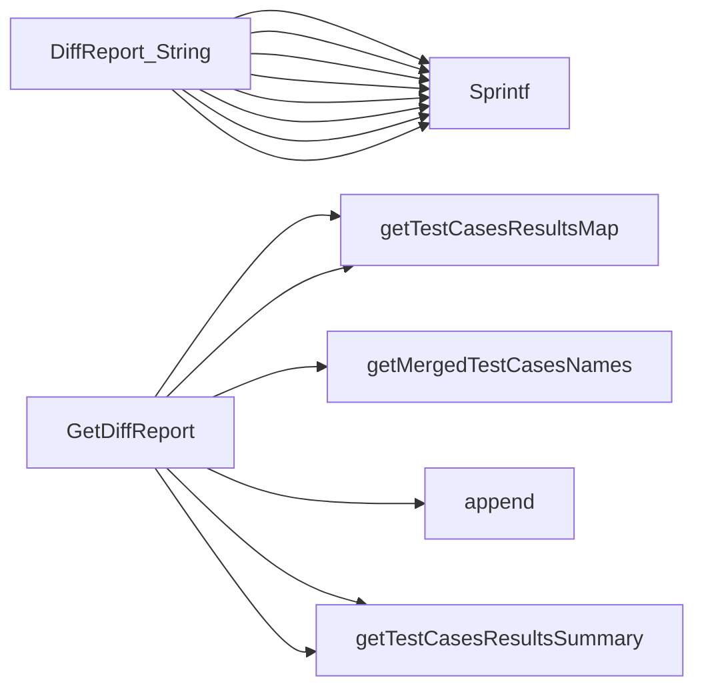

## Package testcases (github.com/redhat-best-practices-for-k8s/certsuite/cmd/certsuite/claim/compare/testcases)

## Overview – `testcases` Package (compare)

The package implements a lightweight diff engine that compares the **results of test‑case executions** between two claim files (`claim.TestSuiteResults`).  
It is used by the command line tool `certsuite compare` to produce a human‑readable report.

| Section | What it contains |
|---------|-----------------|
| **Data structures** | `TcResultsSummary`, `TcResultDifference`, `DiffReport` |
| **Core helpers** | `getTestCasesResultsMap`, `getMergedTestCasesNames`, `getTestCasesResultsSummary` |
| **Public API** | `GetDiffReport` (creates a report) and `DiffReport.String()` (pretty‑prints it) |

---

### Data Structures

| Type | Purpose | Key fields |
|------|---------|------------|
| `TcResultsSummary` | Holds aggregated counters for a claim file. | `Failed, Passed, Skipped int` |
| `TcResultDifference` | Represents one test case that behaved differently between the two claims. | `Name string`, `Claim1Result, Claim2Result string` |
| `DiffReport` | Top‑level object returned by `GetDiffReport`. | <ul><li>`Claim1ResultsSummary TcResultsSummary`</li><li>`Claim2ResultsSummary TcResultsSummary`</li><li>`DifferentTestCasesResults int` – count of diffs</li><li>`TestCases []TcResultDifference` – list of differing test cases</li></ul> |

The `DiffReport.String()` method renders two tables:

1. **Summary table** – counts of passed/failed/skipped per claim.
2. **Differences table** – each row shows the test‑case name and the result in each claim.

---

### Core Helper Functions

| Function | Role | Highlights |
|----------|------|------------|
| `getTestCasesResultsMap(results claim.TestSuiteResults) map[string]string` | Builds a flat map `{testCaseName: result}` from nested `resultsByTestSuite`. | Iterates over suites, then results. |
| `getMergedTestCasesNames(map1, map2 map[string]string) []string` | Merges keys of two result maps into a **sorted** slice without duplicates. | Uses `append`, `Strings` and `sort.Strings`. |
| `getTestCasesResultsSummary(resultsMap map[string]string) TcResultsSummary` | Counts occurrences of `"passed"`, `"failed"` and `"skipped"` in the map. | Simple loop, case‑insensitive? (direct string comparison). |

These helpers are all **private**; they only exist to keep `GetDiffReport` readable.

---

### Public API

#### `GetDiffReport(claim1, claim2 claim.TestSuiteResults) *DiffReport`

1. Convert each claim’s nested results into a flat map (`tcName → result`) via `getTestCasesResultsMap`.
2. Merge the two key sets to know every test case that appears in either claim.
3. For each merged name:
   * Fetch the result from both maps (or `"not found"` if missing).
   * If the results differ, append a `TcResultDifference` to `DiffReport.TestCases`.
4. Compute summaries for each claim using `getTestCasesResultsSummary`.
5. Set `DifferentTestCasesResults` to the length of `DiffReport.TestCases`.

The returned object is **read‑only**; callers typically call its `String()` method.

#### `DiffReport.String() string`

Uses a series of `fmt.Sprintf` calls to build two tables as described above.  
No external libraries – plain text output suitable for terminal display or logs.

---

### How the Pieces Connect

```
┌───────────────────────┐
│  Claim1, Claim2       │   (claim.TestSuiteResults)
├───────────────────────┤
│ getTestCasesResultsMap│   → map[string]string  (tcName→result)
└─────────────▲─────────┘
              │
              ▼
┌───────────────────────┐
│ getMergedTestCasesNames│   → []string of all tc names (sorted)
└───────▲───────┬───────┘
        │       │
        │       ▼
        │  iterate over names
        │  ├─ fetch result from map1 (or "not found")
        │  ├─ fetch result from map2 (or "not found")
        │  └─ if different → append TcResultDifference
        ▼
┌───────────────────────┐
│ getTestCasesResultsSummary(map)│ → TcResultsSummary for each claim
└─────────────▲─────────┘
              │
              ▼
┌───────────────────────┐
│ DiffReport             │   (summary + differences)
└─────────────▲─────────┘
              │
              ▼
┌───────────────────────┐
│ DiffReport.String()    │   Pretty‑printed tables
└───────────────────────┘
```

---

### Things That Remain Unknown

* The exact format of `claim.TestSuiteResults` (structure definition is outside this file).
* Whether result strings are case‑sensitive or trimmed before comparison.
* How the package handles special characters in test‑case names for table alignment.

These points are not critical to understanding the diff logic, but would be worth checking when integrating with other parts of `certsuite`.

### Structs

- **DiffReport** (exported) — 4 fields, 1 methods
- **TcResultDifference** (exported) — 3 fields, 0 methods
- **TcResultsSummary** (exported) — 3 fields, 0 methods

### Functions

- **DiffReport.String** — func()(string)
- **GetDiffReport** — func(claim.TestSuiteResults, claim.TestSuiteResults)(*DiffReport)

### Call graph (exported symbols, partial)



### Symbol docs

- [struct DiffReport](symbols/struct_DiffReport.md)
- [struct TcResultDifference](symbols/struct_TcResultDifference.md)
- [struct TcResultsSummary](symbols/struct_TcResultsSummary.md)
- [function DiffReport.String](symbols/function_DiffReport_String.md)
- [function GetDiffReport](symbols/function_GetDiffReport.md)
