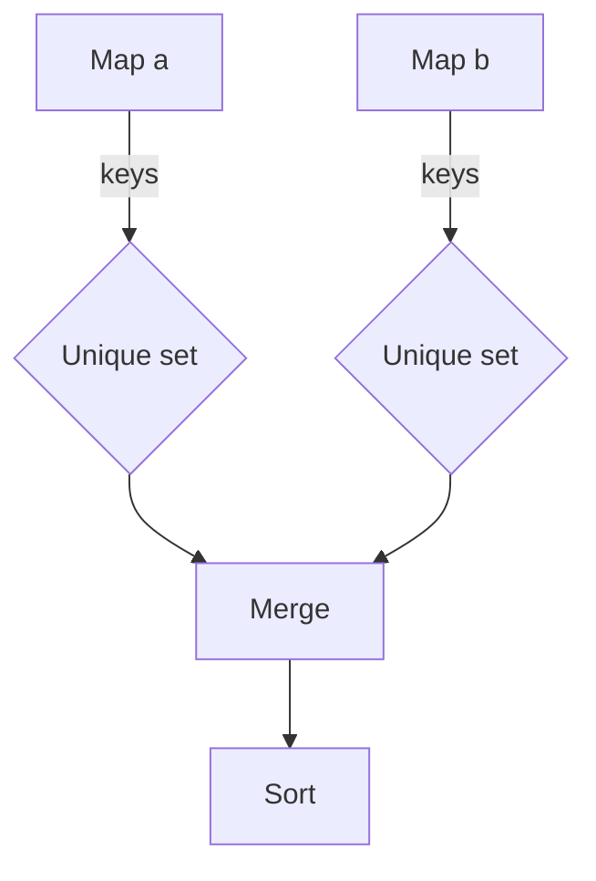

getMergedTestCasesNames`

| Item | Details |
|------|---------|
| **Signature** | `func(getMergedTestCasesNames(a, b map[string]string) []string)` |
| **Exported?** | No – internal helper |
| **Purpose** | Produce a sorted list of unique test‑case names that appear in either of two “results helper” maps.  The maps are keyed by the test case name and hold an arbitrary string value (the test result).  The function is used during claim comparison to know which tests need to be considered for diffing or reporting. |

### Parameters

| Name | Type | Description |
|------|------|-------------|
| `a` | `map[string]string` | First map of test results. |
| `b` | `map[string]string` | Second map of test results. |

Both maps are expected to be non‑nil; the function will iterate over them regardless.

### Return Value

- `[]string`: A slice containing **all distinct keys** from both input maps, sorted in ascending order.  
  *If a key exists in both maps it appears only once.*

### Algorithm (in plain words)

1. Create an empty slice `names`.
2. Iterate over the first map (`a`) – for each key append it to `names`.  
3. Iterate over the second map (`b`). For each key that is **not already present** in `a`, append it to `names`.  
4. Sort the resulting slice alphabetically using `sort.Strings`.

The implementation uses Go’s built‑in `append` and `sort.Strings`; no other packages or globals are touched.

### Dependencies

| Dependency | Why |
|------------|-----|
| `sort.Strings` | To guarantee a deterministic, ordered output. |
| `map` lookup (`_, ok := a[key]`) | Efficient membership test to avoid duplicates. |

No external global variables or state are read or mutated; the function is pure.

### Side Effects

- None – it only reads its arguments and returns a new slice.

### How It Fits in the Package

The `testcases` package provides utilities for comparing claim results.  During comparison, each side (e.g., local vs remote) produces a map of test‑case names to results.  
`getMergedTestCasesNames` consolidates those maps so that downstream logic can iterate over *every* test case that was executed on either side, without caring about duplicates. This is essential for:

- Generating comprehensive diff reports.
- Ensuring all tests are accounted for in statistics or summaries.

---

#### Suggested Mermaid Diagram (optional)

This visualises the flow from two maps → unique key collection → merge → sort.
