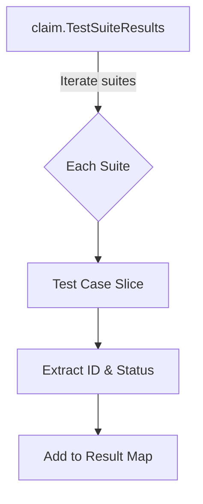

getTestCasesResultsMap`

**Package**: `testcases` – part of the certsuite claim comparison utilities.

## Purpose
Transforms a collection of test‑suite results into a flat mapping from *individual test case identifiers* to their corresponding outcome strings.  
The helper is used internally when producing a side‑by‑side diff of two claim snapshots, allowing other parts of the package to look up a test case result in constant time.

## Signature
```go
func getTestCasesResultsMap(claim.TestSuiteResults) map[string]string
```

| Parameter | Type                | Description |
|-----------|---------------------|-------------|
| `results` | `claim.TestSuiteResults` | A mapping from suite names to a slice of test‑case result objects. The structure is defined in the `claim` package and contains, for each case, at least an identifier (e.g., `"TestFoo"`) and a status string (e.g., `"pass"`). |

| Return value | Type                | Description |
|--------------|---------------------|-------------|
| `map[string]string` | A flat map where the key is the test‑case name and the value is its result string. |

## Key Steps
1. **Iterate over all suites** – The input `TestSuiteResults` is a map whose keys are suite names.
2. **Process each case in a suite** – For every slice of cases, extract the case’s identifier and status.
3. **Populate the output map** – Store `status` under the corresponding identifier key.

The function performs no I/O or mutation of the input; it only reads from the provided data structure and returns a new map.

## Dependencies
- Relies on the `claim.TestSuiteResults` type, which is defined elsewhere in the certsuite project.
- No external packages are imported beyond those required for the `claim` package itself.

## Side Effects
None. The function is pure: it reads from its argument and returns a new data structure without altering global state or performing side‑effects.

## Context within the Package
Within `cmd/certsuite/claim/compare/testcases`, this helper supports higher‑level comparison logic that needs quick lookup of test case results when rendering diffs, generating reports, or feeding data into other analysis tools. By converting nested suite information into a flat map, it simplifies downstream processing and keeps the comparison code concise.

--- 

**Mermaid suggestion (optional)**



This diagram illustrates the linear transformation performed by `getTestCasesResultsMap`.
